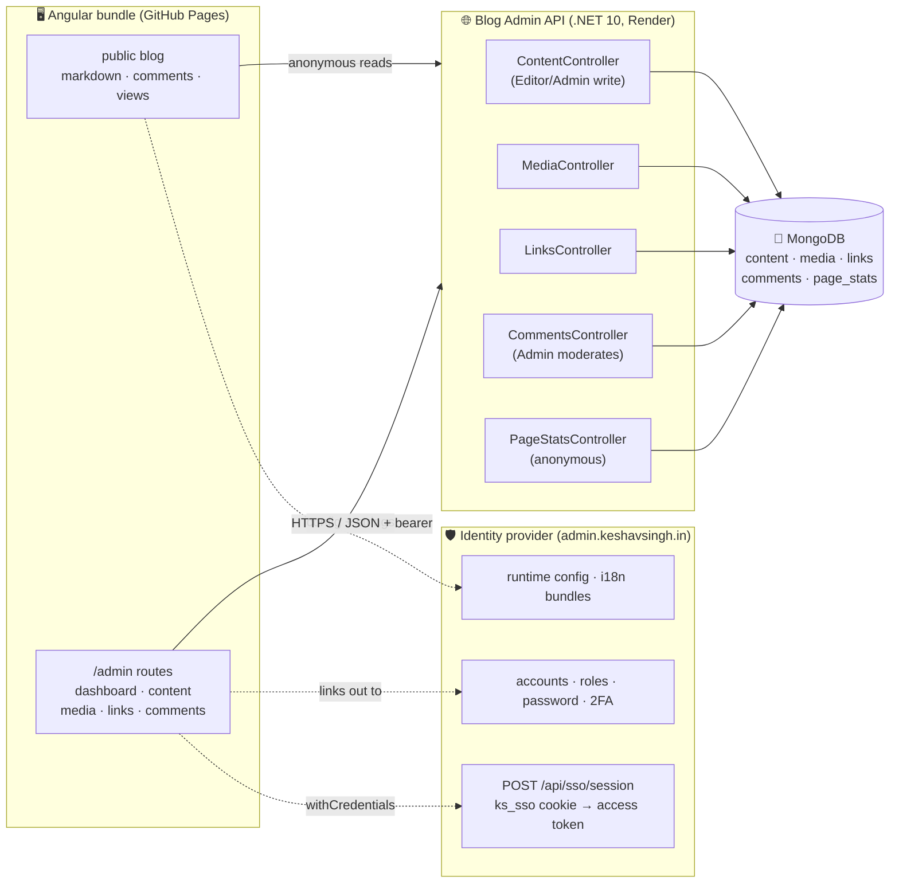

# Blog Admin API — resource server for the content blog

**Angular admin console (`/admin` in the same bundle) + .NET 10 Web API + MongoDB.**

It manages four things: **Content** (markdown topic records), **Media** (uploaded images),
**Links** (curated resources) and reader **Comments** (moderation and bans).

It manages **no identity at all.** There is deliberately no auth controller, no login endpoint and
no user store here. `admin.keshavsingh.in` (API at `id.keshavsingh.in`) is the only token issuer for
the whole app family; accounts, roles, passwords and two-factor enrollment all live there. This
service only *validates* the tokens that provider mints.

> Earlier revisions of this file documented an `AuthController`, `POST /auth/login`, `/auth/2fa/*`
> and admin Users/Security pages. None of that exists in this repository any more.

---

## Architecture at a glance



### How a request gets authorized

```mermaid
sequenceDiagram
    participant U as Blog / console (browser)
    participant I as Identity provider
    participant A as Blog Admin API

    U->>I: POST /api/sso/session (ks_sso cookie, withCredentials)
    I-->>U: { accessToken } — short-lived, held in memory only
    U->>A: GET /api/content (Authorization: Bearer …)
    A->>A: validate HS256 · issuer · audience · lifetime
    Note over A: roles come from the token's "role" claims;<br/>no user lookup, no local account
    A-->>U: 200 · or 401 → the client refreshes once and retries
```

The signing key (`Jwt:SigningKey`) must be **byte-identical** to the provider's, and the app
**throws at startup** if it is unset rather than falling back to a placeholder.

---

## Security design (maps to the org baseline)

| Concern | How it's handled |
| --- | --- |
| Authentication | OAuth2 bearer (JWT) from the central provider, validated on every request — `MapInboundClaims = false`, `RoleClaimType = "role"`, issuer/audience/lifetime all checked |
| Signing key | Required; startup fails closed if absent. From user-secrets / env / Key Vault, never `appsettings.json` |
| Access control | **Default-deny** — `[Authorize]` at the controller, role gates on top, and the few anonymous routes opt out explicitly |
| Record ownership | A comment can only be edited or deleted by its author (or an Admin), enforced in the filter, not in the UI |
| Caller-supplied paths | One trust boundary: `Content/ContentPath` — anchored allowlist regex, length cap, explicit traversal reject. Nothing else builds a path filter |
| Entity ids | `{id:objectid}` route constraint, so a malformed id is a 404 at routing rather than a driver exception |
| Input | DataAnnotations at the boundary; every Mongo query is a typed `Builders<T>` filter (no string concatenation); regex input escaped and anchored |
| Output | DTO projections — anonymous responses carry no internal user ids |
| Uploads | Content-type allowlist **and** magic-byte verification; random on-disk names; no SVG (script-capable, no signature to verify); raw media served with `default-src 'none'; sandbox` |
| Rate limiting | Fixed windows: comments partitioned by `sub`, page views by IP. `ForwardedHeaders` runs first with `ForwardLimit = 1` so hops cannot be prepended |
| Personal data | The visitor de-duplication key is a keyed HMAC of the observed address + user agent; the digest is stored, the inputs never are, and the rows expire |
| Errors | Central middleware **fails closed** — expected failures map to clean status codes, everything else to a bare 500 with no internals |
| Transport | HSTS in production (TLS terminates at Render's edge, which also redirects) |
| Headers | `nosniff`, `X-Frame-Options: DENY`, `no-referrer`, `Cross-Origin-Resource-Policy: same-site` |
| CORS | Credentialed, so a predicate allowlist over `https://*.keshavsingh.in` — never `AllowAnyOrigin` |
| Secrets | Three, all from env / user-secrets / Key Vault: `Mongo:ConnectionString`, `Jwt:SigningKey`, `Encryption:DataKey` |

---

## Running it locally

### 1. Prerequisites
- .NET SDK 10 (`dotnet --version`)
- Node 20+ and the repo's npm deps (`npm ci --legacy-peer-deps` at the repo root)
- A MongoDB connection string (local `mongod` or a free MongoDB Atlas cluster)

### 2. Configure backend secrets (never commit these)

```bash
cd server/Blog.Admin.Api
dotnet user-secrets init

# Database
dotnet user-secrets set "Mongo:ConnectionString" "mongodb://localhost:27017"

# Must match the identity provider's key exactly, or every request is a 401
dotnet user-secrets set "Jwt:SigningKey" "$(openssl rand -base64 48)"

# Base64 of exactly 32 bytes -> AES-256 key (keys the visitor digest)
dotnet user-secrets set "Encryption:DataKey" "$(openssl rand -base64 32)"
```

> On Windows PowerShell, generate keys with:
> `[Convert]::ToBase64String((1..32 | % {Get-Random -Max 256}))`

### 3. Run the API

```bash
cd server/Blog.Admin.Api
dotnet run
# Swagger:   http://localhost:5080/swagger   (Development only)
# Health:    http://localhost:5080/health    (pings MongoDB)
```

### 4. Run the Angular app

```bash
# repo root
npm start
# open http://localhost:4200/#/admin/login
```

`/admin/login` redirects to the identity provider. Sign in there; the console picks up the session
from the shared cookie. To grant yourself a console role, do it at the provider — this service has
no page for it.

### Pointing the UI at a different API
The base URL defaults to `http://localhost:5080/api`. Override without rebuilding by setting
`window.__ADMIN_API_BASE__` (and `__IDP_API_BASE__` / `__ADMIN_APP_URL__`) in `ng-src/index.html`
before the app boots.

---

## API surface

| Method | Route | Access |
| --- | --- | --- |
| GET | `/health` | anonymous (liveness + Mongo ping) |
| GET | `/api/content` · `/api/content/{id}` | any console role |
| POST/PUT/DELETE | `/api/content` | **Editor/Admin** |
| GET | `/api/media` | any console role |
| POST/DELETE | `/api/media` | **Editor/Admin** |
| GET | `/api/media/{id}/raw` | anonymous (public image bytes) |
| GET | `/api/links` | anonymous (visible links, projected) |
| GET | `/api/links?all=true` · `/api/links/{id}` | any console role |
| POST/PUT/DELETE | `/api/links` | **Editor/Admin** |
| GET | `/api/comments?path=…` | anonymous (a document's thread) |
| POST/PUT/DELETE | `/api/comments` | signed in, own comment only (rate limited) |
| GET/POST | `/api/comments/moderation` · `/{id}/hide` · `/unhide` · `/bans` | **Admin** |
| GET | `/api/page-stats` | anonymous |
| POST | `/api/page-stats/view` | anonymous (rate limited, de-duplicated per visitor) |

---

## Roles

Role names come from `KeshavSingh.Core` and are a shared contract across every app in the family —
they arrive in the token, so renaming one silently breaks authorization everywhere.

- **Admin** — everything here, including comment moderation and bans.
- **Editor** — create/edit/delete content, media and links.
- **Viewer** — read-only access to the console.

Who holds which role is decided at the identity provider, not here.
