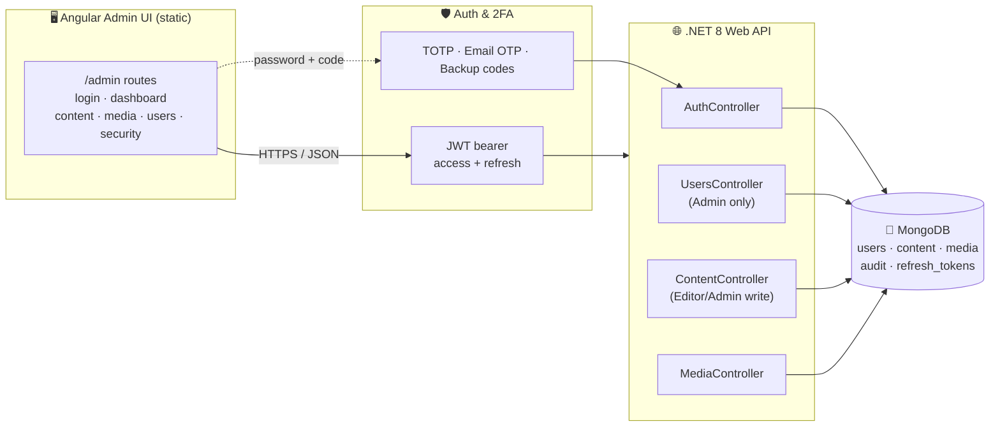
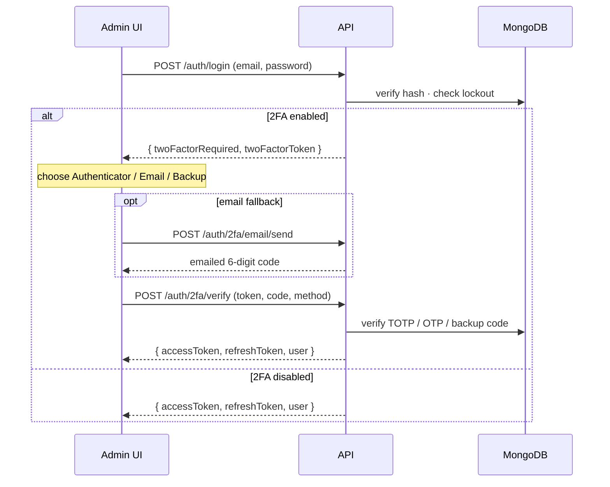

# Blog Admin — Full-Stack Admin Console

A secure admin console for the content blog: **Angular admin UI + .NET 8 Web API + MongoDB**,
with authenticator-first two-factor authentication (TOTP), an email code fallback, and one-time
backup codes.

It manages four things: **Content** (markdown topics), **Media** (images), **Users & Roles**, and
each user's own **Security / 2FA**.

---

## Architecture at a glance



### Sign-in flow (two-factor)



---

## Security design (maps to the org baseline)

| Concern | How it's handled |
| --- | --- |
| Password storage | **PBKDF2-HMAC-SHA256**, 210k iterations, per-user salt, constant-time verify |
| TOTP secret at rest | **AES-256-GCM** encrypted with a key from config/Key Vault |
| Refresh tokens / backup codes / email OTP | only **SHA-256 hashes** stored; refresh tokens rotate & revoke |
| Access control | **default-deny** — `[Authorize]` everywhere, role gates on top |
| Secrets | never in source; read from **user-secrets / env / Azure Key Vault** |
| Input | validated at the boundary (DataAnnotations); Mongo queries are filter-based (no injection); regex search input escaped |
| Errors | central middleware **fails closed**, returns generic messages, no stack traces |
| Transport | HTTPS redirect + HSTS in production; SMTP uses STARTTLS |
| Brute force | per-account lockout **and** per-IP rate limiting on auth endpoints |
| Audit | auth/2FA events logged with context, **no personal data** |

> **Note on HMAC-SHA1:** TOTP (RFC 6238) uses HMAC-SHA1 because authenticator apps require it.
> This is a keyed MAC, not SHA-1 as a digest/signature — it is not affected by SHA-1 collision
> weaknesses. This is the only, documented, use of SHA-1 (see `Security/TotpService.cs`).

---

## Running it locally

### 1. Prerequisites
- .NET SDK 8+ (`dotnet --version`)
- Node 18+ and the repo's npm deps (`npm install` at the repo root)
- A MongoDB connection string (local `mongod` or a free MongoDB Atlas cluster)

### 2. Configure backend secrets (never commit these)

```bash
cd server/Blog.Admin.Api
dotnet user-secrets init

# Database
dotnet user-secrets set "Mongo:ConnectionString" "mongodb://localhost:27017"

# 32+ byte JWT signing key
dotnet user-secrets set "Jwt:SigningKey" "$(openssl rand -base64 48)"

# Base64 of exactly 32 bytes -> AES-256 key for encrypting TOTP secrets
dotnet user-secrets set "Encryption:DataKey" "$(openssl rand -base64 32)"
```

> On Windows PowerShell, generate keys with:
> `[Convert]::ToBase64String((1..32 | % {Get-Random -Max 256}))`

### 3. Run the API

```bash
cd server/Blog.Admin.Api
dotnet run
# Swagger:  http://localhost:5080/swagger
```

The console uses centralized identity (SSO) via the identity provider; there is no local
`Admin` password seed. The first SSO user to sign in becomes an Admin, or an operator grants
the `Admin` role at the IdP. After signing in open **Security & 2FA** to enroll your
authenticator and save your backup codes.

### 4. Run the Angular app

```bash
# repo root
npm start
# open http://localhost:4200/#/admin/login
```

### Pointing the UI at a different API
The base URL defaults to `http://localhost:5080/api`. Override without rebuilding by setting
`window.__ADMIN_API_BASE__` in `ng-src/index.html` before the app boots.

---

## API surface

| Method | Route | Access |
| --- | --- | --- |
| POST | `/api/auth/login` | anonymous |
| POST | `/api/auth/2fa/verify` | anonymous (step token) |
| POST | `/api/auth/2fa/email/send` | anonymous (step token) |
| POST | `/api/auth/refresh` · `/api/auth/logout` | anon / authed |
| POST | `/api/auth/2fa/enroll/start` · `/confirm` · `/disable` | authed (self) |
| GET/POST/PUT/DELETE | `/api/users` · `/api/roles` | **Admin** |
| GET | `/api/content` · `/api/media` | any signed-in |
| POST/PUT/DELETE | `/api/content` · `/api/media` | **Editor/Admin** |
| GET | `/api/media/{id}/raw` | anonymous (public image bytes) |

---

## Roles

- **Admin** — everything, incl. user & role management.
- **Editor** — create/edit/delete content and media.
- **Viewer** — read-only access to the console.
