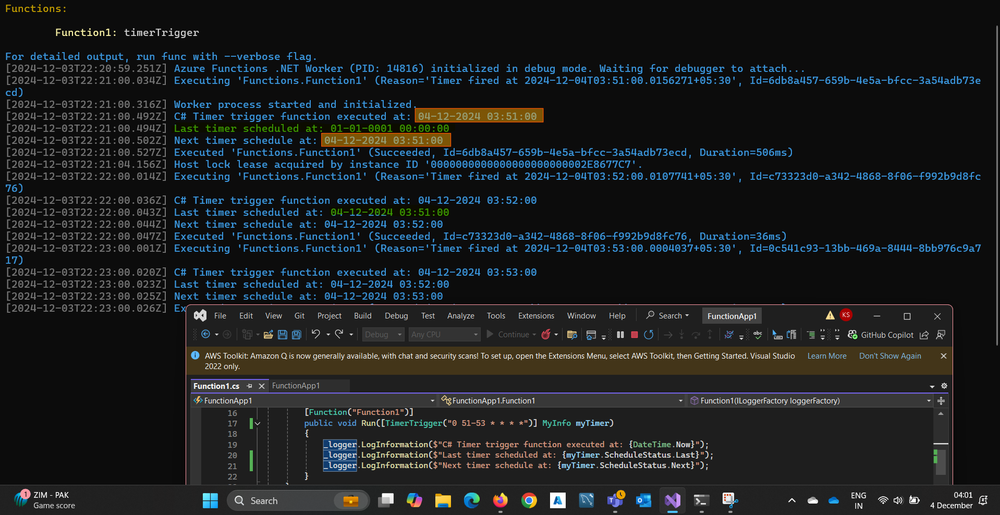

# Azure Functions

> Reference notes. The interview-shaped version, with Durable Functions, retries and the labs, is
> [Interview → Azure → 04 Azure Functions](../../../Interview/Azure/04-azure-functions.md).

> ⚠️ **Model note.** All C# here uses the **isolated worker** model (`[Function]`). Support for the
> **in-process** model (`[FunctionName]`) ends **10 November 2026** — samples using it, including
> older versions of this page, describe a retired model.

## What Azure Functions is

Serverless compute for event-driven code: you write a function, the platform provides the host,
scaling and the connection to whatever triggered it. Typical uses are APIs, data processing, scheduled
jobs and reacting to events from other Azure services.

## Triggers

A trigger defines **how the function is invoked** — exactly one per function.

| Trigger | Fires on |
| --- | --- |
| HTTP | An HTTP request (max 230 s to respond — an Azure Load Balancer limit) |
| Timer | A NCRONTAB schedule |
| Queue Storage | A queue message |
| Blob (Event Grid source) | A blob created or updated |
| Service Bus | A queue or topic-subscription message |
| Event Hubs | A batch of events |
| Cosmos DB | Change feed items |
| Event Grid | A routed event |

```csharp
[Function(nameof(HttpExample))]
public IActionResult HttpExample(
    [HttpTrigger(AuthorizationLevel.Function, "get")] HttpRequest req)
    => new OkObjectResult("Triggered by HTTP request.");
```

## Bindings

Bindings connect to other Azure resources declaratively — **input** bindings supply data, **output**
bindings write it, and neither needs SDK code.

```csharp
[Function(nameof(BlobOutputExample))]
[BlobOutput("sample-container/{rand-guid}.txt", Connection = "StorageConnection")]
public string BlobOutputExample(
    [HttpTrigger(AuthorizationLevel.Function, "post")] HttpRequest req)
    => "Data written to blob!";      // the return value becomes the blob content
```

Bindings trade control for brevity: they give you no hook for custom retry/back-off, batching or
partial failure. Use the SDK directly when you need any of those.

## Authorization levels

For HTTP triggers only. Keys are shared secrets, **not identity** — for real authorization put the
function behind API Management or Easy Auth and validate a Microsoft Entra ID token.

### Anonymous — no key required

```csharp
[Function(nameof(PublicEndpoint))]
public IActionResult PublicEndpoint(
    [HttpTrigger(AuthorizationLevel.Anonymous, "get")] HttpRequest req)
    => new OkObjectResult("This is a public endpoint.");
```

Use for health checks and endpoints already protected by a gateway.

### Function — requires a function or host key

Passed as `?code=<key>` or the `x-functions-key` header.

```csharp
[Function(nameof(InternalApi))]
public IActionResult InternalApi(
    [HttpTrigger(AuthorizationLevel.Function, "get", "post")] HttpRequest req)
    => new OkObjectResult("Function-level secured endpoint.");
```

### Admin — requires the master key

```csharp
[Function(nameof(AdminApi))]
public IActionResult AdminApi(
    [HttpTrigger(AuthorizationLevel.Admin, "delete")] HttpRequest req)
    => new OkObjectResult("Admin-level secured endpoint.");
```

### Function vs Admin

| Aspect | Function | Admin |
| --- | --- | --- |
| Access key | Function key (or host key) | **Master key** |
| Scope | The specific function (host keys: the app) | Every function in the app, plus admin APIs |
| Use case | Per-function secured access | Management operations only — never distribute it |

Keys are managed in the portal or with `az functionapp keys`. Rotate them; treat the master key like
a root credential.

## Hosting plans

| Plan | Scale-out | Max instances | Default / max timeout | Cold start |
| --- | --- | --- | --- | --- |
| **Flex Consumption** (default for new apps) | Per-function group, concurrency-based | 1000 | 30 min / unbounded | Reduced; **always-ready instances** |
| **Premium** | Event-driven, pre-warmed | Windows 100, Linux 20–100 | 30 min / unbounded | None |
| **Dedicated** (App Service plan) | Manual or autoscale | 10–30 (100 ASE) | 30 min / unbounded (needs Always On) | None |
| **Container Apps** | KEDA | 300–1000 | 30 min / unbounded | Depends on min replicas |
| **Consumption** (legacy) | Event-driven | Windows 200, Linux 100 | **5 min / 10 min** | Yes — scales to zero |

The classic **Consumption plan is legacy** — new serverless apps should use **Flex Consumption**, and
**Linux Consumption retires on 30 September 2028**.

## Durable Functions

Stateful workflows on top of stateless functions: **client**, **orchestrator**, **activity** and
**entity** functions, with state checkpointed to a task hub. Patterns: function chaining,
fan-out/fan-in, async HTTP API, monitor, human interaction. The orchestrator is **replayed**, so it
must be deterministic — no `DateTime.UtcNow`, `Guid.NewGuid()`, I/O or `Task.Delay` in the
orchestrator body.

## Deployment and tooling

- **Local:** Azure Functions Core Tools (`func init`, `func new`, `func start`) plus **Azurite** for
  the storage emulator.
- **Deploy:** `func azure functionapp publish`, GitHub Actions, Azure Pipelines, VS Code, Azure CLI,
  Bicep/ARM/Terraform.
- **Monitor:** Application Insights (Azure Monitor), Log Analytics.
- **Languages:** C#, JavaScript/TypeScript, Python, Java, PowerShell.

## Scaling

Scaling follows the trigger (HTTP request rate, queue depth, event throughput) and the plan:

- **Flex Consumption** — per-function scaling with concurrency-based decisions; HTTP triggers scale as
  one group, as do Blob (Event Grid) and Durable triggers.
- **Premium** — event-driven with pre-warmed workers, so no cold start.
- **Dedicated** — manual or App Service autoscale rules; event-driven scaling does not apply.

## Cron format

Azure Functions timer triggers use a **six-field** NCRONTAB expression:

```text
{second} {minute} {hour} {day} {month} {day-of-week}

Second:      0–59
Minute:      0–59
Hour:        0–23
Day:         1–31
Month:       1–12
Day-of-week: 0–6 (Sunday = 0; names like SUN/MON also work)
```

```csharp
[Function(nameof(TimerExample))]
public void TimerExample([TimerTrigger("0 */5 * * * *")] TimerInfo timer)
    => logger.LogInformation("Function executed at: {Now}", DateTime.UtcNow);
```

`0 */5 * * * *` = at second 0, every 5th minute, every hour/day/month/weekday → 12:00:00, 12:05:00, …

| Expression | Description |
| --- | --- |
| `0 0 * * * *` | Every hour, on the hour |
| `0 0 9 * * *` | Daily at 09:00 |
| `0 0 9 * * 1` | Every Monday at 09:00 |
| `0 0 9 1 * *` | 09:00 on the 1st of every month |
| `0 0 9 1 1 *` | 09:00 on 1 January |
| `0 */15 * * * *` | Every 15 minutes |
| `0 37/1 * * * *` | From minute 37, then every minute to the end of the hour (12:37, 12:38 … 12:59) |
| `0 1/1 * * * *` | From minute 1, every minute — **skips** minute 0 |
| `0 */1 * * * *` | Every minute, **including** minute 0 |
| `0 51-53 * * * *` | At minutes 51, 52 and 53 of every hour |

**The difference:** `0 1/1 * * * *` skips the 0th minute; `0 */1 * * * *` includes it.

For a schedule you might want to change without redeploying, put the expression in an app setting and
reference it: `[TimerTrigger("%Schedule:Cleanup%")]`.

<details>
<summary>Timer trigger in the portal</summary>



</details>

**Note:** a `Last timer scheduled at: 01-01-0001 00:00:00` means no previous run was recorded — the
first execution since deployment.

## The runtime storage account

`AzureWebJobsStorage` is required. The Functions host uses it for:

- **Key management** — storing the function/host/master keys
- **Timer trigger state** — the singleton lease that stops every instance firing the same schedule
- **Logging** and runtime state
- **Event Hubs checkpoints** — so event processing resumes where it left off
- **Durable Functions task hub** — orchestration history and queues

```text
Azure Functions runtime
        │
        ▼
AzureWebJobsStorage (Azurite in local development)
   ┌───────────────────────────────┐
   │ - Key management              │
   │ - Timer trigger state         │
   │ - Logging                     │
   │ - Event Hubs checkpoints      │
   │ - Durable task hub            │
   └───────────────────────────────┘
```

Prefer an **identity-based connection** over a connection string — set
`AzureWebJobsStorage__accountName` and grant the function app's managed identity
`Storage Blob Data Owner` + `Storage Queue Data Contributor`. Then the app holds no secret at all.

## Cold start

A cold start is the delay while the platform allocates an instance and loads the runtime and your
dependencies. It happens on the first call after deployment, after an idle period on a plan that
scales to zero, and when scaling out to a new instance.

**What influences it:** the hosting plan (scale-to-zero plans pay it; Premium and always-ready
instances don't), the size of your dependency graph, work done at startup, and image/package size.

**What actually helps**, in order:

1. **Always-ready / pre-warmed instances** (Flex Consumption, Premium)
2. `WEBSITE_RUN_FROM_PACKAGE=1`
3. Trim dependencies; no blocking I/O in `Program.cs`; `IHttpClientFactory` rather than per-call clients
4. `<PublishReadyToRun>true</PublishReadyToRun>`

A "warm-up pinger" is not a fix — it keeps one instance warm and does nothing for scale-out.

## Authentication with Microsoft Entra ID

Function keys identify a caller's possession of a secret, not an identity. For user or service
identity:

1. Enable **App Service authentication (Easy Auth)** on the function app and pick **Microsoft** as
   the identity provider, or front the app with **API Management** and a `validate-jwt` policy.
2. Register the app in Microsoft Entra ID and configure the redirect URI / exposed scopes.
3. Callers present a **JWT access token**; the platform (or APIM) validates issuer, audience,
   signature and expiry, and your code authorizes on the `scp` / `roles` claims.
4. For **outbound** calls, give the function app a **managed identity** and assign it data-plane
   roles — no secrets to store or rotate.

See [Interview → Azure → 02 Entra ID & Managed Identity](../../../Interview/Azure/02-identity-and-managed-identity.md).

## References

- [Azure Functions documentation](https://learn.microsoft.com/en-us/azure/azure-functions/)
- [Isolated worker guide](https://learn.microsoft.com/en-us/azure/azure-functions/dotnet-isolated-process-guide)
- [In-process → isolated migration](https://learn.microsoft.com/en-us/azure/azure-functions/migrate-dotnet-to-isolated-model)
- [Hosting plans and scale](https://learn.microsoft.com/en-us/azure/azure-functions/functions-scale)
- [Timer trigger / NCRONTAB](https://learn.microsoft.com/en-us/azure/azure-functions/functions-bindings-timer)
