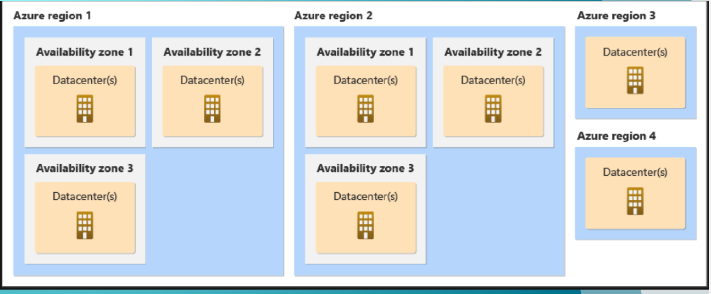
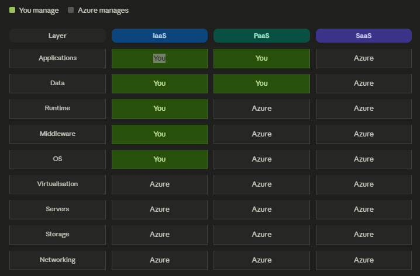

# Azure

## Azure Resource Manager [ARM]
 - It is the **main control layer (brain)** in Azure that creates, manages, and organizes all resources like VMs, databases, storage, etc

## Azure region
- 👉 A Region is a geographical area containing one or more data centers.

<details>
<summary>Example regions:</summary>

        East US
        West Europe
        Central India
        
        ✔ Key Points
        - Located in different parts of the world
        - Data residency & compliance matter
        - Latency depends on region
        
        📌 Example

        If your users are in India → use Central India for low latency

</details>


### Availability Zone
- 👉 A Zone is a physically separate data center inside a region
- Each zone has:
    - Independent power
    - Cooling
    - Networking

<details>
<summary>Example:</summary>

        Region: Central India
        Zone 1
        Zone 2
        Zone 3

</details>


### ⚔️ Region vs Availability Zone

| Feature  |	Region 🌍 |	Availability Zone 🏢 |
| -------- | ---------- | -------------------- |
| Scope	   | Large geographic area |	Within a region |
| Purpose  |	Disaster recovery |	High availability |
| Distance |	Far apart (countries) |	Close but isolated |
| Failure Impact |	Entire region outage |	Single data center failure |
| Example  |	Central India |	Zone 1, 2, 3 inside region |

🧠 When to Use What
- ✅ Use Multiple Zones (Same Region)
    - 👉 For high availability
    - Your app runs in Zone 1, 2, 3
    - If one fails → others handle traffic
    - ✔ Low latency
    - ✔ No downtime

- ✅ Use Multiple Regions
    - 👉 For disaster recovery
    - Primary: Central India
    - Secondary: South India
    - ✔ Survive region outage
    - ✔ Geo-redundancy





## Azure Cloud Hosting model



- IaaS
    - you rent hardware, manage everything above it (VMs, disks, networking)
- PaaS
    - you bring code and data, Azure runs the platform (App Service, AKS, Azure SQL)
- SaaS
    - you just use the app (Microsoft 365, Azure DevOps)
- FaaS
    - subset of PaaS — write one function, pay per run, zero idle cost (Azure Functions)

<details>
<summary>Trick to remember </summary>

```
pps   Don't   Run   My   OS  —   Virtuous   Servers   Store   Networks
Each word = one layer, top to bottom. Click any layer to see details.
```

| Word | Layer |
| ---- | ----- |
| Apps | Applications |
| Don't | Data |
| Run | Runtime |
| My | Middleware |
| OS | Operating system |
| Virtuous | Virtualisation |
| Servers | Servers |
| Store | Storage | 
| Networks | Networking |

</details>
