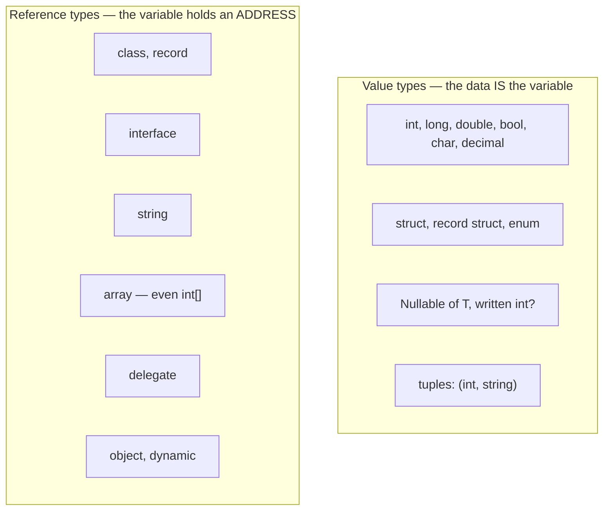
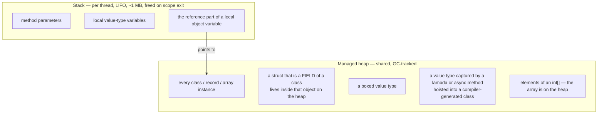
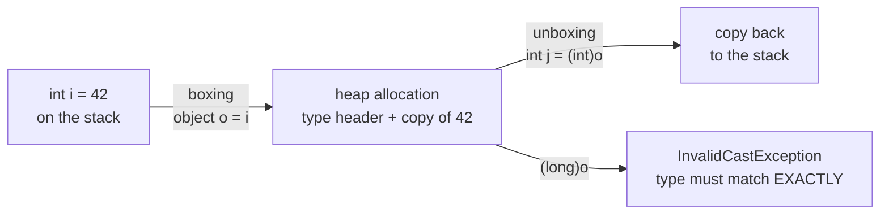
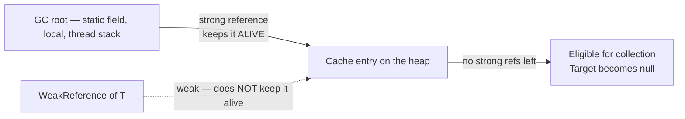

# 02 — Memory, Types, Boxing & Casting

> **Scope:** value vs reference types, stack vs heap (told *correctly*), boxing costs, casting,
> `ref`/`out`/`in`, strong vs weak references. This chapter is where sloppy answers get caught.

---

## Value types vs reference types



| | Value type | Reference type |
| --- | --- | --- |
| Variable holds | the data itself | a reference (address) to the data |
| Assignment copies | the whole value | only the reference — both names see one object |
| Default value | zeroed — `0`, `false`, `'\0'` | `null` |
| Can be `null`? | only as `T?` | yes |
| Base type | `System.ValueType` → `object` | `object` |
| Equality by default | member-wise | reference identity |
| Inheritance | none, interfaces only | full |

```c#
struct Point { public int X, Y; }
class  Node  { public int X, Y; }

var p1 = new Point { X = 1 };
var p2 = p1;          // full COPY
p2.X = 99;            // p1.X is still 1  ✅

var n1 = new Node { X = 1 };
var n2 = n1;          // copies the REFERENCE
n2.X = 99;            // n1.X is now 99   ⚠️ same object
```

---

## Stack vs heap — say this precisely

> ⚠️ **The answer that loses marks:** "value types go on the stack, reference types on the heap."
> That is the *textbook* version and it is wrong often enough that good interviewers probe it.

**The accurate rule: storage is decided by where the variable *lives*, not by its type.**



```c#
class Order
{
    public DateTime CreatedAt;   // DateTime is a struct — but it lives on the HEAP,
}                                // inside the Order object

void Handle()
{
    int local = 5;               // stack
    var order = new Order();     // 'order' reference: stack → object: heap
    int[] nums = new int[100];   // int is a value type, but the array is on the heap

    Func<int> f = () => local;   // 'local' is CAPTURED → hoisted to a heap closure object
}
```

- **Stack:** fast (pointer bump), per-thread, LIFO, roughly 1 MB by default — hence
  `StackOverflowException` on deep recursion, which is **uncatchable** and kills the process.
- **Heap:** GC-managed, shared, supports arbitrary lifetimes.

> 🎯 **The senior answer:** "Locals of value type usually live on the stack, but a struct that is a
> field of a class lives on the heap inside that object, and a captured local is hoisted into a
> heap closure. The type tells you copy semantics; the *location* tells you storage."

---

## struct vs class — and when to pick a struct

| Aspect | `struct` | `class` |
| --- | --- | --- |
| Semantics | value — copied | reference — shared |
| Default value | zeroed instance | `null` |
| Inheritance | interfaces only, cannot be a base or derive | full |
| Can be `abstract` / `sealed`? | implicitly sealed | either |
| Parameterless constructor | allowed since C# 10, but `default` bypasses it | yes |
| Finalizer | not allowed | allowed |
| Best size | **≤ 16 bytes** | any |

**Pick a struct when** the value is small, immutable and short-lived — a coordinate, money, an id
wrapper, a `DateTime`-like value.
**Pick a class when** it has identity, is large, is polymorphic, or is mutable shared state.

```c#
// The idiomatic modern struct: readonly + record struct for free equality
public readonly record struct Money(decimal Amount, string Currency);

// 'in' passes by reference without copying, and without allowing mutation
static decimal Total(in Money a, in Money b) => a.Amount + b.Amount;
```

- `readonly struct` tells the compiler nothing can mutate, so it stops emitting **defensive
  copies** — a real and frequently measured performance win.
- A **mutable struct** is the classic C# footgun: `list[0].X = 5` on a `List<MutableStruct>` fails to
  compile, because the indexer returns a *copy*.

---

## Boxing and unboxing

**Boxing** = converting a value type to `object` or an interface. The CLR allocates a box on the
**heap** and copies the value in. **Unboxing** extracts it back and requires an **exact** type match.



```c#
int i = 42;
object o = i;          // boxing   → heap allocation + copy
int j = (int)o;        // unboxing → type check + copy back
// long k = (long)o;   // ❌ InvalidCastException — boxed int is not a boxed long
```

### Consequences — the real answer to "what's the cost?"

1. **Allocation** on the Gen 0 heap for every box → GC pressure, and in a hot loop that means
   constant Gen 0 collections.
2. **Two copies** (in and out) plus a runtime type check.
3. **Lost mutation** — you mutate the box, not the original.
4. **Silent equality surprises** — two boxes of the same value are different objects, so
   `ReferenceEquals` is `false`.

### Where boxing sneaks in

| Sneaky source | Fix |
| --- | --- |
| `ArrayList`, `Hashtable` (non-generic) | `List<T>`, `Dictionary<K,V>` |
| `string.Format`/`Concat` with value args | interpolation — the handler avoids boxing since .NET 6 |
| Value type implementing an interface, called through the interface | generic constraint `where T : IShape` |
| `struct` in a `params object[]` | `params ReadOnlySpan<T>` (C# 13+) |
| `Enum.HasFlag` on older runtimes | bitwise `&` test |
| LINQ over a struct sequence with a non-generic delegate | keep it generic |

```c#
// ❌ boxes on every call
static void Log(object value) => Console.WriteLine(value);

// ✅ no boxing — the generic keeps the value type intact
static void Log<T>(T value) => Console.WriteLine(value);
```

> 🎯 **Trap:** "Generics avoid boxing" is right — *but* `List<int>` still boxes if you call
> `((IEnumerable)list).GetEnumerator()`, because that path returns `IEnumerator`, not the struct
> enumerator. Use `foreach` on the concrete type.

---

## Casting — implicit, explicit, and the safe operators

| Form | Syntax | Fails how? |
| --- | --- | --- |
| **Implicit** — always safe, no data loss | `long l = 42;` `Base b = derived;` | cannot fail |
| **Explicit** — you assert it is safe | `int i = (int)someLong;` `var d = (Dog)animal;` | `InvalidCastException`, or silent truncation for numerics |
| **`as`** — try reference/nullable cast | `var d = animal as Dog;` | returns `null` |
| **`is` pattern** — test and bind | `if (animal is Dog d)` | branch not taken |
| **`Convert` / `TryParse`** — parsing, not casting | `int.TryParse(s, out var n)` | returns `false` |

```c#
object value = "not a number";

var s = value as string;                 // "not a number"
var n = value as int?;                   // null — no exception
if (value is int i) { /* skipped */ }    // preferred: test + bind in one step

// C# pattern matching makes casting chains readable
string Describe(object o) => o switch
{
    int n when n < 0 => "negative int",
    int n            => $"int {n}",
    string { Length: 0 } => "empty string",
    string str       => $"string of {str.Length}",
    null             => "null",
    _                => o.GetType().Name
};
```

### ❗ What can go wrong in an explicit cast

- **Reference cast to an unrelated type** → `InvalidCastException`.
- **Narrowing a number** → silent data loss: `(int)3.9` is `3`; `(byte)300` is `44`.
- **Overflow** is *unchecked by default*. Wrap in `checked` to make it throw:

```c#
int big = int.MaxValue;
unchecked { int wrapped = big + 1; }        // -2147483648, silently
checked   { int boom = big + 1; }           // OverflowException ✅
```

- **Unboxing to the wrong type** → `InvalidCastException` even for compatible-looking numerics.

> 🎯 **Rule of thumb:** in production code prefer `is`-patterns and `TryParse`. Reserve `(T)x` for
> cases where a failure genuinely is a bug you want to crash on.

---

## `ref`, `out` and `in`

| | `ref` | `out` | `in` |
| --- | --- | --- | --- |
| Direction | **bidirectional** | **out only** | **in only** (read-only) |
| Caller must initialise first | ✅ yes | ❌ no | ✅ yes |
| Method must assign before returning | ❌ no | ✅ yes | cannot assign |
| Typical use | mutate the caller's variable | return extra values | pass a large struct without copying |

```c#
static void Bump(ref int n) => n++;                    // caller's variable changes
static bool TryGetAge(string s, out int age)           // classic Try-pattern
    => int.TryParse(s, out age);
static decimal Sum(in Money m) => m.Amount;            // no copy, no mutation

int counter = 0;                 // must be initialised for ref
Bump(ref counter);               // counter == 1

if (TryGetAge("42", out var age))    // no initialisation needed for out
    Console.WriteLine(age);
```

- They are **different at runtime** (`out` carries an `[Out]` attribute and initialisation rules)
  but **identical in the metadata signature**, so you **cannot overload on `ref` vs `out` alone**.
- `ref readonly` and `ref struct` (`Span<T>`) extend the same idea to zero-copy slicing.
- **Modern alternative:** returning a tuple or a `record` is usually clearer than two `out`
  parameters — reserve `out` for the `TryXxx` idiom, where it is the established convention.

```c#
// Cleaner than three out parameters
static (bool Ok, string? Error, int Value) Parse(string s)
    => int.TryParse(s, out var v) ? (true, null, v) : (false, "not a number", 0);
```

---

## Strong vs weak references



- **Strong reference** — the default. As long as one exists from a GC root, the object survives.
- **Weak reference** — lets you *observe* an object without keeping it alive. The GC may take it at
  any time, after which `TryGetTarget` returns `false`.

```c#
// Prefer the generic WeakReference<T> over the legacy non-generic WeakReference
var weak = new WeakReference<byte[]>(new byte[1024 * 1024]);

if (weak.TryGetTarget(out var buffer))       // ✅ atomic check-and-fetch
    Console.WriteLine(buffer.Length);

GC.Collect();

Console.WriteLine(weak.TryGetTarget(out _)
    ? "still alive"
    : "collected");                          // likely, with no strong reference held
```

> ⚠️ The legacy `if (weak.IsAlive) { use weak.Target; }` pattern found in older notes is **racy** —
> the GC can collect between the two calls. `TryGetTarget` is the correct API.

### When would you actually use one?

| Scenario | Why weak |
| --- | --- |
| **Memory-sensitive cache** of expensive-to-build objects | lets memory pressure evict entries automatically |
| **Event subscriptions** in long-lived publishers | prevents the classic "publisher keeps subscriber alive" leak |
| **Object–metadata side tables** | `ConditionalWeakTable<TKey,TValue>` — value dies with the key |
| Diagnostics / leak detection | check whether an object was really released |

```c#
// A weak cache — entries survive only while memory allows
public sealed class WeakCache<TKey, TValue> where TKey : notnull where TValue : class
{
    private readonly Dictionary<TKey, WeakReference<TValue>> _entries = new();

    public void Set(TKey key, TValue value) => _entries[key] = new WeakReference<TValue>(value);

    public bool TryGet(TKey key, out TValue? value)
    {
        value = null;
        if (!_entries.TryGetValue(key, out var weak)) return false;
        if (weak.TryGetTarget(out value)) return true;
        _entries.Remove(key);          // tombstone: reference is dead, drop the slot
        return false;
    }
}
```

> 🎯 **Better answer for real caching:** reach for `IMemoryCache` / `HybridCache` with a size limit
> and eviction policy first. Weak references give you *no* control over when eviction happens —
> they are a memory-pressure valve, not a cache policy.

---

## Rapid-fire Q&A

**Q: Where does an `int` field of a class live?**
On the heap, inside that object. Being a value type only decides copy semantics.

**Q: Is `string` a value type?**
No — it is a reference type. It *behaves* value-like because it is immutable and `==` is overloaded
to compare content.

**Q: Why is boxing bad in a hot loop?**
Every box is a Gen 0 allocation. Thousands per second means constant Gen 0 collections and lost
throughput, for a value that never needed to leave the stack.

**Q: `as` vs a cast?**
`as` returns `null` on failure and works only for reference and nullable types. A cast throws. Prefer
the `is` pattern, which tests and binds in one step.

**Q: Can you overload on `ref` vs `out`?**
No — they produce identical signatures in metadata. You *can* overload `ref` against by-value.

**Q: Difference between `Nullable<int>` and `object` holding an int?**
`int?` is still a value type — no heap allocation. Assigning an `int` to `object` boxes it.

**Q: What does `readonly struct` buy you?**
The compiler stops emitting defensive copies when the struct is used through `in` parameters or
readonly fields — measurably faster and it documents immutability.

---

**Prev:** [01 — Platform & CLR](01-dotnet-platform-and-clr.md) ·
**Next:** [03 — OOP & Class Design](03-oop-and-class-design.md) ·
**Up:** [Interview hub](../csharp-interview.md)
