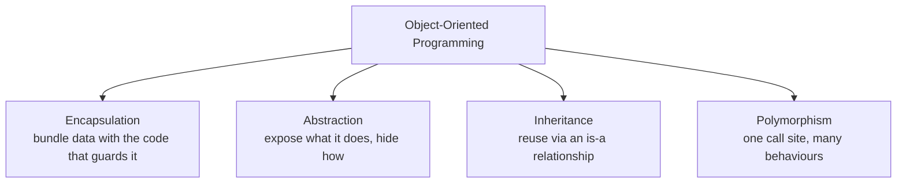
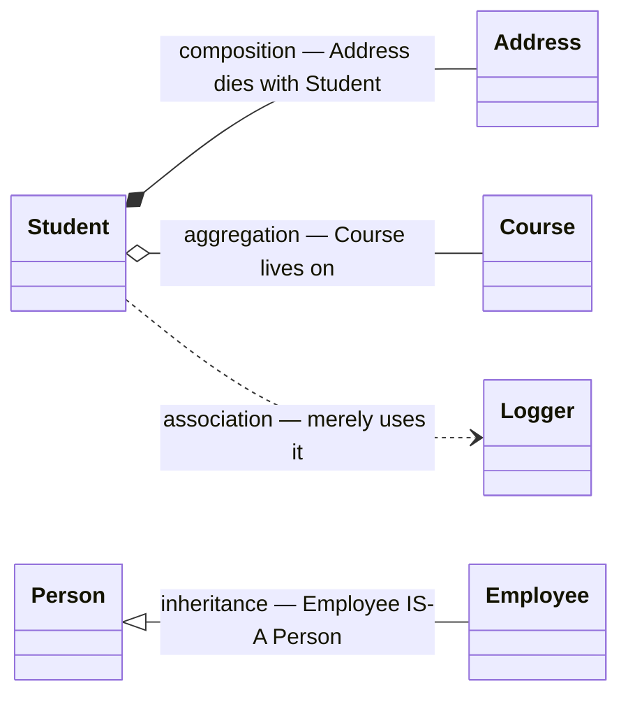
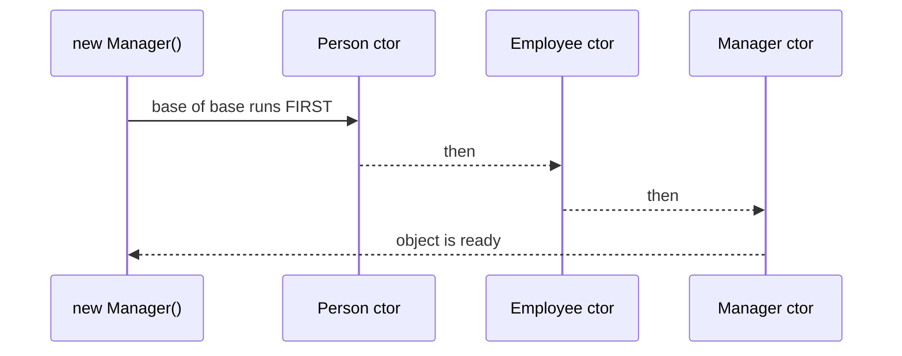
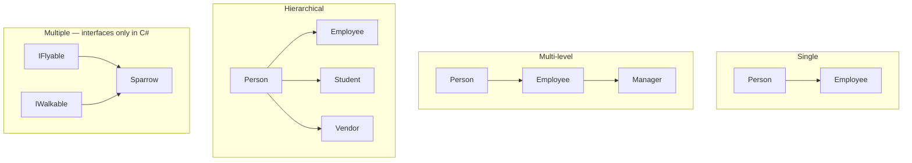
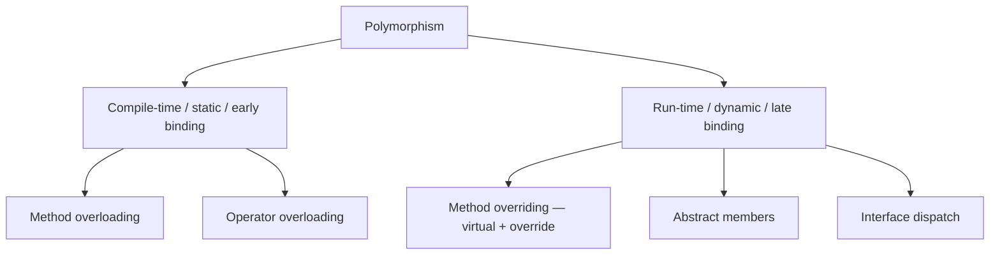

# 03 — OOP, Inheritance & Class Design

> **Scope:** the four pillars with code that proves them, the four class relationships (drawn as
> UML), every kind of inheritance, polymorphism (`virtual`/`override`/`new`), and the
> `sealed` / `static` / `abstract` / `partial` matrix.

---

## The four pillars



### Encapsulation — data hiding

Wrap state and the logic that protects it in one unit, and let nothing reach the state directly.
Achieved with `private` fields plus properties/methods that enforce the invariants.

```c#
public sealed class BankAccount
{
    private decimal _balance;                       // nobody can touch this directly

    public decimal Balance => _balance;             // read-only to the outside world

    public void Deposit(decimal amount)
    {
        // The invariant lives with the data — that is the whole point of encapsulation.
        if (amount <= 0) throw new ArgumentOutOfRangeException(nameof(amount));
        _balance += amount;
    }
}
```

> **C# 14 upgrade — the `field` keyword.** You no longer need a hand-written backing field just to
> add validation:
>
> ```c#
> public decimal Balance
> {
>     get;
>     set => field = value >= 0 ? value : throw new ArgumentOutOfRangeException(nameof(value));
> }
> ```

### Abstraction

Show the *essential* operations, hide the mechanism. Delivered with **interfaces** and **abstract
classes** — so the caller depends on a capability, not an implementation.

```c#
public interface IPaymentGateway            // WHAT the system can do
{
    Task<PaymentResult> ChargeAsync(Money amount, CancellationToken ct = default);
}

// HOW is invisible to callers: retries, HTTP, provider SDK, idempotency keys…
internal sealed class StripeGateway(HttpClient http) : IPaymentGateway { /* … */ }
```

> 🎯 **Encapsulation vs abstraction — the distinction interviewers fish for:**
> encapsulation is about **hiding state** (an implementation-level concern);
> abstraction is about **hiding complexity behind a contract** (a design-level concern).

---

## The four relationships between classes



| Relationship | Reads as | Lifetime | C# shape |
| --- | --- | --- | --- |
| **Association** | *uses-a* | fully independent | a parameter, or an injected service |
| **Aggregation** | *has-a*, shared | child **outlives** the parent | a property referencing an independent entity |
| **Composition** | *has-a*, owned | child **dies with** the parent | a property the owner creates and owns |
| **Inheritance** | *is-a* | n/a | `class Derived : Base` |

### Association — one class *uses* another

```c#
public class StudentService(ILogger<StudentService> logger)   // injected, independent lifetime
{
    public IList<Student> GetAll()
    {
        logger.LogInformation("Loading students");   // uses behaviour, does not own the logger
        return [];
    }
}
```

- Uses another type's methods; does not override them, does not inherit, does not own them.
- Both objects have **independent lifetimes** — disposing one does not dispose the other.

### Composition — owned, cannot exist alone

```c#
public class Student
{
    public int StudentId { get; set; }
    public required string FirstName { get; set; }

    // An Address has no meaning without its Student — the Student owns it.
    public Address HomeAddress { get; set; } = new();
}

public class Address
{
    public int AddressId { get; set; }
    public string? Line1 { get; set; }
    public string? City { get; set; }
    public string? Country { get; set; }
}
```

- Deleting the parent should delete the child — in EF Core this is exactly an **owned entity**
  (`OwnsOne`) or a cascade delete.

### Aggregation — has-a, but independent

```c#
public class Student
{
    public int StudentId { get; set; }
    public Course? EnrolledCourse { get; set; }   // or just CourseId
}

public class Course
{
    public int CourseId { get; set; }
    public required string CourseName { get; set; }
    public DateOnly StartDate { get; set; }
}
```

- Delete the `Student` and the `Course` still exists — other students are enrolled in it.

> 🎯 **The one-liner:** "Composition and aggregation are both *has-a*. In composition the parts
> cannot exist without the whole; in aggregation they can. An engine in a car is composition; a
> student in a course is aggregation."

---

## Inheritance

**Inheritance reuses the functionality of one class in another related class — an *is-a*
relationship.**

### Access modifiers and what the derived class actually sees

| Modifier | Accessible in derived class? | Part of the derived object's public surface? |
| --- | --- | --- |
| `public` | ✅ | ✅ |
| `protected` | ✅ | ❌ — internal to the hierarchy |
| `internal` | ✅ (same assembly) | ✅ (same assembly) |
| `protected internal` | ✅ | ✅ same assembly, or derived elsewhere |
| `private protected` | ✅ derived **in the same assembly** only | ❌ |
| `private` | ❌ — inherited but inaccessible | ❌ |

```c#
class Person
{
    public    string FirstName { get; set; } = "";   // inherited and publicly visible
    protected string Ssn       { get; set; } = "";   // usable inside the hierarchy only
    private   string Secret    { get; set; } = "";   // exists in memory, unreachable from Employee
}

class Employee : Person
{
    public string Describe() => $"{FirstName} / {Ssn}";   // ✅ both fine here
    // public string Leak() => Secret;                    // ❌ CS0122 — inaccessible
}

var emp = new Employee();
emp.FirstName = "Bill";    // ✅ public
// emp.Ssn = "…";          // ❌ protected — not part of the public surface
```

> ⚠️ **Precision point:** private members *are* inherited (they occupy memory in the derived
> object); they are simply not **accessible**. Saying "private members are not inherited" is the
> common shortcut — say "not accessible" and you sound sharper.

### Constructor chaining — base first, always



```c#
class Person(string name)
{
    public string Name { get; } = name;
}

class Employee(string name, string dept) : Person(name)   // primary ctor calls base
{
    public string Dept { get; } = dept;
}

// Classic syntax, when you need a body:
class Manager : Employee
{
    public Manager(string name) : base(name, "Management")   // ':base(...)' picks the overload
    {
        // runs LAST — base is fully constructed by now
    }
}
```

- Construction runs **base → derived**; destruction/`Dispose` conceptually unwinds the other way.
- **Never call a `virtual` method from a constructor** — the override runs before the derived
  class's own fields are initialised, so it sees `null`/zero.

### Type conversion up and down the hierarchy

```c#
Employee emp = new();
Person person = emp;                 // ✅ upcast — implicit, always safe
Employee? back = person as Employee; // ⬇️ downcast — must be explicit, may be null
if (person is Employee e) { }        // ✅ preferred: test and bind
```

### Types of inheritance



| Kind | Shape | C# support |
| --- | --- | --- |
| **Single** | one derived, one base | ✅ |
| **Multi-level** | `A → B → C` | ✅ but keep it shallow — 2–3 levels max |
| **Hierarchical** | several derived from one base | ✅ |
| **Multiple** | one class, several **bases** | ❌ classes · ✅ **interfaces** |
| **Hybrid** | multi-level + hierarchical mixed | ✅ via interfaces |

**Why C# forbids multiple class inheritance:** the *diamond problem* — if `B` and `C` both override
`A.M()` and `D` inherits both, which implementation wins? Interfaces sidestep it because (before
C# 8) they carried no implementation, and default interface methods must be disambiguated
explicitly when they collide.

### The rules worth memorising

- Three kinds can participate: **class**, **struct**, **interface**.
- A class inherits **exactly one** class, and implements **any number** of interfaces.
- A class **cannot** inherit from a struct; a struct **cannot** inherit from a struct or class — only
  implement interfaces.
- An interface can inherit **multiple interfaces**, never a class or struct.
- **Constructors and finalizers are not inherited.**
- Everything derives from `System.Object`.
- Default accessibility: a **type** is `internal`; a **member** is `private`.

---

## Polymorphism



### Compile-time polymorphism

```c#
public class Printer
{
    public void Print(int n)             => Console.WriteLine($"int {n}");
    public void Print(string s)          => Console.WriteLine($"string {s}");
    public void Print(int a, int b)      => Console.WriteLine($"two ints");
}
```

- **Overloading** = same name, **different parameter list** (count, types, or order).
- **Return type is not part of the signature** — you cannot overload on it alone.
- **Operator overloading** — and in **C# 14** you can define **compound operators** (`+=`, `-=`) and
  `++`/`--` directly, instead of relying on the compiler synthesising them from `+`:

```c#
public struct Counter
{
    public int Value;
    public static Counter operator +(Counter a, int n) => new() { Value = a.Value + n };
    public void operator +=(int n) => Value += n;      // C# 14 — mutates in place, no copy
    public void operator ++()      => Value++;         // C# 14
}
```

### Run-time polymorphism

```c#
public abstract class Shape
{
    public abstract double Area();                        // must be overridden
    public virtual string Describe() => $"Area {Area():F2}";   // may be overridden
}

public sealed class Circle(double r) : Shape
{
    public override double Area() => Math.PI * r * r;
    public override string Describe() => $"Circle: {base.Describe()}";   // extend, don't replace
}

Shape shape = new Circle(2);
Console.WriteLine(shape.Describe());   // Circle: Area 12.57 — resolved at RUN time
```

### `virtual`/`override` vs `new` — the classic trick question

```c#
class Base
{
    public virtual string V() => "Base.V";
    public         string H() => "Base.H";
}

class Derived : Base
{
    public override string V() => "Derived.V";
    public new      string H() => "Derived.H";     // HIDES, does not override
}

Base b = new Derived();
Console.WriteLine(b.V());   // "Derived.V"  ← virtual dispatch follows the OBJECT
Console.WriteLine(b.H());   // "Base.H"     ← hiding follows the VARIABLE's declared type ⚠️
```

> 🎯 **Say it like this:** "`override` replaces the entry in the vtable, so dispatch follows the
> runtime type. `new` just hides the name at compile time, so dispatch follows the reference type.
> Method hiding is almost always a bug waiting to happen."

### Compile-time vs run-time polymorphism

| | Compile-time | Run-time |
| --- | --- | --- |
| Achieved by | overloading, operator overloading | overriding (`virtual`/`abstract`/interface) |
| Also called | static binding, early binding | dynamic binding, late binding |
| Resolved | at compile time | at run time, via the vtable / interface dispatch |
| Flexibility | lower — everything is fixed | higher — behaviour chosen by actual type |
| Performance | faster — a direct call | one indirection, though **dynamic PGO often devirtualises it** |

> 🎯 **Modern nuance worth dropping in:** "The classic 'virtual is slower' answer is dated — .NET's
> dynamic PGO devirtualises monomorphic call sites at Tier 1, so in practice the gap is usually
> noise. Design for clarity first."

---

## Kinds of class

| | `sealed` | `static` | `abstract` | `partial` |
| --- | --- | --- | --- | --- |
| Can be instantiated | ✅ | ❌ | ❌ | depends on the class |
| Can be inherited | ❌ | ❌ | ✅ **must be** | depends |
| Can have instance constructors | ✅ | ❌ (static ctor only) | ✅ (called by derived) | ✅ |
| Can have a static constructor | ✅ | ✅ | ✅ | ✅ |
| Members | any | **all static** | abstract + concrete | any |
| Typical use | value objects, prevent extension | helpers, extension methods | template base class | generated + hand-written halves |

### Abstract classes

```c#
public abstract class Repository<TEntity> where TEntity : class    // ✅ can be generic
{
    protected Repository(DbContext db) => Db = db;                // ✅ can have a constructor
    protected DbContext Db { get; }                               // ✅ can have state

    public abstract Task<TEntity?> GetAsync(int id);              // must be implemented
    public virtual Task<int> CountAsync() => Db.Set<TEntity>().CountAsync();   // may be replaced
    public sealed override string ToString() => GetType().Name;   // ✅ sealed stops further overriding
}
```

**Fact sheet** — all of these are true:

| Statement | Notes |
| --- | --- |
| Declared with `abstract` | ✅ |
| Cannot be instantiated | enforced by the compiler |
| Must be inherited to be used | for instance members |
| Can mix abstract and concrete methods | the main reason to prefer it over an interface |
| Abstract methods **cannot be `private`** | nothing could implement them |
| One abstract member forces the whole class abstract | compiler requirement |
| Can have constructors, fields, properties, events | instance *and* static |
| Can implement interfaces | either satisfy them, or re-declare as abstract |
| Can be generic | `abstract class Repository<T>` |
| Abstract methods are **implicitly virtual** | so `abstract virtual` is illegal — pick one |
| Can contain `sealed override` methods | stops the chain of overriding |
| Can have static members and a static constructor | ✅ |
| Can be `partial` | every part must agree it is abstract |

### Partial classes

```c#
// Order.Generated.cs  — tool-owned
public partial class Order { public int Id { get; set; } }

// Order.cs           — hand-written
public partial class Order
{
    public bool IsValid() => Id > 0;
}
```

**Rules:** every part needs the `partial` keyword; same **name**, same **namespace**, same
**assembly**, same **accessibility**; a base class or interface declared on one part applies to all;
if any part is `abstract`/`sealed` the whole type is; no duplicate member names across parts.

**Why it exists:** to separate generated code (designers, EF Core, source generators, gRPC, Swagger
clients) from your code so regeneration never overwrites your work. `partial` also applies to
methods, and in **C# 13+** to **properties and indexers** — which is what source generators use.

### Sealed classes

```c#
public sealed class Currency { }        // cannot be inherited
```

- **Prevents inheritance** — the honest reason is usually design intent: "this type's invariants
  cannot survive being extended."
- **Enables devirtualisation:** the JIT knows there is no override, so it can inline the call. This
  is why so much of the BCL is sealed. (The old claim that "sealed increases speed" is true, but the
  mechanism is devirtualisation, not skipping some check.)
- Access modifiers **do** apply — `public sealed class` and `internal sealed class` are both normal.
  (Older notes claiming otherwise are simply wrong.)
- You still need an instance to reach non-static members.
- `sealed override` on a **member** stops overriding at that level without sealing the class.

### Static classes

```c#
public static class StringExtensions
{
    public static bool IsBlank(this string? s) => string.IsNullOrWhiteSpace(s);
}
```

- All members static, cannot be instantiated or inherited, implicitly `sealed` and `abstract` in IL.
- The **only** place extension methods could live before C# 14 — now `extension` blocks are the
  modern form (see [05 — Language Essentials](05-language-essentials.md)).

### Key facts about classes

- Reference types; instances live on the heap.
- Every class derives from `System.Object`.
- Default accessibility of a **type** is `internal`; of a **member**, `private`.
- A `private` class cannot sit directly in a namespace — only nested inside another type.
- Access modifiers available: `public`, `internal`, `protected`, `private`,
  `protected internal`, `private protected`. (`protected`/`private` on a *top-level* type is illegal.)

---

## Rapid-fire Q&A

**Q: Encapsulation vs abstraction?**
Encapsulation hides *state* behind members that protect invariants. Abstraction hides
*implementation* behind a contract. One is about data, one is about design.

**Q: Composition vs aggregation vs association?**
All three are "one class uses another". Composition owns the child (it dies with the parent),
aggregation references an independently-living child, association merely uses another class's
behaviour.

**Q: Why prefer composition over inheritance?**
Inheritance is compile-time, single, and couples you to the base class's internals — change the base
and every derived class can break. Composition is swappable at run time, testable, and does not
inherit the base's whole surface. Reach for inheritance only for a genuine, stable *is-a*.

**Q: Can a struct inherit?**
It can implement interfaces, nothing more. Structs are implicitly sealed and always derive from
`System.ValueType`.

**Q: `override` vs `new`?**
`override` replaces the virtual slot, so dispatch follows the object's real type. `new` hides the
name, so dispatch follows the variable's declared type.

**Q: Can you override a non-virtual method?**
No. The base member must be `virtual`, `abstract` or `override`. Without it you can only hide with
`new`.

**Q: Why seal a class?**
To protect invariants, and to let the JIT devirtualise and inline calls to it.

**Q: Can an abstract class have no abstract members?**
Yes. That is a perfectly valid way to say "this is a base class, never instantiate it directly".

---

**Prev:** [02 — Memory & Types](02-memory-and-type-system.md) ·
**Next:** [04 — Abstract vs Interface](04-abstract-vs-interface.md) ·
**Up:** [Interview hub](../CS-01.md)
