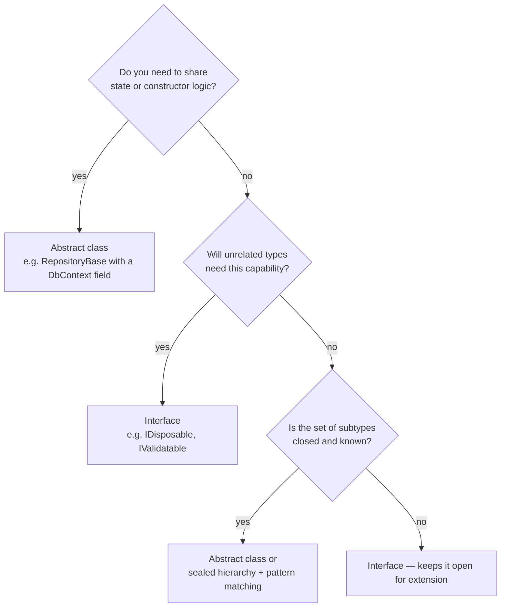

# 04 — Abstract Classes vs Interfaces

> **Scope:** the single most-asked C# design question, answered at .NET 10 / C# 14 level — where
> default interface methods, static abstract members and generic math change the classic answer.

---

## Why both exist

| | Abstract class | Interface |
| --- | --- | --- |
| Models | **"is-a" with shared machinery** | **"can-do" capability / contract** |
| Gives you | partial implementation + state + constructor | a shape callers can rely on |
| Cost | burns your single base-class slot | none — implement as many as you like |

- **Abstract class** — a base type that must not be instantiated, defines what subclasses *must*
  implement, and hands them working code they can reuse.
- **Interface** — a contract. Says what a type can do without dictating how. The tool for
  polymorphism, decoupling, and testability.



---

## The comparison table

| Feature | **Interface** | **Abstract class** |
| --- | --- | --- |
| Instantiation | ❌ | ❌ |
| Implementation of members | ✅ since **C# 8** (default interface methods) | ✅ always |
| **Instance** fields | ❌ never | ✅ |
| **Static** fields | ✅ since C# 8 | ✅ |
| Constructors / finalizers | ❌ | ✅ |
| Access modifiers on members | `public` by default; `private`/`protected`/`static` allowed since C# 8 | full range |
| Multiple inheritance | ✅ implement as many as you want | ❌ one base class only |
| Properties | ✅ including accessors, when a default body is given | ✅ |
| Default behaviour | ✅ via default interface methods | ✅ via virtual/concrete methods |
| Adding a member later | **breaking** — unless you give it a default body | non-breaking if `virtual` with a body |
| Static abstract members | ✅ **C# 11+** — enables generic math | ❌ |
| Purpose | a contract, a capability | a base type with shared behaviour |

> ⚠️ Two lines from older cheat-sheets are now **out of date**:
> "interfaces cannot have any implementation" (false since C# 8) and
> "interfaces cannot define property accessors" (they can, with a default body).
> Knowing *why* they changed is exactly what separates a rehearsed answer from an informed one.

---

## What an interface can do in C# 14 — hands on

```c#
public interface IVehicleService
{
    // 1. Classic contract member — no body, implementers must provide it.
    void StartEngine();

    // 2. Default implementation (C# 8+): every implementer gets this free,
    //    and can still override it.
    void Honk() => Log("Beep beep!");

    // 3. Private helper — usable only by other members of this interface.
    private static void Log(string message) => Console.WriteLine(message);

    // 4. Static abstract (C# 11+): the implementer must supply a STATIC member.
    //    This is what makes generic math and generic factories possible.
    static abstract IVehicleService Create(string name);

    // 5. Static concrete member with state — shared by all implementers.
    static int InstancesCreated { get; private set; }

    // 6. Property with a default computed body.
    string DisplayName => GetType().Name;
}
```

### Why default interface methods were added

To let you **evolve a published interface without breaking every implementer**. Before C# 8, adding
one method to a shipped `IPlugin` broke every plugin ever compiled against it.

```c#
public interface IAuditLog
{
    void Write(string message);

    // Added in v2 — existing implementers keep compiling because there is a default.
    void WriteError(Exception ex) => Write($"ERROR: {ex.Message}");
}
```

**Caveats an interviewer will reward you for knowing:**

- A default method is **not** inherited into the implementing type's public surface — you must call
  it through the interface: `((IAuditLog)log).WriteError(ex)`.
- No instance state is possible, so defaults can only compose other interface members.
- If two implemented interfaces provide the same default member, you **must** disambiguate with an
  explicit implementation — that is how C# avoids the diamond problem.

### Static abstract members — the modern differentiator

```c#
public interface IParsable<TSelf> where TSelf : IParsable<TSelf>
{
    static abstract TSelf Parse(string s);
}

public readonly record struct Sku(string Code) : IParsable<Sku>
{
    public static Sku Parse(string s) => new(s.Trim().ToUpperInvariant());
}

// Now a generic method can call a STATIC member on an unknown type:
static T ParseAll<T>(string raw) where T : IParsable<T> => T.Parse(raw);
```

This is the mechanism behind **generic math** (`INumber<T>`), so you can finally write
`static T Sum<T>(IEnumerable<T> xs) where T : INumber<T>` — impossible before C# 11.

---

## Abstract class questions — the standard set

**Are abstract methods virtual?**
Yes — **implicitly**. An abstract method is a virtual method with no body, so it is dispatched
through the vtable and must be overridden in every non-abstract derived class. Writing
`abstract virtual` is a compile error: pick one.

**Can you create an instance of an abstract class?**
No — compile-time error `CS0144`. You *can* hold a reference of the abstract type pointing at a
derived instance, which is the entire point.

**Is it compulsory to implement abstract methods?**
Yes, in any **non-abstract** derived class. An intermediate abstract class may pass the obligation
down without implementing it.

**Why can't a plain base class replace an abstract class?**
A plain base class can be instantiated (so a meaningless half-built object is possible), and it
cannot *force* derived classes to implement anything. `abstract` encodes both rules in the type
system rather than in a comment.

**Can we do multiple inheritance with abstract classes?**
No. A class inherits **one** class, abstract or not. Use interfaces for multiple inheritance.

```c#
public abstract class NotificationChannel
{
    protected NotificationChannel(TimeProvider clock) => Clock = clock;   // shared setup
    protected TimeProvider Clock { get; }                                 // shared state

    public abstract Task SendAsync(string to, string body);               // must implement

    public virtual bool CanRetry => true;                                 // may override

    // Template Method: fixed algorithm, variable steps — the reason abstract classes exist.
    public async Task<bool> DispatchAsync(string to, string body)
    {
        for (var attempt = 1; attempt <= (CanRetry ? 3 : 1); attempt++)
        {
            try { await SendAsync(to, body); return true; }
            catch (Exception) when (attempt < 3) { await Task.Delay(200 * attempt); }
        }
        return false;
    }
}

public sealed class EmailChannel(TimeProvider clock) : NotificationChannel(clock)
{
    public override Task SendAsync(string to, string body) => Task.CompletedTask;
}
```

---

## Interface questions — the standard set

**Can we write logic in interfaces?**
Yes, since **C# 8** — default implementations, private helpers, static members. Before that, only
signatures.

**Can interface methods be private?**
Yes, since C# 8. A `private` interface member is a helper for other members of the same interface
and is invisible to implementers and callers.

**If I need to change a published interface, what's the best practice?**

1. **Add a default implementation** — non-breaking, works for in-place evolution.
2. **Create a new interface that extends the old one** (`IShipping2 : IShipping`) — the classic
   answer, and still right when you must support old binaries or want a clean split.
3. **Never** silently change an existing member's signature — that breaks every implementer.

```c#
public interface IShipping { decimal Quote(Order o); }

// Option 2: additive, both interfaces remain valid
public interface IShippingWithSla : IShipping
{
    TimeSpan EstimatedDelivery(Order o);
}
```

**Explain multiple inheritance with interfaces.**
A class may implement any number of interfaces, so it can acquire several unrelated capabilities.
This is safe because a class has only one *implementation* chain; when two interfaces supply
conflicting default members, C# forces you to disambiguate explicitly.

```c#
public interface IFlyable { void Fly(); }
public interface IWalkable { void Walk(); }

public class Sparrow : IFlyable, IWalkable
{
    public void Fly()  => Console.WriteLine("Sparrow flying.");
    public void Walk() => Console.WriteLine("Sparrow walking.");
}
```

**Explain the Interface Segregation Principle.**
No client should be forced to depend on members it does not use. Split fat interfaces into small,
role-focused ones — that is exactly why `IFlyable` and `IWalkable` are separate above. A `Penguin`
implementing one fat `IBird` would be stuck throwing `NotImplementedException` from `Fly()`, which
also violates Liskov. (More in [10 — SOLID & Patterns](10-solid-and-patterns.md).)

**Can we create an instance of an interface?**
No. But you can instantiate an anonymous implementation via a lambda-friendly design, and — as of
C# 11 — call static abstract members through a type parameter.

**Can an interface inherit a class?**
No. An interface may inherit any number of interfaces only.

**Explicit interface implementation — when and why?**

```c#
public class Repo : IReadable, IWritable
{
    // Explicit: only reachable through the interface, keeps the public surface clean
    // and resolves name collisions between two interfaces.
    string IReadable.Describe() => "read";
    string IWritable.Describe() => "write";
}

IReadable r = new Repo();
Console.WriteLine(r.Describe());     // "read"
// new Repo().Describe();            // ❌ not on the class's public surface
```

---

## Choosing between them — the answer that ends the question

> **"Interface by default; abstract class when I need shared state or shared constructor logic."**
>
> - I reach for an **interface** for anything that will be injected, mocked or swapped — it costs
>   nothing, allows multiple capabilities, and keeps my domain independent of infrastructure.
> - I reach for an **abstract class** when several implementations genuinely share fields and
>   set-up, or when I want the **Template Method** shape — a fixed algorithm with variable steps.
> - **Both together** is often the real answer: a public `IRepository<T>` interface for consumers,
>   plus an internal `RepositoryBase<T>` abstract class so implementations do not repeat plumbing.

```c#
public interface IOrderRepository                      // what consumers depend on
{
    Task<Order?> GetAsync(int id);
}

internal abstract class RepositoryBase<T>(DbContext db) where T : class   // shared plumbing
{
    protected DbSet<T> Set => db.Set<T>();
}

internal sealed class OrderRepository(DbContext db)
    : RepositoryBase<Order>(db), IOrderRepository                          // best of both
{
    public Task<Order?> GetAsync(int id) => Set.FindAsync(id).AsTask();
}
```

---

## Rapid-fire Q&A

**Q: Since C# 8 gave interfaces default implementations, are abstract classes obsolete?**
No. Interfaces still cannot hold instance state or run a constructor, and default members are not
part of the implementing type's public surface. State and construction remain the dividing line.

**Q: Which is faster?**
Interface dispatch historically cost slightly more than virtual dispatch, but dynamic PGO
devirtualises monomorphic interface calls, so it is rarely measurable. Never choose on this basis.

**Q: Can a struct implement an interface?**
Yes — and it is the recommended way for structs to be polymorphic. Beware: calling through the
interface **boxes** the struct, unless you go through a generic constrained to the interface.

**Q: Can an abstract class implement an interface without implementing its members?**
Yes — it can re-declare them as `abstract` and push the obligation to derived classes.

**Q: What happens if two interfaces declare the same default method and one class implements both?**
Ambiguity — the class must provide its own implementation, or explicitly implement each interface.

---

**Prev:** [03 — OOP & Class Design](03-oop-and-class-design.md) ·
**Next:** [05 — Language Essentials](05-language-essentials.md) ·
**Up:** [Interview hub](../csharp-interview.md)
