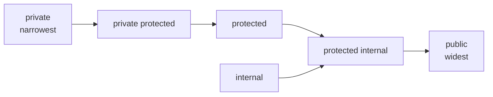

# 05 — Language Essentials

> **Scope:** the fundamentals interviewers use as warm-up — keywords, namespaces, comments,
> operators, access modifiers, conditionals, arrays, exceptions, extension methods, `dynamic` vs
> reflection — brought up to **C# 14**.

---

## Keywords

**Keywords are reserved words with special meaning to the compiler**, so they cannot be used as
identifiers.

| Kind | What it means | Examples |
| --- | --- | --- |
| **Reserved** | always a keyword, everywhere | `int`, `class`, `if`, `return`, `static`, `new` |
| **Contextual** | a keyword only in specific positions, so old code keeps compiling | `var`, `async`, `await`, `record`, `value`, `yield`, `nameof`, `when`, `field` (C# 14), `extension` (C# 14), `allows` |

**Why contextual keywords exist:** when a new keyword is added, making it reserved would break every
program that already used it as a variable name. Contextual keywords are recognised only where they
are unambiguous.

```c#
// Need a keyword as an identifier? Prefix it with @
var @class  = "History 101";
var @switch = true;
int @int    = 42;            // legal, though your reviewer may object
```

---

## Namespaces

**Namespaces organise types and prevent name collisions.**

```c#
// ✅ Modern: file-scoped namespace (C# 10+) — no braces, no extra indentation.
namespace MyApp.Ordering;

public class OrderService;

// Classic block form — still needed if a file must hold two namespaces.
namespace Legacy.Outer
{
    namespace Inner            // nested namespace
    {
        public class Thing;
    }
}

// Equivalent, and preferred over physical nesting:
namespace Legacy.Outer.Inner;
```

**Namespace tooling worth knowing:**

```c#
using System.Text;                        // import
using static System.Math;                 // import STATIC members: Sqrt(2) with no prefix
using Json = System.Text.Json.JsonSerializer;   // alias a type
global using System.Collections.Generic;  // C# 10: applies to the WHOLE project
```

- **Implicit usings** (`<ImplicitUsings>enable</ImplicitUsings>`) add the common namespaces
  automatically, which is why a modern `Program.cs` needs no `using System;`.
- A file-scoped namespace must be the **only** namespace in the file and appear before any type.

---

## Comments — three kinds

```c#
// Single-line comment

/* Multi-line
   comment */

/// <summary>Calculates order total including tax.</summary>
/// <param name="lines">The order lines.</param>
/// <returns>The gross total.</returns>
/// <exception cref="ArgumentNullException">If <paramref name="lines"/> is null.</exception>
public decimal Total(IEnumerable<OrderLine> lines) => lines.Sum(l => l.Gross);
```

**Why XML comments matter in interviews:** they generate IntelliSense and API docs, and with
`<GenerateDocumentationFile>true</GenerateDocumentationFile>` the compiler *warns* on undocumented
public members — a real quality gate for a shipped library.

> 🎯 **Opinion worth voicing:** comments should explain **why**, not **what**. `// increment i` is
> noise; `// retry twice — the provider 502s on cold start` is worth keeping.

---

## Operators

| Category | Operators | Operands |
| --- | --- | --- |
| Arithmetic | `+` `-` `*` `/` `%` | binary |
| Unary | `++` `--` `+` `-` `!` `~` | one |
| Assignment | `=` and compound `+=` `-=` `*=` `/=` `%=` | binary |
| Bitwise | `&` `\|` `^` `~` `<<` `>>` `>>>` | binary (`~` unary) |
| Bitwise assignment | `&=` `\|=` `^=` `<<=` `>>=` | binary |
| Relational | `==` `!=` `>` `<` `>=` `<=` | binary |
| Logical (short-circuit) | `&&` `\|\|` | binary |
| Conditional / ternary | `?:` | **three** |
| Null handling | `??` `??=` `?.` `?[]` | — |
| Type testing | `is` `as` `typeof` `sizeof` | — |
| Lambda / expression body | `=>` | — |
| Index & range | `^` `..` | — |
| Spread (collection expressions) | `..` | — |
| `nameof` | compile-time name | — |

> ⚠️ Older notes list `!=` and `~=` as *bitwise assignment* operators. `!=` is **inequality** and
> `~=` **does not exist in C#** at all. The bitwise assignments are `&=`, `|=`, `^=`, `<<=`, `>>=`.

### The modern operators worth showing off

```c#
// Null-coalescing and null-coalescing assignment
string name = input ?? "anonymous";
_cache ??= new Dictionary<string, int>();      // assign only if currently null

// Null-conditional — short-circuits the whole chain
int? length = customer?.Orders?[0]?.Notes?.Length;

// C# 14: null-conditional ASSIGNMENT — the left side may now be conditional
customer?.Order = newOrder;                    // no-op when customer is null

// Index from end, and ranges
int[] arr = [10, 20, 30, 40, 50];
int last     = arr[^1];                        // 50
int[] middle = arr[1..3];                      // [20, 30]

// Collection expressions + spread (C# 12)
int[] head = [1, 2];
int[] all  = [..head, 3, 4, ..middle];         // [1, 2, 3, 4, 20, 30]

// nameof — refactor-safe strings; C# 14 accepts unbound generics
ArgumentNullException.ThrowIfNull(customer, nameof(customer));
string n = nameof(List<>);                     // "List" — C# 14

// Logical vs bitwise: && short-circuits, & does not
if (customer is not null && customer.IsActive) { }   // safe
```

### Operator overloading

```c#
public readonly record struct Money(decimal Amount)
{
    public static Money operator +(Money a, Money b) => new(a.Amount + b.Amount);
    public static Money operator -(Money a, Money b) => new(a.Amount - b.Amount);
    public static bool  operator >(Money a, Money b) => a.Amount > b.Amount;
    public static bool  operator <(Money a, Money b) => a.Amount < b.Amount;

    // C# 14: user-defined COMPOUND operators — mutate in place, no temporary copy
    // (declared on a mutable type; shown here for the shape of the syntax)
}
```

**Rules:** operator methods must be `public static`; comparison operators must be declared in pairs
(`>` with `<`, `==` with `!=`); if you overload `==` you should also override `Equals` and
`GetHashCode` — or just use a `record`, which does all of it for you.

---

## Access modifiers

| Modifier | Visible from |
| --- | --- |
| `public` | everywhere |
| `private` | **only** the containing type — the default for members |
| `protected` | the containing type and any derived type |
| `internal` | the same assembly — the default for types |
| `protected internal` | the same assembly **OR** any derived type (union — wider) |
| `private protected` | derived types **within the same assembly** (intersection — narrower) |
| `file` (C# 11) | the same **source file** — used by source generators |



```c#
public class Vault
{
    private            string _key = "";     // this class only
    protected          string Hint = "";     // + derived classes anywhere
    internal           string Id = "";       // + same assembly
    protected internal string Tag = "";      // same assembly OR derived anywhere
    private protected  string Seed = "";     // derived, same assembly only
    public             string Name = "";     // everyone
}
```

- Default for a **type** is `internal`; for a **member**, `private`.
- `protected` and `private` are illegal on a **top-level** type.
- `InternalsVisibleTo` in the csproj lets a test project see `internal` members — the standard way
  to test internals without making them public.

---

## Conditionals and switch

```c#
// if / else if / else
if (score >= 90) grade = "A";
else if (score >= 80) grade = "B";
else grade = "C";

// switch STATEMENT — classic
switch (status)
{
    case "new":
    case "open":   Handle(); break;
    default:       throw new ArgumentOutOfRangeException(nameof(status));
}

// switch EXPRESSION (C# 8+) — an expression, so it must be exhaustive
string label = status switch
{
    "new" or "open" => "active",              // or-pattern
    "closed"        => "done",
    null            => "unknown",
    _               => "other"                // discard = catch-all
};
```

### Pattern matching — the differentiator

```c#
decimal Discount(Order o) => o switch
{
    // property pattern + relational pattern + logical pattern
    { Total: > 1000, Customer.IsVip: true } => 0.20m,
    { Total: > 1000 }                       => 0.10m,
    { Lines.Count: 0 }                      => throw new InvalidOperationException("empty order"),

    // list pattern (C# 11): first element, any middle, last element
    { Tags: ["priority", .., _] }           => 0.05m,

    _                                       => 0m
};

// Type pattern + when guard
string Describe(object o) => o switch
{
    int n when n < 0     => "negative",
    int n                => $"int {n}",
    string { Length: 0 } => "empty string",
    IEnumerable<int> xs  => $"{xs.Count()} numbers",
    null                 => "null",
    _                    => o.GetType().Name
};
```

- `is not null` reads better than `!= null` and cannot be broken by a badly overloaded `==`.
- A **switch expression** warns when it is not exhaustive — a genuine safety net that `if` chains
  do not give you.

---

## Arrays

```c#
int[] a = new int[5];              // all zeros
int[] b = [10, 20, 30];            // collection expression (C# 12) — preferred
int[] c = { 10, 20, 30 };          // classic initialiser

int[,]  grid   = new int[3, 4];    // rectangular (multi-dimensional)
int[][] jagged = [[1, 2], [3, 4, 5]];   // jagged — "array of arrays", rows may differ

Console.WriteLine(a.Length);        // total elements
Console.WriteLine(grid.GetLength(0));   // rows of a rectangular array
```

- Zero-based, **fixed length** once created, always a **reference type** (even `int[]`).
- Reference-type arrays are covariant (`string[]` → `object[]`), which is *unsafe* and can throw
  `ArrayTypeMismatchException` at run time — a classic trivia question.
- `Array.Resize` does not resize: it allocates a new array and copies. Use `List<T>` when the size
  changes.
- For slicing without allocating, use `Span<T>` / `ReadOnlySpan<T>`:

```c#
Span<int> span = stackalloc int[3];      // on the stack, zero heap allocation
int[] data = [1, 2, 3, 4, 5];
ReadOnlySpan<int> window = data.AsSpan()[1..4];   // a VIEW, no copy
```

---

## Exception handling

```c#
try
{
    var value = int.Parse(raw);              // may throw FormatException
}
catch (FormatException ex) when (raw.Length < 10)   // exception FILTER
{
    logger.LogWarning(ex, "Bad short input");
    throw;                                   // ✅ rethrow, stack trace PRESERVED
}
catch (Exception ex)
{
    throw new OrderProcessingException("Could not parse order total", ex);   // wrap
}
finally
{
    // Always runs — cleanup, releasing locks, metrics
}
```

| Block | Purpose |
| --- | --- |
| `try` | code that may throw |
| `catch` | handles a specific exception type |
| `when` | **filter** — decide *without* unwinding the stack, so the original frame stays intact |
| `finally` | always runs, whether or not an exception occurred |

### The rules interviewers check

- **`throw;` not `throw ex;`** — `throw ex;` resets the stack trace and hides where it failed.
- **Catch specific first.** `catch (Exception)` at the top swallows bugs. Catch what you can
  actually handle.
- **Never swallow silently** — `catch { }` is how outages become mysteries.
- **Do not use exceptions for control flow** — they cost roughly microseconds each and destroy
  throughput in a loop. Use `TryParse` / `TryGetValue`.
- **Custom exceptions** derive from `Exception`, keep the three standard constructors, and always
  chain the `innerException`.
- **`finally` does not run** on `StackOverflowException` or a fail-fast — those kill the process.
- **Async:** an exception in an `async Task` is captured in the task and rethrown at `await`. In an
  **`async void`** method there is nowhere to put it, so it goes to the unhandled handler and
  **crashes the process** — never write `async void` outside an event handler.

```c#
public sealed class OrderProcessingException : Exception
{
    public OrderProcessingException() { }
    public OrderProcessingException(string message) : base(message) { }
    public OrderProcessingException(string message, Exception inner) : base(message, inner) { }
}
```

> ⚠️ **Security note:** never surface a stack trace or internal path to an end user. Log the detail
> server-side with a correlation id, return a generic problem-details response — see
> `UseExceptionHandler` in [09 — ASP.NET Core](09-aspnet-core-pipeline-and-di.md).

---

## Methods worth knowing

### Extension methods

**They inject methods into an existing type without modifying, deriving from or recompiling it.**
Classically: a `static` method in a `static` class whose first parameter carries `this`.

```c#
namespace ExtensionMethods;

public static class IntExtensions
{
    public static bool IsGreaterThan(this int i, int value) => i > value;
}

// Usage — reads like an instance method
using ExtensionMethods;
bool result = 10.IsGreaterThan(100);      // false
```

**C# 14 — `extension` blocks**, the modern form. They can finally carry extension **properties**,
**static members** and **operators**, not just methods:

```c#
public static class Enumerable14
{
    extension<T>(IEnumerable<T> source)
    {
        public bool IsEmpty => !source.Any();            // extension PROPERTY
        public T? SecondOrDefault() => source.Skip(1).FirstOrDefault();
    }
}

if (orders.IsEmpty) { /* … */ }
```

**Key facts:** extension methods are resolved at **compile time**; an instance method of the same
name always **wins**; they cannot access `private` members; and the whole of LINQ is built from them.

### Generic methods and types

```c#
public class DataStore<T>
{
    private readonly T[] _data = new T[10];

    public void AddOrUpdate(int index, T item)
    {
        if (index is >= 0 and < 10) _data[index] = item;
    }

    public T? GetData(int index) => index is >= 0 and < 10 ? _data[index] : default;
}

// Generic METHOD — the type parameter belongs to the method
static T Max<T>(T a, T b) where T : IComparable<T> => a.CompareTo(b) >= 0 ? a : b;
```

Constraints: `where T : class`, `struct`, `notnull`, `new()`, `unmanaged`, a base class, an
interface, `allows ref struct` (C# 13). Deeper coverage in
[06 — Collections & Generics](06-collections-and-generics.md).

---

## `dynamic` vs reflection

> ⚠️ Older notes have this table **wrong** — they list reflection's type checking and error
> detection as "compile time". Both are **run time**. Reflection inspects metadata *while the
> program runs*; nothing about it is checked by the compiler.

| | `dynamic` | Reflection |
| --- | --- | --- |
| Type checking | **run time** | **run time** |
| Error surfaces as | `RuntimeBinderException` at the call | `TargetException` / `MissingMethodException` |
| Performance | faster — the DLR **caches** the resolved call site | slower — metadata lookup per call unless cached |
| Code complexity | simple, looks like normal C# | verbose |
| Control | low — you just call and hope | high — enumerate, filter, invoke, build types |
| Native AOT | limited | largely **unsupported** |
| Use for | COM/interop, JSON-ish shapes, duck typing | plugins, ORMs, serialisers, DI containers, attributes |

```c#
// Reflection — inspect and invoke metadata at run time
Type type = typeof(MyClass);
MethodInfo? method = type.GetMethod("MyMethod");
object? instance = Activator.CreateInstance(type);
method?.Invoke(instance, null);

foreach (var p in type.GetProperties())
    Console.WriteLine($"{p.Name}: {p.PropertyType.Name}");

// dynamic — skip compile-time binding entirely
dynamic obj = new MyClass();
obj.MyMethod();          // compiles even if MyMethod does not exist; throws at run time
```

> 🎯 **The senior answer:** "Both bind at run time. `dynamic` is DLR-based with a cached call site,
> so it is faster and shorter for interop; reflection gives you full metadata access for
> frameworks. In .NET 10 I would reach for a **source generator** before either — compile-time
> checked, AOT-safe and allocation-free."

---

## Rapid-fire Q&A

**Q: What is a method signature?**
The name plus the parameter list (types, order, and modifiers like `ref`/`out`/`in`). The **return
type is not part of it**, so you cannot overload on return type alone.

**Q: Contextual vs reserved keyword?**
Reserved words are keywords everywhere. Contextual words are keywords only in specific positions,
so adding them did not break existing code.

**Q: `??` vs `?.`?**
`??` supplies a fallback when the left side is null. `?.` short-circuits member access and yields
null instead of throwing.

**Q: `const` vs `readonly`?**
`const` is compile-time, implicitly static, baked into callers — so changing it in a library needs
consumers recompiled. `readonly` is assigned at run time in a constructor and can differ per
instance.

**Q: `string` vs `StringBuilder`?**
`string` is immutable, so every concatenation allocates. Use `StringBuilder` in loops, and
interpolation or `string.Join` for a fixed set.

**Q: `throw` vs `throw ex`?**
`throw;` preserves the original stack trace. `throw ex;` resets it and destroys the evidence.

**Q: Are `is` and `as` the same?**
No. `is` tests (and can bind a variable). `as` converts, returning `null` on failure. Prefer the
`is` pattern — one operation instead of two.

---

**Prev:** [04 — Abstract vs Interface](04-abstract-vs-interface.md) ·
**Next:** [06 — Collections & Generics](06-collections-and-generics.md) ·
**Up:** [Interview hub](../csharp-interview.md)
