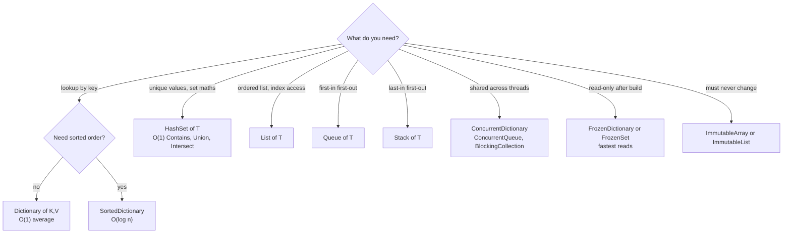

# 06 — Collections & Generics

> **Scope:** why generic collections replaced the non-generic ones, which collection to pick, the
> Big-O you must recite, and generics from constraints to variance.
> Deeper data-structure internals live in
> [Interview-Prep 02 — Collections & Data Structures](../../Interview-Prep/02-collections-and-data-structures.md).

---

## Array vs ArrayList vs `List<T>`

| | `int[]` (Array) | `ArrayList` (legacy) | `List<T>` |
| --- | --- | --- | --- |
| Namespace | `System` | `System.Collections` | `System.Collections.Generic` |
| Size | **fixed** at creation | grows automatically | grows automatically |
| Element type | strongly typed | `object` — anything | strongly typed `T` |
| Type safety | ✅ compile time | ❌ run-time `InvalidCastException` | ✅ compile time |
| Boxing of value types | none | **every add and read** | none |
| Performance | fastest | slowest | near-array, amortised |
| Verdict | use for fixed-size hot paths | ❌ **never in new code** | ✅ the default |

```c#
// ❌ ArrayList — untyped, boxes, and fails at run time
var legacy = new System.Collections.ArrayList();
legacy.Add(1);            // boxes the int onto the heap
legacy.Add("oops");       // compiles happily — nothing stops this
int bad = (int)legacy[1]; // 💥 InvalidCastException at RUN time

// ✅ List<T> — typed, no boxing, mistakes caught at COMPILE time
var modern = new List<int> { 1, 2, 3 };
// modern.Add("oops");    // ❌ compile error — exactly what you want
```

### "Whose performance is better, array or ArrayList?"

**The array, decisively** — and `List<T>` is close behind it.

1. `ArrayList` stores `object`, so every value type is **boxed** on add and **unboxed** on read:
   one heap allocation per element plus GC pressure.
2. Every read needs a **run-time type check**.
3. An array is a contiguous block of `T` with no indirection — cache-friendly and bounds-checked
   once (the JIT often eliminates the bounds check in a `for` loop).

**But:** `List<T>` grows by **doubling** its internal array, so N appends cost amortised O(1). A
fixed array cannot grow at all — `Array.Resize` allocates a new one and copies. Pick the array only
when the length is genuinely fixed.

> 🎯 **The complete answer:** "Array is fastest and fixed-size; `List<T>` gives amortised O(1)
> growth for essentially the same per-element cost; `ArrayList` is strictly worse than both and only
> exists for .NET 1.0 compatibility."

---

## Generic collections

**Generics give you type safety and no boxing, from one implementation.** They were introduced in
.NET 2.0 precisely to fix the `ArrayList`/`Hashtable` problem.

| Legacy (avoid) | Generic replacement |
| --- | --- |
| `ArrayList` | `List<T>` |
| `Hashtable` | `Dictionary<TKey,TValue>` |
| `Queue` | `Queue<T>` |
| `Stack` | `Stack<T>` |
| `SortedList` | `SortedList<TKey,TValue>` / `SortedDictionary<,>` |
| `BitArray` | still fine — already typed |

### Picking a collection



### Big-O worth reciting

| Collection | Add | Remove | Lookup by key/value | Index access |
| --- | --- | --- | --- | --- |
| `T[]` | n/a | n/a | O(n) scan | **O(1)** |
| `List<T>` | O(1) amortised | O(n) shift | O(n) | **O(1)** |
| `Dictionary<K,V>` | **O(1)** avg | **O(1)** avg | **O(1)** avg, O(n) worst | n/a |
| `HashSet<T>` | **O(1)** avg | **O(1)** avg | **O(1)** avg | n/a |
| `SortedDictionary<K,V>` | O(log n) | O(log n) | O(log n) | n/a |
| `LinkedList<T>` | **O(1)** at a node | **O(1)** at a node | O(n) | O(n) |
| `Queue<T>` / `Stack<T>` | **O(1)** | **O(1)** | O(n) | n/a |
| `FrozenDictionary<K,V>` | ❌ immutable | ❌ | **O(1)**, faster than `Dictionary` | n/a |

> 🎯 **The follow-up you should pre-empt:** "`Dictionary` is O(1) *average*. With a bad
> `GetHashCode` every key collides into one bucket and it degrades to O(n) — which is why
> hash-flooding is a real DoS vector and why you must never mutate a key after inserting it."

### Modern collections worth name-dropping

```c#
// FrozenDictionary — build once at startup, then the fastest possible reads (.NET 8+)
private static readonly FrozenDictionary<string, int> Codes =
    new Dictionary<string, int> { ["ok"] = 200, ["created"] = 201 }.ToFrozenDictionary();

// Immutable — every "mutation" returns a new instance; safe to share across threads
ImmutableArray<int> ids = [1, 2, 3];
ImmutableArray<int> more = ids.Add(4);          // ids is untouched

// Concurrent — lock-free/fine-grained locking for multi-threaded access
var counters = new ConcurrentDictionary<string, int>();
counters.AddOrUpdate("hits", 1, (_, old) => old + 1);   // atomic
```

### Which interface should a method accept and return?

| Type | Says | Use as |
| --- | --- | --- |
| `IEnumerable<T>` | "you can iterate this, once, forwards" | **parameter** — the most permissive |
| `IReadOnlyCollection<T>` | + a `Count` | return value when callers need the size |
| `IReadOnlyList<T>` | + indexing | return value for ordered data |
| `ICollection<T>` / `IList<T>` | mutable | only when the caller really should mutate |
| `IQueryable<T>` | an **expression tree** translated to SQL by the provider | EF Core query composition |

> ⚠️ **Classic bug:** returning `IEnumerable<T>` from a repository over a live `IQueryable`. The
> query stays open and callers can trigger surprise round-trips — or worse, a `foreach` re-executes
> it. Materialise with `ToListAsync()` at the boundary.

```c#
// ✅ accept the loosest, return the tightest useful type
public static IReadOnlyList<string> ActiveNames(IEnumerable<User> users) =>
    users.Where(u => u.IsActive).Select(u => u.Name).ToList();
```

---

## Generics

### Why they exist

1. **Type safety** at compile time.
2. **No boxing** — `List<int>` stores raw `int`s.
3. **Reuse** — one `Repository<T>` instead of one per entity.
4. **Performance** — the JIT generates specialised code per value type, and shares one
   instantiation across all reference types.

```c#
public class DataStore<T>
{
    private readonly T[] _data = new T[10];

    public void AddOrUpdate(int index, T item)
    {
        if (index is >= 0 and < 10) _data[index] = item;
    }

    public T? GetData(int index) => index is >= 0 and < 10 ? _data[index] : default;
}
```

### Constraints

| Constraint | Means |
| --- | --- |
| `where T : class` | reference type |
| `where T : struct` | non-nullable value type |
| `where T : notnull` | non-nullable (either kind) |
| `where T : new()` | has a public parameterless constructor |
| `where T : BaseType` | derives from `BaseType` |
| `where T : IShape` | implements the interface — **avoids boxing** when calling through it |
| `where T : unmanaged` | blittable value type, usable with pointers |
| `where T : IComparable<T>` | self-referencing, for comparisons |
| `where T : allows ref struct` | C# 13 — `T` may be `Span<T>` |

```c#
// The constraint is what makes the interface call boxing-free for structs
static double TotalArea<T>(IEnumerable<T> shapes) where T : IShape
    => shapes.Sum(s => s.Area());        // no boxing — the JIT specialises for each struct T

// Static abstract constraint → generic math (C# 11+)
static T Sum<T>(IEnumerable<T> values) where T : INumber<T>
{
    T total = T.Zero;
    foreach (var v in values) total += v;
    return total;
}
```

### Variance — `in` and `out`

Only on **interfaces and delegates**, never on classes.

| | Keyword | Position | Meaning | Example |
| --- | --- | --- | --- | --- |
| **Covariant** | `out T` | return / producer | `IEnumerable<string>` → `IEnumerable<object>` | `IEnumerable<out T>` |
| **Contravariant** | `in T` | parameter / consumer | `Action<object>` → `Action<string>` | `IComparer<in T>`, `Action<in T>` |
| **Invariant** | none | both | no conversion at all | `List<T>`, `IList<T>` |

```c#
IEnumerable<string> strings = ["a", "b"];
IEnumerable<object> objects = strings;      // ✅ covariance — safe, read-only

Action<object> printAny = o => Console.WriteLine(o);
Action<string> printStr = printAny;         // ✅ contravariance — anything handling object handles string

List<string> list = ["a"];
// List<object> bad = list;                 // ❌ invariant — you could Add(42) and break it
```

> 🎯 **Mnemonic:** *out = output = covariant; in = input = contravariant.* `IList<T>` is invariant
> precisely because it does both, and allowing either direction would let you insert the wrong type.

### Deferred execution and `yield`

```c#
static IEnumerable<int> Numbers()
{
    Console.WriteLine("start");     // does NOT run until enumeration begins
    for (int i = 0; i < 3; i++)
    {
        yield return i;             // returns one item and PAUSES here
    }
}

var q = Numbers();                  // nothing has executed yet
foreach (var n in q) { }            // now "start" prints and the loop runs
```

- `yield return` makes the compiler build a **state machine** implementing `IEnumerator<T>` —
  lazy, streaming, no intermediate list.
- LINQ operators are lazy the same way: `Where`/`Select` build a pipeline;
  `ToList`/`Count`/`First`/`foreach` **execute** it.
- **The classic trap:** enumerating twice runs the query twice. If the source is a database or an
  HTTP call, that is two round-trips. Materialise once with `ToList()`.
- `IAsyncEnumerable<T>` + `await foreach` gives the same laziness for asynchronous streams:

```c#
static async IAsyncEnumerable<string> ReadLinesAsync(string path)
{
    using var reader = new StreamReader(path);
    while (await reader.ReadLineAsync() is { } line)
        yield return line;
}

await foreach (var line in ReadLinesAsync("big.log")) { /* streams, never fully in memory */ }
```

---

## Rapid-fire Q&A

**Q: What are generic collections and why prefer them?**
Collections parameterised by element type (`List<T>`, `Dictionary<K,V>`). They give compile-time type
safety and avoid boxing value types, which the non-generic `ArrayList`/`Hashtable` cannot.

**Q: `Dictionary` vs `Hashtable`?**
`Dictionary<K,V>` is generic, faster, and throws `KeyNotFoundException` on a missing key.
`Hashtable` is untyped, boxes, and returns `null` for a missing key. Also: `Hashtable` is
thread-safe for a single writer with multiple readers; `Dictionary` is not thread-safe at all — use
`ConcurrentDictionary`.

**Q: Array vs `List<T>`?**
Fixed vs growable. Both are O(1) indexed. `List<T>` wraps an array and doubles it when full.

**Q: `IEnumerable` vs `IQueryable`?**
`IEnumerable<T>` executes in memory with delegates. `IQueryable<T>` builds an expression tree the
provider translates — so with EF Core, the filter runs **in the database**. Calling `AsEnumerable()`
too early pulls the whole table into memory.

**Q: When is `LinkedList<T>` the right choice?**
Almost never. O(1) insert/remove *at a known node* is its only advantage, and it costs a heap node
plus two pointers per element with terrible cache locality. `List<T>` usually wins even for
mid-list inserts.

**Q: How do you make a collection thread-safe?**
Prefer a `System.Collections.Concurrent` type. Otherwise guard every access with the same `lock`, or
use an immutable collection and swap the reference.

**Q: What does `default(T)` give you?**
`null` for reference types, the zeroed value for value types. Use `default` in a return of `T?` to
signal "not found", or better, use the `TryGet` pattern.

---

**Prev:** [05 — Language Essentials](05-language-essentials.md) ·
**Next:** [07 — Delegates, Events & LINQ](07-delegates-events-and-linq.md) ·
**Up:** [Interview hub](../csharp-interview.md)
