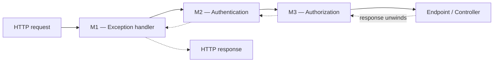
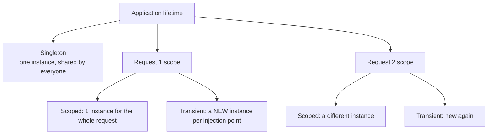
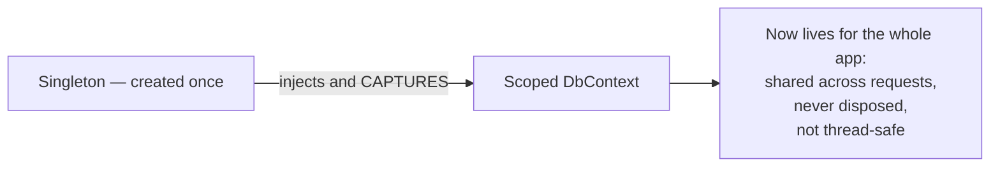
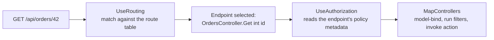
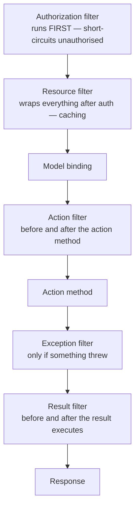

# 09 — ASP.NET Core: Middleware, DI, Routing & Filters

> **Scope:** the request pipeline, middleware ordering, dependency injection with lifetimes and the
> captive-dependency trap, routing, filters vs endpoint filters, and `IActionResult` vs
> `ActionResult<T>` — on **.NET 10** minimal hosting (no `Startup.cs`).
> Filter deep-dives already on this blog: [Filters](../Filters/filter.md).

---

## Middleware — the request pipeline

**Middleware are components assembled into a pipeline.** Each one sees the request, may act on it,
may call the next one, and then sees the response on the way back out.



**Order is everything.** With middleware M1, M2, M3 registered in that order, requests flow
**M1 → M2 → M3 → endpoint**, and the response comes back **endpoint → M3 → M2 → M1**. Every
`await next()` is the point where a middleware hands control inward and later regains it.

### The canonical order

```c#
var builder = WebApplication.CreateBuilder(args);
builder.Services.AddControllers();
builder.Services.AddAuthentication().AddJwtBearer();
builder.Services.AddAuthorization();
var app = builder.Build();

app.UseExceptionHandler();     // 1. outermost — must wrap everything to catch it
app.UseHsts();                 // 2. security headers
app.UseHttpsRedirection();     // 3.
app.UseStaticFiles();          // 4. short-circuit before auth for public assets
app.UseRouting();              // 5. decides WHICH endpoint matched
app.UseCors();                 // 6. after routing, before auth
app.UseAuthentication();       // 7. WHO are you?      — must precede authorization
app.UseAuthorization();        // 8. are you ALLOWED?  — needs the identity from step 7
app.UseOutputCache();          // 9.
app.MapControllers();          // 10. terminal — runs the endpoint

app.Run();                     // starts the host and listens
```

> 🎯 **The reasoning to say out loud:** "Authentication must come before authorization, because
> authorization needs an identity to make a decision. Exception handling goes first so it wraps
> everything downstream. Static files go before auth so public assets never pay for it."

### Writing middleware — three ways

```c#
// 1. Inline terminal middleware: app.Run() takes a RequestDelegate and NEVER calls next.
app.Run(async context =>
{
    await context.Response.WriteAsync("Hello from custom middleware!");
});

// 2. Inline pass-through: app.Use() receives 'next'
app.Use(async (context, next) =>
{
    var sw = Stopwatch.StartNew();
    await next();                                       // pass control inward
    logger.LogInformation("{Path} took {Ms}ms", context.Request.Path, sw.ElapsedMilliseconds);
});

// 3. A class — testable, DI-friendly, the production choice
public sealed class CorrelationIdMiddleware(RequestDelegate next)
{
    public async Task InvokeAsync(HttpContext context)
    {
        var id = context.Request.Headers["X-Correlation-Id"].FirstOrDefault() ?? Guid.NewGuid().ToString();
        context.Response.Headers["X-Correlation-Id"] = id;
        await next(context);
    }
}
app.UseMiddleware<CorrelationIdMiddleware>();
```

> ⚠️ **The two `Run`s are different things** — a point older notes conflate:
> `app.Run(RequestDelegate)` registers **terminal middleware**; `app.Run()` with no argument
> **starts the host**. Anything registered *after* terminal middleware never executes, because
> nothing calls `next`.

**`app.Map`** branches the pipeline on a path prefix:

```c#
app.Map("/hello", branch => branch.Run(async ctx =>
    await ctx.Response.WriteAsync("Hello from /hello")));
```

### "Can I handle a request with no controller?"

Yes — that is exactly what **middleware** and **Minimal APIs** are for:

```c#
app.MapGet("/hello",    () => "Hello, GET request!");
app.MapPost("/hello",   (Order o) => Results.Created($"/hello/{o.Id}", o));
app.MapPut("/hello/{id:int}",    (int id, Order o) => Results.NoContent());
app.MapDelete("/hello/{id:int}", (int id) => Results.NoContent());
```

Minimal APIs skip the MVC filter/model-binding machinery, so they start faster and are AOT-friendly.
Controllers still win when you want conventions, filters, model validation attributes and areas.

---

## Dependency Injection

**DI is a design pattern where a class receives its dependencies instead of constructing them** —
also called **Inversion of Control**. The payoff is loose coupling: you can swap, mock and test.

### The three kinds of injection

```c#
public interface IService { void Serve(); }
public class Service : IService { public void Serve() => Console.WriteLine("Service called"); }

// 1. CONSTRUCTOR injection — the default. Dependencies are required and immutable.
public class ConstructorClient(IService service)
{
    public void Start() => service.Serve();
}

// 2. PROPERTY (setter) injection — for genuinely optional dependencies.
public class SetterClient
{
    public IService? Service { get; set; }
    public void Start() => Service?.Serve();
}

// 3. METHOD injection — when only one method needs it.
public class MethodClient
{
    public void Start(IService service) => service.Serve();
}
```

> 🎯 **Prefer constructor injection.** It makes the dependency **mandatory and visible in the
> signature**, so an incompletely-wired object cannot exist. Setter injection hides requirements and
> allows a half-built object; use it only for optional collaborators.

### Registration and lifetimes

```c#
builder.Services.AddTransient<IEmailSender, SmtpEmailSender>();   // new every resolve
builder.Services.AddScoped<IOrderRepository, OrderRepository>();  // one per HTTP request
builder.Services.AddSingleton<IClock, SystemClock>();             // one per application

builder.Services.AddHttpClient<IPaymentGateway, StripeGateway>(); // pooled handler, correct lifetime
builder.Services.AddDbContext<AppDbContext>(o => o.UseSqlServer(cs));   // Scoped by default
```

| Lifetime | Created | Lives for | Use for |
| --- | --- | --- | --- |
| **Transient** | on every resolve | the consumer | cheap, stateless, short-lived services |
| **Scoped** | once per scope (per HTTP request in ASP.NET Core) | the request | `DbContext`, repositories, unit-of-work |
| **Singleton** | once, on first resolve | the whole application | caches, configuration, clocks, HTTP client factories |



### ❗ Captive dependencies — the trap

**Never inject a shorter-lived service into a longer-lived one.**

Inject a **Transient** or **Scoped** service into a **Singleton** and the singleton holds that one
instance forever — effectively **promoting** it to singleton. A `DbContext` captured this way is
worse than a bug: it is shared across requests, never disposed, accumulates tracked entities, and is
not thread-safe.



| Injecting… | …into | Verdict |
| --- | --- | --- |
| Singleton | anything | ✅ safe |
| Scoped | Scoped or Transient | ✅ safe |
| Transient | Scoped or Transient | ✅ safe |
| **Scoped** | **Singleton** | ❌ **captive dependency** |
| **Transient** | **Singleton** | ❌ captured — becomes a de facto singleton |

**The fix** — if a singleton genuinely needs a scoped service, create a scope per unit of work:

```c#
public sealed class OrderPoller(IServiceScopeFactory scopeFactory) : BackgroundService   // singleton
{
    protected override async Task ExecuteAsync(CancellationToken stoppingToken)
    {
        while (!stoppingToken.IsCancellationRequested)
        {
            // A fresh scope per iteration → a fresh DbContext, disposed at the end. ✅
            using var scope = scopeFactory.CreateScope();
            var repo = scope.ServiceProvider.GetRequiredService<IOrderRepository>();
            await repo.ProcessPendingAsync(stoppingToken);

            await Task.Delay(TimeSpan.FromSeconds(30), stoppingToken);
        }
    }
}
```

> ASP.NET Core's **scope validation** is enabled in Development and throws
> `InvalidOperationException: Cannot consume scoped service … from singleton …` — so the framework
> catches this for you, *if* you run in Development before shipping.

### `IConfiguration` vs `IOptions<T>`

```c#
// Bind a strongly-typed settings class, with validation at startup
builder.Services.AddOptions<SmtpOptions>()
    .Bind(builder.Configuration.GetSection("Smtp"))
    .ValidateDataAnnotations()
    .ValidateOnStart();                     // fail fast at boot, not on first request
```

| | Use |
| --- | --- |
| `IConfiguration` | ad-hoc, stringly-typed reads. Avoid in domain code. |
| `IOptions<T>` | singleton snapshot — fine for config that never changes |
| `IOptionsSnapshot<T>` | per-scope; picks up reloads per request |
| `IOptionsMonitor<T>` | singleton with change notifications — for singletons that must react |

> ⚠️ **Security:** secrets never live in `appsettings.json`. Use user-secrets locally and a managed
> identity plus a key vault in every deployed environment.

---

## Routing

**Routing connects an incoming HTTP request to the code that handles it.** `UseRouting` selects the
endpoint; the endpoint executes at `MapControllers`/`MapGet`.



You can configure routes at three levels:

```c#
// 1. APPLICATION level — conventional routing in Program.cs (was Startup.Configure)
app.MapControllerRoute(
    name: "default",
    pattern: "{controller=Home}/{action=Index}/{id?}");

// A custom route, e.g. for an Admin area
app.MapControllerRoute(
    name: "admin",
    pattern: "admin/{controller=Dashboard}/{action=Index}/{id?}");

// 2. CONTROLLER level — attribute routing
[ApiController]
[Route("api/[controller]")]                    // → /api/orders
public class OrdersController : ControllerBase
{
    // 3. ACTION level
    [HttpGet("{id:int}")]                      // → GET /api/orders/42, with a route CONSTRAINT
    public async Task<ActionResult<Order>> Get(int id, CancellationToken ct)
        => await repo.GetAsync(id, ct) is { } order ? Ok(order) : NotFound();
}
```

**The default pattern has three segments:** `controller` (defaults to `Home`), `action` (defaults to
`Index`) and an optional `id`.

> ⚠️ Older notes place routing in `Startup.cs` → `Configure`, with `app.UseEndpoints(...)`. Since
> .NET 6, minimal hosting merged `Startup` into `Program.cs`, and `app.MapControllers()` replaces
> the `UseEndpoints` block. Attribute routing is the norm for APIs; conventional routing for MVC.

**Route constraints** — `{id:int}`, `{slug:alpha}`, `{code:length(3)}`, `{date:datetime}`,
`{page:min(1)}` — reject bad input *before* your action runs, which is both a correctness and a
security win (allowlist validation at the boundary).

---

## `IActionResult` vs `ActionResult<T>`

| | `IActionResult` | `ActionResult<T>` | `Results` / `TypedResults` |
| --- | --- | --- | --- |
| What it is | interface for "any result" | union of `T` **or** an action result | Minimal API results |
| OpenAPI knows the response type | ❌ needs `[ProducesResponseType]` | ✅ inferred from `T` | ✅ with `TypedResults` |
| Use in | controllers, when only status codes matter | **controllers — the default choice** | Minimal APIs |

```c#
// ✅ ActionResult<T>: self-documenting for OpenAPI, still allows NotFound/BadRequest
[HttpGet("{id:int}")]
public async Task<ActionResult<Order>> Get(int id, CancellationToken ct)
{
    var order = await repo.GetAsync(id, ct);
    if (order is null) return NotFound();                    // 404
    return order;                                            // 200 + JSON body
}

// Minimal API equivalent — TypedResults keeps the response types in the signature
app.MapGet("/orders/{id:int}", async Task<Results<Ok<Order>, NotFound>> (int id, IOrderRepository repo, CancellationToken ct)
    => await repo.GetAsync(id, ct) is { } o ? TypedResults.Ok(o) : TypedResults.NotFound());
```

`ActionResult` is the abstract base class implementing `IActionResult`; both work as return types.
Returning an object serialises it — `Content-Type: application/json`, status `200 OK`, body
`{"name":"John","age":30}`.

---

## Filters

**Filters run code before or after stages of the MVC action pipeline** — the place for cross-cutting
concerns that need to know about the *action*, not just the raw request.



| Filter | Runs | Typical use |
| --- | --- | --- |
| **Authorization** | first, before everything | policy checks, short-circuit with 401/403 |
| **Resource** | after authorization, around model binding | output caching, short-circuiting |
| **Action** | immediately before/after the action method | logging, argument validation, timing |
| **Exception** | when an unhandled exception occurs | mapping domain exceptions to responses |
| **Result** | before/after the action result executes | adding headers, wrapping the payload |

**Endpoint filters** (`IEndpointFilter`) are the Minimal API equivalent:

```c#
app.MapPost("/orders", CreateOrder).AddEndpointFilter<ValidationFilter>();
```

### Three scopes

```c#
// 1. GLOBAL — in Program.cs, applies to every controller and action
builder.Services.AddControllers(options =>
{
    options.Filters.Add<AuditActionFilter>();     // by type — resolved from DI
    options.Filters.Add(new LoggingFilter());     // by instance — no DI
});

// 2. CONTROLLER level
[ServiceFilter(typeof(AuditActionFilter))]
public class OrdersController : ControllerBase
{
    // 3. ACTION level
    [TypeFilter(typeof(RateLimitFilter), Arguments = new object[] { 100 })]
    public IActionResult Index() => Ok();
}
```

| Attribute | When to use |
| --- | --- |
| plain attribute | the filter needs no dependencies |
| **`[ServiceFilter]`** | the filter has DI dependencies — **must be registered** in the container |
| **`[TypeFilter]`** | DI dependencies **plus** constructor arguments; not registered in DI |
| `IFilterFactory` | you want full control over creation |

**Execution order:** global → controller → action for "before" stages, and the reverse for "after"
stages. `Order` on `IOrderedFilter` overrides the default.

> 🎯 **Filters vs middleware — the question behind the question:** middleware knows only
> `HttpContext`; filters know the **action, its arguments, and its result**. Use middleware for
> anything request-wide (auth, logging, exception handling); use filters when you need model state,
> action arguments, or per-action metadata.

---

## Rapid-fire Q&A

**Q: Why does middleware order matter?**
Because each component wraps the rest. Authentication must precede authorization; exception handling
must be outermost; static files should short-circuit before auth.

**Q: What happens if a middleware does not call `next`?**
It **short-circuits** — the pipeline stops there and the response unwinds. That is how
`UseStaticFiles` and a 401 from authorization work.

**Q: Middleware vs filter vs action?**
Middleware = whole request, no MVC knowledge. Filter = inside MVC, sees the action and its
arguments. Action = your handler.

**Q: Default DI lifetime for `DbContext`?**
Scoped. `AddDbContext` registers it that way, which is why injecting it into a singleton is the
classic captive-dependency bug.

**Q: How do you resolve a scoped service inside a singleton?**
Inject `IServiceScopeFactory`, call `CreateScope()` per unit of work, resolve from that scope, and
dispose it.

**Q: Is the built-in DI container enough?**
For most apps, yes. Reach for Autofac/Lamar only when you need interception, assembly scanning
conventions or property injection that the built-in container deliberately omits.

**Q: Constructor vs property injection?**
Constructor for required dependencies — the type cannot exist without them. Property only for
genuinely optional collaborators.

---

**Prev:** [08 — Async, Threading & TPL](08-async-threading-and-tpl.md) ·
**Next:** [10 — SOLID, Patterns & Rapid Fire](10-solid-and-patterns.md) ·
**Up:** [Interview hub](../csharp-interview.md)
