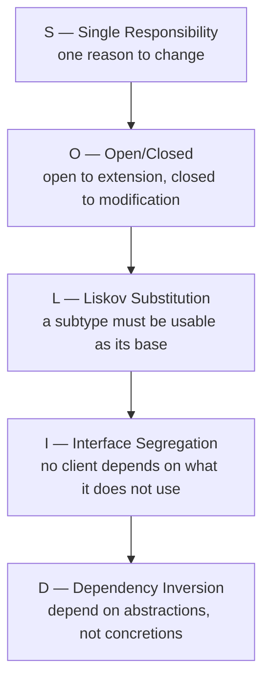
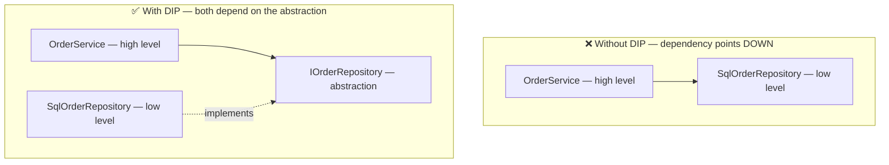

# 10 — SOLID & Design Patterns

> **Scope:** the five SOLID principles with a *bad → good* pair each, and the creational patterns
> the .NET Word notes cover — Singleton, Abstract Factory, Builder, Prototype — plus what a modern
> C# answer looks like.
> Full GOF catalogue on this blog: [GOF patterns](../../GOF/GOF.md) ·
> [Interview-Prep 03 — SOLID](../../Interview-Prep/03-solid-and-design-principles.md) ·
> [csharp-solid.md](../csharp-solid.md).

---

## SOLID at a glance



| | Principle | One-line test |
| --- | --- | --- |
| **S** | Single Responsibility | Can you name one reason this class would change? If you need "and", split it. |
| **O** | Open/Closed | Can you add a new case without editing existing code? |
| **L** | Liskov Substitution | Can you pass any subtype where the base is expected, with no surprises? |
| **I** | Interface Segregation | Does any implementer throw `NotImplementedException`? |
| **D** | Dependency Inversion | Does your business logic `new` up infrastructure? |

---

## S — Single Responsibility Principle

**A class should have one responsibility, and therefore one reason to change.**

```c#
// ❌ Two responsibilities: computing pay AND persisting. A tax-rule change and a
//    database change both force edits to the same class.
public class Employee
{
    public void CalculateSalary() { /* … */ }
    public void SaveEmployee()    { /* … */ }
}

// ✅ Separated — each has one reason to change
public class SalaryCalculator
{
    public decimal Calculate(Employee e) => e.BaseSalary * (1 + e.Bonus);
}

public class EmployeeRepository(AppDbContext db)
{
    public Task SaveAsync(Employee e, CancellationToken ct) { db.Add(e); return db.SaveChangesAsync(ct); }
}
```

**Why it matters:** it delivers **separation of concerns**, which is what makes a class testable
(no database needed to test the maths) and safe to change.

> ⚠️ **The misreading to avoid:** SRP does *not* mean "one method per class". It means one **axis of
> change** — one group of stakeholders who would ask for it to change.

---

## O — Open/Closed Principle

**Open for extension, closed for modification** — you should be able to add behaviour without
editing code that already works.

```c#
// ❌ Every new shape forces an edit to AreaCalculator: a new if-branch, a re-test,
//    a re-deploy, and a chance to break rectangles.
public class Rectangle { public double Width, Height; }

public class AreaCalculator
{
    public double CalculateArea(Rectangle[] rectangles)
    {
        double area = 0;
        foreach (var r in rectangles) area += r.Width * r.Height;
        return area;
    }
}

// ✅ Add a new shape by adding a class. Nothing existing changes.
public abstract class Shape
{
    public abstract double CalculateArea();
}

public sealed class Rectangle2 : Shape
{
    public double Width { get; init; }
    public double Height { get; init; }
    public override double CalculateArea() => Width * Height;
}

public sealed class Circle : Shape
{
    public double Radius { get; init; }
    public override double CalculateArea() => Math.PI * Radius * Radius;
}

public static class AreaCalculator2
{
    public static double Total(IEnumerable<Shape> shapes) => shapes.Sum(s => s.CalculateArea());
}
```

> 🎯 **Modern nuance:** a **closed** hierarchy plus exhaustive pattern matching is sometimes the
> better design — if the set of shapes is genuinely fixed, a `switch` expression the compiler checks
> for exhaustiveness beats virtual dispatch. OCP is about *which axis you expect to vary*: new
> types (use polymorphism) or new operations (use pattern matching).

---

## L — Liskov Substitution Principle

**A subtype must be substitutable for its base type** — a caller holding the base reference must not
be surprised.

```c#
// ❌ The classic violation: implementing a contract you cannot honour.
public interface IMyCollection<T>
{
    void Add(T item);
    void Remove(T item);
    T Get(int index);
}

public class MyReadOnlyCollection<T> : IMyCollection<T>
{
    public void Add(T item)    => throw new NotImplementedException();  // 💥 breaks LSP
    public void Remove(T item) => throw new NotImplementedException();  // 💥
    public T Get(int index)    => throw new NotImplementedException();
}
```

Any code written against `IMyCollection<T>` will call `Add` and blow up. The subtype has **removed**
capability the base promised.

```c#
// ✅ Split the contract so a read-only collection can satisfy one honestly.
//    (This is exactly why the BCL has IReadOnlyList<T> separate from IList<T>.)
public interface IReadableCollection<T>
{
    T Get(int index);
    int Count { get; }
}

public interface IMutableCollection<T> : IReadableCollection<T>
{
    void Add(T item);
    void Remove(T item);
}

public sealed class ReadOnlyBag<T>(IReadOnlyList<T> items) : IReadableCollection<T>
{
    public T Get(int index) => items[index];
    public int Count => items.Count;
}
```

**LSP violations to watch for:**

- Throwing `NotImplementedException`/`NotSupportedException` from an override.
- **Strengthening preconditions** — the base accepts any int, the override rejects negatives.
- **Weakening postconditions** — the base guarantees a sorted result, the override does not.
- Changing the meaning of a member (`Add` that silently ignores duplicates when the base does not).
- The textbook `Square : Rectangle` — setting `Width` also changes `Height`, so
  `rect.Width = 3; rect.Height = 4;` no longer yields area 12.

> 🎯 **Notice how LSP and ISP solve the same smell from two sides:** the read-only collection problem
> is an LSP violation *caused by* an ISP violation. Fat interface → someone cannot honour it.

---

## I — Interface Segregation Principle

**No client should be forced to depend on methods it does not use.** Prefer several small,
role-focused interfaces over one general-purpose one.

```c#
// ✅ Small, focused capabilities
public interface IFlyable { void Fly(); }
public interface IWalkable { void Walk(); }

public class Sparrow : IFlyable, IWalkable
{
    public void Fly()  => Console.WriteLine("Sparrow flying.");
    public void Walk() => Console.WriteLine("Sparrow walking.");
}

public class Penguin : IWalkable            // ✅ simply does not claim to fly
{
    public void Walk() => Console.WriteLine("Penguin walking.");
}
```

Had there been one fat `IBird { Fly(); Walk(); Swim(); }`, `Penguin.Fly()` would have to throw —
breaking LSP too. **Small interfaces are also what make mocking painless**: a test double for
`IWalkable` needs one method, not nine.

---

## D — Dependency Inversion Principle

**High-level modules must not depend on low-level modules; both should depend on abstractions.**

- **High-level module** — business logic: what the application *does*.
- **Low-level module** — infrastructure: SQL, SMTP, files, HTTP.
- **Abstraction** — an interface owned by the *high-level* side.



```c#
// ❌ Without DIP: the service is welded to SQL. You cannot unit-test it without a database,
//    and swapping to Cosmos means editing business logic.
public class OrderServiceBad
{
    private readonly SqlOrderRepository _repo = new();          // hard-coded concretion
    public Task<Order?> Get(int id) => _repo.GetAsync(id);
}

// ✅ With DIP: the abstraction is defined by the consumer, and infrastructure implements it.
public interface IOrderRepository                               // owned by the domain
{
    Task<Order?> GetAsync(int id, CancellationToken ct = default);
}

public class OrderService(IOrderRepository repo)                // depends on the abstraction
{
    public Task<Order?> Get(int id, CancellationToken ct) => repo.GetAsync(id, ct);
}

internal sealed class SqlOrderRepository(AppDbContext db) : IOrderRepository   // infrastructure
{
    public async Task<Order?> GetAsync(int id, CancellationToken ct) =>
        await db.Orders.FindAsync([id], ct);
}

// Wiring — the ONLY place that knows both sides
builder.Services.AddScoped<IOrderRepository, SqlOrderRepository>();
builder.Services.AddScoped<OrderService>();
```

> 🎯 **DI vs DIP vs IoC — the distinction that impresses:** *Dependency Inversion* is the
> **principle** (depend on abstractions). *Inversion of Control* is the **pattern** (something else
> decides what to plug in). *Dependency Injection* is the **technique** (hand it in via the
> constructor). A DI container is just the **tool**.

---

## Creational patterns

### Singleton — one instance, globally reachable

**The four rules** the classic answer expects:

1. **Private, parameterless constructor** — nothing outside can `new` it.
2. **`sealed` class** — a derived class could be instantiated and break the guarantee.
3. **Private static field** holding the single instance, exposed through a public property.
4. **Thread safety** — two threads must not both create it.

```c#
public sealed class Logger
{
    private static Logger? _instance;
    private static readonly Lock _padlock = new();      // .NET 9+; use 'object' on older runtimes

    private Logger() { }                                 // rule 1

    public static Logger Instance
    {
        get
        {
            if (_instance is not null) return _instance;  // fast path, no lock
            lock (_padlock)                              // rule 4
            {
                return _instance ??= new Logger();
            }
        }
    }

    public void Log(string message) => Console.WriteLine($"Log: {message}");
}

Logger.Instance.Log("Application started");
```

**Better in modern C#:**

```c#
// Lazy<T> is thread-safe by default — no hand-written double-checked locking to get wrong.
public sealed class Logger2
{
    private static readonly Lazy<Logger2> Lazy = new(() => new Logger2());
    public static Logger2 Instance => Lazy.Value;
    private Logger2() { }
}
```

**Best in an app with DI:** `builder.Services.AddSingleton<ILogger, Logger>();` — you get one
instance *and* keep testability, because consumers depend on `ILogger`, not on a static.

> 🎯 **The senior take:** "Singleton is the pattern most often used as an anti-pattern. A static
> `Instance` is global mutable state: it hides dependencies, defeats substitution in tests, and
> becomes a contention point. In .NET I express 'one instance' as a **container lifetime**, not a
> static property. And whichever form you use, the instance must be **thread-safe internally** —
> single instance does not mean single-threaded access."

### Abstract Factory — "factory of factories", a family creator

**Creates a family of related objects** without naming their concrete classes. Achieved with an
interface or abstract class so the implementation stays hidden.

```c#
// Abstract products
public interface IButton { string Render(); }
public interface ICheckbox { string Render(); }

// Abstract factory — creates a whole consistent FAMILY
public interface IUiFactory
{
    IButton CreateButton();
    ICheckbox CreateCheckbox();
}

// Concrete factory 1
public sealed class DarkUiFactory : IUiFactory
{
    public IButton CreateButton()     => new DarkButton();
    public ICheckbox CreateCheckbox() => new DarkCheckbox();
}

// Concrete factory 2
public sealed class LightUiFactory : IUiFactory
{
    public IButton CreateButton()     => new LightButton();
    public ICheckbox CreateCheckbox() => new LightCheckbox();
}

// The client never sees a concrete type, so a dark checkbox can never appear in a light theme.
public static string BuildForm(IUiFactory factory) =>
    factory.CreateButton().Render() + factory.CreateCheckbox().Render();
```

**Factory Method vs Abstract Factory:** Factory Method creates **one** product through an overridable
method; Abstract Factory creates a **family** of related products through one interface, guaranteeing
they are compatible with each other.

### Builder — "the Lego master", step-by-step construction

**Builds a complex object step by step, separating the construction process from the
representation** — so the same process can produce different representations.

Use it when a class is too complex to create in one call, or needs many optional pieces.

```c#
public sealed class Car
{
    public string? Engine { get; set; }
    public int Seats { get; set; }
    public bool Spoiler { get; set; }
    public override string ToString() => $"{Engine}, {Seats} seats, spoiler: {Spoiler}";
}

public interface ICarBuilder
{
    void BuildEngine();
    void BuildSeats();
    void BuildExtras();
    Car GetResult();
}

public sealed class SportsCarBuilder : ICarBuilder
{
    private readonly Car _car = new();
    public void BuildEngine() => _car.Engine = "V8";
    public void BuildSeats()  => _car.Seats = 2;
    public void BuildExtras() => _car.Spoiler = true;
    public Car GetResult()    => _car;
}

// The Director owns the ORDER of steps; the builder owns WHAT each step does.
public sealed class Director
{
    public Car Construct(ICarBuilder builder)
    {
        builder.BuildEngine();
        builder.BuildSeats();
        builder.BuildExtras();
        return builder.GetResult();
    }
}

Director director = new();
ICarBuilder builder = new SportsCarBuilder();
Car car = director.Construct(builder);      // the client knows neither the steps nor the parts
```

**The fluent variant** you actually meet in .NET — `WebApplicationBuilder`, `HostBuilder`,
`StringBuilder`, EF Core's `ModelBuilder`:

```c#
public sealed class QueryBuilder
{
    private readonly List<string> _where = [];
    private string _table = "";

    public QueryBuilder From(string table) { _table = table; return this; }
    public QueryBuilder Where(string clause) { _where.Add(clause); return this; }
    public string Build() =>
        $"SELECT * FROM {_table}" + (_where.Count > 0 ? $" WHERE {string.Join(" AND ", _where)}" : "");
}

var sql = new QueryBuilder().From("Orders").Where("Total > @min").Build();
```

> ⚠️ **Security note on that example:** a query *builder* must only ever compose **parameter
> placeholders**, never interpolate user values. Concatenating input into SQL is injection —
> parameterise every value.

**Builder vs Abstract Factory:** the builder produces **one** object through **many steps**; the
abstract factory produces **many** objects in **one** step each.

### Prototype — clone instead of construct

**Used when creating an object from scratch is expensive.** The type implements a prototype
interface that returns a clone of itself.

```c#
public interface IPrototype<T> { T Clone(); }

public sealed class ReportTemplate : IPrototype<ReportTemplate>
{
    public required string Title { get; set; }
    public List<string> Sections { get; set; } = [];

    // DEEP copy — a shallow copy would share the Sections list between clones.
    public ReportTemplate Clone() => new()
    {
        Title = Title,
        Sections = [..Sections]        // new list, same strings (immutable, so safe to share)
    };
}
```

| Copy | What happens | Risk |
| --- | --- | --- |
| **Shallow** (`MemberwiseClone`) | fields copied; reference fields point at the **same** objects | mutating the clone's list mutates the original |
| **Deep** | referenced objects copied too | more expensive, must handle cycles |

> 🎯 **The C# answer:** "For value-like objects a `record` and the `with` expression already give me
> non-destructive copy semantics — `var v2 = v1 with { Title = 'New' }`. I reach for an explicit
> Prototype only when construction is genuinely expensive, like a pre-warmed template or a parsed
> configuration graph."

---

## Rapid-fire Q&A

**Q: Which SOLID principle does a `NotImplementedException` in an override violate?**
Liskov — the subtype cannot stand in for its base. Usually the root cause is an ISP violation: the
interface was too fat.

**Q: Factory vs Singleton?**
Different axes. Factory is about **who creates** an object and hiding the concrete type. Singleton is
about **how many** exist. A factory can return a singleton.

**Q: Is Singleton thread-safe by default?**
No. `Lazy<T>`, a static initialiser, or an explicit lock makes *creation* thread-safe — and the
instance's own state still needs guarding.

**Q: What is CQRS and how does it relate?**
Command Query Responsibility Segregation splits write models from read models. It is SRP and ISP
applied at the architecture level.

**Q: Anti-patterns to name if asked?**
God object (SRP), anaemic domain model, service locator (hides dependencies), singleton-as-global-
state, primitive obsession, sync-over-async, and swallowing exceptions.

**Q: How does DI relate to SOLID?**
It is the practical mechanism for DIP, and it makes SRP achievable — a class can stay focused
because collaborators are handed to it rather than constructed inside it.

---

**Prev:** [09 — ASP.NET Core Pipeline & DI](09-aspnet-core-pipeline-and-di.md) ·
**Up:** [Interview hub](../CS-01.md)
