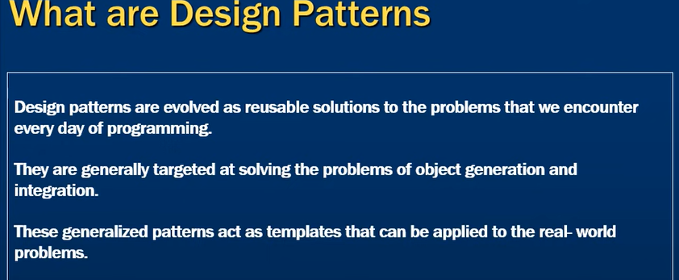
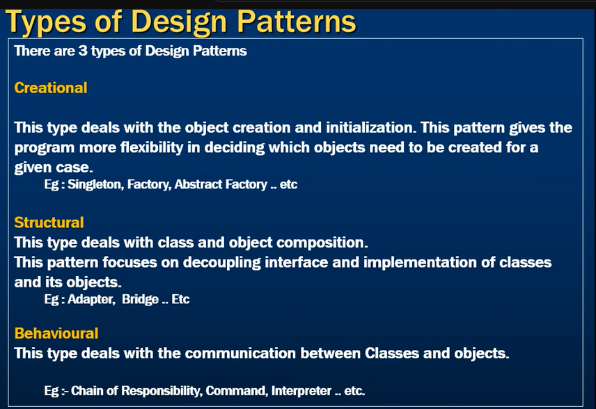
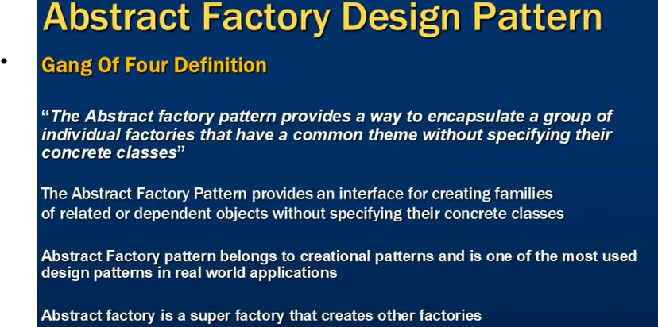
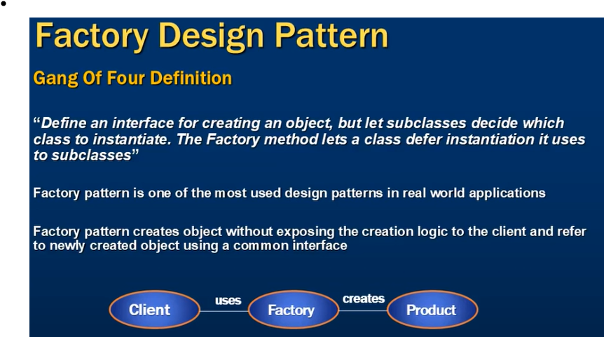
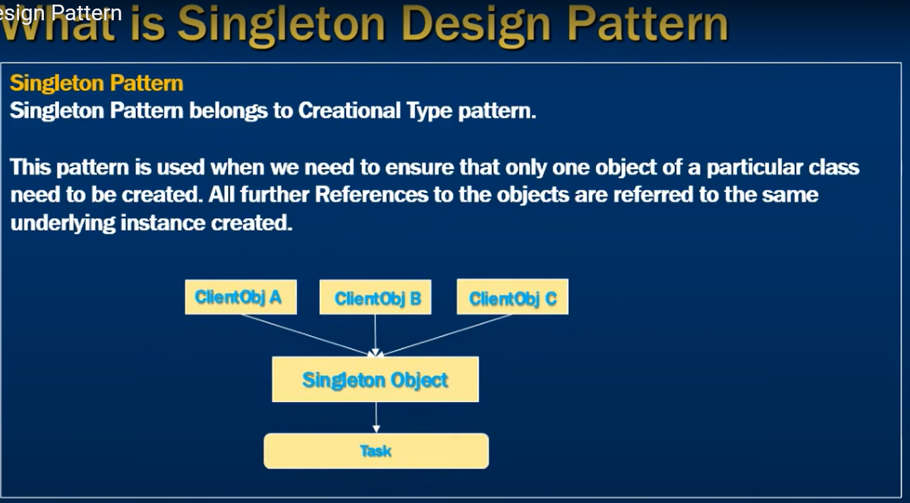
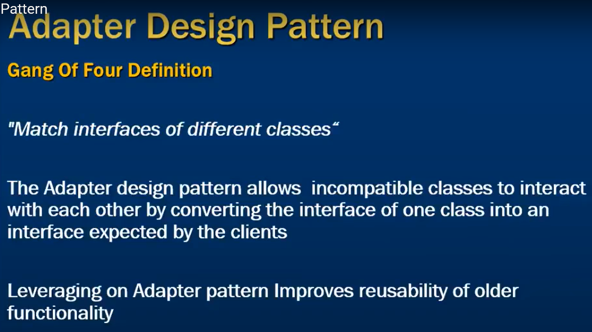
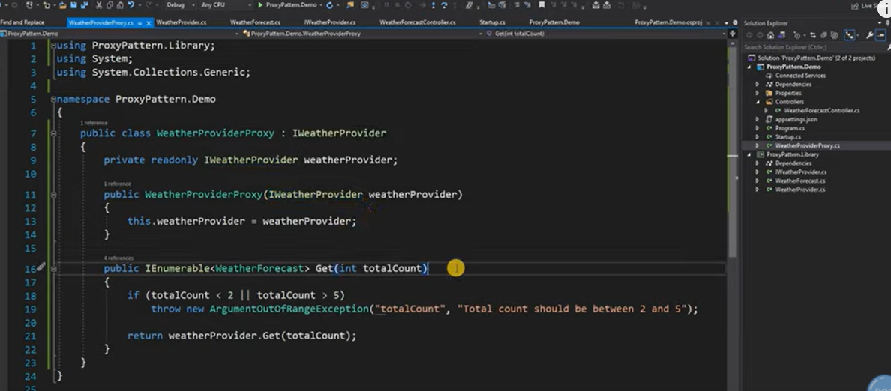
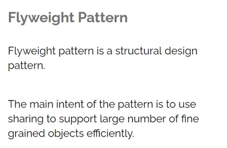

# GOF Design Patterns — index

> The 23 design patterns from *Design Patterns: Elements of Reusable Object-Oriented Software*
> (Gamma, Helm, Johnson, Vlissides — the "Gang of Four").
>
> **This page is a map, not the content.** Each pattern below links to the chapter that works it
> through in C#. The two canonical homes are
> [Architecture 04 — GOF Design Patterns](../Interview/Architecture/04-design-patterns-gof.md)
> (all 23, with the standard C# solution for each) and
> [C# 10 — SOLID & Design Patterns](../Interview/CSharp-DotNet/10-solid-and-patterns.md)
> (the four creational ones in depth, with bad→good pairs).

---

## The three categories

| Category | Concern | Count |
| --- | --- | --- |
| **Creational** | how objects get **created** — decouple construction from use | 5 |
| **Structural** | how objects are **composed** — inheritance vs composition | 7 |
| **Behavioural** | how objects **interact** — responsibility and communication | 11 |

---

## Creational (5)

| Pattern | One-line intent | Worked through in |
| --- | --- | --- |
| **Abstract Factory** | create families of related objects without naming their concrete types | [C# 10](../Interview/CSharp-DotNet/10-solid-and-patterns.md) · [Arch 04](../Interview/Architecture/04-design-patterns-gof.md) |
| **Builder** | assemble a complex object step by step | [C# 10](../Interview/CSharp-DotNet/10-solid-and-patterns.md) · [Arch 04](../Interview/Architecture/04-design-patterns-gof.md) |
| **Factory Method** | let a subclass decide which concrete type to instantiate | [Arch 04](../Interview/Architecture/04-design-patterns-gof.md) |
| **Prototype** | create a new instance by cloning an existing one | [C# 10](../Interview/CSharp-DotNet/10-solid-and-patterns.md) |
| **Singleton** | exactly one instance, with controlled access | [C# 10](../Interview/CSharp-DotNet/10-solid-and-patterns.md) · thread-safe version in [C# 08](../Interview/CSharp-DotNet/08-async-threading-and-tpl.md) |

> ⚠️ **Singleton in a .NET app is usually a DI lifetime, not a hand-written pattern.** Register the
> type as `AddSingleton<T>()` and let the container own it — you keep testability and avoid the
> static state. If you do write one by hand, `Lazy<T>` is the idiomatic thread-safe form; see
> [C# 08](../Interview/CSharp-DotNet/08-async-threading-and-tpl.md). And watch for **captive
> dependencies**: injecting a scoped service into a singleton is a bug —
> [C# 09](../Interview/CSharp-DotNet/09-aspnet-core-pipeline-and-di.md).

---

## Structural (7)

| Pattern | One-line intent | Worked through in |
| --- | --- | --- |
| **Adapter** | make an incompatible interface usable through the one callers expect | [Arch 04](../Interview/Architecture/04-design-patterns-gof.md) |
| **Bridge** | separate an abstraction from its implementation so both vary | [Arch 04](../Interview/Architecture/04-design-patterns-gof.md) |
| **Composite** | treat a tree of objects and a single object uniformly | [Arch 04](../Interview/Architecture/04-design-patterns-gof.md) |
| **Decorator** | add behaviour to one object without touching its class | [Arch 04](../Interview/Architecture/04-design-patterns-gof.md) |
| **Facade** | one simple entry point over a complicated subsystem | [Arch 04](../Interview/Architecture/04-design-patterns-gof.md) |
| **Flyweight** | share immutable state across many instances to save memory | [Arch 04](../Interview/Architecture/04-design-patterns-gof.md) |
| **Proxy** | stand in for another object to control access to it | [Arch 04](../Interview/Architecture/04-design-patterns-gof.md) |

> 💡 **Decorator is everywhere in ASP.NET Core.** The middleware pipeline *is* a chain of
> decorators over `RequestDelegate`, and `DelegatingHandler` on `HttpClient` is the same idea —
> which is why the resilience handler in
> [Arch 18](../Interview/Architecture/18-nfr-deep-dive.md) composes retry, timeout and circuit
> breaker without any of them knowing about the others.

---

## Behavioural (11)

| Pattern | One-line intent |
| --- | --- |
| **Chain of Responsibility** | pass a request along a chain until something handles it |
| **Command** | wrap a request as an object so it can be queued, logged or undone |
| **Interpreter** | represent a grammar and evaluate sentences in it |
| **Iterator** | walk a collection without exposing how it is stored |
| **Mediator** | route interaction through one object so peers stay decoupled |
| **Memento** | capture and restore an object's state without breaking encapsulation |
| **Observer** | notify dependents automatically when state changes |
| **State** | change behaviour by swapping the object's current state |
| **Strategy** | make an algorithm interchangeable at run time |
| **Template Method** | fix the skeleton of an algorithm, defer steps to subclasses |
| **Visitor** | add an operation over a structure without changing its classes |

All eleven are worked through with C# in
[Architecture 04 — GOF Design Patterns](../Interview/Architecture/04-design-patterns-gof.md).

> 💡 **Three of these you already use without naming them.** `IEnumerable<T>`/`yield` is
> **Iterator** ([C# 06](../Interview/CSharp-DotNet/06-collections-and-generics.md)), C# `event` is
> **Observer** ([C# 07](../Interview/CSharp-DotNet/07-delegates-events-and-linq.md)), and injecting
> an interface so the implementation can be swapped is **Strategy** — which is what makes
> Dependency Inversion practical
> ([C# 10](../Interview/CSharp-DotNet/10-solid-and-patterns.md)).

---

## What interviews actually ask

Four patterns account for most questions. Know these cold and be able to *justify* them:

| Asked about | Be ready to say |
| --- | --- |
| **Singleton** | why the naive `if (_instance == null)` is not thread-safe, and that DI usually replaces it |
| **Factory / Abstract Factory** | the difference: Factory Method defers *one* type to a subclass, Abstract Factory produces a *family* |
| **Strategy** | how it removes a `switch` and satisfies Open/Closed |
| **Decorator** | that middleware and `DelegatingHandler` are this pattern |

> 🎯 **The senior answer:** "Patterns are shared vocabulary for structures that recur, not a
> checklist to apply. Most of the GOF catalogue is already built into .NET — `IEnumerable<T>` is
> Iterator, `event` is Observer, the middleware pipeline is Decorator, and the DI container removes
> most hand-written Singletons and Factories. The value in knowing them is naming a design in a
> review, and recognising when a `switch` that keeps growing wants to be a Strategy."

---

**Next:** [Architecture 04 — GOF Design Patterns](../Interview/Architecture/04-design-patterns-gof.md) ·
[C# 10 — SOLID & Design Patterns](../Interview/CSharp-DotNet/10-solid-and-patterns.md) ·
[SOLID principles](../Interview/Architecture/03-solid-and-design-principles.md) ·
[Interview Prep index](../Interview/readme.md)
