# 18 — NFR Deep Dive

> **Scope:** the quality attributes that decide an architecture, written the way an interviewer
> wants to hear them — as **numbers**, not adjectives. [Chapter 17](17-architecture-and-nfrs.md)
> catalogues the "-ilities" alongside layering and architecture views; this chapter goes one level
> deeper on each one, with the .NET 10 / Azure lever that actually delivers it.
>
> **How to use it.** Read §1–§2 for the framing, then drill the eight categories. §7 is a worked
> end-to-end example and §8–§9 are the night-before revision sheets.

---

## 1. What an NFR actually is

A **functional** requirement says what the system does. A **non-functional** requirement says
*how well* it must do it — and unlike the functional half, it is only useful when it carries a
number.

| Functional requirement | Non-functional requirement |
| --- | --- |
| User can log in | Login completes within **2 s** at the 95th percentile |
| User can create an order | System sustains **10,000 orders/minute** |
| Generate a report | Report returns within **5 s** for 12 months of data |
| Send an OTP | OTP service is **99.99 %** available |

> 🎯 **The senior answer:** "Functional requirements define the business capability; non-functional
> requirements define the quality attributes — performance, scalability, availability, security,
> reliability, maintainability. Functional requirements tell you *what to build*; NFRs tell you
> *what to build it out of*."

### Why "the API should be fast" is not a requirement

It cannot be tested, so it cannot be met or missed. Every NFR needs a **metric**, a **target** and
a **percentile or condition**:

```text
❌  The API should be fast.
✅  GET /api/orders responds in under 500 ms at p95, up to 2,000 RPS.
    ^ metric              ^ target        ^ percentile  ^ condition
```

The percentile matters more than it looks. A mean of 200 ms hides the fact that the slowest 1 % of
users wait eight seconds — and at 10,000 RPS that "1 %" is 100 requests every second.

---

## 2. The eight that matter — **P S A S R M O C**

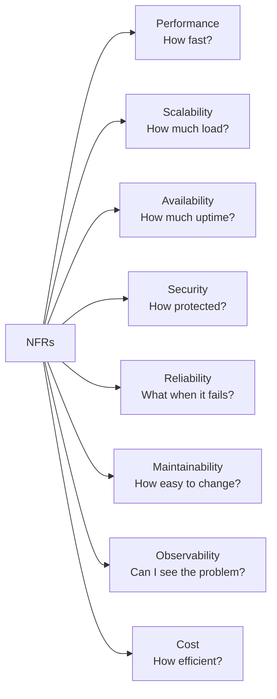

| | Question it answers | One measurable example |
| --- | --- | --- |
| **P**erformance | How fast? | p95 under 500 ms |
| **S**calability | How much load? | 10,000 RPS, autoscale above 70 % CPU |
| **A**vailability | How much uptime? | 99.99 % |
| **S**ecurity | How protected? | OAuth 2.0 + Key Vault, zero secrets in config |
| **R**eliability | What happens when a dependency fails? | Retry + circuit breaker + dead-letter queue |
| **M**aintainability | How easy to change? | A new dev ships a fix in week one |
| **O**bservability | Can we see what's happening? | Logs + metrics + traces, one correlation id |
| **C**ost efficiency | How efficiently are resources used? | Scale to zero outside business hours |

---

## 3. Performance

**Metrics to name:** response time / latency (p50, p95, p99), throughput (RPS / TPS), CPU and
memory utilisation, database query time, GC pause time.

### Finding the bottleneck before changing anything

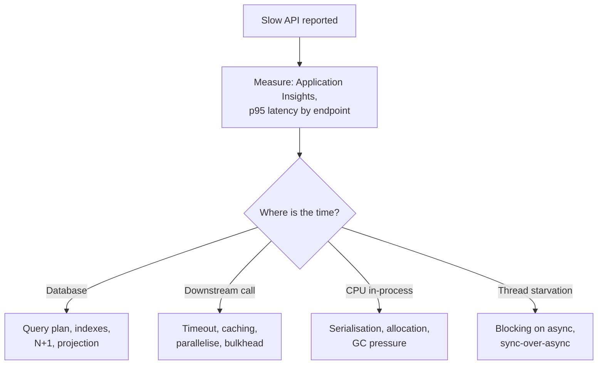

### The levers, in the order worth trying

| Lever | When it helps | .NET 10 / Azure |
| --- | --- | --- |
| Fix the query | almost always first | EF Core: projection, `AsNoTracking()`, index, `AsSplitQuery()` |
| Cache | the same answer is read repeatedly | `HybridCache`, Azure Cache for Redis |
| Async I/O end-to-end | high concurrency, I/O-bound work | `async`/`await`, never `.Result` |
| Paginate | large result sets | keyset pagination over `Skip`/`Take` |
| Shrink the payload | mobile / high-volume clients | projection DTOs, response compression |
| Move work off the request | it does not need to be synchronous | Azure Service Bus + a worker |
| Scale out | the code is already efficient | App Service autoscale, AKS HPA |

**Hands-on — a cache that does not stampede.** `HybridCache` (in `Microsoft.Extensions.Caching.Hybrid`)
gives an L1 in-process + L2 Redis cache with **stampede protection**: 500 simultaneous misses cause
one database call, not 500.

```c#
builder.Services.AddHybridCache();          // add .AddStackExchangeRedisCache(...) for the L2 tier

public sealed class OrderReader(HybridCache cache, AppDb db)
{
    public async Task<OrderDto?> GetAsync(int id, CancellationToken ct) =>
        await cache.GetOrCreateAsync(
            $"order:{id}",
            async token => await db.Orders
                .Where(o => o.Id == id)
                .Select(o => new OrderDto(o.Id, o.Total))   // project — never materialise the entity
                .FirstOrDefaultAsync(token),
            cancellationToken: ct);
}
```

> ⚠️ **The N+1 that hides behind lazy loading.** A `foreach` over orders that touches
> `order.Customer.Name` issues one query per order. Project it, or `Include` it — see
> [07 — Databases & ORM](07-databases-and-orm.md).

> 🎯 **The senior answer:** "I would not tune anything before measuring. Application Insights gives
> me p95 per endpoint and the dependency breakdown, so I can see whether the time is in SQL, a
> downstream call, serialisation or thread-pool starvation. Most 'slow API' tickets are a missing
> index or an N+1. Only once the code is efficient does scaling out make sense — otherwise you are
> paying for the same inefficiency in triplicate."

---

## 4. Scalability

Scalability is the ability to absorb **more load by adding resources**. Two directions:

| | Vertical (scale **up**) | Horizontal (scale **out**) |
| --- | --- | --- |
| Move | 4 vCPU → 8 vCPU, 8 GB → 16 GB | 1 instance → 3 instances |
| Ceiling | the biggest SKU available | effectively none |
| Downtime | usually a restart | none |
| Requires | nothing from the app | **stateless** app, external session/cache |
| Cost shape | steep steps | linear, and reversible |

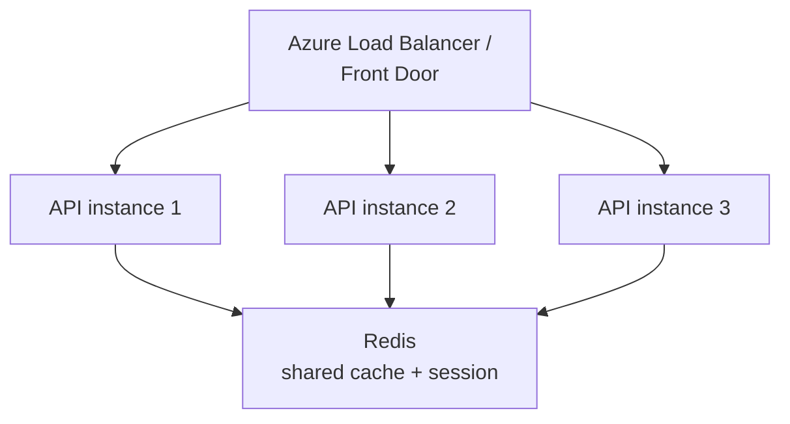

Cloud and microservice systems prefer horizontal scaling — but only **stateless** services can do
it. The moment an instance keeps session state in memory, a load balancer has to pin users to it
and you have lost the elasticity you paid for.

**Example NFR:** *the system supports 10,000 concurrent users and scales out automatically when CPU
utilisation exceeds 70 % for 5 minutes.*

| Azure lever | Scales |
| --- | --- |
| App Service autoscale rules | instance count on CPU / queue depth / schedule |
| AKS Horizontal Pod Autoscaler | pods on CPU, memory or a custom KEDA metric |
| Azure Functions (Consumption / Flex) | to zero, and out per-event |
| Front Door / Load Balancer | distributes; does not itself scale the app |

> 🎯 **The senior answer:** "Vertical scaling is the quick fix with a hard ceiling; horizontal is
> what you design for. The design work is making the service stateless — session and cache move to
> Redis, uploads to Blob Storage — because autoscaling a stateful service just gives you several
> copies of a bottleneck. I would drive the rule off the metric that actually saturates, which is
> often queue depth rather than CPU."

---

## 5. Availability

Availability is the fraction of time the system is operational, and it is always quoted as a
number of nines. The useful way to remember them is as **downtime budget**:

| Availability | Downtime / year | Downtime / month | What it forces |
| --- | --- | --- | --- |
| 99 % | 3.65 days | 7.2 hours | a single instance is fine |
| 99.9 % | 8.76 hours | 43.8 minutes | multiple instances, health checks |
| 99.99 % | 52.6 minutes | 4.4 minutes | availability zones, automated failover |
| 99.999 % | 5.26 minutes | 26 seconds | multi-region active/active |

Each extra nine roughly multiplies cost and operational discipline. **99.99 % leaves no room for a
manual step** — nobody gets paged, diagnoses and fixes anything in four minutes a month.

### Removing single points of failure

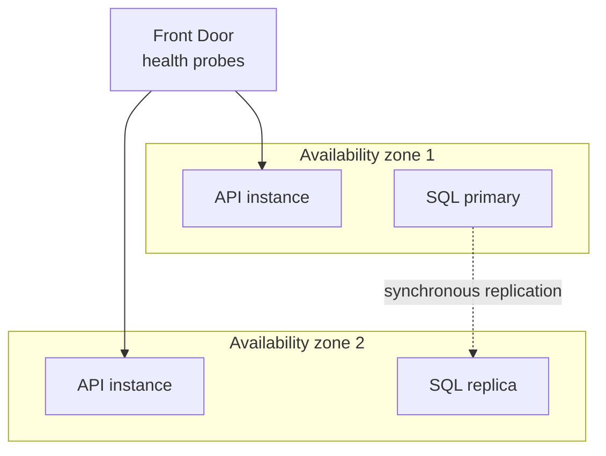

**Hands-on — health checks the platform can actually act on.** A probe that always returns 200 is
worse than none: the load balancer keeps sending traffic to a broken instance.

```c#
builder.Services.AddHealthChecks()
    .AddSqlServer(cfg.GetConnectionString("Db")!, name: "sql")
    .AddAzureServiceBusQueue(cfg["Bus:Namespace"]!, "orders", name: "bus");

// Liveness: is the process wedged? Keep it dependency-free, or a blip restarts a healthy pod.
app.MapHealthChecks("/health/live", new() { Predicate = _ => false });

// Readiness: should this instance receive traffic right now? Dependencies count here.
app.MapHealthChecks("/health/ready");
```

> ⚠️ Wiring dependency checks into the **liveness** probe is a classic outage amplifier: the
> database hiccups, every instance reports unhealthy, the orchestrator restarts all of them at once,
> and now you have a cold start on top of a database problem.

> 🎯 **The senior answer:** "I would target availability by eliminating single points of failure —
> several instances across availability zones, load balancing with real health probes, autoscaling
> and database failover. The number matters because it sets the budget: 99.9 % permits a manual
> recovery, 99.99 % does not, so everything has to be automated."

---

## 6. Security

> Organisational baseline: secrets live in **Azure Key Vault** (one vault per environment),
> identity comes from the centralised OAuth 2.0 / JWT authorisation server, and access is
> **default-deny**. See [11 — API Security](11-api-security.md) for the protocol detail.

| Concern | Question | Mechanism |
| --- | --- | --- |
| Authentication | *Who are you?* | OAuth 2.0 / OIDC, Microsoft Entra ID, JWT bearer |
| Authorisation | *What may you do?* | RBAC, scopes, policy handlers, resource ownership |
| In transit | Can it be read on the wire? | TLS 1.2+ **everywhere**, including service-to-service |
| At rest | Can it be read from storage? | AES-256, TDE, customer-managed keys |
| Secrets | Where do credentials live? | Key Vault + **Managed Identity** — never in config |
| Input | Can a caller reach the engine? | allowlist validation, parameterised queries |
| Abuse | Can one caller exhaust it? | rate limiting, WAF, API Management quotas |
| Forensics | Can we prove what happened? | audit logs with actor, action, timestamp, source IP |

**Hands-on — no secret in the application at all.** Managed Identity means the app authenticates
*as itself*; there is no connection string to leak, rotate or commit.

```c#
// Key Vault as a configuration source, authenticated by the workload's own identity.
builder.Configuration.AddAzureKeyVault(
    new Uri($"https://{builder.Configuration["KeyVault:Name"]}.vault.azure.net/"),
    new DefaultAzureCredential());

// Default-deny: every endpoint needs a policy unless it opts out explicitly.
builder.Services.AddAuthorizationBuilder()
    .SetFallbackPolicy(new AuthorizationPolicyBuilder().RequireAuthenticatedUser().Build());

// Per-caller rate limiting, partitioned by subject so one tenant cannot starve the rest.
builder.Services.AddRateLimiter(o => o.AddPolicy("per-user", ctx =>
    RateLimitPartition.GetFixedWindowLimiter(
        ctx.User.FindFirst("sub")?.Value ?? ctx.Connection.RemoteIpAddress?.ToString() ?? "anon",
        _ => new FixedWindowRateLimiterOptions { PermitLimit = 100, Window = TimeSpan.FromMinutes(1) })));
```

> ⚠️ Partitioning a rate limiter by `X-Forwarded-For` without configuring `ForwardedHeaders` with a
> trusted-proxy count lets a caller mint a fresh partition per request and bypass the limit
> entirely.

> 🎯 **The senior answer:** "Secrets never live in `appsettings` or source control — Managed
> Identity plus Key Vault removes the credential entirely, which is strictly better than rotating
> one. Authentication is OAuth 2.0 / JWT from the central authorisation server; authorisation is
> default-deny with ownership checked server-side on every request. Then TLS everywhere, allowlist
> validation, parameterised queries, rate limiting and audit logging."

---

## 7. Reliability

Availability asks *is it up?*; reliability asks *does it still behave correctly when something
underneath it does not?* Failure is assumed — the design question is what happens next.

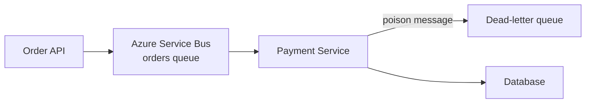

If Payment Service is down, the request is **not lost** — it waits in the queue. That single hop
converts an outage into a delay, which is the whole point of asynchronous messaging.

| Pattern | Protects against | .NET |
| --- | --- | --- |
| **Timeout** | a hung dependency holding your threads | `HttpClient.Timeout`, `CancellationToken` |
| **Retry with jitter** | transient faults | `Microsoft.Extensions.Http.Resilience` |
| **Circuit breaker** | hammering something already broken | same package |
| **Idempotency** | duplicate delivery after a retry | dedupe key + unique index |
| **Dead-letter queue** | one poison message blocking a queue | Service Bus DLQ |
| **Bulkhead** | one slow dependency starving everything | concurrency limiter per client |

**Hands-on — the standard resilience handler.** .NET 8+ ships this as one call; it applies rate
limiting, total timeout, retry and circuit breaker in the correct order.

```c#
builder.Services.AddHttpClient<PaymentClient>(c =>
{
    c.BaseAddress = new Uri(cfg["Payments:BaseUrl"]!);
})
.AddStandardResilienceHandler(o =>
{
    o.Retry.MaxRetryAttempts = 3;
    o.Retry.UseJitter = true;                                 // spreads the thundering herd
    o.CircuitBreaker.FailureRatio = 0.5;                      // open at 50 % failures...
    o.CircuitBreaker.SamplingDuration = TimeSpan.FromSeconds(30);
    o.AttemptTimeout.Timeout = TimeSpan.FromSeconds(5);
});
```

> ⚠️ **Retry without idempotency is a duplicate-charge bug.** If the first attempt succeeded but the
> response was lost, the retry charges the card again. Send a client-generated idempotency key and
> enforce it with a unique index.

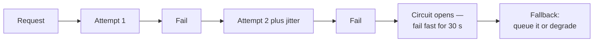

> 🎯 **The senior answer:** "Reliability is designing for the failure you know is coming. Timeouts
> first — without one, a hung dependency exhausts your thread pool and takes you down with it. Then
> bounded retry with jitter for transient faults, a circuit breaker so you stop hammering something
> that is already broken, and idempotency keys so a retry cannot double-charge. Anything that does
> not need a synchronous answer goes on a queue with a dead-letter path."

---

## 8. Maintainability

How quickly can someone who did not write this change it safely? The measurable version: *a new
joiner ships a production fix in their first week.*

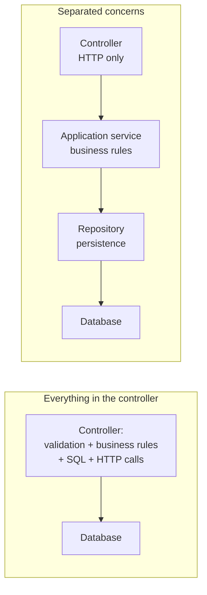

The practices that actually move this: SOLID ([03](03-solid-and-design-principles.md)), a clear
layering, dependency injection so the units are testable in isolation, tests at the level where
the risk lives ([13](13-testing-and-quality.md)), and consistent conventions enforced by tooling
rather than by review comments.

> 🎯 **The senior answer:** "Maintainability is the NFR that pays for the others — you cannot meet
> a performance or security target on a codebase nobody can safely change. Concretely: HTTP concerns
> in the controller, business rules in an application service, persistence behind a repository,
> dependencies injected so each layer is testable, and enough test coverage that a change either
> works or fails loudly in CI."

---

## 9. Observability

Monitoring tells you *that* something is wrong. Observability lets you find out *why* without
shipping new code. Three pillars, one correlation id tying them together:

| Pillar | Answers | Azure |
| --- | --- | --- |
| **Logs** | what happened, with context | Log Analytics / structured logs |
| **Metrics** | how much, how often, how fast | Azure Monitor, Prometheus |
| **Traces** | where the time went, across services | Application Insights (distributed tracing) |

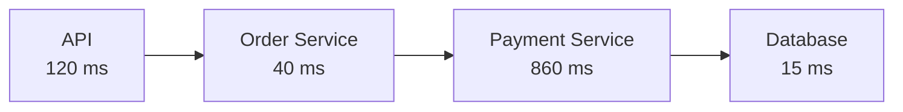

One trace, one glance: the 860 ms in Payment Service is the problem, and no amount of tuning the
API would have found it.

**Hands-on — OpenTelemetry wired to Azure Monitor.**

```c#
builder.Services.AddOpenTelemetry()
    .ConfigureResource(r => r.AddService("orders-api"))
    .WithTracing(t => t.AddAspNetCoreInstrumentation()
                       .AddHttpClientInstrumentation()
                       .AddSqlClientInstrumentation())
    .WithMetrics(m => m.AddAspNetCoreInstrumentation()
                       .AddRuntimeInstrumentation())
    .UseAzureMonitor();

// Structured logging: log the id, never the person.
logger.LogInformation("Payment failed for order {OrderId} after {Attempts} attempts",
    order.Id, attempts);
```

> ⚠️ **Never log personal data.** Log the order id, the correlation id, the outcome — not the name,
> email or card. Scrub before the data leaves the process; a log store is not access-controlled the
> way your database is.

> 🎯 **The senior answer:** "Centralised structured logging, metrics and distributed tracing, all
> correlated by one id so I can pivot from a spike in the error-rate metric to the exact trace and
> its logs. In Azure that is OpenTelemetry into Application Insights. The test of observability is
> whether I can diagnose a new failure mode without deploying anything."

---

## 10. Disaster recovery — RTO and RPO

The two numbers that define what "recovered" means:

| | Stands for | Asks | Example |
| --- | --- | --- | --- |
| **RTO** | Recovery **Time** Objective | How fast must we be back? | 30 minutes |
| **RPO** | Recovery **Point** Objective | How much data may we lose? | 5 minutes |

> 💡 **The mnemonic:** RT**O** → **T**ime. RP**O** → data **P**oint.

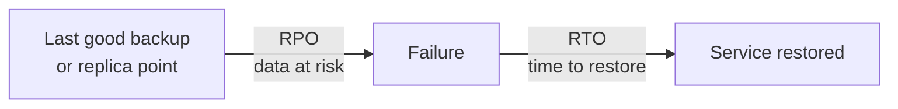

The pair drives the architecture and the bill. RPO ≈ 0 means synchronous replication; RTO of
minutes means a warm standby, not a restore-from-backup runbook.

| Strategy | Typical RTO | Typical RPO | Cost |
| --- | --- | --- | --- |
| Backup / restore | hours | hours | ★ |
| Warm standby (async replica) | minutes | seconds–minutes | ★★★ |
| Active/active multi-region | seconds | ~0 | ★★★★★ |

> 🎯 **The senior answer:** "RTO is time, RPO is data. They are business decisions, not technical
> ones — I ask for them first, because RPO near zero forces synchronous replication and an RTO in
> minutes rules out restoring from backup. Then I make sure the failover is actually *tested*: an
> untested DR plan has an unknown RTO, which is the same as not having one."

---

## 11. The rest — compatibility, usability, compliance, cost

### Compatibility

The system must keep working with existing clients, older API versions, other operating systems and
neighbouring systems. The main lever is **versioning**, so old callers keep working while new ones
move on:

```text
/api/v1/orders    ← existing clients keep this contract
/api/v2/orders    ← new shape, breaking changes allowed
```

Additive changes (a new optional field) do not need a version. Removing or re-typing a field does.
See [08 — REST & API Design](08-rest-and-api-design.md).

### Usability

Simple flows, clear error messages, accessibility, responsive layout, consistent navigation. In a
backend interview this ranks below performance, security, scalability, availability and
reliability — but "clear error messages" is a backend responsibility: a 400 should say which field
was wrong, without leaking internals.

### Compliance

| Regime | Typically demands |
| --- | --- |
| **GDPR** | lawful basis, data-subject deletion, residency, minimisation |
| **PCI DSS** | never store the PAN, tokenise, segment the network |
| **HIPAA** | encryption, audit trails, access control |
| **SOC 2 / ISO 27001** | documented controls and evidence |

Recurring technical requirements: audit logs, retention and deletion policies, encryption at rest
and in transit, RBAC, and data masking in non-production. Compliance is the NFR most often
discovered late and most expensive to retrofit — residency in particular constrains *where* the
architecture may run.

### Cost efficiency

An architecture nobody can afford does not ship. Do not run 20 VMs at full size around the clock
for a load that peaks between 09:00 and 18:00.

| Lever | Saves by |
| --- | --- |
| Autoscale on a schedule | matching capacity to the actual daily curve |
| Serverless (Functions, Container Apps) | scaling to zero when idle |
| Right-sizing | removing the headroom nobody measured |
| Reserved instances / savings plans | committing to steady-state baseline |
| Caching | not paying for the same computation twice |
| Storage lifecycle policies | ageing cold blobs to a cheaper tier |

---

## 12. NFRs drive the design — how to open a system-design interview

The interviewer says *"design an order-processing system."* **Do not start drawing boxes.** Ask for
the numbers, because every one of them changes the answer:

| Ask | Why it changes the design |
| --- | --- |
| Response-time SLA? | 500 ms p95 rules out a synchronous chain of five hops |
| Expected load, and its shape? | 100 RPS steady vs 10,000 RPS at noon are different systems |
| Uptime target? | 99.99 % forces zones, automated failover, no manual steps |
| What happens if Payments is down? | decides queue-and-retry vs fail-fast |
| Data volume and retention? | decides partitioning, archival, cost |
| RPO / RTO? | decides replication topology |
| Compliance and data residency? | decides which regions are even legal |
| Read/write ratio? | decides caching, read replicas, CQRS |

> 🎯 **The senior answer:** "I would start by pinning the NFRs, because they *are* the design
> constraints — throughput, latency target, uptime, RPO/RTO and compliance. 'Design an order system'
> at 100 RPS with 99.9 % is a single service and a database; at 10,000 RPS with 99.99 % and an RPO
> of zero it is a partitioned, queue-buffered, multi-zone system. Same words, different architecture."

---

## 13. Worked example — e-commerce

**Given NFRs**

| NFR | Target |
| --- | --- |
| Throughput | 10,000 requests/sec |
| Latency | under 500 ms at p95 |
| Availability | 99.99 % |
| Scale | 1 million registered users |
| Payments | must not lose a request |
| Sensitive data | encrypted in transit and at rest |
| RTO / RPO | 30 minutes / 5 minutes |

**An architecture those numbers justify**

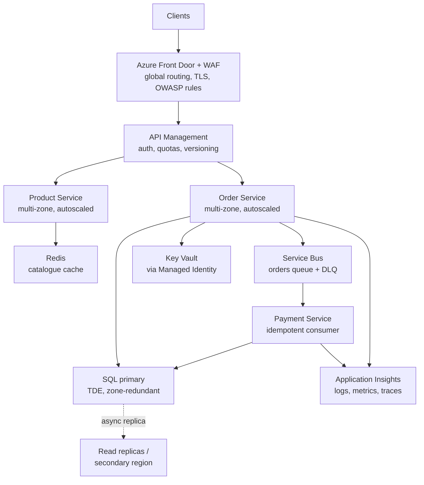

**Which NFR bought which box**

| Decision | Driven by |
| --- | --- |
| Front Door + WAF | availability (global failover) + security (OWASP) |
| API Management | security (auth, quotas) + compatibility (versioning) |
| Multi-zone autoscaled services | availability 99.99 % + throughput 10,000 RPS |
| Redis catalogue cache | latency p95 under 500 ms + cost |
| Service Bus between order and payment | reliability ("must not lose a request") |
| Idempotent payment consumer | reliability under retry — no double charge |
| TDE + Key Vault + Managed Identity | encryption at rest, no stored secrets |
| Async replica / secondary region | RPO 5 min, RTO 30 min |
| Application Insights everywhere | observability, and the only way to prove p95 |

Every box traces back to a number. That is the answer the interviewer is listening for.

---

## 14. Quick revision table

| NFR | In plain words | Example target | Primary lever |
| --- | --- | --- | --- |
| Performance | How fast? | API p95 under 500 ms | indexes, cache, async |
| Scalability | How much load? | 10K RPS | stateless + autoscale out |
| Availability | How much uptime? | 99.99 % | multi-zone, health probes, failover |
| Security | How protected? | OAuth 2.0 + Key Vault | Managed Identity, default-deny, TLS |
| Reliability | What when it fails? | zero lost orders | timeout, retry, breaker, queue, idempotency |
| Maintainability | How easy to change? | fix shipped in week one | SOLID, layering, DI, tests |
| Observability | Can we see it? | any failure diagnosable live | logs + metrics + traces, one id |
| Disaster recovery | How fast, how much loss? | RTO 30 min / RPO 5 min | replication + tested failover |
| Compatibility | Works with others? | v1 clients keep working | API versioning |
| Usability | Easy to use? | clear, actionable errors | UX + honest error contracts |
| Compliance | Legal? | GDPR, PCI DSS | audit, retention, encryption, residency |
| Cost | Efficient? | scale to zero off-hours | autoscale, serverless, right-sizing |

---

## 15. Priority order for a .NET + Azure interview

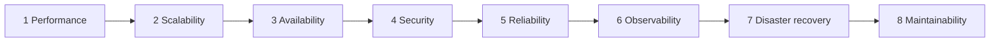

Weighted towards roles involving ASP.NET Core, AKS, microservices, SQL Server, Redis, Service Bus,
API Management, Functions and Application Insights.

### The one-line shortcut for each

| NFR | Say this |
| --- | --- |
| Performance | How **fast**? |
| Scalability | How much **load**? |
| Availability | How much **uptime**? |
| Security | How **protected**? |
| Reliability | What happens when it **fails**? |
| Observability | Can I **see** the problem? |
| RTO | How fast can I **recover**? |
| RPO | How much **data** can I lose? |
| Maintainability | How **easy to change**? |

---

## Rapid-fire Q&A

**Q: What are NFRs?**
Quality attributes and constraints — performance, scalability, availability, security, reliability,
maintainability — describing *how well* a system must operate rather than what it does.

**Q: Functional requirement vs NFR?**
"A user can place an order" is functional. "The order API responds within 500 ms at p95" is
non-functional. The second is only useful because it carries a number.

**Q: What is scalability, and which direction do you prefer?**
The ability to absorb load by adding resources. Vertical adds power to one instance and has a hard
ceiling; horizontal adds instances and is what cloud systems design for — which is why making the
service **stateless** is the real work.

**Q: What does 99.99 % availability actually demand?**
A downtime budget of ~52 minutes a year, or 4.4 minutes a month. That is too short for a human to
be paged and intervene, so failover has to be automatic.

**Q: What is reliability, and how is it different from availability?**
Availability is "is it up"; reliability is "does it stay correct when a dependency is not". Levers:
timeouts, bounded retry with jitter, circuit breakers, queues with dead-lettering, idempotency.

**Q: RPO vs RTO?**
RTO is how quickly you must be back (time). RPO is how much data you may lose (data point). RPO near
zero forces synchronous replication; a short RTO rules out restore-from-backup.

**Q: How would you improve a slow .NET API?**
Measure first — p95 per endpoint and the dependency breakdown in Application Insights. Then fix
what the data points at: query plans and indexes, N+1, caching, async I/O, payload size, moving
non-urgent work to a queue. Scale out last, once the code is efficient.

**Q: Why is retry alone dangerous?**
Because a retried write that actually succeeded the first time is a duplicate. Retry needs
idempotency — a client-supplied key enforced by a unique index — and a circuit breaker so you stop
retrying into a dependency that is already down.

**Q: Where do NFRs come from in a design interview?**
You ask for them. Load, latency target, uptime, RPO/RTO, compliance and read/write ratio are the
constraints that decide the architecture, so eliciting them *is* the first design step.

---

**Next:** back to [17 — Architecture & NFRs](17-architecture-and-nfrs.md) for architecture views,
layering and the deployment checklist · [12 — Cloud Architecture](12-cloud-architecture.md) ·
[15 — Observability & Monitoring](15-observability-and-monitoring.md) ·
[Track index](readme.md)
