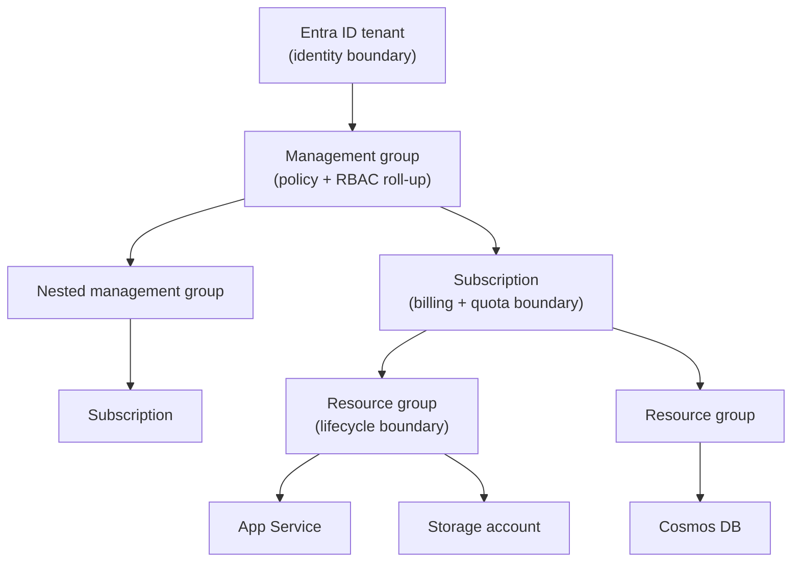

# 01 — Fundamentals & Governance

> **Scope:** the vocabulary every Azure interview opens with — hierarchy, ARM, regions and zones,
> SLA arithmetic, RBAC vs Policy, tagging and cost — plus the `az` and Bicep commands you are
> expected to type without help.
> Already on this blog: [Azure basics](../../Azure/azure-basic.md) ·
> [Cloud architecture (Azure + AWS)](../Architecture/12-cloud-architecture.md).

---

## The resource hierarchy

Everything in Azure is a **resource**, and every resource sits in exactly one place in this tree:



| Level | It is the boundary for | Notes |
| --- | --- | --- |
| **Tenant** | Identity — users, groups, app registrations | One Entra ID directory; a subscription trusts exactly one tenant |
| **Management group** | Policy and RBAC inheritance | Up to 6 levels deep (excluding root); a subscription has one parent |
| **Subscription** | Billing, quotas and limits | The unit you split prod/non-prod by |
| **Resource group** | **Lifecycle** — deploy and delete together | A resource lives in one RG; its region can differ from the RG's |
| **Resource** | The thing itself | Globally identified by its **resource ID** |

```text
/subscriptions/{subId}/resourceGroups/{rg}/providers/Microsoft.Web/sites/{appName}
```

> **The classic trap.** A resource group *has* a location, but that location only stores the group's
> **metadata** — the resources inside it can sit in any region. Deleting the group deletes every
> resource in it, which is exactly why per-environment resource groups are the norm.

## Control plane vs data plane

This distinction is worth a mark on its own, because permissions, latency and throttling all differ.

| | Control plane | Data plane |
| --- | --- | --- |
| Endpoint | `management.azure.com` (ARM) | Service-specific (`{acct}.blob.core.windows.net`, `{vault}.vault.azure.net`) |
| Operations | Create/update/delete/list **resources** | Read/write **the data inside** a resource |
| Authorization | Azure RBAC role assignments | RBAC data-plane roles, keys, SAS, or the service's own ACL |
| Example | `Contributor` can recreate the storage account | `Storage Blob Data Reader` can download a blob |

**`Owner` on a storage account does not let you read a blob.** Management roles like `Owner` and
`Contributor` grant control-plane rights plus the ability to *read the account keys* — but not
data-plane access under Entra ID. You need a `... Data ...` role. Interviewers love this one.

## Azure Resource Manager (ARM)

ARM is the single control-plane API in front of every service. Portal, CLI, PowerShell, the SDKs and
Terraform all speak to it, which is why they behave identically.

- **Declarative + idempotent** — you submit desired state; re-submitting the same template changes nothing.
- **Deployment modes** — `Incremental` (default: adds/updates, leaves everything else) vs `Complete`
  (**deletes resources in the resource group that are not in the template**). Know that difference.
- **Resource providers** — `Microsoft.Web`, `Microsoft.Storage`, … must be *registered* on the subscription.
- **State lives server-side** in the deployment history, unlike Terraform's state file.

## Regions, availability zones and paired regions

| Concept | What it is | Buys you |
| --- | --- | --- |
| **Region** | A geography containing one or more datacenters | Data residency, low latency to users |
| **Availability zone** | A physically separate datacenter (independent power/cooling/network) within a region | **High availability** inside a region |
| **Zonal** service | You pin an instance to zone 1/2/3 yourself | Control — and the job of spreading it |
| **Zone-redundant** service | The platform replicates across zones for you | HA with no work (ZRS storage, zone-redundant App Gateway) |
| **Region pair** | A second region in the same geography | **Disaster recovery**, sequential platform updates |

- Multi-**zone** ⇒ survives a datacenter failure, latency stays sub-millisecond.
- Multi-**region** ⇒ survives a region failure, but you now own replication lag and failover.

## SLA arithmetic — the question behind the question

Composite SLA is the **product** of the SLAs of every component on the critical path:

```text
App Service 99.95%  ×  SQL Database 99.99%  ×  Storage 99.9%
=  0.9995 × 0.9999 × 0.999  =  99.84%   ->  ~14 hours of budget per year
```

Two levers, and interviewers want both:

1. **Remove dependencies from the critical path** — cache, queue the write, degrade gracefully.
   A dependency you can survive without does not multiply into the SLA.
2. **Add redundant instances in parallel** — two independent regions at 99.95% give
   `1 - (1 - 0.9995)² ≈ 99.999975%`, provided the failover itself is automatic.

Always check the current figure on the service's SLA page before quoting it — the numbers move, and
"I'd look it up, but the maths is multiplication on the critical path" is the answer that scores.

## RBAC vs Azure Policy vs locks

| Tool | Answers | Example |
| --- | --- | --- |
| **Azure RBAC** | *Who* can do *what*? | Assign `Key Vault Secrets User` to the app's managed identity |
| **Azure Policy** | *What is allowed to exist?* | Deny any storage account with `allowBlobPublicAccess = true` |
| **Resource lock** | *Can this be changed/deleted at all?* | `CanNotDelete` on the production resource group |

- An RBAC assignment = **security principal + role definition + scope**, and it **inherits downward**
  (management group → subscription → RG → resource).
- Deny assignments exist but are only created by Azure (e.g. Blueprints/managed apps) — you cannot
  hand-author one, so "deny wins" reasoning belongs to Policy, not RBAC.
- Policy effects worth naming: `Deny`, `Audit`, `Append`, `Modify`, `DeployIfNotExists`.
- Locks apply to the **control plane only** — `ReadOnly` on a storage account still lets you write blobs.

## Tags and cost

- **Tags** are key/value pairs for cost allocation and ownership (`env`, `owner`, `costCentre`,
  `app`). They are **not inherited** by child resources — use a `Modify` policy to enforce them.
- **Pricing levers:** pay-as-you-go → **reservations** (1/3-year commit, ~40–70% off steady-state
  compute) → **savings plans** (flexible across services) → **spot** (evictable, batch only) →
  **scale-to-zero** (Functions Flex Consumption, Container Apps).
- **Azure Hybrid Benefit** reuses on-prem Windows Server/SQL licences on Azure VMs and SQL.

## Hands-on — resource group and a Bicep deployment

```bash
# 0. sign in and pick a subscription
az login
az account set --subscription "My Dev Subscription"
az account show --output table

# 1. a resource group
az group create --name rg-shop-dev --location westeurope --tags env=dev owner=keshav

# 2. preview what a template would change (the killer feature: what-if)
az deployment group what-if --resource-group rg-shop-dev --template-file main.bicep

# 3. deploy it (incremental by default)
az deployment group create --resource-group rg-shop-dev --template-file main.bicep \
  --parameters appName=shop-dev

# 4. inspect and clean up
az resource list --resource-group rg-shop-dev --output table
az group delete --name rg-shop-dev --yes --no-wait
```

`main.bicep` — a storage account plus a Linux .NET web app, wired to a managed identity:

```bicep
param appName string
param location string = resourceGroup().location

resource storage 'Microsoft.Storage/storageAccounts@2023-05-01' = {
  name: 'st${uniqueString(resourceGroup().id)}'
  location: location
  sku: { name: 'Standard_LRS' }
  kind: 'StorageV2'
  properties: {
    allowBlobPublicAccess: false
    minimumTlsVersion: 'TLS1_2'
    supportsHttpsTrafficOnly: true
  }
}

resource plan 'Microsoft.Web/serverfarms@2023-12-01' = {
  name: 'plan-${appName}'
  location: location
  sku: { name: 'B1' }
  properties: { reserved: true }          // reserved: true == Linux
}

resource site 'Microsoft.Web/sites@2023-12-01' = {
  name: appName
  location: location
  identity: { type: 'SystemAssigned' }    // no secrets to manage
  properties: {
    serverFarmId: plan.id
    httpsOnly: true
    siteConfig: {
      linuxFxVersion: 'DOTNETCORE|10.0'
      minTlsVersion: '1.2'
      ftpsState: 'Disabled'
      appSettings: [
        { name: 'Storage__AccountUri', value: storage.properties.primaryEndpoints.blob }
      ]
    }
  }
}

output principalId string = site.identity.principalId
```

> Bicep is a transparent transpiler over ARM JSON — `az bicep build --file main.bicep` shows exactly
> what ARM receives, and `az bicep decompile` goes the other way. No state file, no extra runtime.

## Rapid-fire Q&A

**Q: Resource group vs subscription vs management group — pick one for each concern.**
Lifecycle → resource group. Billing/quota → subscription. Policy and RBAC roll-up across many
subscriptions → management group.

**Q: I have `Contributor` on a storage account and can't read a blob. Why?**
`Contributor` is a control-plane role. Blob reads under Entra ID need a data-plane role such as
`Storage Blob Data Reader`. (`Contributor` *can* read the account keys and get in that way — which
is precisely why key access is usually disabled.)

**Q: Incremental vs Complete deployment mode?**
Incremental only adds/updates what the template declares. Complete **deletes** anything in the
resource group that the template does not declare. Complete is how you guarantee no drift — and how
you delete production by accident.

**Q: Availability zone vs region pair?**
Zones = HA within one region, synchronous, no data-residency change. Region pairs = DR across
regions, asynchronous replication, sequential platform updates and prioritised recovery.

**Q: How do you work out the SLA of a system?**
Multiply the SLAs of everything on the critical path; then either take components off that path
(cache/queue/degrade) or run redundant copies in parallel so failure probabilities multiply instead.

**Q: RBAC or Policy to stop anyone creating a public-facing storage account?**
Policy. RBAC controls *who* acts; Policy controls *what may exist*, and it evaluates on every write
to ARM regardless of who is calling.

**Q: Bicep or Terraform on an Azure-only team?**
Bicep — day-one support for new resource types, server-side state, no extra tooling, and it is just
ARM underneath. Terraform when you are genuinely multi-cloud or already invested in its ecosystem.

**Q: What does a resource lock *not* protect?**
The data plane. `CanNotDelete` on a storage account will not stop someone deleting every blob in it.

---

**Next:** [02 — Identity, Entra ID & Managed Identity](02-identity-and-managed-identity.md) ·
**Up:** [Azure track hub](readme.md)
