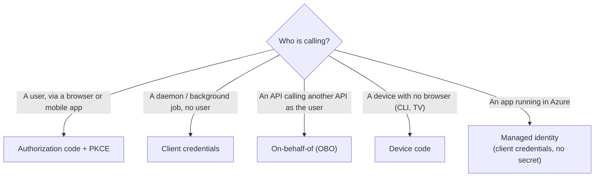

# 02 — Entra ID, OAuth2 & Managed Identity

> **Scope:** how a .NET app proves who it is to Azure and to your own APIs — the identity objects,
> the token, the flows, delegated vs application permissions, managed identity, and the
> `Azure.Identity` credential chain.
> Related: [API security](../Architecture/11-api-security.md) ·
> [Security & cryptography in C#](../../CSharp/security-and-cryptography.md).

---

## The identity objects

Microsoft Entra ID (the service formerly called Azure AD — the rename is complete, expect the new
name in questions) holds four things a developer touches:

| Object | What it is | Lives where |
| --- | --- | --- |
| **Application object** (app registration) | The global *definition* of your app — redirect URIs, exposed scopes, app roles, certificates | The **home** tenant only, one per app |
| **Service principal** (enterprise application) | The *local instance* of that app in a tenant — what role assignments and consent attach to | One **per tenant** the app is used in |
| **Managed identity** | A service principal Azure creates and whose credentials Azure rotates for you | The tenant of the subscription |
| **User** | A human | The tenant |

> **Interview line:** the app registration is the class; the service principal is the instance. RBAC
> role assignments are always made against the *service principal*, never the app registration.

## The token

Everything is a JWT. Know the claims by name, because "how do you validate a token?" is really
"which claims do you check?":

| Claim | Meaning | You must check |
| --- | --- | --- |
| `iss` | Issuer — `https://login.microsoftonline.com/{tid}/v2.0` | ✅ exactly |
| `aud` | Audience — the API the token is *for* | ✅ exactly (yours) |
| `exp` / `nbf` | Expiry / not-before | ✅ (clock skew ≤ 5 min) |
| `tid` | Tenant id | ✅ in single-tenant apps |
| `sub` | Subject — stable, pairwise per app | identifier for the caller |
| `oid` | Object id — the user/SP in the tenant | the durable user key |
| `scp` | **Delegated** scopes, space-separated (`orders.read`) | acting *on behalf of a user* |
| `roles` | **Application** roles or app permissions | acting *as itself* |
| `appid` / `azp` | Calling client | audit |

- **ID token** → for the client, describes the user, never sent to an API.
- **Access token** → for the API, is the thing you validate. **Never parse it in the client.**
- **Refresh token** → exchanged for new access tokens; store server-side / HttpOnly, never in JS.
- Access tokens are signed with **RS256** and validated against the tenant's rotating public keys at
  the JWKS endpoint — which is why you never hardcode a key or call `ValidateIssuerSigningKey = false`.

## The flows — pick one per caller



| Flow | Use for | Credential |
| --- | --- | --- |
| **Authorization code + PKCE** | SPAs, mobile, web apps — anything with a user | none (public client) or a secret (confidential) |
| **Client credentials** | Service-to-service, timers, workers | secret, certificate, or **federated credential** |
| **On-behalf-of** | API A must call API B *as the signed-in user* | A's own credential + the incoming token |
| **Device code** | Input-constrained devices | none |
| **ROPC (password grant)** | ❌ Nothing. It breaks MFA and CA. | — |

**Implicit flow is dead.** SPAs use authorization code + PKCE; if someone offers implicit in an
interview answer, that is the trap.

## Delegated scopes vs application permissions

| | Delegated (`scp`) | Application (`roles`) |
| --- | --- | --- |
| There is a signed-in user | yes | no |
| Effective permission | **intersection** of the app's scope *and* the user's own rights | exactly what was granted — no user to limit it |
| Consent | user or admin | **admin only** |
| Typical | `User.Read`, `Orders.Read` | `Orders.Read.All` on a nightly job |

The intersection rule is the exam question: a delegated `Files.ReadWrite.All` does **not** let a
standard user edit the CEO's files — the user's own rights still apply. An application permission has
no such backstop, which is why it needs admin consent and least privilege.

## Managed identity — the whole point

A managed identity is a service principal whose secret **you never see and never rotate**. The
platform injects an endpoint into the host; the SDK calls it for a token.

| | System-assigned | User-assigned |
| --- | --- | --- |
| Lifecycle | Created with the resource, deleted with it | Standalone resource you create |
| Cardinality | Exactly one per resource | Many per resource; one identity shared by many resources |
| Best for | A single app owning its own access | Fleets, pre-provisioned access, blue/green where the resource is recreated |
| Gotcha | Delete + recreate the app ⇒ new principal ⇒ **every role assignment is gone** | You must tell the SDK *which* identity (`ClientId`) when several are attached |

Facts worth stating out loud:

- It works **inside the resource's own tenant only** — no cross-tenant managed identity.
- Under the hood it is the client-credentials flow against a local token endpoint (IMDS at
  `169.254.169.254` on VMs; an injected env-var endpoint on App Service/Functions/Container Apps).
- The token is cached by the platform and by the SDK. Don't build your own cache; **do** reuse the
  `TokenCredential` and the service client (they are thread-safe and pool connections).
- Assign it **data-plane** roles: `Storage Blob Data Contributor`, `Key Vault Secrets User`,
  `Azure Service Bus Data Sender`, `Cosmos DB Built-in Data Reader`.

## `DefaultAzureCredential` — and why not to ship it

`Azure.Identity` gives every Azure SDK client the same `TokenCredential` abstraction.
`DefaultAzureCredential` walks a fixed chain and takes the first credential that works:

| # | Credential | Enabled by default |
| --- | --- | --- |
| 1 | `EnvironmentCredential` (`AZURE_CLIENT_ID`/`AZURE_TENANT_ID`/`AZURE_CLIENT_SECRET`) | ✅ |
| 2 | `WorkloadIdentityCredential` (AKS workload identity) | ✅ |
| 3 | `ManagedIdentityCredential` | ✅ |
| 4 | `VisualStudioCredential` | ✅ |
| 5 | `VisualStudioCodeCredential` | ✅ |
| 6 | `AzureCliCredential` (`az login`) | ✅ |
| 7 | `AzurePowerShellCredential` | ✅ |
| 8 | `AzureDeveloperCliCredential` (`azd auth login`) | ✅ |
| 9 | `InteractiveBrowserCredential` | ❌ opt-in |
| 10 | `BrokerCredential` (OS broker, needs `Azure.Identity.Broker`) | ✅ |

**The senior answer:** that chain is a *developer-experience* feature. In production it is
non-deterministic — if managed identity starts failing, the app silently slides down to whatever
`az login` left on the box and runs with the wrong principal. Microsoft's own guidance is to pin the
credential in production:

```csharp
// Program.cs — deterministic in prod, convenient locally
builder.Services.AddAzureClients(clients =>
{
    clients.AddBlobServiceClient(new Uri(builder.Configuration["Storage:BlobUri"]!));
    clients.AddSecretClient(new Uri(builder.Configuration["KeyVault:Uri"]!));

    clients.UseCredential(builder.Environment.IsDevelopment()
        ? new DefaultAzureCredential()
        : new ManagedIdentityCredential(
              ManagedIdentityId.FromUserAssignedClientId(
                  builder.Configuration["Azure:UserAssignedClientId"]!)));
});
```

Two lighter alternatives to know:

- `AZURE_TOKEN_CREDENTIALS=prod` (or `dev`, or a single credential name such as
  `ManagedIdentityCredential`) trims the chain without a code change — `Azure.Identity` 1.15+.
- `ChainedTokenCredential` builds a chain up from nothing instead of tearing one down.

To debug a chain, listen to the SDK's event source — it prints which credential was selected:

```csharp
using AzureEventSourceListener listener = new((args, message) =>
{
    if (args is { EventSource.Name: "Azure-Identity" }) Console.WriteLine(message);
}, EventLevel.LogAlways);
```

## Validating tokens in ASP.NET Core

```csharp
// Resource server: validate, never mint. Microsoft.Identity.Web wraps the JWT bearer handler.
builder.Services
    .AddAuthentication(JwtBearerDefaults.AuthenticationScheme)
    .AddMicrosoftIdentityWebApi(builder.Configuration.GetSection("AzureAd"));

builder.Services.AddAuthorization(options =>
{
    // delegated: a user is present and the app was granted the scope
    options.AddPolicy("ReadOrders", p => p.RequireScope("Orders.Read"));
    // application: a daemon acting as itself
    options.AddPolicy("SyncOrders", p => p.RequireRole("Orders.Sync.All"));
});

app.UseAuthentication();
app.UseAuthorization();

app.MapGet("/orders", () => Results.Ok()).RequireAuthorization("ReadOrders");
```

```jsonc
// appsettings.json — no secrets here; the client secret (if any) belongs in Key Vault
"AzureAd": {
  "Instance": "https://login.microsoftonline.com/",
  "TenantId": "<tenant-guid>",
  "ClientId": "<api-app-registration-guid>",
  "Audience": "api://<api-app-registration-guid>"
}
```

Calling a downstream API **as the user** (on-behalf-of) is one call with `Microsoft.Identity.Web`:

```csharp
public sealed class GraphClient(ITokenAcquisition tokenAcquisition, HttpClient http)
{
    public async Task<string> GetMyProfileAsync(CancellationToken ct)
    {
        // exchanges the incoming user token for a Graph token — the OBO flow
        var token = await tokenAcquisition.GetAccessTokenForUserAsync(["User.Read"]);
        http.DefaultRequestHeaders.Authorization = new("Bearer", token);
        return await http.GetStringAsync("https://graph.microsoft.com/v1.0/me", ct);
    }
}
```

## Hands-on — a web app that reads a blob with no secrets

```bash
RG=rg-shop-dev; APP=shop-dev-api; SA=stshopdev$RANDOM

az storage account create -g $RG -n $SA --sku Standard_LRS --allow-blob-public-access false
az webapp create -g $RG -n $APP --plan plan-shop-dev --runtime "DOTNETCORE:10.0"

# 1. give the app a system-assigned identity and capture its principal id
PRINCIPAL=$(az webapp identity assign -g $RG -n $APP --query principalId -o tsv)

# 2. grant it DATA-plane access to the storage account (not Contributor!)
SCOPE=$(az storage account show -g $RG -n $SA --query id -o tsv)
az role assignment create --assignee-object-id $PRINCIPAL \
  --assignee-principal-type ServicePrincipal \
  --role "Storage Blob Data Contributor" --scope $SCOPE

# 3. tell the app where the account is — a URI, not a connection string
az webapp config appsettings set -g $RG -n $APP \
  --settings Storage__BlobUri="https://$SA.blob.core.windows.net"

# 4. locally, the same code authenticates as *you*
az login
az role assignment create --assignee $(az ad signed-in-user show --query id -o tsv) \
  --role "Storage Blob Data Contributor" --scope $SCOPE
```

```csharp
// identical code locally and in Azure — that is the whole benefit
var client = new BlobServiceClient(new Uri(config["Storage:BlobUri"]!), credential);
```

## Rapid-fire Q&A

**Q: App registration vs service principal vs managed identity?**
App registration is the app's global definition; the service principal is its per-tenant instance and
the thing you assign roles to; a managed identity is a service principal Azure creates and whose
credential Azure rotates, so no secret ever exists in your config.

**Q: System-assigned or user-assigned — which and why?**
System-assigned when one resource owns its own access and shares nothing. User-assigned when several
resources need the same identity, when the identity must exist *before* the resource (Key Vault
references at creation time), or when the resource is recreated on every deploy and you don't want to
re-grant every role.

**Q: `scp` vs `roles` in a token?**
`scp` = delegated, a user is present, effective permission is the intersection of app scope and user
rights. `roles` = application permission (or app role), no user, so it needs admin consent and is
exactly as powerful as granted.

**Q: Which OAuth flow for a JavaScript SPA?**
Authorization code with PKCE. Implicit is deprecated; the SPA is a public client, so it holds no
secret and PKCE is what stops code interception.

**Q: How does an API call another API as the signed-in user?**
On-behalf-of: the middle API presents the incoming user token plus its own client credential and gets
a new token for the downstream API, preserving the user identity and their consent.

**Q: What's wrong with `DefaultAzureCredential` in production?**
It is a chain. Silent fallback means a managed-identity failure can promote a developer's `az login`
account, changing the effective privileges without an error. Pin `ManagedIdentityCredential` (or set
`AZURE_TOKEN_CREDENTIALS`) once you know the environment.

**Q: How do you validate an Entra ID access token in ASP.NET Core?**
`AddMicrosoftIdentityWebApi` (or the JWT bearer handler) with issuer and audience pinned; signing keys
come from the tenant's JWKS endpoint and rotate automatically. Then authorize on `scp`/`roles`, not on
the raw token.

**Q: Managed identity across tenants?**
Not supported. Cross-tenant service-to-service needs a multi-tenant app registration with a client
credential — preferably a **federated credential**, so there is still no secret.

---

**Prev:** [01 — Fundamentals & Governance](01-fundamentals-and-governance.md) ·
**Next:** [03 — App Service](03-app-service.md) ·
**Up:** [Azure track hub](readme.md)
