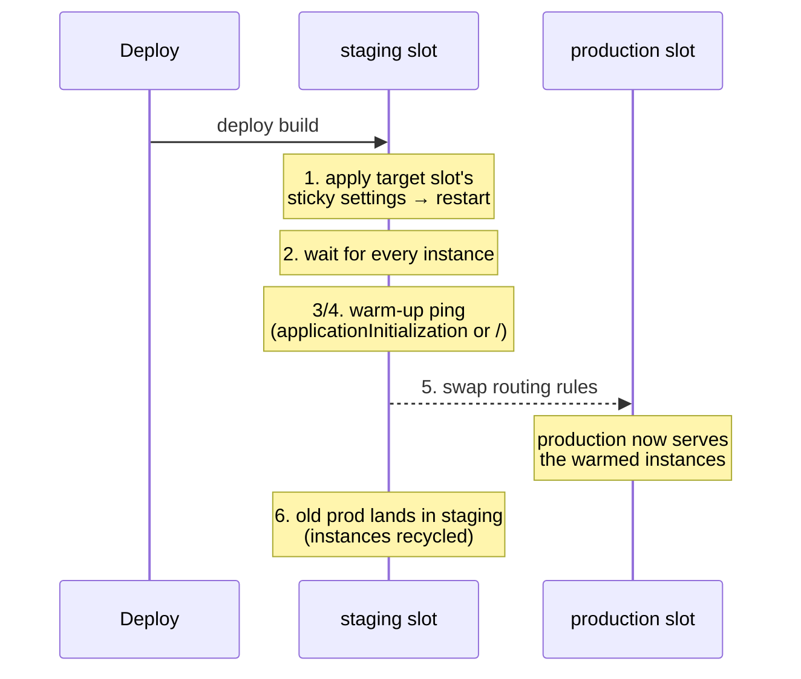

# 03 — App Service

> **Scope:** the PaaS host most .NET web APIs land on. Plans, scaling, the swap mechanics
> interviewers dig into, configuration precedence, networking and diagnostics — with the `az`
> commands to do it.
> Related: [Containers & AKS](05-containers-and-aks.md) · [Azure Functions](04-azure-functions.md).

---

## The model in one paragraph

An **App Service plan** is a set of VMs in one region running one OS. An **app** (web app, API app,
function app on a Dedicated plan) runs *on every VM in its plan*. Several apps in one plan share
those VMs — and therefore share the CPU, the memory and each other's bad days. **Slots also run on
the same VMs**, which is why a staging slot on a B1 plan competes with production for resources.

## Tiers — what each one actually buys

| Category | Tiers | Unlocks |
| --- | --- | --- |
| **Shared compute** | Free (F1), Shared (D1) | Nothing serious — shared VMs, CPU quotas, **no scale-out**, no custom domain on Free |
| **Dedicated compute** | Basic (B1–B3) | Dedicated VMs, custom domains + TLS, manual scale-out. **No slots, no autoscale** |
| | Standard (S1–S3) | **Autoscale**, **5 deployment slots**, daily backups, Traffic Manager |
| | Premium v3 / v4 (P0v3…P5v4) | Faster VMs, more memory, **20 slots**, higher scale, zone redundancy, reserved-instance pricing |
| **Isolated** | IsolatedV2 (I1v2…) | App Service Environment — dedicated VMs **in your own VNet**, compute *and* network isolation |

The slot counts and instance limits are the numbers people get wrong: **Basic has no slots**, Standard
five, Premium/Isolated twenty. Always sanity-check the current limits page before quoting.

## Scale up vs scale out

| | Scale **up** | Scale **out** |
| --- | --- | --- |
| Changes | The tier / VM size | The **number** of instances |
| Gets you | More CPU/RAM per instance, plus tier *features* (slots, autoscale) | More throughput, HA |
| Ceiling | The biggest SKU | The tier's instance limit |

Two scale-out mechanisms:

- **Autoscale rules** (Standard+) — metric-based, e.g. scale out by 1 when average CPU > 70% for
  10 minutes, in by 1 below 30%. Always set a **different threshold for in and out** (a gap) or the
  plan flaps. Rules also do schedule-based profiles ("6 instances 09:00–18:00 on weekdays").
- **Automatic scaling** (Premium v2/v3) — you set a maximum burst, the platform decides, per-app.

> **Interview trap:** "the app is slow, scale it out" is wrong when the bottleneck is a single
> downstream database or a lock. Scale-out multiplies the pressure on the shared dependency.

## Deployment slots — the part they actually probe

A slot is a **live app with its own hostname** sharing the plan's VMs. The point is a swap with no
downtime and an instant rollback.



**What a swap does, in order:** the *target's* slot-specific settings are applied to the source slot,
which **restarts every instance**; the platform waits for the restarts, warms each instance with an
HTTP ping, and only then flips the routing. All the risky work happens on the source slot — the
target stays online whether the swap succeeds or fails. That is why **production must be the target**.

### Swapped vs slot-specific (sticky)

| Swapped with the content | Stays with the slot |
| --- | --- |
| Language/framework version, 32/64-bit, WebSockets | Publishing endpoints, custom domain names |
| **App settings** and connection strings (unless marked sticky) | Non-public certificates and TLS/SSL settings, HTTPS-only |
| Handler mappings, path mappings, public certificates | Scale settings, Always On |
| WebJobs content, hybrid connections, service endpoints, CDN | IP restrictions, CORS, diagnostic log settings |
| | **Managed identities**, VNet integration, `*_EXTENSION_VERSION` |

Mark a setting sticky so each slot keeps its own value:

```bash
az webapp config appsettings set -g $RG -n $APP --slot staging \
  --settings ASPNETCORE_ENVIRONMENT=Staging --slot-settings ASPNETCORE_ENVIRONMENT
```

### Warm-up, preview and rollback

```bash
# ping a cheap health endpoint instead of "/" and only accept a real 200
az webapp config appsettings set -g $RG -n $APP --slot staging --settings \
  WEBSITE_SWAP_WARMUP_PING_PATH=/health \
  WEBSITE_SWAP_WARMUP_PING_STATUSES=200

az webapp deployment slot swap -g $RG -n $APP --slot staging --target-slot production --action preview  # phase 1
az webapp deployment slot swap -g $RG -n $APP --slot staging --target-slot production --action swap     # complete
az webapp deployment slot swap -g $RG -n $APP --slot staging --target-slot production --action reset    # cancel
```

- **Swap with preview** pauses after phase 1 so you can hit the staging hostname *with production
  settings applied* before flipping. Not available when App Service authentication is on.
- **Rollback** = swap the same two slots again. The previous production build is sitting in staging.
- **Auto swap** deploys → warms → swaps automatically. **Not supported on Linux or containers.**
- **Traffic routing** sends a percentage to a slot for canary testing; the client is pinned by the
  `x-ms-routing-name` cookie, and `?x-ms-routing-name=self` sends a user back to production.
- Long-running work is **abandoned when the old instances recycle** — make handlers idempotent and
  short, or move the work to a queue.

## Deploying a .NET app

| Method | When |
| --- | --- |
| **Zip deploy / `az webapp deploy`** | The default for CI; posts a zip to the Kudu endpoint |
| **Run from package** (`WEBSITE_RUN_FROM_PACKAGE=1`) | Read-only, atomic, faster cold start — the recommended production shape |
| **Container** (`az webapp create --deployment-container-image-name`) | You own the image and its dependencies |
| **GitHub Actions / Azure Pipelines** | With OIDC federated credentials, so no publish profile secret |
| Local Git, FTPS | Legacy; FTPS should be disabled |

```bash
dotnet publish -c Release -o ./publish
cd publish && zip -r ../app.zip . && cd ..
az webapp deploy -g $RG -n $APP --slot staging --src-path app.zip --type zip
```

## Configuration — app settings *are* your configuration provider

App settings surface as **environment variables**, and ASP.NET Core's environment-variable provider
sits above `appsettings.json`, so a setting in the portal overrides the file with no code change.
Nested keys use a **double underscore**:

```text
appsettings.json:  { "Storage": { "BlobUri": "..." } }
App Service:       Storage__BlobUri = https://st....blob.core.windows.net
```

```csharp
// nothing Azure-specific in the app; it is just IConfiguration
builder.Services.Configure<StorageOptions>(builder.Configuration.GetSection("Storage"));
```

Secrets belong in Key Vault, referenced from an app setting so the value never exists in ARM:

```text
@Microsoft.KeyVault(SecretUri=https://kv-shop.vault.azure.net/secrets/Db-Password/)
```

The app's managed identity needs `Key Vault Secrets User`. **Key Vault references resolve at app
start and on config change** — a rotated secret needs a restart (or a `Modify`-style refresh), which
is exactly why `App Configuration` + sentinel keys exist ([chapter 09](09-secrets-and-configuration.md)).

## Networking

| Need | Feature | Direction |
| --- | --- | --- |
| App reaches a private database/VNet resource | **Regional VNet integration** | **outbound** |
| Only the VNet may reach the app | **Private endpoint** | **inbound** |
| Allow-list caller IPs / service tags | **Access restrictions** | inbound |
| Reach one on-prem TCP host without a VPN | **Hybrid Connections** | outbound (Windows) |

VNet integration and private endpoints are complementary, not alternatives — a private API typically
uses both. Neither is available on Free/Shared, and Basic is limited.

## Diagnostics

```bash
az webapp log config -g $RG -n $APP --application-logging filesystem --level information
az webapp log tail   -g $RG -n $APP          # live stream
az webapp show       -g $RG -n $APP --query state
```

- **Health check** (`/health`) removes an unhealthy instance from the load balancer instead of
  serving 500s — set it, and make the endpoint cheap and dependency-aware.
- **Kudu / SCM** (`https://<app>.scm.azurewebsites.net`) is the deployment engine: file browser,
  environment, process explorer, log files. Lock it down; it is a real attack surface.
- **Always On** (Basic+) stops the app being unloaded after 20 idle minutes — mandatory for
  background work and for warm cold-start behaviour.
- **App Service authentication ("Easy Auth")** does OIDC in the platform before your code runs and
  injects `X-MS-CLIENT-PRINCIPAL*` headers — useful for zero-code protection, but it is not a
  substitute for validating tokens when the API is also called machine-to-machine.

## Hands-on — deploy, slot, swap, roll back

```bash
RG=rg-shop-dev; APP=shop-dev-api; PLAN=plan-shop-dev

az appservice plan create -g $RG -n $PLAN --is-linux --sku S1
az webapp create -g $RG -p $PLAN -n $APP --runtime "DOTNETCORE:10.0"
az webapp config set -g $RG -n $APP --http20-enabled true --ftps-state Disabled \
  --min-tls-version 1.2 --health-check-path /health
az webapp update -g $RG -n $APP --https-only true

# a staging slot that clones production's configuration
az webapp deployment slot create -g $RG -n $APP --slot staging --configuration-source $APP

# deploy the new build to staging only
az webapp deploy -g $RG -n $APP --slot staging --src-path app.zip --type zip
curl -sf "https://$APP-staging.azurewebsites.net/health"

# go live, then roll back if the smoke test fails
az webapp deployment slot swap -g $RG -n $APP --slot staging --target-slot production
curl -sf "https://$APP.azurewebsites.net/health" \
  || az webapp deployment slot swap -g $RG -n $APP --slot staging --target-slot production
```

## Rapid-fire Q&A

**Q: What exactly happens during a slot swap?**
The target slot's sticky settings are applied to the source slot, every source instance restarts, the
platform warms each instance with an HTTP ping, then routing is switched. All preparation happens on
the source slot, so the target never goes down — which is why production is always the *target*.

**Q: Why did my connection string change after a swap?**
Because app settings and connection strings are swapped **with the content** by default. Mark them
`--slot-settings` to pin them to a slot.

**Q: Which settings never swap?**
Slot-specific ones: publishing endpoints, custom domains, TLS/SSL and HTTPS-only, scale settings,
Always On, IP restrictions, CORS, diagnostics, **managed identities** and VNet integration.

**Q: Scale up or scale out for a CPU-bound API under load?**
Out, if the work is parallelisable and the downstream can take it. Up, if a single request needs more
CPU/RAM than the SKU has, or you need a tier feature. Neither, if the bottleneck is a shared
dependency — fix that first.

**Q: How do you get zero-downtime deploys without slots?**
You mostly don't on App Service. The alternatives are a container platform with rolling updates
(Container Apps revisions, AKS deployments) or Front Door/Traffic Manager weighting across two apps.

**Q: How does the app read a secret without storing it?**
Key Vault reference in an app setting, resolved by the platform using the app's managed identity
(`Key Vault Secrets User`). The secret value never appears in ARM, source control or the portal.

**Q: VNet integration or private endpoint?**
VNet integration is for the app's **outbound** calls into a private network. A private endpoint gives
the app a private **inbound** IP. A locked-down API uses both.

**Q: Why is my app cold after 20 minutes of no traffic?**
Always On is off (or you are on Free/Shared, where it does not exist). Turn it on — and remember it is
a slot-specific setting, so it must be set on every slot.

---

**Prev:** [02 — Entra ID & Managed Identity](02-identity-and-managed-identity.md) ·
**Next:** [04 — Azure Functions](04-azure-functions.md) ·
**Up:** [Azure track hub](readme.md)
