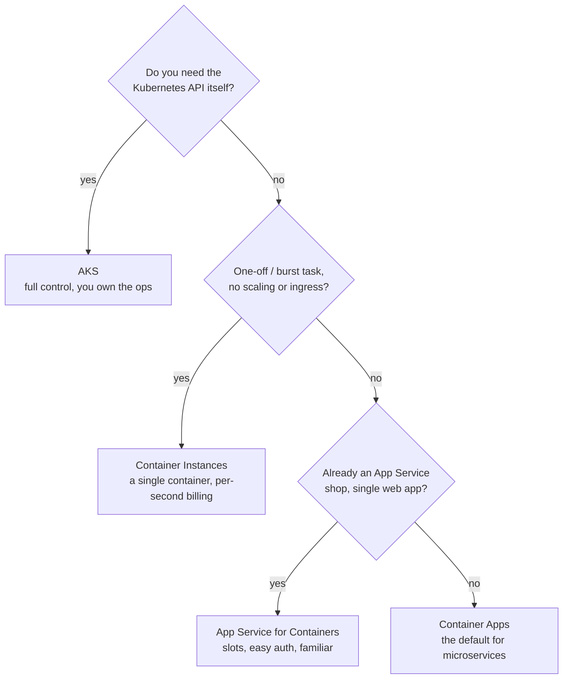

# 05 — Containers, ACR, Container Apps & AKS

> **Scope:** the container half of "develop Azure compute solutions" — building and storing images,
> the four places to run them, and the one you should reach for by default.
> Deep dives already on this blog: [Docker](../../Containerization/Docker/docker.md) ·
> [Kubernetes](../../Containerization/K8/k8.md) · [AKS clusters](../../Containerization/K8/Azure/cluster.azure.k8.md).

---

## Choosing the host



| | **Container Instances (ACI)** | **App Service (containers)** | **Container Apps (ACA)** | **AKS** |
| --- | --- | --- | --- | --- |
| Abstraction | One container | One web app | Serverless containers on managed K8s | Kubernetes |
| Scale to zero | n/a (you start/stop it) | ❌ | ✅ | ❌ (nodes) / with KEDA on pods |
| Event-driven scale | ❌ | ❌ | ✅ **KEDA** | ✅ with KEDA installed |
| Ingress + TLS | ❌ build it yourself | ✅ | ✅ built in, free certs | ✅ via ingress controller |
| Revisions / traffic split | ❌ | slots | ✅ **revisions, % traffic** | Deployments + service mesh |
| Service discovery | ❌ | ❌ | ✅ by app name | ✅ |
| You manage | nothing | nothing | nothing | **cluster, nodes, upgrades, CNI, RBAC…** |
| Reach for it when | Burst jobs, build agents, sidecar-free tasks | A single containerised web app in an existing plan | Microservices, event-driven workers, APIs | You need CRDs, operators, node-level control or a portable K8s estate |

**The answer interviewers want:** start at Container Apps; move to AKS only when you can name the
Kubernetes feature you need. "We might need Kubernetes one day" is not a reason to take on cluster
operations.

## A production .NET container image

```dockerfile
# syntax=docker/dockerfile:1
FROM mcr.microsoft.com/dotnet/sdk:10.0 AS build
WORKDIR /src
COPY ["Shop.Api/Shop.Api.csproj", "Shop.Api/"]
RUN dotnet restore "Shop.Api/Shop.Api.csproj"          # cached layer: restore before the source copy
COPY . .
RUN dotnet publish "Shop.Api/Shop.Api.csproj" -c Release -o /app/publish --no-restore

FROM mcr.microsoft.com/dotnet/aspnet:10.0 AS final
WORKDIR /app
COPY --from=build /app/publish .
USER $APP_UID                                          # non-root by default in the MS images
ENV ASPNETCORE_HTTP_PORTS=8080
EXPOSE 8080
ENTRYPOINT ["dotnet", "Shop.Api.dll"]
```

Points that earn marks: **multi-stage** (SDK never ships), **restore before copy** so the layer
caches, **non-root user**, `aspnet` runtime image not `sdk`, and a **digest-pinned or tag-pinned**
base. `-chiseled` and `-alpine` variants cut the image further; `dotnet publish /t:PublishContainer`
builds an image with no Dockerfile at all.

## Azure Container Registry (ACR)

| Tier | Notable |
| --- | --- |
| Basic | Dev/test, smallest included storage |
| Standard | Most production workloads |
| Premium | Geo-replication, private endpoints, content trust, larger throughput |

```bash
ACR=acrshopdev; RG=rg-shop-dev

az acr create -g $RG -n $ACR --sku Standard
az acr build -r $ACR -t shop-api:$GIT_SHA -t shop-api:latest .   # builds *in Azure*, no local Docker
az acr repository show-tags -n $ACR --repository shop-api -o table
az acr run --registry $ACR --cmd "mcr.microsoft.com/hello-world" /dev/null
```

- **ACR Tasks** (`az acr build`, task triggers) build in the cloud and can **auto-rebuild on a base
  image update** — that is how you patch a CVE in `aspnet:10.0` across every image.
- **Authenticate with a managed identity, not the admin user.** The admin account is a shared
  username/password and should stay disabled:

```bash
az acr update -n $ACR --admin-enabled false
ID=$(az containerapp show -g $RG -n shop-api --query identity.principalId -o tsv)
az role assignment create --assignee-object-id $ID --assignee-principal-type ServicePrincipal \
  --role AcrPull --scope $(az acr show -n $ACR --query id -o tsv)
```

## Azure Container Apps

Managed Kubernetes you never see: an **environment** (the boundary — shared VNet, Log Analytics
workspace, Dapr) holding **container apps**, each made of immutable **revisions**.

| Concept | What it does |
| --- | --- |
| **Environment** | Network + logging boundary; apps in one environment reach each other by name |
| **Revision** | An immutable snapshot of the app; a config or image change creates a new one |
| **Revision mode** | *Single* (new revision takes all traffic) or *Multiple* (**split traffic %** — blue/green and canary) |
| **Ingress** | External or internal, HTTPS terminated for you, `targetPort` into the container |
| **Scale rules** | **KEDA** — HTTP concurrency, CPU/memory, or any KEDA scaler (Service Bus, Event Hubs, Kafka, Redis, Cron) |
| **Secrets** | Referenced as `secretref:` in env vars, or pulled from Key Vault with a managed identity |
| **Dapr** | Optional sidecar: pub/sub, state, bindings, service invocation |
| **Jobs** | Run-to-completion workloads (scheduled, event-driven, manual) |

```bash
# an API that scales on HTTP concurrency, 0 -> 10
az containerapp create -g $RG -n shop-api --environment env-shop \
  --image $ACR.azurecr.io/shop-api:$GIT_SHA --registry-server $ACR.azurecr.io \
  --target-port 8080 --ingress external \
  --min-replicas 0 --max-replicas 10 \
  --scale-rule-name http-rule --scale-rule-type http --scale-rule-http-concurrency 50 \
  --system-assigned

# a worker that scales on Service Bus queue depth — the classic KEDA scaler
az containerapp create -g $RG -n order-worker --environment env-shop \
  --image $ACR.azurecr.io/order-worker:$GIT_SHA \
  --min-replicas 0 --max-replicas 30 \
  --scale-rule-name sb-rule --scale-rule-type azure-servicebus \
  --scale-rule-metadata queueName=orders namespace=sb-shop-dev messageCount=20 \
  --scale-rule-auth "connection=service-bus-connection"

# canary: 90% of traffic on the old revision, 10% on the new one
az containerapp revision set-mode -g $RG -n shop-api --mode multiple
az containerapp ingress traffic set -g $RG -n shop-api \
  --revision-weight shop-api--v1=90 shop-api--v2=10
```

**Scale-to-zero caveats:** with `--min-replicas 0` an idle app has a cold start, background timers
stop, and in-memory caches die. A worker that must always drain a queue needs `min-replicas 1` or a
KEDA rule that wakes it.

## AKS — what a developer is expected to know

You are not being asked to run a cluster, but to be fluent at the edge of one:

- **Deployment + Service + Ingress**, `kubectl apply -f`, `kubectl logs`, `kubectl describe`,
  `kubectl get events` — the four commands that debug 90% of "my pod won't start".
- **Requests and limits**, liveness/readiness/startup probes, `HorizontalPodAutoscaler`.
- **Workload identity** — the modern way a pod gets an Entra ID token (federated credential on a
  service account); it replaces the retired pod-managed identity.
- **Secrets** via the Key Vault CSI driver, not `Secret` objects checked into Git.
- **Managed add-ons** you get on Azure: Azure CNI, Application Gateway ingress, Azure Monitor
  container insights, KEDA, Dapr, cluster autoscaler + node autoprovisioning.

```bash
az aks get-credentials -g $RG -n aks-shop            # merges into ~/.kube/config
kubectl get pods -n shop -o wide
kubectl logs deploy/shop-api -n shop --tail=100 -f
kubectl describe pod <pod> -n shop                   # events explain ImagePullBackOff / CrashLoopBackOff
```

## Rapid-fire Q&A

**Q: Container Apps or AKS?**
Container Apps unless you need the Kubernetes API — CRDs, operators, custom schedulers, node-level
control, or an existing portable K8s estate. ACA gives you revisions, KEDA, ingress, service discovery
and Dapr with zero cluster operations; AKS gives you everything and the pager.

**Q: When is ACI the right answer?**
A single container with a defined start and end and no need for scaling, ingress or discovery — a
batch job, a build agent, a burst offload from AKS via virtual nodes.

**Q: What is a revision?**
An immutable snapshot of a Container App's image + configuration. In multiple-revision mode you can
run several at once and split traffic by percentage — that is blue/green and canary without a mesh.

**Q: How does a Container App scale on a queue?**
A KEDA scaler: it reads the queue depth and computes the replica count, down to zero. `messageCount`
is messages *per replica*, so 100 pending with `messageCount=20` targets 5 replicas.

**Q: How should a container authenticate to ACR?**
The workload's managed identity with the `AcrPull` role. Disable the registry admin account — it is a
shared static credential.

**Q: Why multi-stage builds?**
So the shipped image contains the runtime and your publish output only — no SDK, no source, no NuGet
cache. Smaller image, faster pulls, far smaller attack surface.

**Q: Image tagged `:latest` in production — what's wrong?**
It is mutable and unresolvable: you cannot tell what is running or roll back to a known build. Tag
with the commit SHA (or digest-pin) and let `latest` be a convenience alias only.

**Q: How does a pod get an Azure token on AKS?**
Workload identity: a Kubernetes service account is federated to an Entra ID app/user-assigned identity,
the pod gets a projected token, and `WorkloadIdentityCredential` exchanges it. No secrets, no
pod-managed identity (retired).

---

**Prev:** [04 — Azure Functions](04-azure-functions.md) ·
**Next:** [06 — Blob Storage](06-blob-storage.md) ·
**Up:** [Azure track hub](readme.md)
