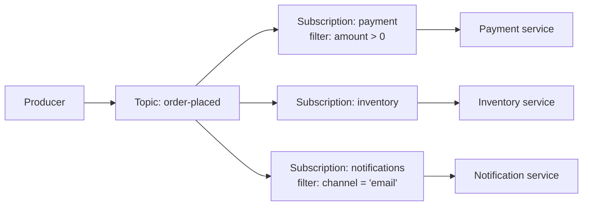
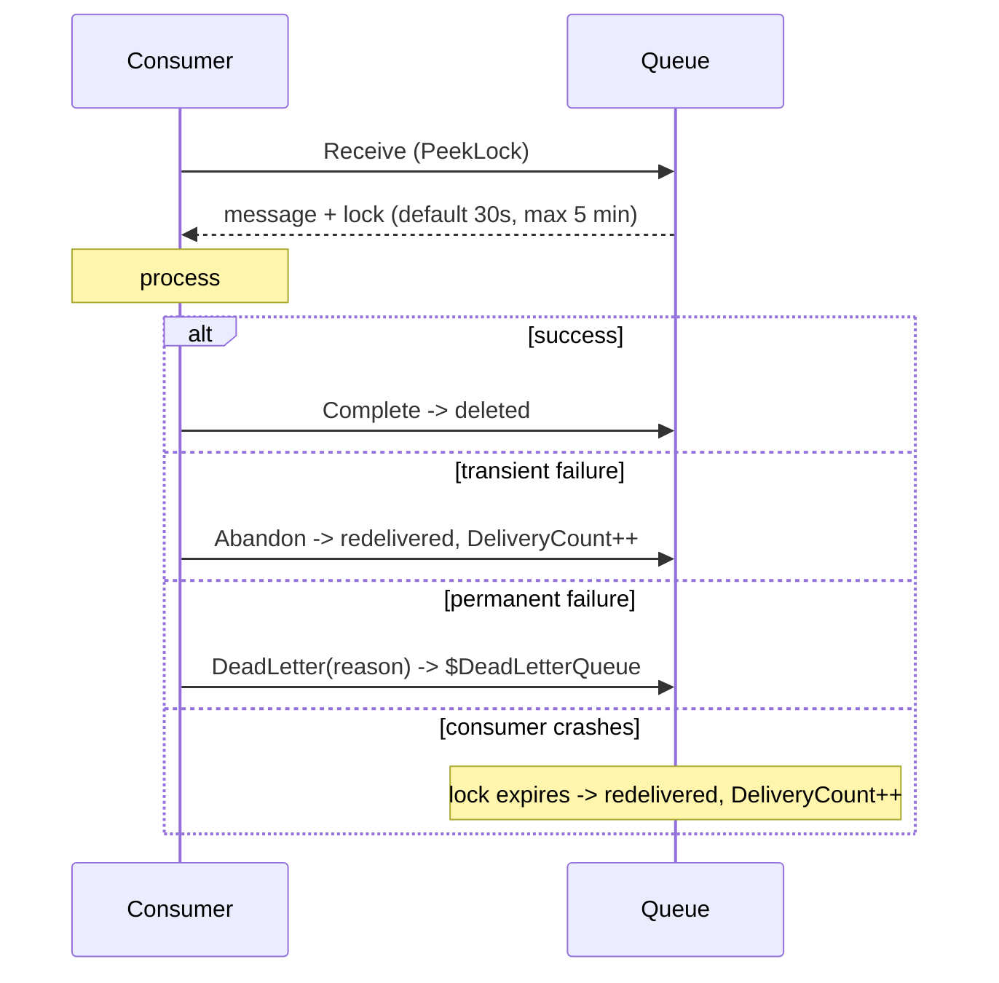

# 08 — Messaging & Events

> **Scope:** the four Azure messaging services, the decision between them, and the delivery semantics
> that turn "it works" into "it works when a consumer crashes mid-message".
> Related: [Messaging & eventing patterns](../Architecture/09-messaging-and-eventing.md) ·
> [Service Bus notes](../../Azure/Azure-service-bus.md).

---

## Message vs event — the framing

- A **message** carries data the sender expects someone to *process*. The sender cares about the
  outcome. Losing it is a bug. → **Service Bus**, **Storage Queues**.
- An **event** is a lightweight notification that *something happened*. The publisher does not care
  who listens. → **Event Grid** (discrete reactions), **Event Hubs** (high-volume streams).

## Choosing

| | **Storage Queue** | **Service Bus** | **Event Grid** | **Event Hubs** |
| --- | --- | --- | --- | --- |
| Model | Simple queue | Enterprise broker: queues + topics | Pub/sub event routing | Streaming ingestion |
| Ordering | ❌ best-effort | ✅ FIFO **with sessions** | ❌ | ✅ per partition |
| Delivery | at-least-once | at-least-once (peek-lock) | at-least-once | at-least-once, **replayable** |
| Max size | 64 KB | 256 KB (Standard) / 100 MB (Premium) | ~1 MB | ~1 MB |
| Scale point | 500 TB queue | Throughput per namespace | Millions of events/s | **Millions of events/s** |
| Killer feature | Cheap, dead simple, huge backlog | DLQ, sessions, dedup, transactions, scheduled, topics+filters | Reactive glue between Azure services + CloudEvents/MQTT | Retention + replay + consumer groups + Capture |
| Consumer reads | destructive | lock-then-complete | **push** (webhook/handler) | **pull by offset**, own the checkpoint |
| Reach for it when | You need a work queue and nothing else | Business transactions, ordering, once-only handling | "When X happens, run Y" | Telemetry, clickstream, IoT, anything you may want to replay |

> **The one-liner:** Storage Queue = a to-do list. Service Bus = a to-do list with a supervisor.
> Event Grid = a doorbell. Event Hubs = a tape recorder.

A real system uses several: Service Bus for order processing, Event Hubs for site telemetry, Event
Grid to react to a blob landing.

## Service Bus

### Queues, topics and subscriptions



A **topic** is a queue with a fan-out: each **subscription** gets its own copy and its own DLQ.
Subscriptions filter with **SQL filters** (`sys.Label = 'vip' AND amount > 100`), **correlation
filters** (cheaper — equality on system/user properties) or a true filter (everything).

### Peek-lock — the delivery model to explain



- **`ReceiveAndDelete`** is at-most-once — one crash and the message is gone. Use `PeekLock` unless
  you genuinely do not care about the message.
- When `DeliveryCount` exceeds **`MaxDeliveryCount` (default 10)** the message moves to the
  **dead-letter queue** — a real sub-queue you can read, fix and resubmit. Messages also dead-letter
  on TTL expiry, subscription filter evaluation errors, and explicit `DeadLetterMessageAsync`.
- Long work: **renew the lock** (`maxAutoLockRenewalDuration` in the processor) rather than raising
  the lock duration for everyone.

### The features that only Service Bus has

| Feature | What it does | Interview note |
| --- | --- | --- |
| **Sessions** | FIFO + exclusive processing for all messages sharing a `SessionId` | The *only* real ordering guarantee; one consumer per session at a time |
| **Duplicate detection** | Discards a repeat `MessageId` inside a window (default 30 s, up to 7 days) | Protects against duplicate **sends**, not duplicate **processing** |
| **Scheduled messages** | Deliver at a future time (`ScheduledEnqueueTime`) | Delays, retries with back-off, reminders |
| **Deferral** | Park a message by sequence number for later | Out-of-order dependencies |
| **Transactions** | Send + complete atomically within a namespace | Enables the "process and forward" pattern |
| **Geo-DR + geo-replication** | Premium tier only | Standard has no cross-region story |
| **Auto-forward** | Chain a queue/subscription into another entity | Fan-in without a consumer |

**Tiers:** Basic (queues only), Standard (topics, shared capacity, pay-per-operation),
**Premium** (dedicated messaging units, predictable latency, 100 MB messages, VNet/private endpoints,
geo-replication). Sessions and dedup are Standard+.

```csharp
// Program.cs — identity-based, one client per namespace
builder.Services.AddAzureClients(clients =>
{
    clients.AddServiceBusClientWithNamespace(config["ServiceBus:Namespace"]);   // sb-shop.servicebus.windows.net
    clients.UseCredential(new ManagedIdentityCredential());
});
```

```csharp
// Sender — MessageId is your idempotency key
await sender.SendMessageAsync(new ServiceBusMessage(BinaryData.FromObjectAsJson(order))
{
    MessageId     = order.Id,                 // duplicate detection keys on this
    SessionId     = order.CustomerId,         // FIFO per customer
    Subject       = "order-placed",           // == Label, filterable
    ContentType   = "application/json",
    CorrelationId = activity.Id,
    TimeToLive    = TimeSpan.FromHours(12)
}, ct);
```

```csharp
// Receiver — ServiceBusProcessor: concurrency, auto lock renewal, event-based handlers
var processor = client.CreateProcessor("orders", new ServiceBusProcessorOptions
{
    MaxConcurrentCalls           = 16,
    AutoCompleteMessages         = false,               // complete explicitly, after the work succeeds
    MaxAutoLockRenewalDuration   = TimeSpan.FromMinutes(5),
    PrefetchCount                = 0
});

processor.ProcessMessageAsync += async args =>
{
    var order = args.Message.Body.ToObjectFromJson<Order>();
    try
    {
        await handler.HandleAsync(order, args.CancellationToken);        // must be idempotent
        await args.CompleteMessageAsync(args.Message, args.CancellationToken);
    }
    catch (ValidationException ex)                                       // will never succeed -> DLQ now
    {
        await args.DeadLetterMessageAsync(args.Message, "InvalidPayload", ex.Message, args.CancellationToken);
    }
    catch (Exception)                                                    // transient -> let it retry
    {
        await args.AbandonMessageAsync(args.Message, cancellationToken: args.CancellationToken);
        throw;
    }
};

processor.ProcessErrorAsync += args => { logger.LogError(args.Exception, "SB error in {Source}", args.ErrorSource); return Task.CompletedTask; };
await processor.StartProcessingAsync(ct);
```

## Storage Queues

Everything Service Bus is not: no topics, no sessions, no DLQ, no transactions, 64 KB messages —
and correspondingly cheap, with a queue that can hold 500 TB.

```csharp
var queue = new QueueClient(new Uri($"https://{account}.queue.core.windows.net/thumbnails"), credential);

await queue.SendMessageAsync(BinaryData.FromObjectAsJson(job), visibilityTimeout: TimeSpan.FromSeconds(0), ct);

foreach (var msg in (await queue.ReceiveMessagesAsync(maxMessages: 16, TimeSpan.FromMinutes(1), ct)).Value)
{
    await Process(msg.Body, ct);
    await queue.DeleteMessageAsync(msg.MessageId, msg.PopReceipt, ct);   // the "complete"
}
```

The **visibility timeout + pop receipt** pair is the Storage Queue version of peek-lock: the message
is hidden, not removed, until you delete it. `DequeueCount` is your poison-message signal — there is
no automatic DLQ, so route it to a `-poison` queue yourself (the Functions queue trigger does this
for you after `maxDequeueCount`, default 5).

## Event Grid

Push-based routing of discrete events, with retries and dead-lettering built in.

- **Topic** (custom, system, partner) → **event subscription** → **handler** (Function, webhook,
  Service Bus, Event Hubs, Storage Queue, Container App…).
- **Filtering** on event type, subject prefix/suffix, or advanced property filters — so a handler only
  gets what it asked for.
- **Retries**: exponential back-off for up to **24 hours** by default, then **dead-letter to a
  storage container** if you configured one. Configure it — otherwise failures vanish.
- **Schemas**: Event Grid schema or **CloudEvents 1.0** (the interoperable choice). Namespaces also
  support **MQTT** and pull delivery.
- **Webhook handshake**: a new webhook subscription must echo the validation code (or use a
  `Microsoft.EventGrid`-aware handler) — otherwise the subscription never activates.

```csharp
// Publishing a custom event
await new EventGridPublisherClient(new Uri(topicEndpoint), credential)
    .SendEventAsync(new EventGridEvent(
        subject:   $"orders/{order.Id}",
        eventType: "Shop.Order.Placed",
        dataVersion: "1.0",
        data: new { order.Id, order.CustomerId, order.Total }), ct);
```

```csharp
// Handling one in an isolated-worker Function
[Function(nameof(OnOrderPlaced))]
public Task OnOrderPlaced([EventGridTrigger] CloudEvent cloudEvent, CancellationToken ct)
    => notifier.SendAsync(cloudEvent.Data!.ToObjectFromJson<OrderPlaced>(), ct);
```

**Keep events thin.** Publish the id and enough to route (`OrderPlaced { id, customerId }`), and let
the handler fetch the current state — a fat event is a stale event, and it leaks your schema.

## Event Hubs

A partitioned, append-only log with retention — Kafka-shaped, and it speaks the Kafka protocol.

| Concept | Meaning |
| --- | --- |
| **Partition** | The unit of parallelism and of ordering. Fixed at creation on most tiers — choose ≥ your peak consumer count |
| **Partition key** | Hashes to a partition; same key ⇒ same partition ⇒ ordered |
| **Consumer group** | An independent view of the stream with its own offsets — one per downstream system |
| **Offset / checkpoint** | Your position, stored by you (in blob storage) — this is why replay is possible |
| **Throughput unit / processing unit** | The capacity you buy (1 TU ≈ 1 MB/s or 1000 events/s in) |
| **Capture** | Automatic write-through to Blob/Data Lake in Avro — free archival |

```csharp
// Producer — batch, and use a key when ordering matters
using var batch = await producer.CreateBatchAsync(new CreateBatchOptions { PartitionKey = deviceId }, ct);
foreach (var reading in readings)
    if (!batch.TryAdd(new EventData(BinaryData.FromObjectAsJson(reading)))) break;
await producer.SendAsync(batch, ct);
```

```csharp
// Consumer — EventProcessorClient owns partition leases and checkpoints in blob storage
var processor = new EventProcessorClient(
    new BlobContainerClient(new Uri(checkpointContainerUri), credential),
    consumerGroup: "projections",
    fullyQualifiedNamespace: ns, eventHubName: "telemetry", credential);

processor.ProcessEventAsync += async args =>
{
    await sink.WriteAsync(args.Data.EventBody, args.CancellationToken);
    await args.UpdateCheckpointAsync(args.CancellationToken);   // checkpoint *periodically*, not per event
};
```

**Checkpointing is a trade-off:** checkpoint every event and you pay a storage write per event;
checkpoint rarely and a crash replays more. Batch it (every N events or T seconds) and make the
consumer idempotent.

## Delivery semantics and idempotency

Everything here is **at-least-once**. Exactly-once *delivery* does not exist across a network; what
you build is exactly-once **effect**:

1. **Deduplicate on a business key** — write with `IfNoneMatch`/a unique index on `MessageId`, or keep
   a processed-ids table with a TTL.
2. **Make the operation naturally idempotent** — `SET status = 'paid'` instead of `balance -= 10`.
3. **Transactional outbox** for the dual-write problem: write the business row and the outbox row in
   one database transaction, then a relay publishes the outbox. Never "save then publish" — the
   process can die between the two.
4. **Poison handling**: DLQ + an alert on DLQ depth, and a documented replay path. A DLQ nobody looks
   at is a data-loss queue.

## Hands-on

```bash
RG=rg-shop-dev; NS=sb-shop-dev$RANDOM

az servicebus namespace create -g $RG -n $NS --sku Standard
az servicebus queue create -g $RG --namespace-name $NS -n orders \
  --max-delivery-count 5 --lock-duration PT1M --enable-session true \
  --default-message-time-to-live P1D --enable-dead-lettering-on-message-expiration true

az servicebus topic create -g $RG --namespace-name $NS -n order-placed
az servicebus topic subscription create -g $RG --namespace-name $NS --topic-name order-placed -n payment
az servicebus topic subscription rule create -g $RG --namespace-name $NS --topic-name order-placed \
  --subscription-name payment -n vip-only --filter-sql-expression "amount > 100"

# identity instead of a connection string
APPID=$(az containerapp show -g $RG -n order-worker --query identity.principalId -o tsv)
az role assignment create --assignee-object-id $APPID --assignee-principal-type ServicePrincipal \
  --role "Azure Service Bus Data Receiver" \
  --scope $(az servicebus namespace show -g $RG -n $NS --query id -o tsv)

# how deep is the dead-letter queue? (the metric you alert on)
az servicebus queue show -g $RG --namespace-name $NS -n orders \
  --query countDetails.deadLetterMessageCount
```

## Rapid-fire Q&A

**Q: Storage Queue or Service Bus?**
Storage Queue for a simple, cheap, enormous work queue. Service Bus the moment you need topics,
ordering, dead-lettering, duplicate detection, transactions or scheduled delivery — i.e. for business
transactions.

**Q: Event Grid or Service Bus for "order placed"?**
Both, for different consumers. Service Bus when a specific service must reliably *process* the order
(retries, DLQ, ordering). Event Grid when arbitrary subscribers want to *react* and you don't want the
publisher to know about them.

**Q: Event Hubs or Service Bus?**
Event Hubs for high-volume streams you may want to replay and read from several independent consumer
groups. Service Bus for discrete messages with per-message lifecycle — locks, DLQ, ordering, dedup.

**Q: How does peek-lock work, and what happens if the consumer dies?**
Receive takes a time-limited lock instead of deleting; you `Complete`, `Abandon` or `DeadLetter`. If
the consumer dies the lock expires, `DeliveryCount` increments and the message is redelivered — and
after `MaxDeliveryCount` (default 10) it dead-letters.

**Q: How do you guarantee FIFO?**
Sessions on Service Bus (all messages with the same `SessionId` go to one consumer, in order), or a
partition key on Event Hubs. Plain queues with competing consumers are not ordered — a retry alone
breaks the order.

**Q: Does duplicate detection give exactly-once?**
No. It stops the *broker* accepting the same `MessageId` twice within a window. Redelivery after a
lock expiry still happens, so the **handler must be idempotent**.

**Q: Why is a message in the dead-letter queue?**
Delivery count exceeded, TTL expired, a subscription filter threw, the message was too large for the
forward target, or the app dead-lettered it explicitly. The `DeadLetterReason` property says which.

**Q: What is the dual-write problem and how do you fix it?**
Writing to a database and publishing a message are two systems and cannot be atomic. Use the
transactional outbox: commit the message row with the business change, then relay it — combined with
an idempotent consumer.

**Q: How many Event Hubs partitions?**
At least as many as your peak concurrent consumers in a group, since a partition is read by one
consumer at a time; enough that a single partition's throughput isn't the ceiling; and remembering the
count is fixed at creation on most tiers.

---

**Prev:** [07 — Cosmos DB](07-cosmos-db.md) ·
**Next:** [09 — Secrets & Configuration](09-secrets-and-configuration.md) ·
**Up:** [Azure track hub](readme.md)
