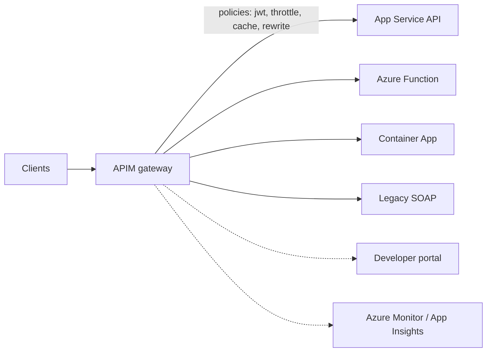

# 10 — API Management

> **Scope:** the gateway layer — what APIM is for, the object model, the policy pipeline and the
> policies you should be able to write from memory.
> Related: [REST & API design](../Architecture/08-rest-and-api-design.md) ·
> [API security](../Architecture/11-api-security.md) · [API reference](../../API/API.md).

---

## What it is for

APIM is a **reverse proxy with a policy engine**, plus a developer portal and analytics. It exists so
cross-cutting concerns live in one place instead of in every service:

authentication · rate limiting and quotas · caching · request/response transformation ·
versioning · mocking · analytics · a single public surface over many backends.



## The object model

| Object | What it is |
| --- | --- |
| **API** | A set of operations, imported from OpenAPI/WSDL/App Service/Function or defined by hand |
| **Operation** | One method + URL template, mapped to a backend path |
| **Product** | A bundle of APIs with terms, a state (published/not) and a subscription requirement |
| **Subscription** | A pair of keys granting access to a product (or all APIs); sent as `Ocp-Apim-Subscription-Key` |
| **Backend** | A reusable target with its own credentials/certificates |
| **Named value** | A reusable setting or **Key Vault reference** for a secret used in policies |
| **Version / revision** | See below — they are not the same thing |

**Versions vs revisions** is a favourite question:

| | **Version** | **Revision** |
| --- | --- | --- |
| Visible to callers | ✅ — `?api-version=`, a path segment, or a header | ❌ (unless you make it current) |
| For | A **breaking** change; consumers migrate deliberately | A **non-breaking** change you want to test, then flip |
| Lifecycle | Versions coexist indefinitely | One revision is *current*; others are staged, with a change log |

## The policy pipeline

Policies are XML in four sections, evaluated in order:

```xml
<policies>
  <inbound>      <!-- before the backend: authn, throttle, cache lookup, rewrite --> </inbound>
  <backend>      <!-- how the request is forwarded: retries, timeouts               --> </backend>
  <outbound>     <!-- after the backend: transform, cache store, strip headers       --> </outbound>
  <on-error>     <!-- any stage threw: shape the error, never leak internals         --> </on-error>
</policies>
```

They apply at four **scopes**, and `<base />` is where the parent's policy runs:

```text
Global (all APIs)  →  Product  →  API  →  Operation
```

Leaving out `<base />` in a child scope **silently drops the parent's policy** — including your global
authentication. That is the trap.

### The policies to know cold

```xml
<policies>
  <inbound>
    <base />

    <!-- 1. authenticate: validate an Entra ID token before anything else -->
    <validate-jwt header-name="Authorization" failed-validation-httpcode="401"
                  failed-validation-error-message="Unauthorized"
                  output-token-variable-name="jwt">
      <openid-config url="https://login.microsoftonline.com/{tenant-id}/v2.0/.well-known/openid-configuration" />
      <audiences><audience>api://shop-api</audience></audiences>
      <issuers><issuer>https://login.microsoftonline.com/{tenant-id}/v2.0</issuer></issuers>
      <required-claims>
        <claim name="roles" match="any"><value>Orders.Read</value></claim>
      </required-claims>
    </validate-jwt>

    <!-- 2. throttle per caller identity, not per gateway -->
    <rate-limit-by-key calls="100" renewal-period="60"
        counter-key="@(context.Request.Headers.GetValueOrDefault("Authorization","").AsJwt()?.Subject
                       ?? context.Request.IpAddress)"
        remaining-calls-variable-name="remainingCalls" />
    <quota-by-key calls="10000" renewal-period="86400"
        counter-key="@(context.Subscription?.Id ?? context.Request.IpAddress)" />

    <!-- 3. cache GETs at the edge -->
    <cache-lookup vary-by-developer="false" vary-by-developer-groups="false" downstream-caching-type="none">
      <vary-by-header>Accept</vary-by-header>
      <vary-by-query-parameter>page</vary-by-query-parameter>
    </cache-lookup>

    <!-- 4. shape the request for the backend -->
    <set-header name="X-Correlation-Id" exists-action="skip">
      <value>@(context.RequestId.ToString())</value>
    </set-header>
    <set-header name="Ocp-Apim-Subscription-Key" exists-action="delete" />   <!-- never forward the key -->
    <rewrite-uri template="/internal/v2/orders/{id}" />

    <!-- 5. call the backend as APIM's own managed identity -->
    <authentication-managed-identity resource="api://shop-api-backend" />
  </inbound>

  <backend>
    <forward-request timeout="30" />
  </backend>

  <outbound>
    <base />
    <cache-store duration="60" />
    <set-header name="X-Powered-By" exists-action="delete" />
    <set-header name="X-RateLimit-Remaining" exists-action="override">
      <value>@(context.Variables.GetValueOrDefault<int>("remainingCalls").ToString())</value>
    </set-header>
  </outbound>

  <on-error>
    <base />
    <!-- fail closed and say nothing useful to an attacker -->
    <set-body>@{ return new JObject(new JProperty("error","Request could not be processed"),
                                    new JProperty("correlationId", context.RequestId)).ToString(); }</set-body>
  </on-error>
</policies>
```

Others worth naming: `ip-filter`, `cors`, `validate-content` / `validate-headers` (schema validation
at the edge), `mock-response` (contract-first before the backend exists), `send-request` +
`return-response` (call another service, or short-circuit), `retry`, `set-backend-service` (route by
header/claim — how you do canary or multi-tenant routing), `check-header`, `limit-concurrency`,
`emit-metric`, and `llm-token-limit` / `azure-openai-*` for AI backends.

**Rate limiting caveats:** `rate-limit-by-key` is **not available in the Consumption tier**, counters
are per-gateway-region (so a multi-region deployment throttles per region unless you use the
distributed option), and classic tiers use a sliding window while the v2 tiers use a token bucket.

## Tiers

| Tier | Shape | Notes |
| --- | --- | --- |
| **Consumption** | Serverless, pay-per-call, scales to zero | No developer portal cache, **no `rate-limit-by-key`**, no VNet |
| **Developer** | Full features, **no SLA** | Non-production only |
| **Basic / Standard / Premium** (classic) | Dedicated units | Premium adds multi-region, VNet, self-hosted gateway |
| **Basic v2 / Standard v2 / Premium v2** | Faster provisioning, simplified networking | The current default for new instances |

**Self-hosted gateway** runs the APIM data plane as a container in your own cluster or datacentre,
managed from Azure — the answer to "our backend can't be reached from Azure" and to data-residency
constraints.

## Securing the chain

The pattern to describe end to end:

1. Client gets an **Entra ID access token** (auth code + PKCE, or client credentials).
2. APIM `validate-jwt` verifies signature, issuer, audience and required claims — bad tokens never
   reach the backend.
3. APIM calls the backend as **itself** (`authentication-managed-identity`) or with mTLS.
4. The **backend still validates** — network position is not authorization, and the backend may be
   reachable another way. Defence in depth.
5. The backend is not publicly reachable: private endpoint / VNet, or an App Service access
   restriction on the APIM subnet or its service tag.

**Subscription keys are not authentication.** They identify a *product subscription* for quota and
analytics; they are shared secrets in a header. Never rely on them alone for a sensitive API, and
never forward them to the backend.

## Hands-on

```bash
RG=rg-shop-dev; APIM=apim-shop-dev; APP=shop-dev-api

az apim create -g $RG -n $APIM --publisher-email dev@example.com --publisher-name Shop --sku-name Developer

# import the backend's OpenAPI document
az apim api import -g $RG --service-name $APIM --path orders --api-id orders-api \
  --specification-url "https://$APP.azurewebsites.net/swagger/v1/swagger.json" \
  --specification-format OpenApiJson

# product + subscription
az apim product create -g $RG --service-name $APIM --product-id partner \
  --product-name "Partner" --subscription-required true --state published
az apim product api add -g $RG --service-name $APIM --product-id partner --api-id orders-api

# policy from a file (the XML above)
az apim api policy import -g $RG --service-name $APIM --api-id orders-api \
  --policy-format xml --value "@policy.xml"

# APIM's identity calls the backend; the backend accepts only APIM
az apim update -g $RG -n $APIM --set identity.type=SystemAssigned
az webapp config access-restriction add -g $RG -n $APP --rule-name apim-only \
  --priority 100 --service-tag ApiManagement --action Allow
```

## Rapid-fire Q&A

**Q: Why put APIM in front of services that already work?**
One public surface, one place for authentication, throttling, caching, transformation and analytics —
and the freedom to refactor or replace a backend without breaking the contract.

**Q: Product vs subscription vs API?**
An API is the surface; a product bundles APIs with terms and a policy scope; a subscription is a
consumer's key pair granting access to a product. Quotas and analytics attach to the subscription.

**Q: In what order do policies run, and what does `<base />` do?**
Inbound → backend → outbound, with `on-error` on any failure; and at each stage global → product → API
→ operation. `<base />` is where the parent scope's policy executes — omit it and you silently drop
inherited policies such as your global `validate-jwt`.

**Q: Version or revision?**
Version for a breaking change consumers must opt into; revision for a non-breaking change you stage,
test and then make current. Revisions are invisible to callers.

**Q: How do you throttle per user rather than per gateway?**
`rate-limit-by-key` with a `counter-key` expression built from the caller's identity — the JWT
subject, a claim, or the subscription id — falling back to the IP. Note it is unavailable on the
Consumption tier and counters are per region.

**Q: Are subscription keys authentication?**
No. They identify a subscription for quota and reporting. Real authentication is a validated Entra ID
token (`validate-jwt`), and the backend must validate independently.

**Q: How does APIM call a backend without a secret?**
`authentication-managed-identity` — APIM's own managed identity gets a token for the backend's
resource. Alternatively client certificates from a named/Key Vault-backed backend.

**Q: How would you mock an API before the backend exists?**
Import the OpenAPI contract and add `mock-response` on the operations; consumers integrate against the
real gateway URL while the backend is built. That is contract-first with no throwaway code.

---

**Prev:** [09 — Key Vault & App Configuration](09-secrets-and-configuration.md) ·
**Next:** [11 — Observability, App Insights & KQL](11-observability-and-kql.md) ·
**Up:** [Azure track hub](readme.md)
