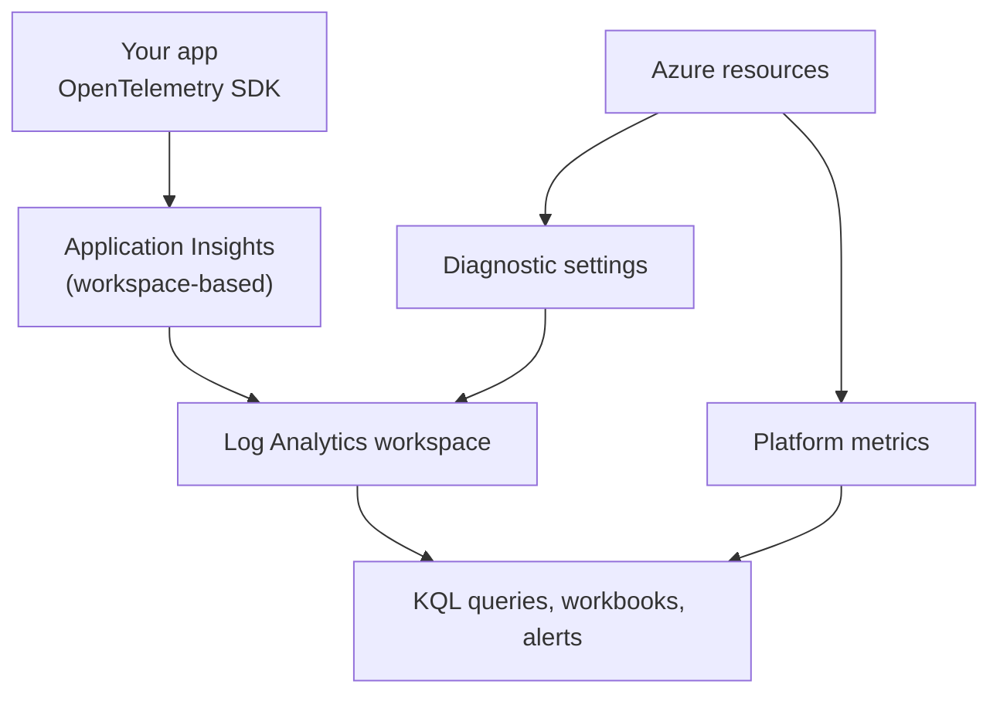

# 11 — Observability, Application Insights & KQL

> **Scope:** instrumenting a .NET service on Azure, making traces correlate across services, and
> querying the result. The "monitor, troubleshoot and optimize" half of the developer exam.
> Related: [Observability & monitoring](../Architecture/15-observability-and-monitoring.md).

---

## The data model



| Signal | Store | Shape | Query with |
| --- | --- | --- | --- |
| **Metrics** | Metrics store | Numeric, pre-aggregated, cheap, ~93-day retention | Metrics explorer, metric alerts |
| **Logs / traces** | **Log Analytics workspace** | Schema-per-table rows | **KQL** |
| **Activity log** | Subscription-level | Control-plane events (who created/deleted what) | KQL via a diagnostic setting |

**Application Insights is workspace-based** — its tables live in a Log Analytics workspace, so app
telemetry and platform logs join in one query. Nothing flows into the workspace unless you say so:
resources need a **diagnostic setting**.

The tables you will actually type:

| Table | Holds |
| --- | --- |
| `AppRequests` | Incoming HTTP requests — name, duration, result code, success |
| `AppDependencies` | Outgoing calls — HTTP, SQL, Cosmos, Service Bus, with duration and success |
| `AppExceptions` | Unhandled and tracked exceptions with stacks |
| `AppTraces` | `ILogger` output |
| `AppMetrics` | Custom metrics |
| `AppAvailabilityResults` | Availability test outcomes |
| `AzureDiagnostics` / resource-specific tables | Platform logs from diagnostic settings |

## Instrumenting ASP.NET Core

OpenTelemetry is the current path; the classic `TelemetryClient` SDK is legacy for new work.

```csharp
// dotnet add package Azure.Monitor.OpenTelemetry.AspNetCore
builder.Services.AddOpenTelemetry().UseAzureMonitor(o =>
{
    o.ConnectionString = builder.Configuration["ApplicationInsights:ConnectionString"];
    o.SamplingRatio    = 0.05f;      // 5% — start here on a busy service and tune
});

// add instrumentation the distro doesn't wire by default, and your own sources
builder.Services.ConfigureOpenTelemetryTracerProvider(t => t.AddSource("Shop.Orders"));
builder.Services.AddSingleton(new ActivitySource("Shop.Orders"));
builder.Services.AddSingleton<Meter>(_ => new Meter("Shop.Orders"));
```

```csharp
// a custom span + a custom metric, the OpenTelemetry way
public sealed class OrderService(ActivitySource source, Meter meter, ILogger<OrderService> log)
{
    private readonly Counter<long> _placed = meter.CreateCounter<long>("orders.placed");

    public async Task<Order> PlaceAsync(Order order, CancellationToken ct)
    {
        using var activity = source.StartActivity("PlaceOrder", ActivityKind.Internal);
        activity?.SetTag("order.id", order.Id);
        activity?.SetTag("customer.tier", order.Tier);      // dimensions you will filter by later

        try
        {
            var saved = await repo.SaveAsync(order, ct);
            _placed.Add(1, new KeyValuePair<string, object?>("tier", order.Tier));
            // structured logging: named holes become queryable properties, not string soup
            log.LogInformation("Order {OrderId} placed for {CustomerId}", saved.Id, saved.CustomerId);
            return saved;
        }
        catch (Exception ex)
        {
            activity?.SetStatus(ActivityStatusCode.Error, ex.Message);
            throw;
        }
    }
}
```

**Never log personal data or secrets.** Log ids and scrub values before they leave the process —
telemetry is a copy of your data in another system, with its own access model and retention.

### Correlation

Correlation is what turns three services' logs into one story. ASP.NET Core and the Azure SDKs
propagate **W3C `traceparent`** automatically, so a request's `operation_Id` flows to its
dependencies and on to the next service. Two rules:

- Use `HttpClient` from `IHttpClientFactory` (instrumented); a hand-rolled `HttpClient` still
  propagates via `DiagnosticSource`, but a raw socket call does not.
- **Messaging breaks the chain unless you carry it.** Put the `traceparent` in a message property on
  send and restore it on receive (`ActivityContext.TryParse` → `StartActivity(..., parentContext)`),
  or the consumer's work looks unrelated to the request that caused it.

### Sampling

Telemetry volume is the cost driver. Application Insights' distro ships a sampler that keeps **whole
traces** rather than isolated spans, so a sampled request keeps its dependencies and exceptions.
Start around **5%** on a high-volume service and adjust until the failures/performance blades are
accurate. Metrics are **pre-aggregated before sampling**, so counts stay correct even when traces are
thinned.

## Availability tests and alerts

- **Standard availability tests** ping a URL from multiple regions and alert on failure or latency —
  the cheapest possible "is it up?" and the source of `AppAvailabilityResults`.
- **Alert types:** metric (fast, cheap, on a metric threshold or dynamic baseline), **log** (a KQL
  query on a schedule — anything expressible in KQL), and **activity log** (someone deleted a
  resource). All fire into an **action group** (email, webhook, Logic App, ITSM, Azure Function).
- **Alert on symptoms, not causes:** error *rate*, p95 latency, queue depth/age, DLQ count, and
  availability — not "CPU > 80%", which is noise if the SLO is fine.

## KQL — the queries to know

The shape is always: pick a table → filter early → summarise → order → project.

```kusto
// 1. failure rate and p95 latency per operation, last 24h
AppRequests
| where TimeGenerated > ago(24h)
| summarize
    total   = count(),
    failed  = countif(Success == false),
    p50     = percentile(DurationMs, 50),
    p95     = percentile(DurationMs, 95),
    p99     = percentile(DurationMs, 99)
  by OperationName
| extend failureRate = round(100.0 * failed / total, 2)
| where total > 100
| order by failureRate desc, p95 desc
```

```kusto
// 2. the top exceptions, with an example so you can jump to the trace
AppExceptions
| where TimeGenerated > ago(6h)
| summarize count(), any(OperationId), earliest = min(TimeGenerated) by ProblemId, OuterMessage
| order by count_ desc
| take 20
```

```kusto
// 3. slow dependencies — is it us or them?
AppDependencies
| where TimeGenerated > ago(1h)
| summarize calls = count(), failures = countif(Success == false), p95 = percentile(DurationMs, 95)
  by Type, Target, Name
| order by p95 desc
```

```kusto
// 4. one end-to-end transaction: everything sharing an operation id
let opId = "0HN7Q2K5J8L1M";
union AppRequests, AppDependencies, AppExceptions, AppTraces
| where OperationId == opId
| project TimeGenerated, itemType, Name = coalesce(Name, OperationName, Message), DurationMs, Success
| order by TimeGenerated asc
```

```kusto
// 5. requests per minute as a chart, split by result code
AppRequests
| where TimeGenerated > ago(3h)
| summarize count() by bin(TimeGenerated, 1m), ResultCode
| render timechart
```

```kusto
// 6. did the deploy at 14:00 make it worse? (before/after comparison)
AppRequests
| where TimeGenerated between (ago(4h) .. now())
| extend window = iff(TimeGenerated < datetime_add('hour', -2, now()), "before", "after")
| summarize p95 = percentile(DurationMs, 95), errors = countif(Success == false), n = count() by window, OperationName
| order by OperationName asc
```

```kusto
// 7. a custom property from structured logging (LogInformation("... {CustomerId}", id))
AppTraces
| where TimeGenerated > ago(1h) and Message has "Order"
| extend customerId = tostring(Properties["CustomerId"])
| summarize orders = count() by customerId
| top 10 by orders desc
```

Operators worth having on the tip of your tongue: `where`, `project` / `project-away`, `extend`,
`summarize ... by`, `bin()`, `percentile()`, `countif()`, `join kind=inner`, `union`, `let`,
`parse`, `todynamic`, `mv-expand`, `top`, `render`, `ago()`, `between`, `series_decompose_anomalies`.

**Performance rule:** filter on `TimeGenerated` first, then on indexed columns, then summarise. `has`
beats `contains` (token index vs substring scan), and `search *` across all tables is the slowest thing
you can type.

## Cost control

Ingestion is the bill. In order of impact: **sampling**, a shorter **retention** on chatty tables,
**basic/auxiliary log plans** for high-volume low-query data, dropping debug logs in production
(`Logging:LogLevel:Default = Information`), **transformations** in the data collection rule to filter
or trim rows at ingest, and daily caps as a backstop (which silently drop data — an alert, not a plan).

## Hands-on

```bash
RG=rg-shop-dev; LAW=law-shop-dev; AI=appi-shop-dev; APP=shop-dev-api

az monitor log-analytics workspace create -g $RG -n $LAW
az monitor app-insights component create -g $RG -a $AI --location westeurope \
  --workspace $(az monitor log-analytics workspace show -g $RG -n $LAW --query id -o tsv)

CS=$(az monitor app-insights component show -g $RG -a $AI --query connectionString -o tsv)
az webapp config appsettings set -g $RG -n $APP --settings ApplicationInsights__ConnectionString="$CS"

# ship the platform logs of the web app into the same workspace
az monitor diagnostic-settings create -g $RG -n to-law \
  --resource $(az webapp show -g $RG -n $APP --query id -o tsv) \
  --workspace $(az monitor log-analytics workspace show -g $RG -n $LAW --query id -o tsv) \
  --logs '[{"category":"AppServiceHTTPLogs","enabled":true},{"category":"AppServiceConsoleLogs","enabled":true}]'

# run a query from the CLI
az monitor log-analytics query -w $(az monitor log-analytics workspace show -g $RG -n $LAW --query customerId -o tsv) \
  --analytics-query "AppRequests | where TimeGenerated > ago(1h) | summarize count() by ResultCode"
```

## Rapid-fire Q&A

**Q: Metrics or logs?**
Metrics for pre-aggregated numeric series — cheap, fast, what you alert on. Logs for anything with
cardinality and context you need to query after the fact. Use metrics for the alert and logs for the
investigation it triggers.

**Q: How do you trace one request across three services and a queue?**
W3C trace context: the `traceparent` header propagates automatically over HTTP and the Azure SDKs; for
messaging you copy it into a message property and restore the parent context on receive. Then query by
`OperationId`.

**Q: What is sampling, and does it break my error counts?**
It drops a proportion of traces to control ingest cost, keeping whole traces together so a sampled
request keeps its dependencies and exceptions. Metrics are pre-aggregated before sampling, so counts
stay right; individual traces may be missing.

**Q: OpenTelemetry or the classic Application Insights SDK?**
OpenTelemetry via the Azure Monitor Distro for new work — vendor-neutral instrumentation, standard
`ActivitySource`/`Meter` APIs, and the same Application Insights back end.

**Q: What would you alert on for a checkout API?**
Availability test failures, error rate over a rolling window, p95/p99 latency against the SLO, queue
depth and age, and dead-letter count. Not CPU — that is a diagnostic, not a symptom.

**Q: Write a KQL query for the five slowest endpoints in the last hour.**
`AppRequests | where TimeGenerated > ago(1h) | summarize p95 = percentile(DurationMs, 95) by OperationName | top 5 by p95 desc`

**Q: Telemetry costs have tripled. What do you do?**
Find the noisy table/operation (`Usage | summarize sum(Quantity) by DataType`), then: raise sampling,
cut debug logging, add an ingest-time transformation to drop the noise, shorten retention or move the
table to a cheaper plan. A daily cap is a last resort — it drops data blindly.

**Q: Where do platform logs come from?**
Nowhere by default. Each resource needs a **diagnostic setting** routing its logs and metrics to the
Log Analytics workspace (or storage/Event Hubs). Forgetting this is why "there are no logs".

---

**Prev:** [10 — API Management](10-api-management.md) ·
**Next:** [12 — Hands-on Labs](12-hands-on-labs.md) ·
**Up:** [Azure track hub](readme.md)
