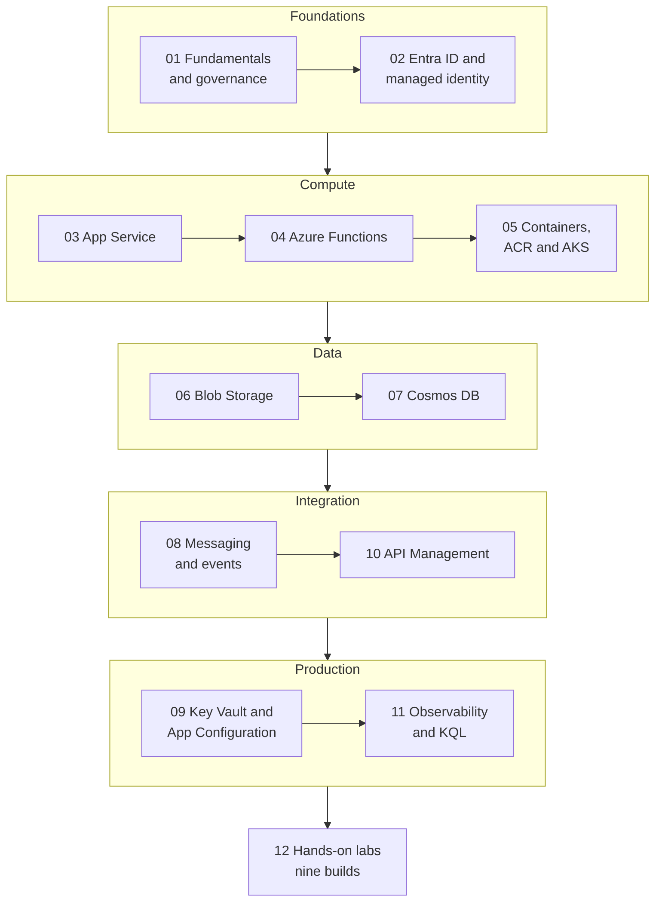

# Azure — Interview Prep Hub

> **What this is.** The Azure track of this blog's [interview prep](../readme.md), written for a
> **C# / .NET 10** developer: every service explained through the code and the `az` commands you'd
> actually type, with the trade-off named rather than the feature list recited.
>
> **How to use it.** Read a chapter, then do the matching lab in
> [12 — Hands-on Labs](12-hands-on-labs.md). Each chapter ends with a **Rapid-fire Q&A** to drill the
> night before. There is a [four-evening plan](12-hands-on-labs.md#a-four-evening-plan) if the
> interview is this week.

---

## The track

| # | Chapter | Covers |
| --- | --- | --- |
| 01 | [Fundamentals & Governance](01-fundamentals-and-governance.md) | resource hierarchy, **control plane vs data plane**, regions & zones, composite SLA maths, RBAC vs Policy, Bicep |
| 02 | [Entra ID & Managed Identity](02-identity-and-managed-identity.md) | app registration vs service principal, token claims, the four OAuth flows, delegated vs application permissions, `DefaultAzureCredential` |
| 03 | [App Service](03-app-service.md) | plans & tiers, scale up vs out, **what a slot swap actually does**, sticky settings, run-from-package, VNet integration |
| 04 | [Azure Functions](04-azure-functions.md) | **isolated worker** (in-process retires 10 Nov 2026), triggers & bindings, Flex Consumption, cold start, retries, Durable Functions |
| 05 | [Containers, ACR & AKS](05-containers-and-aks.md) | ACI vs App Service vs Container Apps vs AKS, a production Dockerfile, ACR tasks, revisions & KEDA |
| 06 | [Blob Storage](06-blob-storage.md) | redundancy, blob types, tiers & early-deletion penalties, lifecycle policies, **the three SAS kinds**, ETag concurrency |
| 07 | [Cosmos DB](07-cosmos-db.md) | partition-key design & the 20 GB ceiling, RUs, **the five consistency levels**, indexing, change feed, v3 SDK |
| 08 | [Messaging & Events](08-messaging-and-events.md) | Service Bus vs Storage Queue vs Event Grid vs Event Hubs, peek-lock & DLQ, sessions, dedup, outbox, idempotency |
| 09 | [Key Vault & App Configuration](09-secrets-and-configuration.md) | secrets/keys/certs, RBAC vs access policies, soft delete & purge protection, rotation, **the sentinel refresh pattern**, feature flags |
| 10 | [API Management](10-api-management.md) | products & subscriptions, the policy pipeline and `<base />`, `validate-jwt`, `rate-limit-by-key`, versions vs revisions, tiers |
| 11 | [Observability & KQL](11-observability-and-kql.md) | Azure Monitor data model, OpenTelemetry distro, correlation across a queue, sampling, alerts, **seven KQL queries** |
| 12 | [Hands-on Labs](12-hands-on-labs.md) | nine labs on one running example, each ending in the sentence it earns you |

---

## About the certification

The developer certification changed in 2026, and quoting the old one is a small own goal:

| | |
| --- | --- |
| **AZ-204: Developing Solutions for Microsoft Azure** | **Retired 31 July 2026**, along with the *Azure Developer Associate* certification and its renewal assessment. A credential you already hold stays on your transcript and remains valid until its normal expiry. |
| **AI-200: Developing AI Cloud Solutions on Azure** | The suggested replacement, leading to **Azure AI Cloud Developer Associate**. |

**What actually changed.** AI-200 keeps containers, Cosmos DB, Service Bus, Event Grid, Functions,
Key Vault, App Configuration and monitoring, and adds vector search / RAG over Cosmos DB, Azure
Database for PostgreSQL (pgvector) and Azure Managed Redis, OpenTelemetry tracing and KQL. It drops
the identity, App Service and Blob Storage depth that AZ-204 carried — and it lists **Python** in its
audience profile.

| AI-200 skill area | Weight | Where this track covers it |
| --- | --- | --- |
| Develop containerized solutions on Azure | 20–25% | [05](05-containers-and-aks.md) |
| Develop AI solutions using Azure data management services | 25–30% | [07](07-cosmos-db.md) (+ vector search, not covered here) |
| Connect to and consume Azure services | 20–25% | [08](08-messaging-and-events.md) · [04](04-azure-functions.md) |
| Secure, monitor and troubleshoot Azure solutions | 20–25% | [09](09-secrets-and-configuration.md) · [11](11-observability-and-kql.md) |

**So is the AZ-204 material wasted?** No — it is still exactly what an Azure .NET *interview* asks
about, which is why this track is organised around the work rather than around an exam. Chapters 02,
03 and 06 are now interview-only material; treat the AI-200 table above as the certification path and
this track as the interview path.

---

## The 12 answers to have word-perfect

1. **Control plane vs data plane.** `Owner` on a storage account doesn't let you read a blob; that
   needs a data-plane role. ([01](01-fundamentals-and-governance.md#control-plane-vs-data-plane))
2. **Composite SLA.** Multiply everything on the critical path; then remove dependencies from that
   path or run redundant copies in parallel. ([01](01-fundamentals-and-governance.md#sla-arithmetic--the-question-behind-the-question))
3. **Managed identity.** A service principal whose credential Azure rotates — system-assigned dies
   with the resource, user-assigned outlives it. ([02](02-identity-and-managed-identity.md#managed-identity--the-whole-point))
4. **`DefaultAzureCredential` is a dev-time convenience.** Pin `ManagedIdentityCredential` in
   production so a failure can't silently promote another credential. ([02](02-identity-and-managed-identity.md#defaultazurecredential--and-why-not-to-ship-it))
5. **A slot swap** applies the target's sticky settings to the source, restarts it, warms it, *then*
   flips routing — so production is the target and rollback is a second swap. ([03](03-app-service.md#deployment-slots--the-part-they-actually-probe))
6. **Isolated worker only.** The in-process Functions model loses support on 10 November 2026.
   ([04](04-azure-functions.md#the-net-model-isolated-worker-and-only-isolated-worker))
7. **230 seconds** is the HTTP limit on a function regardless of plan — long work returns `202` and
   goes Durable. ([04](04-azure-functions.md#hosting-plans--the-numbers))
8. **A SAS cannot be un-issued.** Short expiry, narrow permissions, user delegation SAS, or a stored
   access policy you can revoke. ([06](06-blob-storage.md#access-control--four-ways-in-ranked))
9. **Partition key** = high cardinality, even distribution, present in your hot queries — against a
   20 GB / 10,000 RU/s logical-partition ceiling. ([07](07-cosmos-db.md#partitioning--the-decision-everything-else-depends-on))
10. **Everything is at-least-once.** Exactly-once *effect* comes from idempotent handlers plus a
    transactional outbox. ([08](08-messaging-and-events.md#delivery-semantics-and-idempotency))
11. **Sentinel key.** Register one key for refresh, write all your changes, bump the sentinel — the
    reload is atomic and needs no restart. ([09](09-secrets-and-configuration.md#azure-app-configuration))
12. **`<base />`** is where the parent policy runs in APIM; omitting it silently disables inherited
    authentication. ([10](10-api-management.md#the-policy-pipeline))

---

## Service cheat-sheet

| I need to… | Reach for | Not |
| --- | --- | --- |
| Host a .NET web API | App Service, or Container Apps if containerised | AKS, unless you need the K8s API |
| Run event-driven code | Azure Functions (Flex Consumption) | A VM with a timer |
| Reliably process business messages | Service Bus (queue or topic) | Event Grid |
| React to "something happened" in Azure | Event Grid | Polling |
| Ingest and replay telemetry | Event Hubs | Service Bus |
| Store files/objects | Blob Storage | A database BLOB column |
| Store JSON documents at global scale | Cosmos DB for NoSQL | Table Storage, unless it's key/value and cheap matters |
| Hold a secret | Key Vault | App settings, environment variables, source |
| Hold a setting or a feature flag | App Configuration | A redeploy |
| Authenticate to an Azure service | Managed identity + RBAC | Connection strings, account keys |
| Front several APIs | API Management | A hand-rolled proxy |
| Find out why it's slow | App Insights + KQL | Adding more logging and hoping |

---

## Self-test — 20 questions, no notes

Answer out loud. Anything you can't finish in two sentences is the chapter to reread.

1. Why doesn't `Contributor` let you download a blob?
2. Incremental vs Complete ARM deployment mode — which deletes things?
3. Work out the SLA of an API on App Service that calls SQL Database and Blob Storage.
4. RBAC or Azure Policy to prevent public storage accounts existing at all?
5. App registration, service principal, managed identity — define each in one line.
6. A token has `roles` but no `scp`. Who is calling, and what does that imply?
7. Why shouldn't `DefaultAzureCredential` ship to production?
8. Name three settings that do **not** swap between App Service slots.
9. Your slot swap failed halfway. What state is production in, and why?
10. Which Functions hosting plan scales to zero, gives you a VNet, and reaches 1,000 instances?
11. An HTTP function must run for 10 minutes. What do you build?
12. Why must a Durable orchestrator avoid `DateTime.UtcNow`?
13. Container Apps or AKS — and what would change your mind?
14. Someone leaked a SAS URL for a private container. What are your options?
15. What does moving a blob out of the cool tier after 10 days cost you?
16. `/status` as a Cosmos partition key — what breaks, and when?
17. Which consistency level, and what does it cost in RUs?
18. A Service Bus message has been delivered three times. Name three possible causes.
19. How do you change a production setting without a restart or a deploy?
20. Write the KQL for the p95 duration of each operation in the last hour.

Where each answer lives

1–4 [01](01-fundamentals-and-governance.md) · 5–7 [02](02-identity-and-managed-identity.md) ·
8–9 [03](03-app-service.md) · 10–12 [04](04-azure-functions.md) · 13 [05](05-containers-and-aks.md) ·
14–15 [06](06-blob-storage.md) · 16–17 [07](07-cosmos-db.md) · 18 [08](08-messaging-and-events.md) ·
19 [09](09-secrets-and-configuration.md) · 20 [11](11-observability-and-kql.md)

---

## Reference material outside this track

**On this blog** ·
[Azure basics](../../Azure/azure-basic.md) ·
[Automation & Logic Apps](../../Azure/azure.md) ·
[Service Bus notes](../../Azure/Azure-service-bus.md) ·
[Azure DevOps & pipelines](../../Azure/Azure-DevOps.md) ·
[AZ-204 archive](../../Azure/Certification/AZ-204.md) ·
[AKS clusters](../../Containerization/K8/Azure/cluster.azure.k8.md) ·
[Kubernetes](../../Containerization/K8/k8.md) ·
[Cloud architecture (Azure + AWS)](../Architecture/12-cloud-architecture.md) ·
[AWS](../../AWS/aws.md)

**Microsoft** ·
[Azure documentation](https://learn.microsoft.com/en-us/azure/) ·
[Azure SDK for .NET](https://learn.microsoft.com/en-us/dotnet/azure/) ·
[Azure Architecture Center](https://learn.microsoft.com/en-us/azure/architecture/) ·
[Well-Architected Framework](https://learn.microsoft.com/en-us/azure/well-architected/) ·
[Azure CLI reference](https://learn.microsoft.com/en-us/cli/azure/) ·
[AI-200 study guide](https://learn.microsoft.com/en-us/credentials/certifications/resources/study-guides/ai-200) ·
[Microsoft Learn training](https://learn.microsoft.com/en-us/training/browse/?products=azure)
