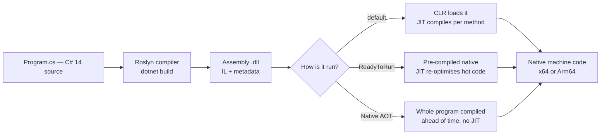
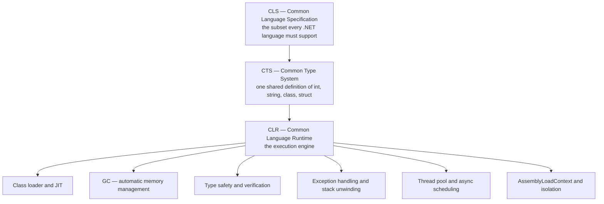
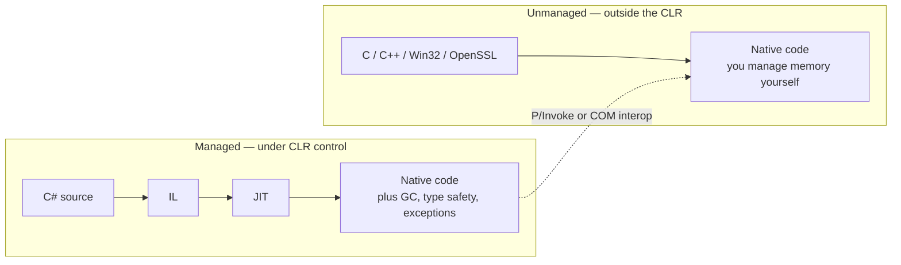

# 01 — .NET Platform, CLR & Compilation

> **Scope:** what .NET actually *is*, how your C# becomes machine code, and every runtime
> acronym an interviewer can throw at you — IL, JIT, CLR, CTS, CLS, GC, AOT.
> Targets **.NET 10 (LTS) / C# 14**.

---

## .NET vs C# — the question that opens most interviews

| | .NET | C# |
| --- | --- | --- |
| What it is | A **platform**: runtime (CLR), base class library, SDK, tooling | A **language** |
| Gives you | GC, type system, JIT, `System.*` libraries, `dotnet` CLI | Syntax, type checking, language features |
| Alternatives | Java/JVM, Node, Go | F#, VB.NET — *both run on .NET* |
| Versioning | .NET 8, 9, **10** | C# 12, 13, **14** |

**The analogy that lands well:** .NET is the *toolbox and materials* — bricks, wiring, power
tools. C# is the *blueprint* you write. Swap the blueprint for F# and you still build with the
same bricks.

```c#
// Every line here is C# *syntax*; every capability comes from the .NET *libraries*.
Console.WriteLine("Hello, World!");   // System.Console  → .NET BCL
```

> 🎯 **Say this out loud:** "C# is the language, .NET is the platform it compiles to. `Console`,
> `List<T>` and `Task` are not C# keywords — they are .NET types."

---

## How C# becomes machine code



### IL — Intermediate Language

- **What:** a CPU-independent, stack-based instruction set, also called **MSIL** or **CIL**.
  `dotnet build` emits IL, **not** machine code.
- **Why it exists:**
  - **Portability** — one `.dll` runs on Windows/Linux/macOS, x64/Arm64.
  - **Language interop** — C#, F# and VB all compile to the same IL, so they can call each other.
  - **Verifiability** — the runtime can prove type safety before running the code.
  - **Late optimisation** — the JIT knows the *actual* CPU (AVX-512? Arm64?) and can use it.
- **How to view it:** `ildasm`, **ILSpy**, `ilspycmd`, JetBrains dotPeek, or paste into
  [sharplab.io](https://sharplab.io) — the fastest option in an interview or a blog post.

```bash
# Inspect what the compiler really generated
dotnet build -c Release
ilspycmd bin/Release/net10.0/MyApp.dll        # dotnet tool install -g ilspycmd
```

### JIT — Just-In-Time compiler

- Compiles IL to native code **per method, on first call**, then caches it for the process lifetime.
- **Tiered compilation** (default): **Tier 0** compiles fast with few optimisations so start-up is
  quick; methods that get hot are recompiled at **Tier 1** with full optimisation.
- **OSR — On-Stack Replacement** lets a long-running loop already executing at Tier 0 be swapped to
  Tier 1 mid-flight. Without it a `while(true)` loop would stay unoptimised forever.
- **Dynamic PGO** is on by default since .NET 8: the runtime *instruments* Tier 0 code, learns which
  branches and which interface implementations actually occur, and feeds that into Tier 1 —
  devirtualising interface calls and inlining the hot path.

> 🎯 **Interview payoff:** "The JIT is not just a translator, it is an *optimiser with runtime
> information a static compiler never has* — real branch probabilities and the real CPU."

### AOT alternatives — know when JIT is the wrong answer

| Mode | Start-up | Throughput | Size | Use for |
| --- | --- | --- | --- | --- |
| JIT (default) | slowest | best after warm-up | smallest deploy | long-lived servers |
| **ReadyToRun** (R2R) | fast | good, re-jits hot code | larger | web apps that need a fast first request |
| **Native AOT** | fastest, milliseconds | very good, no warm-up | small self-contained exe | CLI tools, serverless, containers, scale-to-zero |

```bash
# Native AOT — no runtime install, no JIT, single native executable
dotnet publish -c Release -r linux-x64 -p:PublishAot=true
```

- **Native AOT trade-off:** there is no runtime code generation, so **`Reflection.Emit`, dynamic
  assembly loading and reflection-based serialisers break**. Use *source generators* instead —
  `System.Text.Json` source-gen, compile-time logging, compile-time regex.

---

## The runtime acronyms



### CLR — Common Language Runtime

The virtual execution engine. It loads assemblies, JITs IL, manages the heap and GC, enforces type
safety, unwinds exceptions and hosts the thread pool. **Code the CLR runs is "managed".**

### CTS — Common Type System

One shared type system across all .NET languages. C# `int`, VB `Integer` and F# `int` are *the same
type*, `System.Int32`. Without CTS, every cross-language call would need marshalling.

### CLS — Common Language Specification

A **subset** of CTS that every .NET language is guaranteed to support. Stay CLS-compliant in a
**public library API** and any .NET language can consume it.

- Classic CLS violations: `uint`/`ulong`/`sbyte` in public signatures, and members differing
  **only by case** (`Foo` vs `foo` — fatal for VB, which is case-insensitive).

```c#
[assembly: System.CLSCompliant(true)]     // compiler now warns on violations

public class Api
{
    public void Send(int bytes) { }        // ✅ CLS-compliant
    public void Send(uint bytes) { }       // ⚠️ CS3001: uint is not CLS-compliant
}
```

### Managed vs unmanaged code



| | Managed | Unmanaged |
| --- | --- | --- |
| Runs under | CLR | OS directly |
| Memory | GC | manual `malloc` / `free` |
| Type safety | verified | none |
| Examples | your C# app | Win32 API, native SQLite, OpenSSL |
| Reached via | — | `[LibraryImport]` (P/Invoke), COM, C++/CLI |

```c#
// Modern P/Invoke: source-generated and AOT-friendly — replaces [DllImport]
internal static partial class Native
{
    [System.Runtime.InteropServices.LibraryImport("kernel32", SetLastError = true)]
    internal static partial uint GetCurrentProcessId();
}
```

---

## Metadata and the assembly manifest

An assembly is not just IL. Alongside the instructions the compiler emits **metadata**: a set of
tables describing every type, member, signature and attribute in the assembly. The **manifest** is
one part of that metadata — the assembly's own identity card.

| | Metadata | Manifest |
| --- | --- | --- |
| Describes | the **contents** — types, members, signatures, attributes | the **assembly itself** |
| Holds | type definitions, method signatures, custom attributes, security info | name, version, culture, public key, file list, referenced assemblies |
| Read by | the JIT (to lay out types), reflection, serialisers, DI containers | the CLR's assembly loader, versioning and binding |
| Reached via | `type.GetMembers()`, `type.GetProperties()` | `assembly.GetName()` |

Think of the `.dll` as a book: **metadata** is the index — every chapter, section and term.
The **manifest** is the title page — title, edition, authors, ISBN.

```c#
using System.Reflection;

Assembly asm = typeof(Program).Assembly;

// --- manifest: who this assembly IS ---
AssemblyName id = asm.GetName();
Console.WriteLine($"{id.Name} v{id.Version} culture={id.CultureName ?? "neutral"}");
foreach (AssemblyName reference in asm.GetReferencedAssemblies())
    Console.WriteLine($"  depends on {reference.Name} v{reference.Version}");

// --- metadata: what this assembly CONTAINS ---
foreach (Type type in asm.GetTypes())
{
    Console.WriteLine(type.FullName);
    foreach (MemberInfo member in type.GetMembers(BindingFlags.Public | BindingFlags.Instance))
        Console.WriteLine($"    {member.MemberType} {member.Name}");
}
```

> 🎯 **The senior answer:** "Metadata is the self-description of everything *in* the assembly —
> it is why .NET needs no header files and why reflection, serialisers and DI containers work at
> all. The manifest is the slice of that metadata describing the assembly *as a unit*: identity,
> version and dependencies, which is what the loader binds against."

---

## Garbage collection — the interview essentials

- **Why it matters:** it removes an entire class of bugs — leaks, double-free, dangling pointers —
  and compacts the heap so allocation is little more than a pointer bump.
- **Generational:** Gen 0 (new, collected constantly and cheaply), Gen 1 (buffer), Gen 2
  (long-lived), plus the **LOH** for objects **≥ 85,000 bytes**. Most objects die in Gen 0 — that
  *generational hypothesis* is what the whole design rests on.
- **Non-deterministic:** you do not know *when* it runs, so never rely on it for timing.

> Full treatment — generations, GC modes, `Span<T>`, leak hunting — is in
> [06 — Memory, GC & Profiling](../Architecture/06-memory-gc-and-profiling.md).

### ❗ "Can the GC reclaim unmanaged objects?" — **No**

The GC only tracks the managed heap. File handles, sockets, DB connections, native buffers and GDI
objects are invisible to it. You must release them yourself:

```c#
// The pattern interviewers want to see: IDisposable, not a finalizer.
public sealed class TempWorkspace : IDisposable
{
    private readonly string _dir = Directory.CreateTempSubdirectory().FullName;
    private bool _disposed;

    public void Dispose()
    {
        if (_disposed) return;
        Directory.Delete(_dir, recursive: true);   // deterministic cleanup
        _disposed = true;
    }
}

using var ws = new TempWorkspace();   // Dispose() runs at end of scope, guaranteed
```

| Mechanism | When it runs | Use it |
| --- | --- | --- |
| `IDisposable` + `using` | deterministically, at end of scope | **always, first choice** |
| `IAsyncDisposable` + `await using` | same, for async cleanup — flush a stream, close a connection | async resources |
| **Finalizer** `~Type()` | eventually, on the finalizer thread, order undefined | safety net for raw handles only |
| **`SafeHandle`** | CLR-managed, critical-finalizer backed | wrapping native handles — **preferred over a finalizer** |

> 🎯 **Trap:** "Just call `GC.Collect()`." Wrong answer. It forces a full blocking collection,
> destroys the generational heuristics, and does not touch unmanaged memory anyway.

---

## Does .NET support multiple languages?

Yes — **C#**, **F#** (functional-first) and **Visual Basic** ship in the SDK and all compile to
IL over the same CTS. Because the types are literally identical, a C# project can reference an F#
library and use its types directly with no shim.

---

## .NET 10 vs .NET Framework 4.8.x

> ⚠️ Older notes call it ".NET Core". That name was retired at **.NET 5**. Say **".NET"**
> (modern, cross-platform) versus **".NET Framework"** (Windows-only; 4.8.1 is the last version and
> is in permanent maintenance mode).

| | **.NET 10** | **.NET Framework 4.8.1** |
| --- | --- | --- |
| Platforms | Windows, Linux, macOS, containers | Windows only |
| Open source | fully, on GitHub | partially |
| Performance | far faster — `Span<T>`, tiered JIT, dynamic PGO, AOT | frozen |
| Microservices / Docker | designed for it, tiny AOT images | poor fit |
| Side-by-side versions | ✅ per-app, no machine-wide install | ❌ one machine-wide framework |
| CLI | full cross-platform `dotnet` CLI | `msbuild` on Windows only |
| Future features | all new work lands here | security fixes only |
| Still needed for | — | WebForms, WCF *server*, Workflow Foundation, COM-heavy legacy |

### LTS vs STS — the usual follow-up

| | **LTS** — Long Term Support | **STS** — Standard Term Support |
| --- | --- | --- |
| Versions | even: 8, **10** | odd: 7, 9 |
| Supported | **36 months** | **18 months** |
| Released | every November | every November |
| Choose for | production, anything you will not re-platform yearly | early adoption, short-lived internal apps |

**.NET 10 is the current LTS** (November 2025) and ships **C# 14**.

---

## Rapid-fire Q&A

**Q: What is IL code?**
CPU-independent instructions emitted by Roslyn. It is what actually lives in your `.dll`, alongside
metadata describing every type and member.

**Q: What is the benefit of compiling to IL rather than straight to native?**
Portability across OS and CPU, cross-language interop through a shared type system, runtime type
verification, and letting the JIT optimise for the actual machine and actual runtime behaviour.

**Q: Is it possible to view IL?**
Yes — ILSpy, `ildasm`, dotPeek, `ilspycmd`, or sharplab.io.

**Q: Why is a JIT'd app sometimes *faster* than a statically compiled one?**
Dynamic PGO. The JIT sees real branch frequencies and real interface targets, so it devirtualises
and inlines based on the workload actually running.

**Q: Managed vs unmanaged — one sentence each.**
Managed runs on the CLR with GC, verification and exception handling. Unmanaged runs straight on the
OS and you own its memory and lifetime.

**Q: What is `unsafe` for?**
Raw pointers, `stackalloc`, interop and hot-path micro-optimisation. Needs
`<AllowUnsafeBlocks>true</AllowUnsafeBlocks>`. Prefer `Span<T>` and `ref` — same performance,
verified safety.

**Q: Why is the GC generational?**
Because most objects die young. Collecting only Gen 0 scans a tiny fraction of the heap yet reclaims
most of the garbage, so a full Gen 2 collection stays rare.

---

**Next:** [02 — Memory, Types & Boxing](02-memory-and-type-system.md) ·
**Up:** [Interview hub](readme.md)
