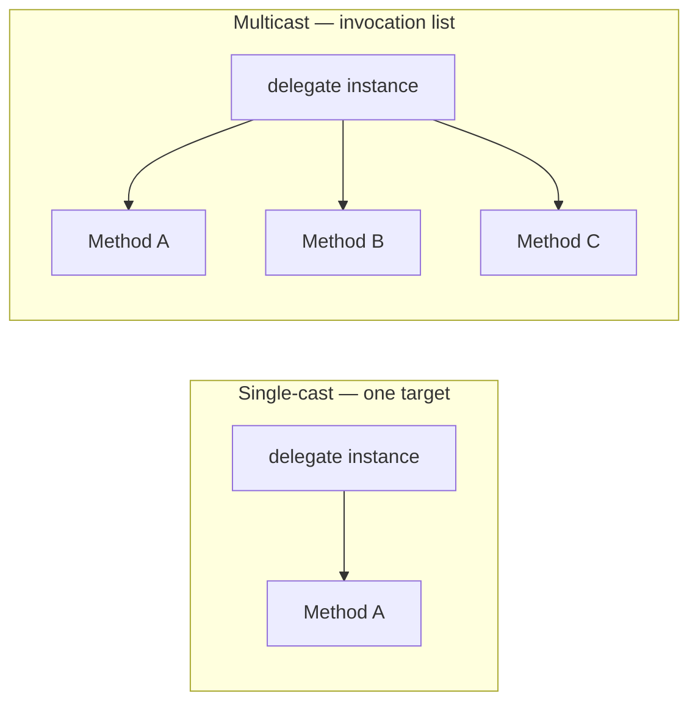
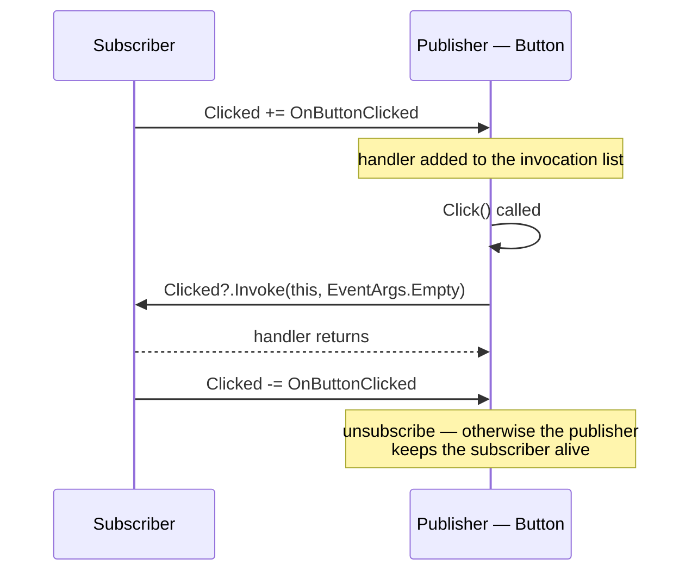

# 07 — Delegates, Events & LINQ

> **Scope:** delegates from first principles, `Func`/`Action`/`Predicate`, multicast behaviour,
> events and the leak they cause, plus the LINQ built on top of all of it.
> Companion deep-dive already on this blog: [csharp-delegate.md](../../CSharp/csharp-delegate.md).

---

## What a delegate is

**A delegate is a type-safe pointer to a method** — it holds the address of a method (plus the target
object, for instance methods) and can invoke it later.

```c#
// 1. Declare the SHAPE: two ints in, one int out
public delegate int BinaryOperation(int x, int y);

public class Calculator
{
    public int Add(int x, int y)      => x + y;
    public int Subtract(int x, int y) => x - y;
}

var calc = new Calculator();

BinaryOperation op = calc.Add;        // 2. point it at a method
int result = op(5, 3);                // 3. invoke → 8

op = calc.Subtract;                   // repoint at run time
result = op(5, 3);                    // → 2
```

### What delegates are actually for

| Use | Example |
| --- | --- |
| **Callbacks** | `Retry(action, onFailure: LogIt)` |
| **Event notification** | which method to run when a button is clicked |
| **Strategy / policy injection** | pass the comparison rule into a sort |
| **Reusability and flexibility** | behaviour becomes a parameter, not a subclass |
| **Foundation of LINQ** | every `Where`/`Select` takes a delegate |

```c#
// Behaviour as a parameter — no inheritance, no interface, no ceremony
static async Task<T> RetryAsync<T>(Func<Task<T>> work, Action<Exception> onError, int attempts = 3)
{
    for (var i = 1; ; i++)
    {
        try { return await work(); }
        catch (Exception ex) when (i < attempts) { onError(ex); await Task.Delay(200 * i); }
    }
}
```

---

## `Func`, `Action`, `Predicate` — the built-in delegates

You almost never need to declare your own delegate type any more.

| | `Func<...,TResult>` | `Action<...>` | `Predicate<T>` |
| --- | --- | --- | --- |
| Returns | a value — `int`, `string`, anything | **`void`** | **`bool`** |
| Input parameters | 0–16 | 0–16 | exactly **1** |
| Output parameters | 1 (the return) | 0 | 1 (the `bool`) |
| `ref` / `out` parameters | ❌ not allowed | ❌ not allowed | ❌ not allowed |
| Lambdas / anonymous methods | ✅ | ✅ | ✅ |
| Equivalent to | — | — | `Func<T, bool>` |

```c#
Func<int, int>            square  = x => x * x;              // int → int
Func<int, int, int>       add     = (a, b) => a + b;         // last type param is the RETURN
Action<string>            log     = Console.WriteLine;       // returns void
Action                    ping    = () => Console.WriteLine("ping");
Predicate<string>         isEmpty = s => s.Length == 0;      // T → bool

// Predicate<T> and Func<T,bool> are structurally the same but NOT interchangeable types.
// LINQ uses Func<T,bool>; List<T>.Find/RemoveAll use Predicate<T>.
List<int> nums = [1, 2, 3, 4];
nums.RemoveAll(n => n % 2 == 0);            // Predicate<int>
var odds = nums.Where(n => n % 2 == 1);     // Func<int,bool>
```

> ⚠️ **Note:** older notes say `Func` returns "int, float, etc." — it returns *any* type, including
> `Task<T>`, which is how async callbacks work: `Func<Task<Order>>`.
> They also say delegates cannot take `ref`/`out` — true for `Func`/`Action`/`Predicate`, but a
> **custom** delegate type absolutely can: `delegate bool TryParse<T>(string s, out T value);`

---

## Single-cast vs multicast delegates



- **Single-cast** — points at exactly one method.
- **Multicast** — holds an **invocation list**; every delegate in C# actually derives from
  `MulticastDelegate`. Build it with `+` / `+=`, remove with `-` / `-=`.
- Methods run **in the order they were added**.

```c#
Action pipeline = () => Console.WriteLine("validate");
pipeline += () => Console.WriteLine("save");
pipeline += () => Console.WriteLine("notify");
pipeline();                     // validate, save, notify — in order

pipeline -= /* the same delegate instance */ null;   // -= needs an equal delegate to remove
```

### The two multicast gotchas interviewers love

**1. Return values.** A multicast delegate with a non-`void` return type is legal — but you only
get the value from the **last** method in the list; every earlier return is discarded.

```c#
Func<int> chain = () => 1;
chain += () => 2;
chain += () => 3;
Console.WriteLine(chain());        // 3 — the first two results are thrown away
```

> This is why older notes say multicast "only works with `void`". More precisely: it *works* with
> any return type, but only the last result survives — so a non-`void` multicast is almost always a
> design mistake.

**2. One exception kills the rest.** If the second handler throws, the third never runs. To make
every handler run, enumerate the list yourself:

```c#
foreach (Action handler in pipeline.GetInvocationList().Cast<Action>())
{
    try { handler(); }
    catch (Exception ex) { logger.LogError(ex, "Handler failed"); }
}
```

### Passing a method as a parameter

```c#
static int Apply(int a, int b, BinaryOperation op) => op(a, b);

Console.WriteLine(Apply(5, 3, calc.Add));         // 8 — the METHOD is the argument
Console.WriteLine(Apply(5, 3, (x, y) => x * y));  // 15 — or a lambda inline
```

### Invoking safely

```c#
BinaryOperation? maybe = null;
int? value = maybe?.Invoke(1, 2);       // null-conditional invoke — no NullReferenceException
```

---

## Events

**An event is a delegate with access restrictions.** Outside the declaring type you may only `+=`
and `-=`; you cannot invoke it, and you cannot clobber the whole list with `=`. That is the entire
difference — and it is exactly what makes the publish/subscribe pattern safe.



```c#
public class Button
{
    // EventHandler = void (object? sender, EventArgs e) — the .NET convention
    public event EventHandler? Clicked;

    // EventHandler<T> for custom payloads
    public event EventHandler<ClickedEventArgs>? ClickedWithData;

    public void Click()
    {
        // ✅ Null-conditional invoke: thread-safe (reads the field once) and no NRE
        //    when nobody has subscribed.
        Clicked?.Invoke(this, EventArgs.Empty);
    }
}

public sealed class ClickedEventArgs(int x, int y) : EventArgs
{
    public int X { get; } = x;
    public int Y { get; } = y;
}

// Subscribing
var button = new Button();
button.Clicked += OnButtonClicked;
button.Click();                          // "Button clicked!"
button.Clicked -= OnButtonClicked;       // ⚠️ always unsubscribe

static void OnButtonClicked(object? sender, EventArgs e) => Console.WriteLine("Button clicked!");
```

### Delegate vs event

| | Delegate | Event |
| --- | --- | --- |
| Outside code can invoke it | ✅ | ❌ |
| Outside code can reassign with `=` | ✅ — wiping every other subscriber | ❌ |
| Outside code can `+=` / `-=` | ✅ | ✅ |
| Typical role | callback, strategy, parameter | notification / pub-sub |

### ❗ The event memory leak — a favourite senior question

The **publisher holds a strong reference to every subscriber**. If the publisher outlives the
subscriber and nobody unsubscribes, the subscriber can never be collected.

```c#
// A long-lived singleton publisher + short-lived subscribers = a growing leak
appLifetime.SomeEvent += shortLivedView.Handler;   // shortLivedView now immortal
```

**Fixes, in order of preference:**

1. **Unsubscribe** in `Dispose`/`OnDestroy` — the correct, boring answer.
2. Use a **weak event pattern** or `WeakReference<T>` handlers.
3. Prefer an explicit message bus / `IObservable<T>` with a disposable subscription, where the
   *subscriber* owns the lifetime.

```c#
public sealed class Widget : IDisposable
{
    private readonly Button _button;
    public Widget(Button button) { _button = button; _button.Clicked += OnClick; }
    private void OnClick(object? s, EventArgs e) { }
    public void Dispose() => _button.Clicked -= OnClick;   // ✅ symmetric
}
```

### Raising events correctly

```c#
// The protected virtual OnXxx pattern lets derived classes intercept
protected virtual void OnClicked(ClickedEventArgs e) => ClickedWithData?.Invoke(this, e);
```

- Naming: `event` past-tense (`Clicked`, `Saved`) or gerund for pre-events (`Closing`).
- Signature: `(object? sender, TEventArgs e)`.
- **Never** use `async void` handlers except at the outermost UI boundary — exceptions in them
  crash the process.

---

## Lambdas, closures and anonymous methods

```c#
Func<int, int> a = delegate (int x) { return x * 2; };     // anonymous method (C# 2, legacy)
Func<int, int> b = x => x * 2;                             // lambda (C# 3+)
Func<int, int> c = static x => x * 2;                      // static lambda — cannot capture (C# 9)
```

**Closures:** a lambda that uses an outer local **captures** it. The compiler hoists that variable
into a heap-allocated class, so it lives as long as the delegate does.

```c#
// The classic closure trap
var actions = new List<Action>();
for (int i = 0; i < 3; i++)
    actions.Add(() => Console.WriteLine(i));   // captures the VARIABLE, not the value
actions.ForEach(a => a());                     // 3, 3, 3 — one shared 'i'

// Fix: capture a fresh copy per iteration
for (int i = 0; i < 3; i++)
{
    int copy = i;
    actions.Add(() => Console.WriteLine(copy));   // 0, 1, 2 ✅
}
```

> `foreach` variables have been per-iteration since C# 5, so only `for` loops still bite you.
> Mark a lambda `static` when it should not capture — the compiler then enforces it and you avoid
> an accidental allocation.

---

## LINQ

**LINQ is a uniform query syntax over any data source** — objects, XML, JSON, EF Core, Cosmos.
It is built entirely from extension methods that take delegates.

```c#
var report = orders
    .Where(o => o.Total > 100)                      // filter    (Func<Order,bool>)
    .OrderByDescending(o => o.CreatedAt)            // sort
    .Select(o => new { o.Id, o.Total })             // project
    .Take(10)                                       // page
    .ToList();                                      // EXECUTE

// Query syntax — identical result, sometimes clearer for joins and grouping
var grouped =
    from o in orders
    group o by o.CustomerId into g
    where g.Count() > 1
    select new { CustomerId = g.Key, Orders = g.Count(), Spend = g.Sum(x => x.Total) };
```

### Deferred vs immediate execution

| Deferred — builds a pipeline | Immediate — executes now |
| --- | --- |
| `Where`, `Select`, `OrderBy`, `Take`, `Skip`, `GroupBy`, `Join`, `Distinct` | `ToList`, `ToArray`, `ToDictionary`, `Count`, `Sum`, `First`, `Single`, `Any`, `foreach` |

```c#
var query = orders.Where(o => o.Total > 100);   // NOTHING has run
var list  = query.ToList();                    // runs here
var again = query.ToList();                    // runs AGAIN — two DB round-trips with EF Core
```

### LINQ to Objects vs LINQ to Entities

| | `IEnumerable<T>` (LINQ to Objects) | `IQueryable<T>` (EF Core) |
| --- | --- | --- |
| Lambda compiles to | a **delegate** | an **expression tree** |
| Where it runs | in your process | translated to SQL, runs in the database |
| Unsupported call | anything goes | throws or silently falls back to client evaluation |

```c#
// ⚠️ The line that ruins performance: AsEnumerable() before the filter
var bad  = db.Orders.AsEnumerable().Where(o => o.Total > 100);   // pulls the WHOLE table
var good = db.Orders.Where(o => o.Total > 100);                  // WHERE runs in SQL ✅
```

### The methods people get wrong

| Method | Empty source | Multiple matches |
| --- | --- | --- |
| `First()` | throws | returns the first |
| `FirstOrDefault()` | `default` | returns the first |
| `Single()` | throws | **throws** |
| `SingleOrDefault()` | `default` | **throws** |

- Use `Single` when "more than one" is a **bug you want to hear about**; `First` when you just want
  one and ordering decides.
- `Any()` beats `Count() > 0` — it stops at the first match.
- `Select` **projects**, `SelectMany` **flattens**.
- Async EF Core: `ToListAsync`, `FirstOrDefaultAsync`, `AnyAsync` — never block on `.Result`.

---

## Rapid-fire Q&A

**Q: What problem do delegates solve?**
They let behaviour be passed around as data — callbacks, strategies, event handlers — without an
interface or a subclass for every variation.

**Q: Delegate vs interface for a single method?**
A delegate is lighter and works with lambdas. An interface is better when the implementation needs
state, several related members, or DI. Both are used heavily in .NET — `IComparer<T>` and
`Comparison<T>` are the same idea in both shapes.

**Q: Are delegates type-safe?**
Yes — the signature must match exactly (with covariance/contravariance allowed on return and
parameter types).

**Q: What is a multicast delegate?**
One delegate instance holding an invocation list of several methods, called in order. Every C#
delegate supports it.

**Q: Why does an event need `?.Invoke`?**
The backing field is `null` when nobody has subscribed, and the null-conditional form also reads the
field once, so it cannot be nulled between the check and the call by another thread.

**Q: `Func<T>` vs `Expression<Func<T>>`?**
`Func<T>` is compiled code you can only call. `Expression<Func<T>>` is a data structure describing
the code — which is what lets EF Core turn it into SQL.

**Q: Does LINQ execute immediately?**
No, most operators are deferred. Nothing runs until you enumerate or call a materialising method.

---

**Prev:** [06 — Collections & Generics](06-collections-and-generics.md) ·
**Next:** [08 — Async, Threading & TPL](08-async-threading-and-tpl.md) ·
**Up:** [Interview hub](readme.md)
