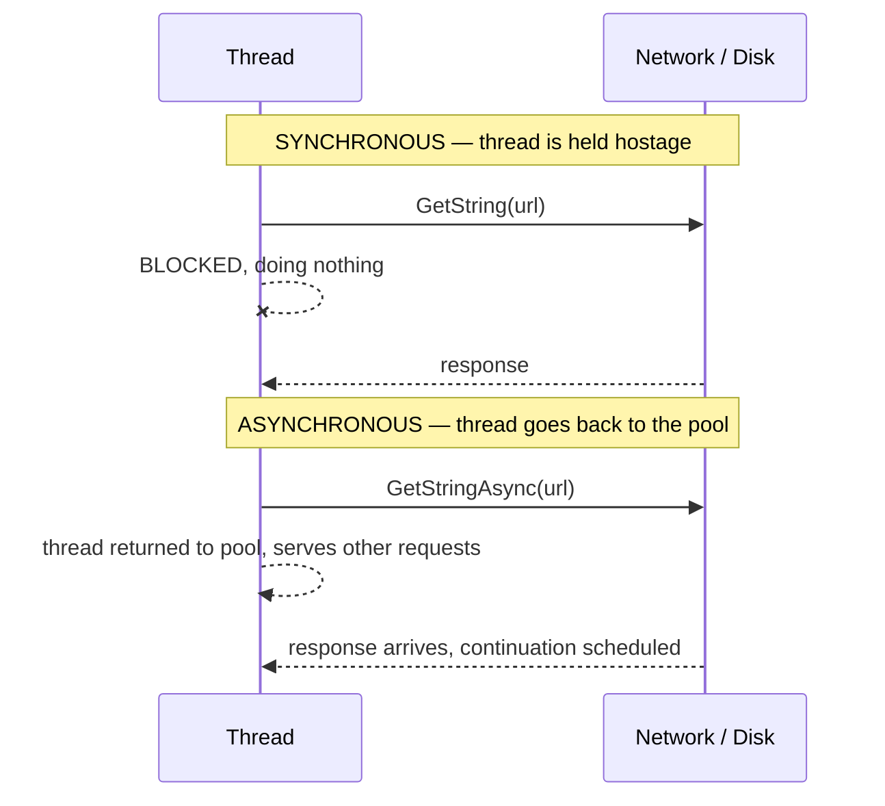
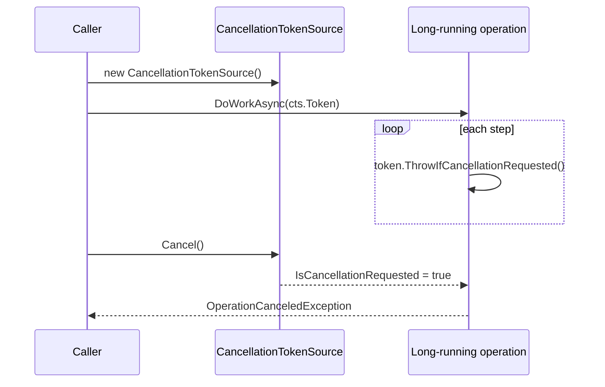
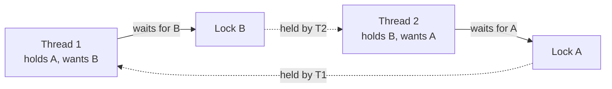

# 08 — Async, Threading, TPL & Locking

> **Scope:** sync vs async explained so it actually lands, `Task` vs `Thread` vs TPL,
> `CancellationToken`, `lock` and the modern `Lock` type, deadlocks and the classic mistakes.
> Broader concurrency theory:
> [Architecture 05 — Concurrency](../Architecture/05-concurrency-and-multithreading.md).

---

## Synchronous vs asynchronous

- **Synchronous** — the operation **blocks** the calling thread until it completes. The thread sits
  there doing nothing while the network or disk works.
- **Asynchronous** — the operation is started and the thread is **released**. When the work
  completes the continuation resumes, possibly on a different thread.



### Synchronous — the blocking version

```c#
public static void Main()
{
    Console.WriteLine("Starting synchronous operation...");
    string result = GetDataFromWeb();      // ⛔ blocks until the response arrives
    Console.WriteLine($"Completed: {result.Length} chars");
}

public static string GetDataFromWeb()
{
    // WebClient is obsolete — HttpClient is the modern type. This is the blocking
    // shape purely for contrast; see the async version below.
    using HttpClient client = new();
    return client.GetStringAsync("https://example.com").GetAwaiter().GetResult();
}
```

Execution stops at `GetDataFromWeb()`. Nothing else on that thread happens until it returns.

### Asynchronous — the non-blocking version

```c#
public static async Task Main()
{
    Console.WriteLine("Starting asynchronous operation...");

    Task<string> resultTask = GetDataFromWebAsync();   // starts, returns immediately
    Console.WriteLine("Program continues doing other work...");

    DoSomethingElse();                                 // real overlap happens here

    string result = await resultTask;                  // yields the thread until it completes
    Console.WriteLine($"Completed: {result.Length} chars");
}

public static async Task<string> GetDataFromWebAsync()
{
    // In production, inject HttpClient via IHttpClientFactory — never 'new' it per call.
    using HttpClient client = new();
    return await client.GetStringAsync("https://example.com");
}
```

> 🎯 **The sentence that shows you understand it:** "`await` does not block a thread — it *returns*
> the thread to the pool and registers a continuation. The wait is free; that is why async scales
> a web server, even though it makes a single operation no faster."

### What `async`/`await` compiles to

The compiler rewrites the method into a **state machine**. Each `await` becomes a state:
capture where we are, hand the continuation to the awaiter, return. When the task completes, the
state machine resumes at the next state.


---

## `Thread` vs `Task` vs the TPL

| | `Thread` | `ThreadPool` | `Task` / TPL |
| --- | --- | --- | --- |
| Level | OS thread, ~1 MB stack | pooled, reused worker | **abstraction over work** |
| Creation cost | expensive | cheap (reused) | cheapest — may not need a thread at all |
| Return a value | ❌ manual plumbing | ❌ | ✅ `Task<T>` |
| Exceptions | lost unless you catch them | lost | captured in the task, rethrown at `await` |
| Cancellation | `Abort` — removed in .NET | none | ✅ `CancellationToken` |
| Continuations | manual | manual | ✅ `await` / `ContinueWith` |
| Composition | none | none | ✅ `WhenAll`, `WhenAny` |
| Use it for | a dedicated long-running loop, custom priority/apartment | legacy fire-and-forget | **everything else** |

### "How are threads different from the TPL?"

- A **thread** is a *resource*. The **TPL** is a *scheduler and programming model*: you express
  **work items** (`Task`s) and the pool decides which thread runs them, with work-stealing queues.
- **I/O-bound async needs no thread at all.** `await httpClient.GetAsync(...)` registers a
  completion callback with the OS — there is no thread parked waiting. This is the single most
  important point: "async ≠ another thread".
- **CPU-bound** work does need a thread: `await Task.Run(() => Compute())` moves it off the caller.

```c#
// CPU-bound → Task.Run (uses a pool thread)
var total = await Task.Run(() => ExpensiveCalculation(input));

// I/O-bound → just await the async API. NEVER Task.Run around it — that wastes a thread.
var payload = await httpClient.GetStringAsync(url);

// Parallel fan-out with concurrency control (.NET 6+)
await Parallel.ForEachAsync(urls, new ParallelOptions { MaxDegreeOfParallelism = 8 },
    async (url, ct) => await ProcessAsync(url, ct));

// Composition
Task<Order>  order  = GetOrderAsync(id);
Task<User>   user   = GetUserAsync(id);
await Task.WhenAll(order, user);              // both run concurrently
var winner = await Task.WhenAny(fast, slow);  // whichever finishes first
```

### The async rules that get people rejected

| ❌ Never | ✅ Instead | Why |
| --- | --- | --- |
| `.Result` / `.Wait()` | `await` | classic deadlock in any context with a scheduler; blocks a pool thread |
| `async void` | `async Task` | exceptions cannot be caught — they crash the process |
| `Task.Run` around an async I/O call | just `await` it | burns a thread for nothing |
| Ignoring a returned `Task` | `await` it, or explicitly discard with a comment | unobserved exceptions vanish |
| `async` methods without a `CancellationToken` | thread it through | nothing can be cancelled |
| `Thread.Sleep` in async code | `await Task.Delay` | `Sleep` blocks the thread |

```c#
// ⛔ The deadlock classic — do not do this
// var data = GetDataAsync().Result;

// ✅ async all the way up to the entry point
public async Task<IResult> Handle() => Results.Ok(await GetDataAsync());
```

- **`ConfigureAwait(false)`** in **library** code avoids capturing the synchronisation context —
  irrelevant in ASP.NET Core (no context) but still correct for a library that might run in WPF or
  WinForms.
- **`ValueTask<T>`** avoids the `Task` allocation for a hot path that usually completes
  synchronously (e.g. a cache hit). It may be awaited **only once**.

---

## `CancellationToken`

**Cooperative cancellation:** nothing is forcibly killed. The *operation itself* observes the token
and stops, which is why it is safe — no torn state, no orphaned locks.



```c#
public static async Task DownloadAsync(CancellationToken cancellationToken)
{
    for (var chunk = 0; chunk < 100; chunk++)
    {
        // Check before each unit of work — this is what makes cancellation "cooperative".
        cancellationToken.ThrowIfCancellationRequested();

        // Pass it down: Delay, HTTP, EF Core and File APIs all accept a token.
        await Task.Delay(1000, cancellationToken);
        Console.WriteLine($"chunk {chunk}");
    }
}

using var cts = new CancellationTokenSource();
cts.CancelAfter(TimeSpan.FromSeconds(5));      // or call cts.Cancel() from a Cancel button

try
{
    await DownloadAsync(cts.Token);
}
catch (OperationCanceledException)
{
    Console.WriteLine("Download cancelled — no further chunks processed.");
}
```

**Where it earns its keep:** a user abandoning a large download or report, an HTTP request the client
disconnected from (ASP.NET Core gives you `HttpContext.RequestAborted`), a timeout, or shutting down
a background service cleanly.

```c#
// Composite tokens: cancel when EITHER the request aborts or the timeout fires
using var timeout = new CancellationTokenSource(TimeSpan.FromSeconds(30));
using var linked  = CancellationTokenSource.CreateLinkedTokenSource(
    HttpContext.RequestAborted, timeout.Token);
await repository.QueryAsync(linked.Token);
```

**Rules:** accept `CancellationToken` as the **last parameter**, default it to `default`, thread it
into every async call you make, and let `OperationCanceledException` propagate — do not "handle" a
cancellation as if it were an error.

---

## Locking

**`lock` guarantees that only one thread at a time enters a critical section**, preventing race
conditions on shared mutable state.

```c#
public class Account
{
    // Modern C# 13 / .NET 9+: System.Threading.Lock — faster than locking on an object,
    // and the compiler warns if you accidentally use it with the old pattern.
    private readonly Lock _gate = new();
    private int _balance;

    public bool Withdraw(int amount)
    {
        lock (_gate)                     // only one thread inside at a time
        {
            if (amount > _balance) return false;
            _balance -= amount;          // read-modify-write is now atomic w.r.t. other lockers
            return true;
        }
    }
}
```

Before .NET 9 the idiom was a plain private object — still perfectly valid:

```c#
private readonly object _thisLock = new();
lock (_thisLock) { /* critical section */ }
```

### Why a race condition happens

`_balance -= amount` is **three** operations — read, subtract, write. Two threads interleaving them
can both read 100, both subtract 60, and both write 40, so 120 leaves an account holding 100.

### Locking rules

| Rule | Reason |
| --- | --- |
| Lock on a **private, readonly** field | anything public can be locked by foreign code → deadlock |
| **Never** `lock (this)` or `lock (typeof(T))` or on a **string** | all are publicly reachable; interned strings are process-wide |
| Keep the critical section **tiny** | a lock serialises every thread that wants it |
| **Never `await` inside a `lock`** | it does not compile, and the lock is thread-affine anyway — use `SemaphoreSlim` |
| Always acquire multiple locks **in the same order** | different orders = textbook deadlock |
| Prefer no lock at all | `Interlocked`, `ConcurrentDictionary`, immutability |

```c#
// Async-safe mutual exclusion — SemaphoreSlim, because 'lock' cannot span an await
private readonly SemaphoreSlim _mutex = new(1, 1);

public async Task UpdateAsync()
{
    await _mutex.WaitAsync();
    try { await SaveAsync(); }
    finally { _mutex.Release(); }        // ⚠️ release in finally, always
}

// Cheaper than a lock for a single counter
Interlocked.Increment(ref _hits);
```

### Deadlock



Four conditions must hold: mutual exclusion, hold-and-wait, no pre-emption, circular wait. Break any
one — usually the **circular wait**, by fixing a global lock ordering, or by using a single lock, or
by using `Monitor.TryEnter` with a timeout.

### Thread-safe singleton

```c#
// The classic lock version (what the interviewer usually expects to see)
public sealed class Logger
{
    private static Logger? _instance;
    private static readonly Lock _padlock = new();

    private Logger() { }

    public static Logger Instance
    {
        get
        {
            // Double-checked locking: avoid taking the lock once it is created.
            if (_instance is not null) return _instance;
            lock (_padlock)
            {
                return _instance ??= new Logger();
            }
        }
    }
}

// ✅ Better in modern C#: Lazy<T> is thread-safe by default and far harder to get wrong.
public sealed class Logger2
{
    private static readonly Lazy<Logger2> Lazy = new(() => new Logger2());
    public static Logger2 Instance => Lazy.Value;
    private Logger2() { }
}

// ✅ Best in an app with DI: let the container own the lifetime.
// builder.Services.AddSingleton<ILogger, Logger>();
```

> 🎯 **Say this:** "The `lock`-based singleton is the textbook answer, but in a real .NET app I would
> register it as a DI singleton, or use `Lazy<T>` — both are thread-safe without hand-written
> double-checked locking, which is easy to get subtly wrong."

---

## `Lazy<T>` — deferred, thread-safe initialisation

Lazy initialisation defers expensive work until someone actually needs the result. The point is
**not** that it runs faster: the cost is *avoided entirely* if the value is never read, and paid
**exactly once** if it is.

```c#
public sealed class ReportService
{
    // Nothing is built when ReportService is constructed...
    private readonly Lazy<IReadOnlyList<int>> _lookup = new(() =>
    {
        var table = new List<int>(5_000_000);
        for (int i = 0; i < 5_000_000; i++) table.Add(i);
        return table;
    });

    // ...the factory runs on the FIRST read of .Value, then the result is cached.
    public int Count => _lookup.Value.Count;
}
```

`Lazy<T>` is **thread-safe by default** — `LazyThreadSafetyMode.ExecutionAndPublication`, meaning
concurrent first-readers block and the factory runs once. That default is what makes it the
cleanest thread-safe singleton in C#:

```c#
public sealed class Singleton
{
    private static readonly Lazy<Singleton> _instance = new(() => new Singleton());
    public static Singleton Instance => _instance.Value;
    private Singleton() { }
}
```

| Mode | Factory may run | Use when |
| --- | --- | --- |
| `ExecutionAndPublication` (default) | once, others block | almost always |
| `PublicationOnly` | concurrently; first result wins, others discarded | the factory is cheap and side-effect free |
| `None` | no synchronisation at all | single-threaded access, guaranteed |

> ⚠️ If the factory **throws**, `ExecutionAndPublication` caches the exception — every later
> `.Value` rethrows the same one. Pass `LazyThreadSafetyMode.PublicationOnly` if you need retries.

> ⚠️ Do not confuse this with EF Core's **lazy loading** of navigation properties. Same idea, very
> different failure mode: there it causes N+1 queries. See
> [Architecture 07 — Databases & ORM](../Architecture/07-databases-and-orm.md).

> 🎯 **The senior answer:** "`Lazy<T>` defers construction to first use and caches the result;
> the default thread-safety mode runs the factory exactly once even under contention, which makes
> it the idiomatic thread-safe singleton. Just remember it caches a thrown exception too."

---

## Rapid-fire Q&A

**Q: Does `async` create a new thread?**
No. For I/O it uses an OS completion callback and no thread waits. Only `Task.Run` (or an explicit
thread) introduces one.

**Q: `Task` vs `Thread`?**
`Thread` is an OS resource you manage. `Task` is a unit of work with a result, exception capture,
cancellation and composition, scheduled onto the pool.

**Q: Why is `.Result` dangerous?**
It blocks the calling thread. In a context with a single-threaded scheduler the continuation can
never run, so it deadlocks; in ASP.NET Core it starves the thread pool under load.

**Q: What does `finally` guarantee around a lock?**
That the lock is released even if the body throws. `lock` compiles to `Monitor.Enter` +
`try/finally { Monitor.Exit }` for you — but a manual `SemaphoreSlim` needs the `finally` yourself.

**Q: How do you cancel a `Task`?**
You do not cancel the task — you signal a `CancellationTokenSource` and the operation cooperatively
stops by observing the token.

**Q: `Task.WhenAll` vs `Task.WaitAll`?**
`WhenAll` returns a task you `await` (non-blocking). `WaitAll` blocks the current thread.

**Q: What is a captive dependency / thread-pool starvation?**
Blocking pool threads (via `.Result`, `Thread.Sleep`, or sync-over-async) exhausts the pool, so new
requests queue and latency explodes — while CPU sits idle. It is the number-one cause of "the app is
slow but the servers are bored".

---

**Prev:** [07 — Delegates, Events & LINQ](07-delegates-events-and-linq.md) ·
**Next:** [09 — ASP.NET Core Pipeline & DI](09-aspnet-core-pipeline-and-di.md) ·
**Up:** [Interview hub](readme.md)
