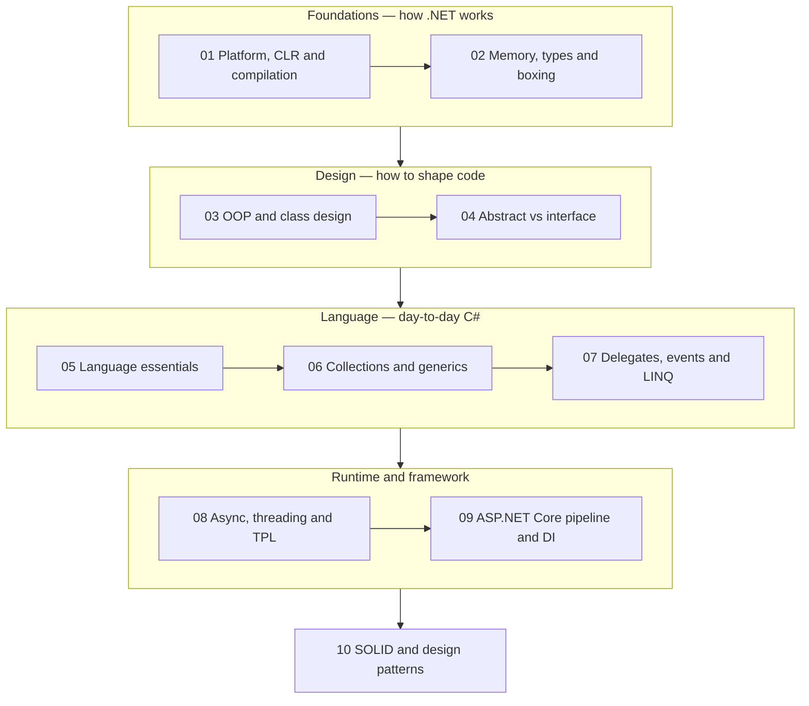

# C# & .NET 10 — Interview Prep Hub

> **What this is.** A crystal-clear, hands-on interview track for **.NET 10 (LTS) / C# 14**, rebuilt
> from two sets of personal notes (`.Net_Q` and `.Net_CSharp_Interview_Questions_List`) and brought
> up to date: every answer verified, every dated claim corrected, every concept given runnable code
> and — where it helps — a diagram.
>
> **How to use it.** Work top to bottom for a full pass, or jump to a weak area. Each chapter ends
> with a **Rapid-fire Q&A** you can drill the night before.

---

## The track

| # | Chapter | Covers |
| --- | --- | --- |
| 01 | [Platform, CLR & Compilation](01-dotnet-platform-and-clr.md) | .NET vs C#, IL, JIT & tiered compilation, Native AOT, CLR/CTS/CLS, managed vs unmanaged, GC basics, .NET 10 vs .NET Framework, LTS vs STS |
| 02 | [Memory, Types & Boxing](02-memory-and-type-system.md) | value vs reference types, **stack vs heap told correctly**, struct vs class, boxing costs, casting, `ref`/`out`/`in`, strong vs weak references |
| 03 | [OOP & Class Design](03-oop-and-class-design.md) | four pillars, association/composition/aggregation/inheritance (UML), access modifiers in inheritance, constructor chaining, polymorphism, `sealed`/`static`/`abstract`/`partial` |
| 04 | [Abstract vs Interface](04-abstract-vs-interface.md) | the full comparison at C# 14, default interface methods, static abstract members, when to use which — and why "both" is often right |
| 05 | [Language Essentials](05-language-essentials.md) | keywords, namespaces, comments, operators, access modifiers, pattern matching, arrays & spans, exception handling, extension methods, `dynamic` vs reflection |
| 06 | [Collections & Generics](06-collections-and-generics.md) | array vs `ArrayList` vs `List<T>`, choosing a collection, Big-O, constraints, variance, `yield` & deferred execution |
| 07 | [Delegates, Events & LINQ](07-delegates-events-and-linq.md) | delegates, `Func`/`Action`/`Predicate`, multicast pitfalls, events & the subscription leak, closures, LINQ execution model |
| 08 | [Async, Threading & TPL](08-async-threading-and-tpl.md) | sync vs async, state machines, `Thread` vs `Task` vs TPL, `CancellationToken`, `lock`/`Lock`, deadlocks, thread-safe singleton |
| 09 | [ASP.NET Core Pipeline & DI](09-aspnet-core-pipeline-and-di.md) | middleware order, custom middleware, DI lifetimes, **captive dependencies**, routing, filters, `ActionResult<T>` |
| 10 | [SOLID & Design Patterns](10-solid-and-patterns.md) | SOLID with bad→good pairs, Singleton, Abstract Factory, Builder, Prototype |

---

## The 12 answers to have word-perfect

| Question | The 15-second answer |
| --- | --- |
| **.NET vs C#?** | .NET is the platform — runtime, GC, BCL, SDK. C# is one of the languages that compiles to it. |
| **What is IL and why?** | CPU-independent instructions in your `.dll`. Gives portability, cross-language interop, verification, and lets the JIT optimise for the real CPU and real branch behaviour. |
| **Value vs reference type?** | Value types hold the data and copy on assignment; reference types hold an address and share. Storage depends on *where the variable lives*, not just its type. |
| **Boxing cost?** | A heap allocation plus two copies plus a type check — fine once, fatal in a loop. |
| **Abstract class vs interface?** | Interface = contract, multiple, no state. Abstract class = base type with shared state and constructor. Interface by default; abstract class when you need state. |
| **`override` vs `new`?** | `override` replaces the vtable slot so dispatch follows the object. `new` hides the name so dispatch follows the variable's declared type. |
| **DI lifetimes?** | Transient per resolve, Scoped per request, Singleton per app. Never inject a shorter-lived service into a longer-lived one. |
| **Does `await` create a thread?** | No. For I/O it registers a completion callback and returns the thread to the pool. Only `Task.Run` uses a thread. |
| **Why is `.Result` dangerous?** | It blocks a pool thread and can deadlock; under load it starves the pool while the CPU sits idle. |
| **Middleware order?** | Exception handler outermost, then HTTPS/static files, routing, CORS, **authentication before authorization**, then endpoints. |
| **`throw` vs `throw ex`?** | `throw;` preserves the stack trace. `throw ex;` resets it and destroys the evidence. |
| **Can the GC free unmanaged memory?** | No. Use `IDisposable`/`using`, or a `SafeHandle`. `GC.Collect()` is not an answer. |

---

## What the older notes got wrong

These are the corrections baked into this track — knowing *why* they changed is exactly what
separates a rehearsed answer from an informed one. The two older note files (`csharp.md`, a
question bank with no answers, and `csharp-old.md`) have been **folded into the chapters below**,
so each topic now lives in exactly one place.

| Old claim | Corrected |
| --- | --- |
| "Value types go on the stack" | Storage depends on where the variable lives. A struct field of a class lives on the heap; a captured local is hoisted into a heap closure. → [02](02-memory-and-type-system.md) |
| "Reflection does type checking at **compile** time" | Reflection is entirely **run time**. Both it and `dynamic` bind at run time. → [05](05-language-essentials.md) |
| "Interfaces cannot contain any implementation" | Since **C# 8** they can — default methods, private helpers, static members; since **C# 11**, static abstract members. → [04](04-abstract-vs-interface.md) |
| "Access modifiers are not applied to a sealed class" | They are, and should be. `sealed` restricts *inheritance*, not visibility. → [03](03-oop-and-class-design.md) |
| "Multicast delegates only work with `void`" | They work with any return type — but only the **last** result survives, so non-`void` multicast is a design smell. → [07](07-delegates-events-and-linq.md) |
| "`~=` is a bitwise assignment operator" | No such operator in C#. The set is `&=`, `\|=`, `^=`, `<<=`, `>>=`. → [05](05-language-essentials.md) |
| "The last `app.Run();` starts the app" — used interchangeably with terminal middleware | `app.Run(RequestDelegate)` is **terminal middleware**; `app.Run()` **starts the host**. Two different methods. → [09](09-aspnet-core-pipeline-and-di.md) |
| "Routing is configured in `Startup.cs` → `Configure` / `UseEndpoints`" | Minimal hosting (since .NET 6) merged `Startup` into `Program.cs`; `app.MapControllers()` replaces the `UseEndpoints` block. → [09](09-aspnet-core-pipeline-and-di.md) |
| "`if (weak.IsAlive) { use weak.Target; }`" | Racy — the GC can collect between the two calls. Use `WeakReference<T>.TryGetTarget`. → [02](02-memory-and-type-system.md) |
| "`.NET Core` vs `.NET Framework`" | The name "Core" was retired at **.NET 5**. Say **.NET 10** vs **.NET Framework 4.8.1**. → [01](01-dotnet-platform-and-clr.md) |
| "C# is simple because it has no pointers" | C# *does* have pointers, behind `unsafe` + `AllowUnsafeBlocks`. Prefer `Span<T>`/`ref` — same speed, verified safety. → [01](01-dotnet-platform-and-clr.md) |
| `WebClient` in the sync-vs-async example | Obsolete. `HttpClient` (injected via `IHttpClientFactory`) is the modern type. → [08](08-async-threading-and-tpl.md) |

---

## Self-test — 20 questions, no notes

Give yourself 30 seconds each. Anything you stumble on, open the linked chapter.

1. Why does .NET compile to IL instead of native code? → [01](01-dotnet-platform-and-clr.md)
2. What does dynamic PGO let the JIT do that a static compiler cannot? → [01](01-dotnet-platform-and-clr.md)
3. Can the GC reclaim a file handle? What do you use instead? → [01](01-dotnet-platform-and-clr.md)
4. Where does a `DateTime` field of a class live, and why? → [02](02-memory-and-type-system.md)
5. Name three places boxing sneaks in, and the fix for each. → [02](02-memory-and-type-system.md)
6. `ref` vs `out` vs `in` — who must initialise, who must assign? → [02](02-memory-and-type-system.md)
7. Composition vs aggregation, with an example of each. → [03](03-oop-and-class-design.md)
8. Why can't C# have multiple class inheritance? → [03](03-oop-and-class-design.md)
9. What does `Base b = new Derived(); b.HiddenMethod();` call, and why? → [03](03-oop-and-class-design.md)
10. Give a case where an interface *cannot* replace an abstract class. → [04](04-abstract-vs-interface.md)
11. How do you add a member to a published interface without breaking implementers? → [04](04-abstract-vs-interface.md)
12. Why is `is not null` preferable to `!= null`? → [05](05-language-essentials.md)
13. What is the difference between `catch (X) when (...)` and an `if` inside the catch? → [05](05-language-essentials.md)
14. Why is `ArrayList` slower than `List<int>`? Two reasons. → [06](06-collections-and-generics.md)
15. Why is `List<T>` invariant when `IEnumerable<T>` is covariant? → [06](06-collections-and-generics.md)
16. What does a multicast `Func<int>` return? → [07](07-delegates-events-and-linq.md)
17. How does an event subscription leak memory, and how do you fix it? → [07](07-delegates-events-and-linq.md)
18. Does `await` use a thread while waiting on HTTP? → [08](08-async-threading-and-tpl.md)
19. Why is injecting a `DbContext` into a singleton a bug? → [09](09-aspnet-core-pipeline-and-di.md)
20. Which SOLID principle does `NotImplementedException` in an override break, and what usually caused it? → [10](10-solid-and-patterns.md)

---

## Related reading already on this blog

**C# / .NET reference**
[modern-csharp.md](../../CSharp/modern-csharp.md) — C# 12–14 language features ·
[tips.md](../../CSharp/tips.md) — pattern matching ·
[OOP.md](../../CSharp/OOP.md) — classes, objects, constructors ·
[csharp-solid.md](../../CSharp/csharp-solid.md) — SOLID with analogies ·
[csharp-delegate.md](../../CSharp/csharp-delegate.md) — delegate deep-dive ·
[ef.md](../../CSharp/ef.md) — EF Core ·
[security-and-cryptography.md](../../CSharp/security-and-cryptography.md) ·
[Filters](../../CSharp/Filters/filter.md) ·
[Dotnet CLI](../../CSharp/Dotnet/dotnet-cli.md)

**Wider senior/architect track**
[Architecture track](../Architecture/readme.md) — 18 chapters spanning collections, concurrency,
GC & profiling, databases, REST, messaging, microservices, security, cloud, testing, DevOps,
observability and NFRs ·
[GOF patterns](../../GOF/GOF.md) ·
[SQL](../../SQL/sql.md) ·
[API design](../../API/API.md)
