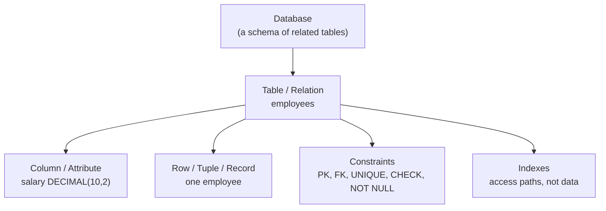
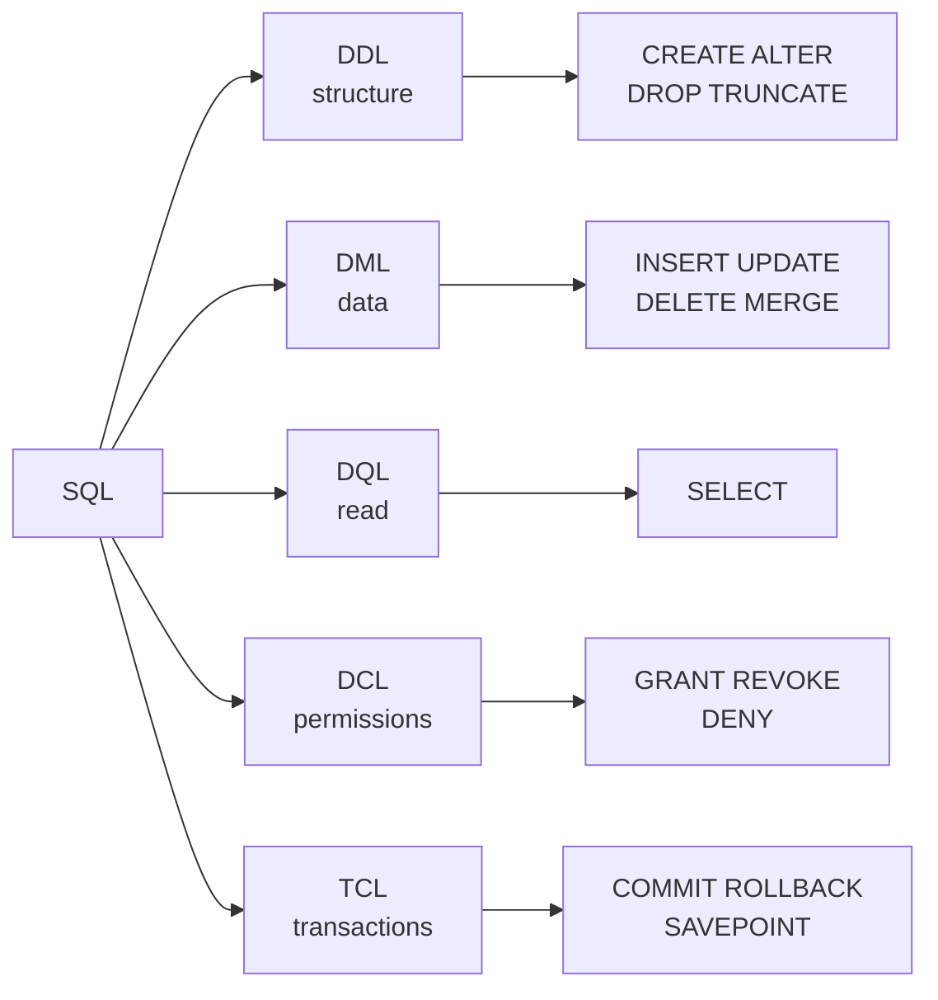

# 01 — Relational Foundations & SQL Sublanguages

> **Scope:** the vocabulary and the command families. This chapter is the one that makes the rest
> readable — if you cannot say precisely what a *relation*, a *candidate key* or a *DDL statement*
> is, every later answer sounds vague.
> Set up the practice database in [the hub](readme.md#set-up-the-practice-database) first; every
> query in this track runs against it.

---

## What SQL is — and what it is not

SQL (Structured Query Language) is a **declarative, set-oriented** language for defining and
querying relational data. You state *what* you want; the engine's query optimiser decides *how* to
get it.

That single sentence carries the two ideas interviewers probe:

| Property | What it means in practice |
| --- | --- |
| **Declarative** | You never write the loop. `WHERE country = 'IN'` does not say "scan the table" — the optimiser may seek an index instead. This is why the *same* query gets faster when you add an index and slower when statistics go stale. |
| **Set-oriented** | Every operation takes and returns a **multiset of rows**, not one row. Thinking row-at-a-time is what produces cursors and RBAR ("row by agonising row") code that runs 100× slower than the set-based equivalent — see [10 — Programmability](10-views-procedures-functions-triggers.md#cursors--and-why-you-usually-want-a-set-based-rewrite). |

> ⚠️ **SQL is a standard, not a product.** ANSI/ISO SQL defines the language; **SQL Server, MySQL,
> PostgreSQL, Oracle and SQLite** are implementations that each extend it. So "does SQL support
> `LIMIT`?" has no answer — MySQL/PostgreSQL do, SQL Server uses `OFFSET … FETCH` (and the
> proprietary `TOP`). Dialect differences are listed in
> [03 — Dialect cheat-sheet](03-querying-and-logical-order.md#dialect-cheat-sheet).

### "What is the difference between SQL and MySQL?"

A deliberately easy opener that a surprising number of candidates fumble.

| SQL | MySQL |
| --- | --- |
| A **language** — the ANSI standard for relational query and definition | A **product** — an open-source RDBMS owned by Oracle |
| Not installed, not versioned per-vendor, has no storage engine | Installed, versioned (8.x), has storage engines (InnoDB, MyISAM) |
| Same category as: C#, XPath | Same category as: SQL Server, PostgreSQL, Oracle DB |

> 🎯 **The one-liner:** "SQL is the language; MySQL is one of many database engines that speak it.
> SQL Server and PostgreSQL are the same kind of thing as MySQL, not the same kind of thing as SQL."

---

## The relational vocabulary, said precisely



| Loose term | Formal term | The precise definition |
| --- | --- | --- |
| Table | **relation** | A named set of rows with a fixed set of typed columns. Has **no inherent order** — see the warning below. |
| Row / record | **tuple** | One complete fact. Uniquely identifiable by its primary key. |
| Column / field | **attribute** | A named, typed slot. `NOT NULL` is part of the type, in effect. |
| Number of columns | **degree** | Fixed by the schema. |
| Number of rows | **cardinality** | Varies with the data. |
| — | **domain** | The set of legal values for a column (its data type plus its `CHECK` constraints). |

> ⚠️ **A table has no order.** This is the most commonly violated rule in production code. Without
> an `ORDER BY`, the engine may return rows in any order, and *that order can change* when an index
> is added, statistics update, or the query goes parallel. A `SELECT` you rely on for ordering
> without `ORDER BY` is a latent bug, not a working query. A clustered index makes a particular
> order *likely*, never *guaranteed*.

### DBMS vs RDBMS

- A **DBMS** is any software that stores, retrieves and manages data.
- An **RDBMS** is a DBMS built on the relational model: data in tables, relationships expressed by
  **foreign keys**, and a query language (SQL) with **declarative integrity constraints**.
- A **non-relational (NoSQL)** store drops one or more of those — no fixed schema, no joins, or no
  cross-document transactions — in exchange for horizontal scale or a friendlier shape for the data.
  The trade-off is worked through in
  [Architecture 07 — Databases & ORM](../Architecture/07-databases-and-orm.md#rdbms-vs-nosql).

---

## The five sublanguages

Every SQL statement belongs to exactly one of five families. Interviewers ask this to check whether
you know *which statements can be rolled back* — the practical consequence.



| Family | Stands for | Statements | Changes | Rollback? |
| --- | --- | --- | --- | --- |
| **DDL** | Data **Definition** Language | `CREATE`, `ALTER`, `DROP`, `TRUNCATE` | the **schema** | ✅ in SQL Server / PostgreSQL (transactional DDL) · ❌ in MySQL and Oracle (implicit commit) |
| **DML** | Data **Manipulation** Language | `INSERT`, `UPDATE`, `DELETE`, `MERGE` | the **rows** | ✅ always |
| **DQL** | Data **Query** Language | `SELECT` | nothing | n/a |
| **DCL** | Data **Control** Language | `GRANT`, `REVOKE`, `DENY` | **permissions** | ✅ in SQL Server |
| **TCL** | **Transaction** Control Language | `BEGIN`, `COMMIT`, `ROLLBACK`, `SAVE TRANSACTION` | transaction boundaries | — it *is* the mechanism |

> 💡 **Memory hook:** *Define, Manipulate, Query, Control, Transact* — D-M-Q-C-T. Many textbooks
> fold DQL into DML (because `SELECT` is technically DML in the standard). If an interviewer says
> "there are four", they are using that grouping — say so rather than arguing.

### Hands-on: one statement from each family

```sql
-- DDL — define structure
CREATE TABLE departments (
    department_id   INT           NOT NULL PRIMARY KEY,
    name            NVARCHAR(60)  NOT NULL UNIQUE
);

CREATE TABLE employees (
    employee_id     INT            NOT NULL IDENTITY(1,1) PRIMARY KEY,
    full_name       NVARCHAR(120)  NOT NULL,
    email           NVARCHAR(200)  NOT NULL UNIQUE,
    salary          DECIMAL(10, 2) NOT NULL CHECK (salary > 0),
    hired_on        DATE           NOT NULL DEFAULT SYSUTCDATETIME(),
    manager_id      INT            NULL REFERENCES employees(employee_id),
    department_id   INT            NOT NULL REFERENCES departments(department_id)
);

-- DDL — change structure
ALTER TABLE employees ADD phone NVARCHAR(20) NULL;

-- DML — change data
INSERT INTO departments (department_id, name) VALUES (1, N'Engineering'), (2, N'Finance');

UPDATE employees
SET    salary = salary * 1.05
WHERE  department_id = 1;

-- DQL — read data
SELECT d.name, COUNT(*) AS headcount, AVG(e.salary) AS avg_salary
FROM   employees   AS e
JOIN   departments AS d ON d.department_id = e.department_id
GROUP  BY d.name;

-- DCL — control access
GRANT SELECT ON employees TO reporting_role;
REVOKE UPDATE ON employees FROM reporting_role;

-- TCL — bound a unit of work
BEGIN TRANSACTION;
    UPDATE accounts SET balance = balance - 100 WHERE account_id = 1;
    UPDATE accounts SET balance = balance + 100 WHERE account_id = 2;
COMMIT;
```

> ⚠️ **`ADD phone NVARCHAR(20) NULL` is instant; `ADD phone NVARCHAR(20) NOT NULL DEFAULT ''` may
> not be.** Adding a nullable column is a metadata-only change. Adding a `NOT NULL` column with a
> default rewrites every row on some engines and versions, which on a large table means a long
> exclusive lock. Zero-downtime schema change is chapter
> [13 — Schema Change & Migrations](13-schema-change-and-migrations.md).

---

## Statement, clause, predicate, expression

Precision here separates a senior answer from a junior one.

| Term | Definition | Example |
| --- | --- | --- |
| **Statement** | A complete instruction, terminated by `;` | `SELECT * FROM employees;` |
| **Clause** | A named section of a statement | `WHERE`, `GROUP BY`, `ORDER BY` |
| **Predicate** | An expression that evaluates to `TRUE` / `FALSE` / `UNKNOWN` | `salary > 50000`, `email IS NULL` |
| **Expression** | Anything producing a value | `salary * 1.1`, `CONCAT(first, ' ', last)` |
| **Batch** | A set of statements sent together (T-SQL: separated by `GO` in tooling) | — |

> 💡 Note the third truth value: SQL predicates are **three-valued** (`TRUE`/`FALSE`/`UNKNOWN`), not
> boolean. That is the root of every `NULL` surprise — see
> [02 — NULL and three-valued logic](02-data-types-and-constraints.md#null-and-three-valued-logic).

### Comments

```sql
-- A single-line comment runs to end of line.
SELECT * FROM employees;   -- trailing comments are fine too

/* A block comment
   can span lines, and is the only form
   that can be nested in T-SQL. */
SELECT /* inline */ full_name FROM employees;
```

---

## `DELETE` vs `TRUNCATE` vs `DROP`

Asked in almost every SQL screen. The answer that scores is the one that names **DML vs DDL** and
**what happens to identity values**.

| | `DELETE` | `TRUNCATE TABLE` | `DROP TABLE` |
| --- | --- | --- | --- |
| Family | **DML** | **DDL** | **DDL** |
| Removes | selected rows (or all) | **all** rows | rows **and the table itself** |
| `WHERE` clause | ✅ | ❌ | ❌ |
| Logging | **per row** — slow on millions | per **page deallocation** — fast | per deallocation |
| Fires triggers | ✅ `DELETE` triggers | ❌ **never** | ❌ |
| Identity / `AUTO_INCREMENT` seed | **kept** | **reset to seed** | gone with the table |
| Blocked by an inbound FK | only for referenced rows | ✅ **always**, even if the child table is empty | ✅ unless the FK is dropped first |
| Rollback inside a transaction | ✅ | ✅ **in SQL Server / PostgreSQL** · ❌ in MySQL / Oracle | ✅ in SQL Server / PostgreSQL |
| Reclaims space | not immediately | ✅ | ✅ |
| Permission needed | `DELETE` | `ALTER` | `ALTER`/`CONTROL` |

```sql
DELETE FROM employees WHERE department_id = 2;   -- 1 row per log record, triggers fire, IDENTITY kept
TRUNCATE TABLE staging_import;                   -- whole table, no triggers, IDENTITY back to 1
DROP TABLE staging_import;                       -- table gone: schema, indexes, permissions, triggers
```

> 🎯 **The complete answer:** "`DELETE` is DML — row-by-row, logged individually, fires triggers,
> can be filtered, keeps the identity seed. `TRUNCATE` is DDL — it deallocates pages, so it is
> dramatically faster, cannot be filtered, fires no triggers, and resets identity. `DROP` removes
> the object. The gotcha people miss is that `TRUNCATE` is refused if *any* foreign key references
> the table — even when the referencing table is empty — and that in SQL Server all three are
> transactional, so the old 'TRUNCATE can't be rolled back' claim is MySQL/Oracle behaviour, not a
> universal truth."

> ⚠️ **`DELETE` without `WHERE` deletes every row.** In an interview, say out loud that you would
> run the `SELECT` first, wrap it in an explicit transaction, and check the affected row count
> before committing. Interviewers notice.

---

## Rapid-fire Q&A

**Q: Is SQL a programming language?**
It is a **declarative, domain-specific** language — Turing-complete only with vendor procedural
extensions (T-SQL, PL/pgSQL, PL/SQL). Plain `SELECT`/`INSERT` has no loops or branches.

**Q: Difference between a primary key and a unique key?**
Both enforce uniqueness. A table has **exactly one** primary key, which is implicitly `NOT NULL`; it
can have **many** unique constraints, and (in SQL Server) each unique constraint permits **one**
`NULL`. Full treatment in [02](02-data-types-and-constraints.md#keys).

**Q: Is `TRUNCATE` DDL or DML, and why does it matter?**
DDL. It matters because it bypasses triggers, resets identity, requires `ALTER` permission, and is
blocked by inbound foreign keys.

**Q: What is a schema?**
A namespace inside a database that owns objects and can be granted permissions as a unit
(`dbo.employees`, `sales.orders`). In MySQL, "schema" is a synonym for "database" — a real dialect
trap.

**Q: What does `NULL` mean?**
"Unknown" or "not applicable" — **not** zero and not empty string. `NULL = NULL` is `UNKNOWN`.

**Q: Can `SELECT` change data?**
Not by itself. But `SELECT … INTO` creates a table (DDL), and a `SELECT` calling a procedure or a
non-deterministic function can have side effects. `SELECT` also takes locks under the default
isolation level — [09](09-transactions-and-concurrency.md).

**Q: What is the difference between `WHERE` and `HAVING`?**
`WHERE` filters **rows before** grouping; `HAVING` filters **groups after** aggregation, so only
`HAVING` may reference an aggregate. See [05](05-aggregation-and-window-functions.md#where-vs-having).

**Q: How do you find every table in a database, portably?**
`SELECT * FROM INFORMATION_SCHEMA.TABLES;` — the ANSI catalogue view, supported by SQL Server,
MySQL and PostgreSQL. `sys.tables` is the SQL Server-specific (and richer) equivalent.

---

**Next:** [02 — Data Types & Constraints](02-data-types-and-constraints.md) ·
**Up:** [SQL interview hub](readme.md)
