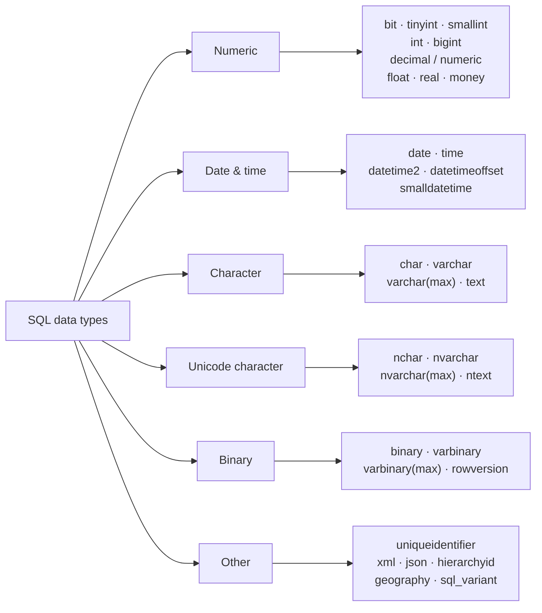

# 02 — Data Types & Constraints

> **Scope:** picking the right type, the constraints that make the database — not your C# — the
> guardian of integrity, and the `NULL` semantics behind most "why did my query return nothing?"
> bugs.

---

## The data type families



### Numeric — and the .NET type each maps to

| SQL Server type | Range / precision | Bytes | .NET type |
| --- | --- | --- | --- |
| `bit` | 0, 1, `NULL` | 1 (8 bits packed) | `bool` |
| `tinyint` | 0 … 255 | 1 | `byte` |
| `smallint` | ±32 767 | 2 | `short` |
| `int` | ±2.1 billion | 4 | `int` |
| `bigint` | ±9.2 × 10¹⁸ | 8 | `long` |
| `decimal(p,s)` / `numeric(p,s)` | **exact**, up to 38 digits | 5–17 | `decimal` |
| `float(53)` | approximate, ~15 digits | 8 | `double` |
| `real` / `float(24)` | approximate, ~7 digits | 4 | `float` |
| `money` | 4 fixed decimal places | 8 | `decimal` |

> ⚠️ **Never store money in `float`/`real`.** They are binary floating point: `0.1` has no exact
> binary representation, so sums drift. Use `decimal(19,4)` (or `decimal(19,2)`), which is
> **exact** decimal arithmetic and maps to `System.Decimal`. This is the same reason C# uses
> `decimal` rather than `double` for currency.

```sql
-- The demonstration to have ready
DECLARE @f FLOAT = 0.0, @d DECIMAL(19,4) = 0.0;
DECLARE @i INT = 0;
WHILE @i < 10 BEGIN SET @f += 0.1; SET @d += 0.1; SET @i += 1; END;

SELECT @f AS as_float, @d AS as_decimal;
-- as_float = 0.99999999999999989   as_decimal = 1.0000
```

> ⚠️ **`money` is a trap of its own.** It holds only 4 decimal places and **truncates
> intermediate results** in division, so `$100 / 3 * 3` does not come back as `$100`. Prefer
> `decimal(19,4)`.

### Character — `CHAR` vs `VARCHAR` vs `NVARCHAR`

| | `CHAR(n)` | `VARCHAR(n)` | `NVARCHAR(n)` |
| --- | --- | --- | --- |
| Length | **fixed** — padded with spaces | variable | variable |
| Storage | exactly `n` bytes | actual length + 2 bytes | actual length × 2 + 2 bytes |
| Encoding | 1 byte per char (collation code page) | same | **UTF-16**, 2 bytes per char |
| Max `n` | 8 000 | 8 000 (`MAX` → 2 GB) | 4 000 (`MAX` → 2 GB) |
| Use for | genuinely fixed codes — `CHAR(2)` country, `CHAR(3)` currency | ASCII-only text of varying length | **anything user-facing** |

> 🎯 **The answer:** "`CHAR` is fixed width and space-padded, so it is only right when the value
> really is a fixed length — a two-letter country code. `VARCHAR` stores the actual length plus a
> 2-byte offset, so it wins for anything variable. `NVARCHAR` is the Unicode form at two bytes per
> character; I default to `NVARCHAR` for names, addresses and anything a user types, because a
> single non-Latin character in a `VARCHAR` column is silently corrupted into `?`."

> 💡 **Modern nuance worth mentioning:** since SQL Server 2019 a `VARCHAR` column with a `_UTF8`
> collation stores UTF-8, so it can hold Unicode at ~1 byte per character for Latin text. On MySQL
> and PostgreSQL, `VARCHAR` is already Unicode (`utf8mb4` / `UTF8`) and there is **no `NVARCHAR`** —
> a common dialect slip.

> ⚠️ `TEXT` / `NTEXT` / `IMAGE` are **deprecated**. Use `VARCHAR(MAX)`, `NVARCHAR(MAX)`,
> `VARBINARY(MAX)`.

### Date & time

| Type | Stores | Bytes | .NET type |
| --- | --- | --- | --- |
| `date` | date only, 0001-01-01 → 9999-12-31 | 3 | `DateOnly` (.NET 6+) |
| `time(n)` | time only | 3–5 | `TimeOnly` |
| `datetime2(n)` | date + time, 100 ns precision | 6–8 | `DateTime` |
| `datetimeoffset(n)` | date + time + **UTC offset** | 8–10 | `DateTimeOffset` |
| `datetime` | **legacy** — 3.33 ms rounding | 8 | `DateTime` |

> ⚠️ **`datetime` rounds to 1/300th of a second**, so `23:59:59.999` becomes the *next day*.
> Use `datetime2`. And for anything that crosses a time zone, store `datetimeoffset` or store UTC
> in `datetime2` and convert at the edge — never store local time without the offset.

---

## The six constraints

Constraints are **declarative integrity**: the database refuses bad data even when a buggy service,
an ad-hoc script or a DBA's `UPDATE` tries to write it. Application-level validation is a UX
convenience; the constraint is the guarantee.

| Constraint | Enforces | Nullable? | Count per table |
| --- | --- | --- | --- |
| `NOT NULL` | a value must be present | — | per column |
| `PRIMARY KEY` | unique **and** not null | ❌ never | **exactly one** |
| `UNIQUE` | no duplicate values | ✅ one `NULL` (SQL Server) / many (PostgreSQL, Oracle) | many |
| `FOREIGN KEY` | the value exists in the referenced key | ✅ (unmatched rows allowed if null) | many |
| `CHECK` | an arbitrary row-level predicate | — | many |
| `DEFAULT` | a value when none is supplied | — | per column |

```sql
CREATE TABLE orders (
    order_id      INT            NOT NULL IDENTITY(1,1),
    order_ref     CHAR(12)       NOT NULL,
    customer_id   INT            NOT NULL,
    status        VARCHAR(20)    NOT NULL CONSTRAINT DF_orders_status DEFAULT 'Pending',
    total         DECIMAL(19,4)  NOT NULL,
    placed_at     DATETIME2(3)   NOT NULL CONSTRAINT DF_orders_placed DEFAULT SYSUTCDATETIME(),

    CONSTRAINT PK_orders        PRIMARY KEY (order_id),
    CONSTRAINT UQ_orders_ref    UNIQUE (order_ref),
    CONSTRAINT FK_orders_cust   FOREIGN KEY (customer_id) REFERENCES customers(customer_id),
    CONSTRAINT CK_orders_total  CHECK (total >= 0),
    CONSTRAINT CK_orders_status CHECK (status IN ('Pending','Paid','Shipped','Cancelled'))
);

-- Added later, on an existing table
ALTER TABLE employees ADD CONSTRAINT UQ_employees_email UNIQUE (email);
ALTER TABLE employees DROP CONSTRAINT UQ_employees_email;
```

> 💡 **Name your constraints.** An auto-generated name like `PK__orders__C3905BAF3D2A1B7C` differs
> between environments, so a migration script that drops it by name works on your machine and fails
> in production.

### Foreign keys and referential actions

```sql
CONSTRAINT FK_items_order FOREIGN KEY (order_id)
    REFERENCES orders(order_id)
    ON DELETE CASCADE      -- delete children with the parent
    ON UPDATE NO ACTION;   -- refuse a parent-key update that would orphan children
```

| Action | On delete/update of the parent |
| --- | --- |
| `NO ACTION` (default) | **reject** the operation |
| `CASCADE` | apply the same operation to the children |
| `SET NULL` | null the child's FK column (must be nullable) |
| `SET DEFAULT` | set the child's FK to its default |

> ⚠️ **`ON DELETE CASCADE` is a loaded gun.** One `DELETE` on a parent can silently remove millions
> of rows across a graph, and SQL Server rejects **cyclical or multiple cascade paths** at create
> time. In an interview, say you prefer explicit deletes (or soft deletes) for anything
> business-critical, and reserve cascade for genuinely owned child rows like order lines.

---

## Keys

| Key | Definition |
| --- | --- |
| **Super key** | Any column set that uniquely identifies a row (may contain redundant columns). |
| **Candidate key** | A **minimal** super key — remove any column and uniqueness is lost. |
| **Primary key** | The candidate key you *chose*. Implicitly `NOT NULL`; one per table. |
| **Alternate key** | The candidate keys you did **not** choose — enforce them with `UNIQUE`. |
| **Composite key** | A key spanning two or more columns. |
| **Foreign key** | A column set referencing the primary/unique key of another (or the same) table. |
| **Surrogate key** | A system-generated, meaningless identifier (`IDENTITY`, `SEQUENCE`, GUID). |
| **Natural key** | A key with business meaning (email, ISBN, national ID). |

### Surrogate vs natural — the design question behind the vocabulary

| | Surrogate (`INT IDENTITY`) | Natural (e.g. `email`) |
| --- | --- | --- |
| Stability | never changes | **changes** — people change email, countries rename |
| Width in child tables & indexes | 4–8 bytes | often 50–200 bytes, multiplied across every FK and index |
| Readability in raw data | meaningless | self-describing |
| Leaks information | row counts / ordering | business data into URLs |

> 🎯 **The senior answer:** "I use a surrogate primary key — usually `INT`/`BIGINT IDENTITY` — and
> then add a `UNIQUE` constraint on the natural key. That way joins and indexes stay narrow and the
> key never changes, but the database still refuses duplicate emails. I only reach for a GUID when
> ids must be generated **before** reaching the database or merged across systems, and then I make
> it a **non-clustered** primary key or use `NEWSEQUENTIALID()`, because random GUIDs in a clustered
> index cause page splits and fragmentation."

---

## `NULL` and three-valued logic

`NULL` is not a value — it is the **absence** of one. Every comparison with it yields `UNKNOWN`,
and `WHERE` keeps only rows where the predicate is `TRUE`.

| Expression | Result |
| --- | --- |
| `NULL = NULL` | `UNKNOWN` → row **filtered out** |
| `NULL <> 5` | `UNKNOWN` → row **filtered out** |
| `NULL + 10` | `NULL` |
| `'abc' + NULL` | `NULL` (whole concatenation) |
| `x IS NULL` | `TRUE` / `FALSE` — **the only correct test** |
| `NOT (UNKNOWN)` | `UNKNOWN` |
| `TRUE OR UNKNOWN` | `TRUE` |
| `FALSE AND UNKNOWN` | `FALSE` |

```sql
-- ❌ Returns zero rows, always. The classic bug.
SELECT * FROM employees WHERE manager_id = NULL;

-- ✅
SELECT * FROM employees WHERE manager_id IS NULL;
```

### The three `NULL` traps interviewers actually use

**1. `NOT IN` with a `NULL` in the list returns nothing.**

```sql
-- If ANY manager_id is NULL, this returns 0 rows — not "employees who are not managers".
SELECT full_name FROM employees
WHERE employee_id NOT IN (SELECT manager_id FROM employees);

-- ✅ NOT EXISTS is null-safe
SELECT e.full_name FROM employees AS e
WHERE NOT EXISTS (SELECT 1 FROM employees AS m WHERE m.manager_id = e.employee_id);
```

Why: `x NOT IN (1, NULL)` expands to `x <> 1 AND x <> NULL` → `TRUE AND UNKNOWN` → `UNKNOWN`.

**2. Aggregates ignore `NULL` — except `COUNT(*)`.**

```sql
SELECT COUNT(*)        AS all_rows,      -- counts rows, NULLs included
       COUNT(phone)    AS with_phone,    -- counts NON-NULL phones
       AVG(bonus)      AS avg_bonus      -- divides by the count of NON-NULL bonuses
FROM   employees;
```

So `AVG(bonus)` over `{100, NULL, NULL}` is **100**, not 33.3. If a missing bonus means zero, write
`AVG(COALESCE(bonus, 0))` and say why.

**3. `GROUP BY` and `UNIQUE` treat `NULL`s as equal; `=` does not.**
`GROUP BY` puts all `NULL`s in one group, and `UNION`/`DISTINCT` deduplicate them — yet `NULL = NULL`
is `UNKNOWN`. This inconsistency is deliberate in the standard and worth naming.

### Handling `NULL`

| Function | Behaviour | Portable? |
| --- | --- | --- |
| `COALESCE(a, b, c)` | first non-null of any number of args; **ANSI standard** | ✅ everywhere |
| `ISNULL(a, b)` | two args only, returns the **first** argument's type | ❌ T-SQL only |
| `NULLIF(a, b)` | `NULL` when `a = b`, else `a` — great for guarding divide-by-zero | ✅ |

```sql
SELECT full_name,
       COALESCE(phone, N'(none on file)')            AS phone,
       total / NULLIF(item_count, 0)                 AS avg_item_price   -- NULL, not an error
FROM   employees AS e
JOIN   orders    AS o ON o.customer_id = e.employee_id;
```

> ⚠️ **`ISNULL` truncates.** `ISNULL(CAST(NULL AS VARCHAR(2)), 'abcdef')` returns `'ab'`, because
> the result takes the *first* argument's type. `COALESCE` uses type precedence and returns
> `'abcdef'`. Another reason to prefer `COALESCE`.

---

## Rapid-fire Q&A

**Q: `VARCHAR(50)` vs `NVARCHAR(50)` — which do you pick?**
`NVARCHAR` for any human-entered text, because it stores Unicode; `VARCHAR` only when the data is
provably ASCII and the byte saving matters. On MySQL/PostgreSQL the question does not exist —
`VARCHAR` is already Unicode.

**Q: `DECIMAL` vs `FLOAT` for a price?**
`DECIMAL` — exact base-10 arithmetic. `FLOAT` is binary approximate and accumulates error.

**Q: Can a primary key be `NULL`? Can a foreign key?**
Primary key: never. Foreign key: yes — a null FK simply means "no relationship", which is how you
model an optional parent (an employee with no manager).

**Q: How many `NULL`s can a `UNIQUE` column hold?**
**One** in SQL Server; **many** in PostgreSQL, Oracle and MySQL, because they treat `NULL`s as
distinct. A genuine portability difference. SQL Server's workaround is a filtered unique index:
`CREATE UNIQUE INDEX … WHERE col IS NOT NULL`.

**Q: Difference between a `UNIQUE` constraint and a unique index?**
Functionally the same in SQL Server — the constraint *is* implemented as a unique index. The
constraint expresses intent (and can be an FK target); the index gives you extra options
(`INCLUDE`, filters, `WHERE`).

**Q: What is a `CHECK` constraint's limitation?**
It sees only the **current row** (no subqueries, no other tables) and is not evaluated for existing
rows unless you validate them. Cross-row rules need a trigger or an indexed view.

**Q: `COUNT(*)` vs `COUNT(column)` vs `COUNT(1)`?**
`COUNT(*)` counts rows. `COUNT(column)` counts non-null values in that column. `COUNT(1)` is
identical to `COUNT(*)` in every modern optimiser — the "`COUNT(1)` is faster" claim is a myth.

**Q: What is `rowversion` / `timestamp` for?**
An automatically incremented 8-byte binary value, unique per database, changed on every update. It
is the standard **optimistic concurrency** token — see
[09](09-transactions-and-concurrency.md#optimistic-concurrency-with-rowversion). Note the alias
`timestamp` has nothing to do with dates.

**Q: `uniqueidentifier` (GUID) as a primary key — good or bad?**
Fine as a *key*, bad as a **clustered** key: random values insert into the middle of the B-tree,
causing page splits and fragmentation, and it is 16 bytes wide in every non-clustered index. Use
`NEWSEQUENTIALID()`, or a `BIGINT` clustered key with the GUID as a unique non-clustered column.

---

**Prev:** [01 — Relational Foundations](01-relational-foundations.md) ·
**Next:** [03 — Querying & Logical Order](03-querying-and-logical-order.md) ·
**Up:** [SQL interview hub](readme.md)
