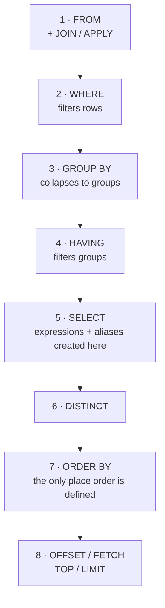

# 03 — Querying & Logical Processing Order

> **Scope:** the `SELECT` statement in depth. The single most valuable idea in this chapter is the
> **logical processing order** — it explains why you cannot use a column alias in `WHERE`, why
> `HAVING` sees aggregates and `WHERE` does not, and why `ORDER BY` can use an alias.

---

## The logical processing order

You *write* a query in one order. The engine *evaluates* it in another. Learn the evaluation order
and a whole class of errors becomes obvious.



| Step | Clause | Sees | Cannot see |
| --- | --- | --- | --- |
| 1 | `FROM` / `JOIN` | base tables | anything downstream |
| 2 | `WHERE` | table columns | aliases from `SELECT`, aggregates |
| 3 | `GROUP BY` | table columns | `SELECT` aliases |
| 4 | `HAVING` | grouping columns, **aggregates** | non-aggregated columns |
| 5 | `SELECT` | everything above; **creates aliases** | — |
| 6 | `DISTINCT` | the projected rows | — |
| 7 | `ORDER BY` | **`SELECT` aliases**, and columns not projected | — |
| 8 | `OFFSET`/`FETCH` | the ordered stream | — |

### The three errors this explains

```sql
-- ❌ Invalid column name 'annual'. WHERE runs BEFORE SELECT creates the alias.
SELECT salary * 12 AS annual FROM employees WHERE annual > 600000;

-- ✅ repeat the expression …
SELECT salary * 12 AS annual FROM employees WHERE salary * 12 > 600000;
-- ✅ … or introduce it upstream with a CTE (see chapter 06)
WITH pay AS (SELECT employee_id, salary * 12 AS annual FROM employees)
SELECT * FROM pay WHERE annual > 600000;

-- ❌ An aggregate may not appear in WHERE.
SELECT department_id, AVG(salary) FROM employees
WHERE AVG(salary) > 90000 GROUP BY department_id;

-- ✅ HAVING runs after grouping
SELECT department_id, AVG(salary) AS avg_salary FROM employees
GROUP BY department_id HAVING AVG(salary) > 90000;

-- ✅ ORDER BY *can* use the alias, because it runs last
SELECT salary * 12 AS annual FROM employees ORDER BY annual DESC;
```

> 🎯 **The answer that lands:** "SQL's *logical* processing order is `FROM` → `WHERE` → `GROUP BY` →
> `HAVING` → `SELECT` → `DISTINCT` → `ORDER BY` → `OFFSET/FETCH`. Aliases are created in `SELECT`,
> which is why `WHERE` can't see them but `ORDER BY` can. It's a *logical* order, not an execution
> plan — the optimiser is free to physically evaluate things differently as long as the result is the
> same, which is exactly why predicate pushdown works."

---

## Operators

### Comparison

`=` `<>` (or `!=`) `>` `<` `>=` `<=`

> 💡 `<>` is the **ANSI standard** for "not equal"; `!=` is a widely supported extension. They are
> functionally identical everywhere they both exist — prefer `<>` for portability.

### Logical — and precedence

`AND` binds **tighter** than `OR`. Getting this wrong is a real production bug, not a trivia point.

```sql
-- ❌ Reads as: (dept = 'Sales') OR (dept = 'Finance' AND salary > 100000)
SELECT * FROM employees
WHERE department = 'Sales' OR department = 'Finance' AND salary > 100000;

-- ✅ parenthesise, always
SELECT * FROM employees
WHERE (department = 'Sales' OR department = 'Finance') AND salary > 100000;
```

Precedence, highest first: `NOT` → `AND` → `OR`.

### Range, list and pattern

```sql
-- BETWEEN is INCLUSIVE of both bounds
SELECT * FROM sales WHERE unit_price BETWEEN 5 AND 10;      -- 5 and 10 included
SELECT * FROM sales WHERE unit_price >= 5 AND unit_price <= 10;   -- identical

-- IN — a list, or a subquery
SELECT * FROM employees WHERE department IN ('HR', 'Finance', 'IT');
SELECT * FROM employees WHERE department_id IN (SELECT department_id FROM departments WHERE active = 1);

-- LIKE wildcards
--   %  zero, one or many characters
--   _  exactly one character
--   [] a character class (T-SQL only)
SELECT * FROM customers WHERE last_name LIKE 'S%';        -- starts with S
SELECT * FROM customers WHERE last_name LIKE '_r%';       -- second letter is r
SELECT * FROM customers WHERE last_name LIKE '%son';      -- ends with son  ← cannot use an index
SELECT * FROM customers WHERE last_name LIKE '[A-C]%';    -- T-SQL character class
SELECT * FROM customers WHERE code LIKE '50!%%' ESCAPE '!';  -- literal % via ESCAPE
```

> ⚠️ **`BETWEEN` on dates is the classic off-by-one.** `WHERE placed_at BETWEEN '2026-01-01' AND
> '2026-01-31'` silently drops everything after midnight on the 31st, because a `datetime2` on that
> day is greater than `2026-01-31 00:00:00`. Use a **half-open range**:
> `WHERE placed_at >= '2026-01-01' AND placed_at < '2026-02-01'`. It is also index-friendly and
> immune to precision changes.

> ⚠️ **`LIKE '%term%'` cannot use an index.** A leading wildcard forces a scan. For real text
> search use full-text indexing (`CONTAINS`/`FREETEXT` in SQL Server) or a search engine. See
> [08 — SARGability](08-indexing-and-query-performance.md#sargability--the-single-biggest-win).

### Set operators

| Operator | Returns | Duplicates | Sorted? |
| --- | --- | --- | --- |
| `UNION` | rows from both queries | **removed** (implies a distinct sort) | often, incidentally |
| `UNION ALL` | rows from both queries | **kept** | no |
| `INTERSECT` | rows in **both** | removed | — |
| `EXCEPT` (Oracle: `MINUS`) | rows in the first **not** in the second | removed | — |

```sql
SELECT full_name FROM employees WHERE department_id = 1
UNION ALL                       -- ← default to ALL; only use UNION when you need the dedupe
SELECT full_name FROM contractors WHERE department_id = 1;

SELECT email FROM customers
EXCEPT
SELECT email FROM unsubscribes;   -- customers who have not unsubscribed, NULL-safe
```

> 🎯 **`UNION` vs `UNION ALL` is a performance question.** "`UNION` deduplicates, which means the
> engine must sort or hash the entire combined result — measurable cost on large sets. `UNION ALL`
> just concatenates. I default to `UNION ALL` and only pay for `UNION` when duplicates are actually
> possible and unwanted."

Requirements for all four: the same **number** of columns, in the same **order**, with
**compatible types**. Column names come from the *first* query.

> 💡 `EXCEPT`/`INTERSECT` compare rows using `NULL`-equal semantics, unlike `=`. That makes
> `EXCEPT` a neat way to diff two tables including their null columns.

### Membership and existence

```sql
-- EXISTS: stops at the first match; ideal for "is there at least one …"
SELECT d.name FROM departments AS d
WHERE EXISTS (SELECT 1 FROM employees AS e WHERE e.department_id = d.department_id);

-- NOT EXISTS: the NULL-safe form of NOT IN (see chapter 02)
SELECT d.name FROM departments AS d
WHERE NOT EXISTS (SELECT 1 FROM employees AS e WHERE e.department_id = d.department_id);
```

`IN` vs `EXISTS` vs `JOIN` is worked through in
[06 — Subqueries & CTEs](06-subqueries-ctes-and-recursion.md#in-vs-exists-vs-join).

### Arithmetic and the integer-division trap

```sql
SELECT 1 / 2;                      -- 0   ← integer division!
SELECT 1.0 / 2;                    -- 0.500000
SELECT CAST(1 AS DECIMAL(9,4)) / 2;-- 0.5000
SELECT 10 % 3;                     -- 1   (modulo)
```

> ⚠️ `SELECT correct_answers / total_questions AS pass_rate` returns `0` for every student when both
> columns are `INT`. Cast one operand.

### String and concatenation — a real dialect split

| Engine | Concatenation |
| --- | --- |
| SQL Server | `+`, or `CONCAT(a, b, c)` (null-safe), or `CONCAT_WS(sep, …)` |
| MySQL | `CONCAT(a, b)` — `+` does **arithmetic** |
| PostgreSQL / Oracle / SQLite | `\|\|` (ANSI standard) |

```sql
-- SQL Server: + propagates NULL, CONCAT does not
SELECT 'Hello' + NULL;                  -- NULL
SELECT CONCAT('Hello', NULL, 'World');  -- 'HelloWorld'
```

### Bitwise

`&` `|` `^` `~` (and `<<` / `>>` where supported). Used for flag columns:

```sql
-- Which items have bit 8 (the "archived" flag) set?
SELECT item_id, flags, flags & 8 AS archived_bit FROM items;
```

> ⚠️ A bitmask column is **not SARGable** — `WHERE flags & 8 = 8` cannot seek an index, because the
> function wraps the column. If you filter on a flag often, give it its own `bit` column.

---

## Built-in scalar functions

Two categories, and interviewers do ask you to name them: **system-defined** (built in — the tables
below) and **user-defined** (yours — [chapter 10](10-views-procedures-functions-triggers.md#stored-procedures-vs-functions)).

### String

| Function | Returns | Note |
| --- | --- | --- |
| `LEN(s)` / `DATALENGTH(s)` | characters / **bytes** | `LEN` **ignores trailing spaces**; `DATALENGTH` does not. MySQL/PostgreSQL: `CHAR_LENGTH` / `LENGTH` |
| `CONCAT(a, b, …)` | joined string | **null-safe** — treats `NULL` as `''`, unlike `+` |
| `CONCAT_WS(sep, …)` | joined with a separator | skips `NULL`s entirely |
| `UPPER(s)` / `LOWER(s)` | case-folded | ⚠️ wrapping a column in these makes the predicate non-SARGable — use a case-insensitive collation instead |
| `SUBSTRING(s, start, length)` | a slice | **1-based**, not 0-based |
| `LEFT(s, n)` / `RIGHT(s, n)` | ends | — |
| `REPLACE(s, find, sub)` | replaced | — |
| `TRIM(s)` / `LTRIM` / `RTRIM` | trimmed | `TRIM` is SQL Server 2017+; before that combine `LTRIM(RTRIM(s))` |
| `CHARINDEX(needle, s)` | 1-based position, `0` if absent | MySQL/PostgreSQL: `POSITION`/`INSTR` |
| `STRING_AGG(s, sep)` | one row per group joined | MySQL: `GROUP_CONCAT`; PostgreSQL: `string_agg` |
| `STRING_SPLIT(s, sep)` | a **table** of parts | SQL Server 2016+ — the supported way to unpack a CSV column |
| `FORMAT(v, fmt)` | formatted string | ⚠️ CLR-based and **slow**; avoid in a `SELECT` over many rows |

### Date and time

| Function | Returns |
| --- | --- |
| `SYSUTCDATETIME()` | current UTC as `datetime2(7)` — **prefer this** |
| `GETUTCDATE()` / `GETDATE()` | UTC / **server local** as `datetime` |
| `SYSDATETIMEOFFSET()` | current time **with** offset |
| `DATEADD(part, n, d)` | `d` shifted — `DATEADD(DAY, 7, d)` |
| `DATEDIFF(part, a, b)` | whole boundaries crossed — see the warning |
| `DATEPART(part, d)` / `YEAR`/`MONTH`/`DAY` | a component |
| `EOMONTH(d)` | last day of the month |
| `DATEFROMPARTS(y, m, d)` | a `date` built from integers |
| `AT TIME ZONE 'India Standard Time'` | convert a `datetimeoffset` |

> ⚠️ **`DATEDIFF` counts *boundaries crossed*, not elapsed time.**
> `DATEDIFF(YEAR, '2025-12-31', '2026-01-01')` is **1**, from one day apart. And
> `DATEDIFF(DAY, …)` on a `datetime2` ignores the time part entirely. For a true age or duration,
> compare the full values rather than a truncated part.

> 💡 **Store UTC, convert at the edge.** `GETDATE()` returns the *server's* local time, which makes
> your data undebuggable the first time the host moves region or the clocks change. Use
> `SYSUTCDATETIME()` in defaults and `datetimeoffset` where the offset matters.

### Numeric and system

| Function | Returns |
| --- | --- |
| `ABS`, `CEILING`, `FLOOR`, `SQRT`, `POWER`, `SIGN` | as named (note: `CEILING` in T-SQL, `CEIL` in MySQL/PostgreSQL/Oracle) |
| `ROUND(v, n)` | rounded to `n` decimals — `ROUND(v, 0, 1)` **truncates** instead |
| `NEWID()` / `NEWSEQUENTIALID()` | a random / sequential GUID |
| `SCOPE_IDENTITY()` | the last identity value **in this scope** |
| `@@ROWCOUNT` | rows affected by the previous statement |
| `SUSER_SNAME()` / `SESSION_USER` | the calling login — for audit columns |
| `ISNUMERIC` / `TRY_CAST` | ⚠️ `ISNUMERIC('1e5') = 1`; prefer `TRY_CAST(x AS DECIMAL) IS NOT NULL` |

> ⚠️ **`@@IDENTITY` vs `SCOPE_IDENTITY()` vs `IDENT_CURRENT()`.** `@@IDENTITY` returns the last
> identity generated **on the connection** — including one generated by a *trigger* on another
> table, which is a genuine production bug. `SCOPE_IDENTITY()` is scoped to your batch and is the
> correct choice. Better still, use `OUTPUT`:
>
> ```sql
> INSERT INTO employees (full_name, email, salary, hired_on, department_id)
> OUTPUT inserted.employee_id                    -- ← safe, set-based, works for multi-row inserts
> VALUES (N'Nia', N'nia@example.com', 105000, '2026-09-01', 1);
> ```

---

## `SELECT … INTO` — create a table from a result

```sql
-- Creates dbo.employee_backup with the SAME column names and types, and copies the rows
SELECT employee_id, full_name, salary
INTO   dbo.employee_backup
FROM   dbo.employees
WHERE  department_id = 1;
```

> ⚠️ **`SELECT … INTO` copies the data and the column types — and nothing else.** No primary key,
> no indexes, no constraints, no defaults, no identity property carried as a constraint. It is a
> DDL statement (so it takes a schema lock and fails if the target already exists), which makes it
> convenient for a quick snapshot and wrong as a way to "clone a table". To clone structure
> properly, script the DDL. To copy into an **existing** table, use `INSERT INTO … SELECT`:
>
> ```sql
> INSERT INTO dbo.employee_backup (employee_id, full_name, salary)
> SELECT employee_id, full_name, salary FROM dbo.employees;
> ```

---

## `CASE` — conditional logic

Two forms. Both are **expressions**, so they work anywhere a value works: `SELECT`, `WHERE`,
`ORDER BY`, `GROUP BY`, `UPDATE … SET`, even inside an aggregate.

```sql
-- Searched CASE — evaluates predicates in order, first TRUE wins
SELECT full_name, salary,
       CASE WHEN salary >= 150000 THEN 'Senior band'
            WHEN salary >=  90000 THEN 'Mid band'
            ELSE                       'Entry band'
       END AS band
FROM   employees;

-- Simple CASE — compares one expression against values (a switch)
SELECT full_name,
       CASE UPPER(country_code)
            WHEN 'IN' THEN N'India'
            WHEN 'GB' THEN N'United Kingdom'
            ELSE           N'Other'
       END AS country
FROM   employees;
```

> ⚠️ **Omit `ELSE` and unmatched rows get `NULL`**, not an error. Nearly always write an explicit
> `ELSE`.

### `CASE` inside an aggregate — conditional aggregation

This is the pattern that turns rows into columns without `PIVOT`, and it is a genuine
senior-level tell.

```sql
SELECT department_id,
       COUNT(*)                                                 AS headcount,
       SUM(CASE WHEN salary > 100000 THEN 1 ELSE 0 END)         AS high_earners,
       AVG(CASE WHEN hired_on >= '2025-01-01' THEN salary END)  AS avg_new_hire_salary
FROM   employees
GROUP  BY department_id;
```

The third column relies on `AVG` ignoring `NULL`s — the "no `ELSE`" behaviour used deliberately.

---

## `CAST` vs `CONVERT` vs `TRY_CAST`

```sql
SELECT CAST('2026-09-02' AS DATE);                    -- ANSI, portable
SELECT CONVERT(DATE, '02/09/2026', 103);              -- T-SQL only, but supports style codes
SELECT TRY_CAST('not a date' AS DATE);                -- NULL instead of an error
SELECT FORMAT(SYSUTCDATETIME(), 'yyyy-MM-dd');        -- T-SQL, flexible but slow — avoid in bulk
```

| | `CAST` | `CONVERT` | `TRY_CAST` / `TRY_CONVERT` |
| --- | --- | --- | --- |
| Standard | ✅ ANSI | ❌ T-SQL | ❌ T-SQL |
| Format/style control | ❌ | ✅ (`103` = dd/mm/yyyy) | inherits |
| On failure | **error** | **error** | returns `NULL` |

> 💡 Prefer `CAST` for portability, `CONVERT` when you need a style code, and `TRY_CAST` whenever
> the input is untrusted — it is the difference between a null column and a failed batch.

> ⚠️ **Implicit conversion silently kills index usage.** If `account_no` is `VARCHAR` and you write
> `WHERE account_no = 12345`, SQL Server converts the *column* to `INT` on every row and scans.
> Match the literal's type to the column's.

---

## `DISTINCT` and paging

```sql
SELECT DISTINCT department_id FROM employees;                -- distinct across ALL projected columns
```

> ⚠️ `DISTINCT` applies to the **whole row**, not the first column. `SELECT DISTINCT department_id,
> full_name` gives one row per *pair*, which is almost never what someone writing it wanted. And
> reaching for `DISTINCT` to "fix" duplicated rows usually means the join is wrong — go fix the join.

### Paging, by dialect

```sql
-- ANSI / SQL Server 2012+ / PostgreSQL / Oracle 12c+   ← use this
SELECT employee_id, full_name
FROM   employees
ORDER  BY employee_id           -- ORDER BY is MANDATORY with OFFSET/FETCH
OFFSET 20 ROWS FETCH NEXT 10 ROWS ONLY;

-- MySQL / PostgreSQL / SQLite
SELECT employee_id, full_name FROM employees ORDER BY employee_id LIMIT 10 OFFSET 20;

-- T-SQL proprietary
SELECT TOP (10) * FROM employees ORDER BY salary DESC;
SELECT TOP 40 PERCENT * FROM employees ORDER BY salary DESC;
SELECT TOP (10) WITH TIES * FROM employees ORDER BY salary DESC;  -- includes rows tied at 10th
```

> ⚠️ **`OFFSET` paging degrades linearly.** `OFFSET 1000000` still reads and discards a million
> rows. For deep paging use **keyset ("seek") pagination**:
>
> ```sql
> SELECT TOP (10) * FROM employees
> WHERE  employee_id > @last_seen_id      -- the key of the last row on the previous page
> ORDER  BY employee_id;
> ```
>
> Constant time regardless of page depth, and stable when rows are inserted mid-scroll — which
> `OFFSET` is not. Saying this unprompted marks you out.

> ⚠️ **`ORDER BY` must be deterministic for paging to work.** Ordering by a non-unique column
> (`ORDER BY salary`) lets ties appear on two pages or none. Always append a unique tiebreaker:
> `ORDER BY salary DESC, employee_id`.

---

## Dialect cheat-sheet

| Task | SQL Server (T-SQL) | MySQL | PostgreSQL |
| --- | --- | --- | --- |
| Limit rows | `TOP (n)` / `OFFSET…FETCH` | `LIMIT n` | `LIMIT n` |
| Concatenate | `+` / `CONCAT` | `CONCAT` | `\|\|` |
| Current UTC timestamp | `SYSUTCDATETIME()` | `UTC_TIMESTAMP()` | `NOW() AT TIME ZONE 'utc'` |
| Current date | `CAST(GETDATE() AS DATE)` | `CURDATE()` | `CURRENT_DATE` |
| Add 7 days | `DATEADD(DAY, 7, d)` | `DATE_ADD(d, INTERVAL 7 DAY)` | `d + INTERVAL '7 days'` |
| Date difference | `DATEDIFF(DAY, a, b)` | `DATEDIFF(b, a)` | `b - a` |
| Null coalesce | `ISNULL` / `COALESCE` | `IFNULL` / `COALESCE` | `COALESCE` |
| Substring | `SUBSTRING(s, 1, 3)` | `SUBSTRING(s, 1, 3)` | `SUBSTRING(s FROM 1 FOR 3)` |
| Auto id | `IDENTITY(1,1)` / `SEQUENCE` | `AUTO_INCREMENT` | `GENERATED … AS IDENTITY` / `serial` |
| Unicode text | `NVARCHAR` | `VARCHAR` (`utf8mb4`) | `VARCHAR`/`text` |
| String length | `LEN` (ignores trailing spaces!) / `DATALENGTH` | `CHAR_LENGTH` | `LENGTH` |
| Regex match | `LIKE` + CLR, or `REGEXP_LIKE` (2025+) | `REGEXP` / `RLIKE` | `~` / `SIMILAR TO` |
| Case-insensitive compare | collation-driven, often default | collation-driven, often default | **case-sensitive** by default — use `ILIKE`/`LOWER` |

> 💡 **Say which dialect you are writing in.** Volunteering "I'll write T-SQL — the `LIMIT`
> equivalent is `OFFSET … FETCH`" turns a potential mistake into evidence you know the landscape.

---

## Rapid-fire Q&A

**Q: Why can't I use a `SELECT` alias in `WHERE`?**
`WHERE` is evaluated before `SELECT`, so the alias does not exist yet. Repeat the expression, or
wrap the query in a CTE / derived table.

**Q: `WHERE` vs `HAVING`?**
`WHERE` filters rows pre-aggregation and can use indexes; `HAVING` filters groups post-aggregation
and is the only one that may reference an aggregate. Filter in `WHERE` whenever you can — fewer
rows reach the grouping.

**Q: Is `BETWEEN` inclusive?**
Yes, both endpoints. Which is exactly why it is wrong for `datetime` ranges.

**Q: `UNION` vs `JOIN`?**
`UNION` combines rows **vertically** (same columns, more rows). `JOIN` combines **horizontally**
(same rows, more columns).

**Q: What does `SELECT 1 FROM …` inside `EXISTS` mean?**
Nothing is projected — `EXISTS` only asks whether a row exists, so the select list is ignored.
`SELECT 1`, `SELECT *` and `SELECT NULL` produce identical plans.

**Q: How would you page a 10-million-row grid?**
Keyset pagination on a unique, indexed, monotonic key — not `OFFSET`, whose cost grows with page
depth.

**Q: Why is `SELECT *` discouraged in production code?**
It breaks when columns are added or reordered, defeats covering indexes, ships columns over the
network that nobody uses, and makes views/`INSERT … SELECT` fragile. Fine for ad-hoc exploration.

**Q: Difference between `COALESCE` and `ISNULL`?**
`COALESCE` is ANSI, takes any number of arguments and uses type precedence for the result.
`ISNULL` is T-SQL, takes two, and coerces the result to the **first** argument's type — so it can
silently truncate.

**Q: What is a SARGable predicate?**
One the optimiser can satisfy with an index **seek** because the column appears bare on one side:
`WHERE hired_on >= '2026-01-01'` is SARGable, `WHERE YEAR(hired_on) = 2026` is not.
[Chapter 08](08-indexing-and-query-performance.md#sargability--the-single-biggest-win).

---

**Prev:** [02 — Data Types & Constraints](02-data-types-and-constraints.md) ·
**Next:** [04 — Joins](04-joins.md) ·
**Up:** [SQL interview hub](readme.md)
