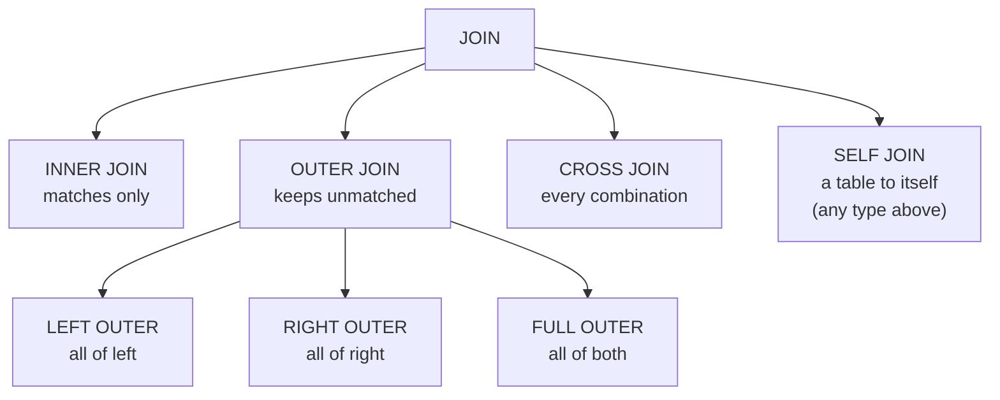

# 04 — Joins

> **Scope:** joins are the most-tested topic in any SQL interview, and the questions are rarely
> "what is a LEFT JOIN". They are: *what happens to the unmatched rows*, *why did my row count
> explode*, and *why does moving a predicate from `WHERE` to `ON` change the answer*.

---

## Sample data used throughout

Every result set below is the real output for this data. Run it and check.

```sql
CREATE TABLE customers (customer_id INT PRIMARY KEY, name NVARCHAR(40), city NVARCHAR(40));
CREATE TABLE orders    (order_id INT PRIMARY KEY, customer_id INT NULL, total DECIMAL(9,2));

INSERT INTO customers VALUES (1, N'Asha',  N'Pune'),
                             (2, N'Boris', N'Berlin'),
                             (3, N'Chen',  N'Shanghai');   -- Chen has no orders

INSERT INTO orders    VALUES (10, 1,    120.00),
                             (11, 1,     80.00),          -- Asha has two orders
                             (12, 2,    250.00),
                             (13, NULL,  99.00);           -- an orphan order
```

`customers`

| customer_id | name | city |
| --- | --- | --- |
| 1 | Asha | Pune |
| 2 | Boris | Berlin |
| 3 | Chen | Shanghai |

`orders`

| order_id | customer_id | total |
| --- | --- | --- |
| 10 | 1 | 120.00 |
| 11 | 1 | 80.00 |
| 12 | 2 | 250.00 |
| 13 | *NULL* | 99.00 |

---

## The join family



`SELF JOIN` is not a separate *kind* of join — it is any join where both sides are the same table.
Interviewers list it separately, so name it that way.

---

## `INNER JOIN` — matches only

```sql
SELECT c.name, o.order_id, o.total
FROM   customers AS c
INNER  JOIN orders AS o ON o.customer_id = c.customer_id;
```

| name | order_id | total |
| --- | --- | --- |
| Asha | 10 | 120.00 |
| Asha | 11 | 80.00 |
| Boris | 12 | 250.00 |

**3 rows.** Chen disappears (no orders); order 13 disappears (`NULL` customer, and `NULL = 1` is
`UNKNOWN`). `JOIN` with no keyword means `INNER JOIN`.

---

## `LEFT OUTER JOIN` — all of the left table

```sql
SELECT c.name, o.order_id, o.total
FROM   customers AS c
LEFT   JOIN orders AS o ON o.customer_id = c.customer_id;
```

| name | order_id | total |
| --- | --- | --- |
| Asha | 10 | 120.00 |
| Asha | 11 | 80.00 |
| Boris | 12 | 250.00 |
| **Chen** | *NULL* | *NULL* |

**4 rows.** Chen is preserved with `NULL`s on the right. The `OUTER` keyword is optional
(`LEFT JOIN` ≡ `LEFT OUTER JOIN`).

> ⚠️ **`COUNT(*)` lies on an outer join.** `SELECT c.name, COUNT(*) … LEFT JOIN … GROUP BY c.name`
> gives Chen a count of **1**, because the padded `NULL` row still counts. Count a column from the
> *right* table instead: `COUNT(o.order_id)` → **0** for Chen. This is a favourite trick question.

```sql
SELECT c.name,
       COUNT(*)           AS wrong_count,   -- Chen: 1
       COUNT(o.order_id)  AS right_count    -- Chen: 0
FROM   customers AS c
LEFT   JOIN orders AS o ON o.customer_id = c.customer_id
GROUP  BY c.name;
```

---

## `RIGHT OUTER JOIN` — all of the right table

```sql
SELECT c.name, o.order_id
FROM   customers AS c
RIGHT  JOIN orders AS o ON o.customer_id = c.customer_id;
```

| name | order_id |
| --- | --- |
| Asha | 10 |
| Asha | 11 |
| Boris | 12 |
| *NULL* | **13** |

**4 rows.** Order 13 is preserved. Note `A RIGHT JOIN B` ≡ `B LEFT JOIN A`.

> 💡 **Style point worth making:** most teams ban `RIGHT JOIN` in review, because reading a query
> requires holding both a left-to-right table order *and* a right-to-left preservation rule in your
> head. Rewrite as a `LEFT JOIN` with the tables swapped. Say this — it reads as experience.

---

## `FULL OUTER JOIN` — all of both

```sql
SELECT c.name, o.order_id
FROM   customers AS c
FULL   JOIN orders AS o ON o.customer_id = c.customer_id;
```

| name | order_id |
| --- | --- |
| Asha | 10 |
| Asha | 11 |
| Boris | 12 |
| Chen | *NULL* |
| *NULL* | 13 |

**5 rows** — every match, plus unmatched rows from both sides. Not supported by MySQL; emulate with
`LEFT JOIN` `UNION` `RIGHT JOIN`.

Its main real use is **reconciliation** — finding rows present on one side only:

```sql
SELECT c.customer_id AS in_customers, o.customer_id AS in_orders
FROM   customers AS c
FULL   JOIN orders AS o ON o.customer_id = c.customer_id
WHERE  c.customer_id IS NULL OR o.customer_id IS NULL;
```

---

## `CROSS JOIN` — the Cartesian product

Every row of the left paired with every row of the right. No `ON` clause.

```sql
SELECT c.name, s.size
FROM   customers AS c
CROSS  JOIN (VALUES ('S'), ('M'), ('L')) AS s(size);
```

3 customers × 3 sizes = **9 rows**.

Legitimate uses: generating a calendar or number series, building a complete matrix to
`LEFT JOIN` sparse data onto (so gaps show as zero rather than vanishing), and test-data generation.

> ⚠️ **An accidental Cartesian product is the #1 cause of "my query ran for an hour".** It happens
> when you list two tables in `FROM` and forget the `WHERE`, or when a join key is not unique. Two
> 100 000-row tables produce **10 billion** rows.

### The row-count rule you should be able to state

For `A JOIN B ON A.k = B.k`, the result has one row **per matching pair**. So if a key value
appears 3× in `A` and 4× in `B`, that value alone yields **12 rows**. This is why joining two
one-to-many children of the same parent inflates every aggregate:

```sql
-- ❌ total is multiplied by the number of shipments per order
SELECT o.order_id, SUM(i.line_total) AS items, SUM(s.weight) AS weight
FROM   orders AS o
JOIN   order_items AS i ON i.order_id = o.order_id
JOIN   shipments   AS s ON s.order_id = o.order_id
GROUP  BY o.order_id;

-- ✅ aggregate each branch independently, then join the results
SELECT o.order_id, i.items, s.weight
FROM   orders AS o
LEFT   JOIN (SELECT order_id, SUM(line_total) AS items  FROM order_items GROUP BY order_id) AS i
         ON i.order_id = o.order_id
LEFT   JOIN (SELECT order_id, SUM(weight)     AS weight FROM shipments   GROUP BY order_id) AS s
         ON s.order_id = o.order_id;
```

> 🎯 **If you spot this in an interview, say the name:** *fan-out* (or "join multiplication"). The
> giveaway is a `SUM` that is a clean multiple of the correct answer, and the instinct to "fix" it
> with `DISTINCT` — which is wrong, because `SUM(DISTINCT …)` also removes legitimate equal values.

---

## `SELF JOIN` — a table to itself

Requires aliases, because both sides need distinct names.

```sql
-- Each employee alongside their manager
SELECT e.full_name AS employee, m.full_name AS manager
FROM   employees AS e
LEFT   JOIN employees AS m ON m.employee_id = e.manager_id;
```

`LEFT`, not `INNER` — otherwise the CEO (whose `manager_id` is `NULL`) vanishes. That substitution
is exactly what an interviewer is watching for.

Other classic self-join shapes:

```sql
-- Employees who earn more than their manager
SELECT e.full_name, e.salary, m.full_name AS manager, m.salary AS manager_salary
FROM   employees AS e
JOIN   employees AS m ON m.employee_id = e.manager_id
WHERE  e.salary > m.salary;

-- Pairs of colleagues in the same city, each pair listed once
SELECT a.full_name, b.full_name, a.city
FROM   employees AS a
JOIN   employees AS b ON b.city = a.city
                     AND b.employee_id > a.employee_id;   -- > not <>, so no mirrored duplicates
```

> 💡 For a hierarchy of **arbitrary depth** a self join is not enough — one join per level. Use a
> **recursive CTE**: [06](06-subqueries-ctes-and-recursion.md#recursive-ctes).

---

## Anti-joins — "rows in A with no match in B"

Three ways to express it. Know all three and their trade-offs.

```sql
-- 1. NOT EXISTS  ← the default choice: NULL-safe, usually the best plan
SELECT c.name FROM customers AS c
WHERE  NOT EXISTS (SELECT 1 FROM orders AS o WHERE o.customer_id = c.customer_id);

-- 2. LEFT JOIN … IS NULL  ← equally correct, sometimes a different plan
SELECT c.name FROM customers AS c
LEFT   JOIN orders AS o ON o.customer_id = c.customer_id
WHERE  o.order_id IS NULL;

-- 3. NOT IN  ← ⚠️ silently returns NOTHING if the subquery yields any NULL
SELECT c.name FROM customers AS c
WHERE  c.customer_id NOT IN (SELECT customer_id FROM orders);
```

With our data, form 3 returns **zero rows** — order 13 has a `NULL` `customer_id`, so
`3 NOT IN (1,1,2,NULL)` evaluates to `UNKNOWN`. Forms 1 and 2 correctly return **Chen**.

> 🎯 **The senior answer:** "I write anti-joins as `NOT EXISTS`. It's null-safe, it reads as intent,
> and the optimiser implements it as a proper anti-semi-join. `LEFT JOIN … IS NULL` is equivalent
> but relies on the reader noticing the `IS NULL`. `NOT IN` I avoid entirely unless the subquery
> column is `NOT NULL`, because a single `NULL` turns the whole predicate `UNKNOWN` and the query
> returns an empty set with no error."

---

## The `ON` vs `WHERE` trap

For an **inner** join, `ON` and `WHERE` are interchangeable. For an **outer** join they are
completely different, and this is the single best join question an interviewer can ask.

```sql
-- A) Predicate in ON — filters BEFORE padding. Chen survives with NULLs.
SELECT c.name, o.order_id, o.total
FROM   customers AS c
LEFT   JOIN orders AS o ON o.customer_id = c.customer_id
                       AND o.total > 100;
```

| name | order_id | total |
| --- | --- | --- |
| Asha | 10 | 120.00 |
| Boris | 12 | 250.00 |
| Chen | *NULL* | *NULL* |

```sql
-- B) Predicate in WHERE — filters AFTER padding. Chen's NULL total fails `> 100`.
SELECT c.name, o.order_id, o.total
FROM   customers AS c
LEFT   JOIN orders AS o ON o.customer_id = c.customer_id
WHERE  o.total > 100;
```

| name | order_id | total |
| --- | --- | --- |
| Asha | 10 | 120.00 |
| Boris | 12 | 250.00 |

**Version B has silently become an inner join.** Any `WHERE` predicate on a column of the
outer-joined table (other than `IS NULL`) destroys the outerness.

> 🎯 **The rule to recite:** "In an outer join, `ON` decides *what counts as a match*; `WHERE`
> filters *the result after the padding rows are added*. So a filter on the optional side belongs in
> `ON`. If I see a `LEFT JOIN` whose `WHERE` clause references the right-hand table, I treat it as a
> bug until proven otherwise — the author almost certainly wanted an inner join or meant to put the
> predicate in `ON`."

---

## Implicit vs explicit join syntax

```sql
-- Implicit (ANSI-89): comma-separated FROM, condition in WHERE
SELECT e.full_name, d.name
FROM   employees e, departments d
WHERE  e.department_id = d.department_id;

-- Explicit (ANSI-92): ← always use this
SELECT e.full_name, d.name
FROM   employees AS e
JOIN   departments AS d ON d.department_id = e.department_id;
```

Why explicit wins:

- **Forget the condition and you get a Cartesian product with no error.** With `JOIN`, omitting
  `ON` is a syntax error.
- Join conditions stay separate from filters, so intent is readable.
- Outer joins have **no portable implicit form** (the old `*=` / `(+)` operators are removed or
  deprecated), so a codebase mixing styles cannot express them consistently.

---

## Join algorithms — how the engine actually does it

You are not asked to choose these, but naming them when discussing a slow query is a strong signal.

| Algorithm | How it works | Best when | Cost |
| --- | --- | --- | --- |
| **Nested Loops** | for each outer row, seek the inner | one side small, inner side **indexed** | O(n × log m) with an index; O(n × m) without |
| **Merge Join** | walk two **sorted** inputs in step | both inputs already sorted on the key (e.g. both clustered) | O(n + m) + sort cost if not sorted |
| **Hash Join** | build a hash table from the smaller side, probe with the larger | large, **unsorted**, unindexed inputs | O(n + m), needs memory — spills to disk ("tempdb spill") if the grant is too small |

> 💡 **Reading a plan:** a Hash Match where you expected a seek usually means a missing index or a
> bad row estimate. Nested Loops over a *large* outer input with a table scan inside is the classic
> "it worked in dev with 100 rows" failure. See
> [08 — Reading an execution plan](08-indexing-and-query-performance.md#reading-an-execution-plan).

---

## Multi-table joins

```sql
SELECT c.name        AS customer,
       o.order_id,
       p.name        AS product,
       i.quantity,
       i.quantity * p.unit_price AS line_total
FROM        customers   AS c
JOIN        orders      AS o ON o.customer_id = c.customer_id
JOIN        order_items AS i ON i.order_id    = o.order_id
LEFT  JOIN  products    AS p ON p.product_id  = i.product_id   -- product may be deleted
WHERE  o.placed_at >= '2026-01-01'
ORDER  BY c.name, o.order_id;
```

Two things to know:

1. **Written order is not execution order.** The optimiser reorders joins freely based on
   cardinality estimates. `FORCE ORDER` / `STRAIGHT_JOIN` hints exist and should be a last resort.
2. **An `INNER JOIN` after a `LEFT JOIN` cancels it.** Once `p` is `LEFT` joined, adding
   `JOIN reviews AS r ON r.product_id = p.product_id` drops every row whose product was missing.
   Chain outer joins as outer joins.

---

## Rapid-fire Q&A

**Q: How many rows does `A JOIN B` return?**
One per matching pair. If a key appears *m* times in A and *n* times in B, that value contributes
*m × n* rows.

**Q: `INNER JOIN` vs `LEFT JOIN` — when does it matter?**
Whenever the right side is optional. `INNER` silently drops parents with no children — the most
common cause of "the report is missing customers".

**Q: What does a `CROSS JOIN` with a `WHERE` clause equal?**
An inner join. That is precisely what implicit-join syntax is.

**Q: Difference between `CROSS APPLY` and `INNER JOIN`?**
`CROSS APPLY` runs the right side **once per left row** and can reference the left row's columns —
so it can be a top-N-per-group or a table-valued function call, neither of which a `JOIN` can
express. `OUTER APPLY` is its `LEFT JOIN` equivalent. See
[06](06-subqueries-ctes-and-recursion.md#apply--the-correlated-join).

**Q: Can you join on more than one column? On an inequality?**
Yes to both. `ON a.x = b.x AND a.y = b.y`, and `ON a.value BETWEEN b.lo AND b.hi` (a *theta* join,
used for banding and interval matching).

**Q: Why did adding a join make my `SUM` too large?**
Fan-out — the join multiplied rows. Pre-aggregate each branch in a derived table or CTE.

**Q: `FULL OUTER JOIN` in MySQL?**
Not supported. `SELECT … LEFT JOIN … UNION SELECT … RIGHT JOIN …`.

**Q: Are Venn diagrams a good model for joins?**
Only loosely. Venn diagrams model **set overlap**, but a join produces *pairs* — with duplicate keys
the result is larger than either input, which no Venn diagram can show. Say this if someone draws
one; the row-count rule is the model that survives contact with real data.

---

**Prev:** [03 — Querying & Logical Order](03-querying-and-logical-order.md) ·
**Next:** [05 — Aggregation & Window Functions](05-aggregation-and-window-functions.md) ·
**Up:** [SQL interview hub](readme.md)
