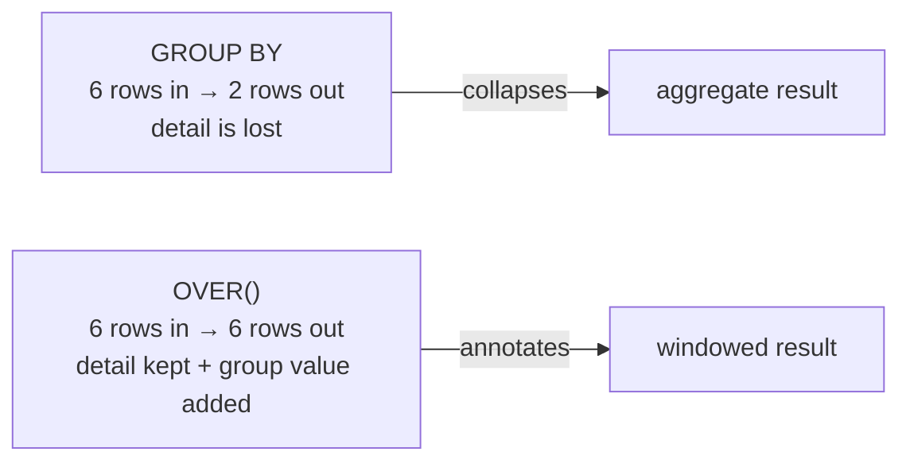

# 05 — Aggregation & Window Functions

> **Scope:** aggregation, then the topic that most separates mid from senior in a SQL screen —
> **window functions**. If you learn one thing from this track, make it the difference between
> `ROW_NUMBER`, `RANK` and `DENSE_RANK`, and the fact that a window function does **not** collapse
> rows.

---

## Sample data used throughout

```sql
CREATE TABLE staff (
    staff_id    INT PRIMARY KEY,
    name        NVARCHAR(20),
    department  NVARCHAR(20),
    salary      DECIMAL(9,2)
);

INSERT INTO staff VALUES
 (1, N'Asha',  N'Engineering', 120000),
 (2, N'Boris', N'Engineering', 120000),   -- tied with Asha
 (3, N'Chen',  N'Engineering',  95000),
 (4, N'Dara',  N'Finance',     110000),
 (5, N'Eve',   N'Finance',      90000),
 (6, N'Femi',  N'Finance',      90000);   -- tied with Eve
```

---

## Aggregate functions

| Function | Ignores `NULL`? | Notes |
| --- | --- | --- |
| `COUNT(*)` | ❌ counts **rows** | the row counter |
| `COUNT(col)` | ✅ | counts non-null values |
| `COUNT(DISTINCT col)` | ✅ | distinct non-null values |
| `SUM(col)` | ✅ | returns `NULL` for an empty set, **not 0** |
| `AVG(col)` | ✅ | divides by the count of **non-null** values |
| `MIN` / `MAX` | ✅ | work on strings and dates too |
| `STRING_AGG(col, ',')` | ✅ | concatenate a group (MySQL: `GROUP_CONCAT`; PostgreSQL: `string_agg`) |
| `STDEV` / `VAR` | ✅ | statistical |

```sql
SELECT COUNT(*)                     AS rows_,          -- 6
       SUM(salary)                  AS payroll,        -- 625000.00
       AVG(salary)                  AS avg_salary,     -- 104166.666666
       MIN(salary)                  AS lowest,         -- 90000.00
       COUNT(DISTINCT department)   AS departments,    -- 2
       STRING_AGG(name, ', ')       AS everyone        -- 'Asha, Boris, Chen, Dara, Eve, Femi'
FROM   staff;
```

> ⚠️ **`SUM` of an empty set is `NULL`, not zero.** `SELECT SUM(total) FROM orders WHERE 1 = 0`
> returns `NULL`. If you feed it into arithmetic, the whole expression becomes `NULL`. Wrap it:
> `COALESCE(SUM(total), 0)`.

---

## `GROUP BY`

```sql
SELECT   department, COUNT(*) AS headcount, AVG(salary) AS avg_salary
FROM     staff
GROUP BY department;
```

| department | headcount | avg_salary |
| --- | --- | --- |
| Engineering | 3 | 111666.666666 |
| Finance | 3 | 96666.666666 |

**The rule:** every column in `SELECT` must either appear in `GROUP BY` or be inside an aggregate.

```sql
-- ❌ Column 'staff.name' is invalid in the select list …
SELECT department, name, AVG(salary) FROM staff GROUP BY department;
```

> ⚠️ **MySQL used to allow this** (returning an arbitrary `name`) until `ONLY_FULL_GROUP_BY` became
> the default in 5.7. If someone tells you the query "works in MySQL", that is a legacy setting, not
> valid SQL. The correct way to get "the name of the top earner per department" is a window function
> — see [Top-N per group](#top-n-per-group).

### `GROUP BY` and `NULL`

All `NULL`s form **one group**, even though `NULL = NULL` is `UNKNOWN`. Deliberate inconsistency in
the standard, and a fair interview question.

### `ROLLUP`, `CUBE` and `GROUPING SETS`

Subtotals without a second query — a nice thing to know exists.

```sql
SELECT   COALESCE(department, '— ALL —') AS department,
         COUNT(*) AS headcount, SUM(salary) AS payroll
FROM     staff
GROUP BY ROLLUP (department);
```

| department | headcount | payroll |
| --- | --- | --- |
| Engineering | 3 | 335000.00 |
| Finance | 3 | 290000.00 |
| **— ALL —** | **6** | **625000.00** |

`ROLLUP` adds hierarchical subtotals; `CUBE` adds every combination; `GROUPING SETS` lets you list
exactly the ones you want. Use `GROUPING(col)` to tell a real `NULL` from a subtotal row.

---

## `WHERE` vs `HAVING`

| | `WHERE` | `HAVING` |
| --- | --- | --- |
| Runs | **before** grouping | **after** grouping |
| Filters | individual **rows** | **groups** |
| May reference an aggregate | ❌ | ✅ |
| Can use an index to skip rows | ✅ | ❌ (rows are already read) |

```sql
SELECT   department, AVG(salary) AS avg_salary
FROM     staff
WHERE    salary > 50000            -- 1. drop cheap rows first  (index-usable)
GROUP BY department
HAVING   AVG(salary) > 100000;     -- 2. then drop cheap groups
```

| department | avg_salary |
| --- | --- |
| Engineering | 111666.666666 |

> 🎯 **The performance point that earns the mark:** "Both can express many of the same filters, but
> `WHERE` runs first and can use an index, so it reduces the rows that ever reach the aggregation.
> `HAVING` can only discard work already done. So I push every non-aggregate predicate into `WHERE`
> and leave `HAVING` for genuine aggregate conditions."

---

## Window functions

A window function computes a value **over a set of related rows** while **keeping every row**.
That is the whole idea, and the reason it replaces so many self-joins and correlated subqueries.



```sql
SELECT name, department, salary,
       AVG(salary) OVER (PARTITION BY department) AS dept_avg,
       salary - AVG(salary) OVER (PARTITION BY department) AS vs_dept_avg
FROM   staff;
```

| name | department | salary | dept_avg | vs_dept_avg |
| --- | --- | --- | --- | --- |
| Asha | Engineering | 120000 | 111666.67 | 8333.33 |
| Boris | Engineering | 120000 | 111666.67 | 8333.33 |
| Chen | Engineering | 95000 | 111666.67 | -16666.67 |
| Dara | Finance | 110000 | 96666.67 | 13333.33 |
| Eve | Finance | 90000 | 96666.67 | -6666.67 |
| Femi | Finance | 90000 | 96666.67 | -6666.67 |

Doing that with `GROUP BY` needs a second query and a join. That contrast **is** the answer to
"why would you use a window function?"

### Anatomy of the `OVER` clause

```sql
function() OVER (
    PARTITION BY <cols>            -- optional: restart per group. Omit ⇒ one window = whole result
    ORDER BY     <cols>            -- required by ranking / LAG / LEAD / running totals
    ROWS|RANGE BETWEEN <a> AND <b> -- optional frame: which rows within the partition
)
```

---

## Ranking functions — the question you will be asked

```sql
SELECT name, department, salary,
       ROW_NUMBER() OVER (ORDER BY salary DESC) AS rn,
       RANK()       OVER (ORDER BY salary DESC) AS rnk,
       DENSE_RANK() OVER (ORDER BY salary DESC) AS dense,
       NTILE(3)     OVER (ORDER BY salary DESC) AS tercile
FROM   staff;
```

| name | salary | `rn` | `rnk` | `dense` | `tercile` |
| --- | --- | --- | --- | --- | --- |
| Asha | 120000 | 1 | **1** | **1** | 1 |
| Boris | 120000 | 2 | **1** | **1** | 1 |
| Dara | 110000 | 3 | **3** | **2** | 2 |
| Chen | 95000 | 4 | 4 | 3 | 2 |
| Eve | 90000 | 5 | **5** | **4** | 3 |
| Femi | 90000 | 6 | **5** | **4** | 3 |

| Function | Ties get | After a tie | Gaps? | Use it for |
| --- | --- | --- | --- | --- |
| `ROW_NUMBER()` | **different** numbers (arbitrary order) | continues | no | deduplication, paging, "pick exactly one per group" |
| `RANK()` | the **same** rank | **skips** (1,1,3) | ✅ | competition ranking — "joint first, then third" |
| `DENSE_RANK()` | the same rank | **continues** (1,1,2) | no | "the 2nd highest **distinct** salary" |
| `NTILE(n)` | split into `n` near-equal buckets | — | — | quartiles, deciles, load-balancing a batch |

> 🎯 **The word-perfect answer:** "All three number rows within a window. `ROW_NUMBER` is always
> unique — ties are broken arbitrarily, so it is non-deterministic unless the `ORDER BY` is unique.
> `RANK` gives tied rows the same value and then *skips*, so with two people tied at first the next
> is third. `DENSE_RANK` gives tied rows the same value and does *not* skip, so the next is second.
> That's why “second-highest **distinct** salary” is `DENSE_RANK = 2`, while “the second row” is
> `ROW_NUMBER = 2`."

> ⚠️ **`ROW_NUMBER` with a non-unique `ORDER BY` is non-deterministic** — Asha and Boris could swap
> between runs. If which row you keep matters, add a tiebreaker: `ORDER BY salary DESC, staff_id`.

> ⚠️ **`NTILE` does not split by value, it splits by row count.** `NTILE(4)` gives four buckets of
> equal *size*, so a value on a boundary can land in either bucket. For true value-based
> percentiles use `PERCENTILE_CONT` / `PERCENTILE_DISC`.

### Top-N per group

The canonical use of `ROW_NUMBER`, and the answer to "highest-paid employee in each department".

```sql
WITH ranked AS (
    SELECT name, department, salary,
           ROW_NUMBER() OVER (PARTITION BY department ORDER BY salary DESC, staff_id) AS rn
    FROM   staff
)
SELECT name, department, salary
FROM   ranked
WHERE  rn = 1;
```

| name | department | salary |
| --- | --- | --- |
| Asha | Engineering | 120000 |
| Dara | Finance | 110000 |

> ⚠️ **A window function cannot go in `WHERE`.** `WHERE ROW_NUMBER() OVER (…) = 1` is an error,
> because windows are computed at the `SELECT` step — *after* `WHERE`. You must wrap it in a CTE,
> derived table, or use `QUALIFY` (Snowflake/Teradata only). Knowing *why* — the logical processing
> order from [chapter 03](03-querying-and-logical-order.md#the-logical-processing-order) — is worth
> more than knowing the workaround.

Swap `ROW_NUMBER` for `RANK` and you get **all** tied top earners (Asha *and* Boris) instead of one.
State which one the requirement wants.

---

## Offset functions — `LAG` and `LEAD`

Reach into the previous or next row without a self join. Month-over-month growth, streaks,
duration-between-events.

```sql
SELECT month, revenue,
       LAG(revenue)  OVER (ORDER BY month) AS prev_month,
       revenue - LAG(revenue) OVER (ORDER BY month) AS delta,
       LEAD(revenue) OVER (ORDER BY month) AS next_month,
       FIRST_VALUE(revenue) OVER (ORDER BY month) AS first_month,
       LAST_VALUE(revenue)  OVER (ORDER BY month
                                  ROWS BETWEEN UNBOUNDED PRECEDING
                                           AND UNBOUNDED FOLLOWING) AS last_month
FROM   monthly_revenue;
```

`LAG(col, offset, default)` — `LAG(revenue, 1, 0)` returns `0` rather than `NULL` for the first row.

> ⚠️ **`LAST_VALUE` needs an explicit frame.** The default frame is
> `RANGE BETWEEN UNBOUNDED PRECEDING AND CURRENT ROW`, so plain `LAST_VALUE(x) OVER (ORDER BY m)`
> returns the *current* row's value — a genuinely surprising result that catches people out.
> `FIRST_VALUE` looks correct by accident because the frame starts at the beginning.

---

## Frames — `ROWS` vs `RANGE`

The frame says *which rows inside the partition* the function sees.

| Frame | Meaning |
| --- | --- |
| `ROWS BETWEEN UNBOUNDED PRECEDING AND CURRENT ROW` | running total (physical rows) |
| `ROWS BETWEEN 2 PRECEDING AND CURRENT ROW` | 3-row moving window |
| `ROWS BETWEEN CURRENT ROW AND UNBOUNDED FOLLOWING` | remaining total |
| `RANGE BETWEEN UNBOUNDED PRECEDING AND CURRENT ROW` | **the default** with `ORDER BY` — includes *peers* (all rows with the same `ORDER BY` value) |

```sql
-- Running total, 3-day moving average, and % of grand total
SELECT sale_date, amount,
       SUM(amount) OVER (ORDER BY sale_date
                         ROWS BETWEEN UNBOUNDED PRECEDING AND CURRENT ROW) AS running_total,
       AVG(amount) OVER (ORDER BY sale_date
                         ROWS BETWEEN 2 PRECEDING AND CURRENT ROW)         AS ma_3day,
       100.0 * amount / SUM(amount) OVER ()                                AS pct_of_total
FROM   daily_sales;
```

> ⚠️ **`ROWS` vs `RANGE` is a correctness bug, not a style choice.** With duplicate `ORDER BY`
> values, the default `RANGE` frame gives every tied row the **same** running total (it includes all
> peers), while `ROWS` increments row by row. Two salespeople with sales on the same date both show
> the day's cumulative total under `RANGE`. Always write `ROWS` explicitly for a running total.
> `ROWS` is also faster — `RANGE` requires peer detection.

Note `SUM(amount) OVER ()` — an empty `OVER` clause means "the whole result set", the cleanest way
to get a grand total on every row for percentage-of-total.

---

## Distribution & percentile functions

```sql
SELECT name, salary,
       CUME_DIST()    OVER (ORDER BY salary) AS cumulative_dist,   -- ≤ current, as a fraction
       PERCENT_RANK() OVER (ORDER BY salary) AS percent_rank,      -- (rank-1)/(rows-1)
       PERCENTILE_CONT(0.5) WITHIN GROUP (ORDER BY salary)
                            OVER ()          AS median_interpolated,
       PERCENTILE_DISC(0.5) WITHIN GROUP (ORDER BY salary)
                            OVER ()          AS median_actual_value
FROM   staff;
```

`PERCENTILE_CONT` interpolates between rows (so the median of an even count is the midpoint);
`PERCENTILE_DISC` returns an actual value from the data. Median comes up often enough to be worth
knowing — the portable version is in [12 — Query Drills](12-query-drills.md#11-median).

---

## `WINDOW` clause — naming a window

Repeating a long `OVER (…)` three times is noise. Name it once (SQL Server 2022+, PostgreSQL,
MySQL 8+):

```sql
SELECT name, department, salary,
       RANK()       OVER w AS rnk,
       DENSE_RANK() OVER w AS dense,
       AVG(salary)  OVER w AS dept_avg
FROM   staff
WINDOW w AS (PARTITION BY department ORDER BY salary DESC);
```

---

## Performance notes

- A window function needs its input **sorted** by `PARTITION BY` + `ORDER BY`. An index on
  `(partition_cols, order_cols)` lets the engine skip the sort entirely — often the single biggest
  win on a windowed query.
- Two window functions sharing the same `OVER` specification are computed in **one** pass. Different
  specifications each add a sort, so consolidate them where you can.
- Window functions do **not** reduce rows. A window over 50 million rows still materialises 50
  million rows — filter in `WHERE` first (which is legal; it is only the *window result* you cannot
  filter there).

---

## Rapid-fire Q&A

**Q: `GROUP BY` vs a window function?**
`GROUP BY` collapses rows and loses detail. A window function annotates each row with a group-level
value and keeps every row. Use a window when you need both the detail and the aggregate.

**Q: `RANK` vs `DENSE_RANK` vs `ROW_NUMBER`?**
Ties: `ROW_NUMBER` breaks them arbitrarily and is always unique; `RANK` shares the rank then skips;
`DENSE_RANK` shares the rank and does not skip.

**Q: How do you get the 2nd highest salary?**
`DENSE_RANK() = 2` if you mean the second distinct value; `OFFSET 1 FETCH NEXT 1 ROW ONLY` if you
mean the second row. Several variants in [12 — Query Drills](12-query-drills.md#1-nth-highest-salary).

**Q: Why can't I filter on a window function in `WHERE`?**
Windows are evaluated at the `SELECT` step, after `WHERE`. Wrap the query in a CTE and filter
outside.

**Q: Can you use `DISTINCT` inside a window function?**
No — `COUNT(DISTINCT x) OVER (…)` is not supported in SQL Server. Work around it with
`DENSE_RANK` or a pre-aggregated CTE.

**Q: What does `OVER ()` with nothing inside mean?**
One window containing the entire result set — the idiomatic way to put a grand total on every row.

**Q: `COUNT(*)` on a `LEFT JOIN` returns 1 for parents with no children. Why?**
The padded `NULL` row is still a row. Count a non-nullable column from the child table instead.

**Q: Are window functions available everywhere?**
Yes in modern versions: SQL Server 2005+ (frames from 2012), PostgreSQL 8.4+, MySQL **8.0+**,
SQLite 3.25+, Oracle 8i+. MySQL 5.7 and earlier have none — the reason so much legacy MySQL code
uses correlated subqueries and user variables.

---

**Prev:** [04 — Joins](04-joins.md) ·
**Next:** [06 — Subqueries, CTEs & Recursion](06-subqueries-ctes-and-recursion.md) ·
**Up:** [SQL interview hub](readme.md)
