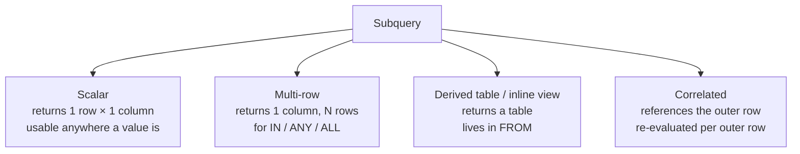
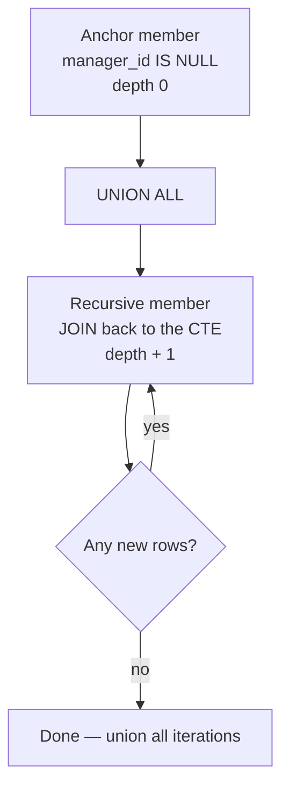

# 06 — Subqueries, CTEs & Recursion

> **Scope:** the four shapes of subquery, the `IN`/`EXISTS`/`JOIN` decision, CTEs as the readability
> tool that makes complex SQL reviewable, recursive CTEs for hierarchies of unknown depth, and
> `APPLY` — the operator most .NET developers have never used and every senior SQL interview
> rewards.

---

## The four shapes of subquery



### Scalar subquery

```sql
-- In the select list
SELECT name, salary,
       salary - (SELECT AVG(salary) FROM staff) AS vs_company_avg
FROM   staff;

-- In WHERE
SELECT name FROM staff WHERE salary > (SELECT AVG(salary) FROM staff);
```

> ⚠️ **A scalar subquery returning more than one row is a run-time error**, not a silent pick:
> *"Subquery returned more than 1 value."* Guard it with `TOP (1)` + `ORDER BY`, or `MAX`, if
> multiple rows are genuinely possible.

### Multi-row subquery — `IN`, `ANY`, `ALL`

```sql
SELECT name FROM staff
WHERE  department IN (SELECT name FROM departments WHERE active = 1);

SELECT name FROM staff WHERE salary > ALL (SELECT salary FROM staff WHERE department = 'Finance');
SELECT name FROM staff WHERE salary > ANY (SELECT salary FROM staff WHERE department = 'Finance');
```

`> ALL` means "greater than the maximum"; `> ANY` means "greater than the minimum". `IN` is just
`= ANY`. Reaching for `MAX`/`MIN` instead is usually clearer.

> ⚠️ `> ALL (…)` on an **empty** subquery is `TRUE` for every row; `> ANY` on an empty subquery is
> `FALSE`. And a `NULL` in the list makes `NOT IN` unusable — [chapter 02](02-data-types-and-constraints.md#null-and-three-valued-logic).

### Derived table — a subquery in `FROM`

```sql
SELECT d.department, d.avg_salary
FROM   (SELECT department, AVG(salary) AS avg_salary
        FROM   staff
        GROUP  BY department) AS d              -- ← the alias is MANDATORY
WHERE  d.avg_salary > 100000;
```

Requires an alias, and cannot be referenced twice — which is exactly what CTEs fix.

### Correlated subquery — references the outer row

```sql
-- Staff earning above their own department's average
SELECT s.name, s.department, s.salary
FROM   staff AS s
WHERE  s.salary > (SELECT AVG(s2.salary)
                   FROM   staff AS s2
                   WHERE  s2.department = s.department);   -- ← s.department: the correlation
```

Conceptually re-evaluated once per outer row. The optimiser often rewrites it into a join or a
windowed aggregate, but you should not rely on that:

```sql
-- The window-function form — one pass, no correlation, and it reads better
SELECT name, department, salary
FROM   (SELECT *, AVG(salary) OVER (PARTITION BY department) AS dept_avg FROM staff) AS x
WHERE  salary > dept_avg;
```

> 🎯 **The senior instinct:** "A correlated subquery in the *select list* is the shape I look for
> when a query is slow, because it can execute once per output row. Nine times out of ten it
> rewrites to a window function or a pre-aggregated join, which is one pass instead of N."

---

## `IN` vs `EXISTS` vs `JOIN`

All three can express "customers who have placed an order". They are **not** interchangeable.

```sql
-- IN — one row per customer, correct
SELECT name FROM customers
WHERE  customer_id IN (SELECT customer_id FROM orders);

-- EXISTS — one row per customer, correct, null-safe
SELECT name FROM customers AS c
WHERE  EXISTS (SELECT 1 FROM orders AS o WHERE o.customer_id = c.customer_id);

-- JOIN — ⚠️ ONE ROW PER ORDER. Asha appears twice.
SELECT c.name FROM customers AS c
JOIN   orders AS o ON o.customer_id = c.customer_id;
```

| | `IN` | `EXISTS` | `JOIN` |
| --- | --- | --- | --- |
| Duplicates the outer row | ❌ | ❌ | ✅ **one row per match** |
| Can project columns from the inner table | ❌ | ❌ | ✅ |
| `NULL`-safe when negated | ❌ **`NOT IN` breaks** | ✅ `NOT EXISTS` | ✅ |
| Short-circuits on first match | depends | ✅ by definition | n/a |
| Best when | the list is small / literal | checking **existence** | you need the inner **columns** |

> 🎯 **The complete answer:** "`IN` and `EXISTS` are semi-joins — they filter the outer rows without
> duplicating them. `JOIN` is a full join, so it returns one row per match and can duplicate the
> outer row, which is a correctness difference, not a performance one. In modern optimisers `IN` and
> `EXISTS` usually produce the *same* plan for the positive case, so the old '`EXISTS` is faster'
> rule is mostly obsolete. The difference that still matters is the **negative** case: `NOT IN`
> returns an empty set if the subquery yields a single `NULL`, while `NOT EXISTS` is safe. So I use
> `EXISTS`/`NOT EXISTS` for existence tests and `JOIN` only when I need the inner columns."

---

## Common Table Expressions (CTEs)

A CTE is a named, temporary result set that exists for the duration of one statement.

```sql
WITH dept_stats AS (
    SELECT department, AVG(salary) AS avg_salary, COUNT(*) AS headcount
    FROM   staff
    GROUP  BY department
),
big_departments AS (
    SELECT * FROM dept_stats WHERE headcount >= 3      -- ← a CTE can reference an earlier CTE
)
SELECT s.name, s.salary, b.avg_salary
FROM   staff AS s
JOIN   big_departments AS b ON b.department = s.department
WHERE  s.salary > b.avg_salary;
```

### Why a CTE over a nested subquery

| | Nested subquery | CTE |
| --- | --- | --- |
| Reads | inside-out | **top-down**, like a pipeline |
| Reusable in the same query | ❌ must be repeated | ✅ referenced by name any number of times |
| Chainable | nesting gets unreadable fast | ✅ each `WITH` builds on the last |
| Recursion | impossible | ✅ `WITH RECURSIVE` |
| Debuggable | must un-nest to test | ✅ swap the final `SELECT` to inspect a stage |
| Usable by `UPDATE`/`DELETE` | limited | ✅ (T-SQL, PostgreSQL) |

> ⚠️ **A CTE is not a temp table.** In SQL Server it is inlined into the query plan, so a CTE
> referenced three times may be **executed three times** — it is not materialised or cached. If a
> stage is expensive and reused, put it in a `#temp` table (which also gets statistics) rather than
> a CTE. PostgreSQL materialised CTEs by default before v12 and now inlines them too, with
> `MATERIALIZED` / `NOT MATERIALIZED` to force either. This nuance is a genuine senior-level
> discriminator.

### `UPDATE` and `DELETE` through a CTE

The idiomatic way to delete duplicates — a top-5 interview problem.

```sql
WITH dupes AS (
    SELECT staff_id,
           ROW_NUMBER() OVER (PARTITION BY email ORDER BY staff_id) AS rn
    FROM   staff
)
DELETE FROM dupes WHERE rn > 1;      -- keeps the lowest staff_id per email
```

---

## Recursive CTEs

For hierarchies of **unknown depth** — org charts, category trees, bills of materials, graph
traversal — where a self join would need one join per level.

```sql
WITH org AS (
    -- 1. Anchor: the root(s). No recursion here.
    SELECT employee_id, full_name, manager_id, 0 AS depth,
           CAST(full_name AS NVARCHAR(4000)) AS path
    FROM   employees
    WHERE  manager_id IS NULL

    UNION ALL          -- ← must be UNION ALL, never UNION

    -- 2. Recursive member: references the CTE itself.
    SELECT e.employee_id, e.full_name, e.manager_id, o.depth + 1,
           CAST(o.path + N' > ' + e.full_name AS NVARCHAR(4000))
    FROM   employees AS e
    JOIN   org       AS o ON o.employee_id = e.manager_id
)
SELECT REPLICATE(N'  ', depth) + full_name AS chart, depth, path
FROM   org
ORDER  BY path
OPTION (MAXRECURSION 100);           -- ← T-SQL guard; default is 100, 0 means unlimited
```

| chart | depth | path |
| --- | --- | --- |
| Ada | 0 | Ada |
| &nbsp;&nbsp;Boris | 1 | Ada > Boris |
| &nbsp;&nbsp;&nbsp;&nbsp;Chen | 2 | Ada > Boris > Chen |
| &nbsp;&nbsp;Dara | 1 | Ada > Dara |



**The four rules:**

1. Exactly one **anchor** member and one **recursive** member, combined with `UNION ALL`.
2. The recursive member must reference the CTE **exactly once**, and may not use `GROUP BY`,
   `HAVING`, `DISTINCT`, an outer join to the CTE, or a window function over it.
3. Column types must match between the two members — cast explicitly, or you get *"Types don't
   match between the anchor and the recursive part"*.
4. **Guard the depth.** `OPTION (MAXRECURSION n)` in T-SQL; a `WHERE depth < n` predicate in
   PostgreSQL/MySQL, which have no equivalent option.

> ⚠️ **Cycles cause infinite recursion.** If employee A manages B and B manages A, the CTE never
> terminates — you hit `MAXRECURSION` (error 530) or spin forever. The defence is the `path` column:
> add `AND o.path NOT LIKE '%' + e.full_name + '%'`, or carry a visited-set. PostgreSQL has
> `CYCLE … SET … USING …` built in. Volunteering the cycle problem before being asked is a strong
> signal.

> 💡 `WITH RECURSIVE` is the ANSI keyword (required in PostgreSQL, MySQL 8+, SQLite). **T-SQL does
> not use it** — plain `WITH` is recursive if it has a self-reference.

### Generating a series with recursion

Useful for calendar tables, and to fill date gaps so a report shows zero rather than a missing row.

```sql
WITH dates AS (
    SELECT CAST('2026-01-01' AS DATE) AS d
    UNION ALL
    SELECT DATEADD(DAY, 1, d) FROM dates WHERE d < '2026-12-31'
)
SELECT d FROM dates OPTION (MAXRECURSION 400);
```

> 💡 A recursive CTE for a series is elegant but slow at scale (one iteration per row). For large
> ranges, cross-join a numbers table or use `GENERATE_SERIES` (SQL Server 2022+,
> `generate_series` in PostgreSQL). A permanent **calendar table** is what production systems use.

---

## `APPLY` — the correlated join

`APPLY` invokes the right-hand expression **once per left row**, and the right side can reference
the left row's columns. A plain `JOIN` cannot do that.

```sql
-- Top 2 orders per customer — impossible with a plain JOIN, trivial with APPLY
SELECT c.name, o.order_id, o.total
FROM   customers AS c
CROSS  APPLY (SELECT TOP (2) order_id, total
              FROM   orders AS o
              WHERE  o.customer_id = c.customer_id     -- ← references the outer row
              ORDER  BY o.total DESC) AS o;
```

| | `CROSS APPLY` | `OUTER APPLY` |
| --- | --- | --- |
| Left row with an empty right side | **dropped** | **kept**, right columns `NULL` |
| Analogous to | `INNER JOIN` | `LEFT JOIN` |

Use `APPLY` for:

- **Top-N per group** where N > 1 (a window function needs a full sort of every row; `APPLY` with a
  supporting index seeks only the top N per group, and is often dramatically faster).
- Calling a **table-valued function** per row.
- Referencing a computed alias from the same `SELECT` — the trick that avoids repeating an
  expression three times:

```sql
SELECT o.order_id, calc.net, calc.net * 0.2 AS vat, calc.net * 1.2 AS gross
FROM   orders AS o
CROSS  APPLY (SELECT o.total - o.discount AS net) AS calc;
```

> 💡 `APPLY` is T-SQL (and Oracle 12c+). PostgreSQL and MySQL 8.0.14+ spell it
> `LEFT JOIN LATERAL (…) ON TRUE` / `CROSS JOIN LATERAL`. Same operator, ANSI name.

---

## Temp tables, table variables and CTEs — choosing

| | CTE | Table variable `@t` | Temp table `#t` |
| --- | --- | --- | --- |
| Lifetime | one statement | the batch | the session/scope |
| Materialised | ❌ inlined (re-executed per reference) | ✅ | ✅ |
| Statistics | n/a | ❌ (estimated as 1 row!) | ✅ full |
| Indexes | ❌ | primary/unique key only | ✅ any, after creation |
| In a transaction | n/a | not rolled back | rolled back |
| Reach for it when | readability, recursion | tiny row counts, TVPs | large intermediate sets, reused stages |

> ⚠️ **The table-variable trap:** SQL Server estimates **1 row** for a table variable (unless you
> add `OPTION (RECOMPILE)` or use deferred compilation on 2019+). Load 500 000 rows into `@t`, join
> it, and you get a nested-loops plan built for one row. A `#temp` table has real statistics. This
> is a favourite "have you actually tuned a query?" question.

---

## Rapid-fire Q&A

**Q: What is a correlated subquery?**
One that references a column from the outer query, so it is logically evaluated per outer row.

**Q: `IN` vs `EXISTS` — which is faster?**
Usually the same plan in a modern optimiser. The real difference is `NOT IN` being unsafe with
`NULL`s, and `EXISTS` reading as intent.

**Q: Is a CTE materialised?**
Not in SQL Server — it is inlined, so N references can mean N executions. Use a temp table when a
stage is expensive and reused.

**Q: CTE vs derived table?**
Same execution semantics; a CTE can be named, reused within the statement, chained, and made
recursive.

**Q: What are the required parts of a recursive CTE?**
An anchor member, `UNION ALL`, and a recursive member that references the CTE once — plus a
termination condition and a depth guard.

**Q: How do you stop a recursive CTE looping forever?**
`OPTION (MAXRECURSION n)` in T-SQL, an explicit depth predicate, and a path/visited column to break
cycles.

**Q: `CROSS APPLY` vs `CROSS JOIN`?**
`CROSS JOIN` is a Cartesian product with no correlation. `CROSS APPLY` evaluates the right side per
left row and *can* reference it.

**Q: Top 3 per group — window function or `APPLY`?**
Either is correct. `ROW_NUMBER` is more portable; `APPLY` with an index on
`(group_key, sort_key DESC)` can seek just 3 rows per group instead of sorting the whole table, so
it usually wins on large data. Say both and name the trade-off.

**Q: Can a subquery appear in `ORDER BY`?**
Yes — `ORDER BY (SELECT COUNT(*) FROM …)`. Also `ORDER BY (SELECT NULL)` is the standard trick to
satisfy `OFFSET/FETCH` when you genuinely do not want an ordering.

---

**Prev:** [05 — Aggregation & Window Functions](05-aggregation-and-window-functions.md) ·
**Next:** [07 — Normalization & Data Modelling](07-normalization-and-modelling.md) ·
**Up:** [SQL interview hub](readme.md)
