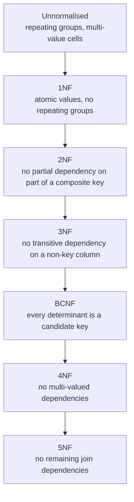
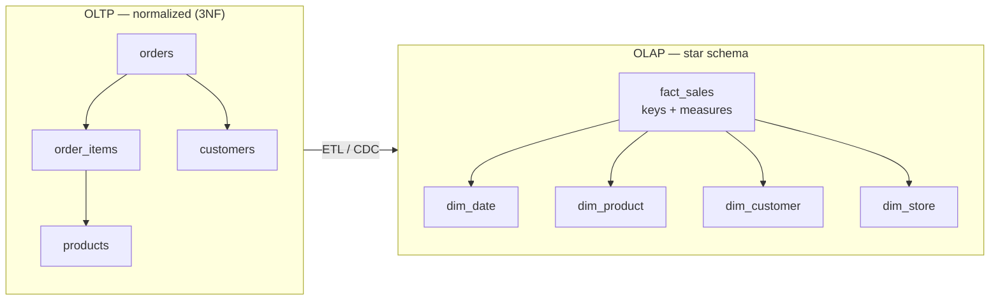

# 07 — Normalization & Data Modelling

> **Scope:** normalization from the *problem* end — the three anomalies — then each normal form
> applied to one running example, then the deliberate decision to break the rules.
> The answer that scores is never a recitation of the forms; it is "3NF by default, denormalize with
> evidence."

---

## Why normalize? The three anomalies

Normalization is not tidiness. It exists to eliminate three concrete failure modes caused by storing
the same fact twice. Start here in an interview, then define the forms.

Take one unnormalised table:

**`orders_flat`**

| order_id | customer_name | customer_city | product_name | product_category | unit_price |
| --- | --- | --- | --- | --- | --- |
| 1 | John Doe | Pune | Laptop | Electronics | 1000 |
| 2 | Jane Smith | Berlin | Phone | Electronics | 800 |
| 3 | John Doe | Pune | Headphones | Electronics | 200 |

| Anomaly | What goes wrong here | Concrete symptom |
| --- | --- | --- |
| **Insertion** | You cannot record a new product until somebody orders it — there is nowhere to put a product without an `order_id` and a customer. | Teams invent a fake "order 0" row, and every report has to filter it out forever. |
| **Update** | The laptop's price lives in every row that mentions it. Changing 1000 → 900 means updating N rows in one transaction. | Miss one and the database now holds two prices for one product. No constraint can catch it. |
| **Deletion** | Delete order 3 and the *existence* of "Headphones, Electronics, 200" is gone — it was stored nowhere else. | Silent, unrecoverable loss of reference data as a side effect of routine cleanup. |

> 🎯 **The framing that lands:** "Normalization is about making every fact live in exactly one
> place, so that a single-row `UPDATE` can never leave the database internally contradictory. Once
> a fact is stored twice, no constraint can keep the copies in agreement — only application
> discipline can, and application discipline fails."

---

## Functional dependency — the vocabulary the forms are defined in

`A → B` ("A determines B") means: for any two rows with the same `A`, `B` must be the same.

| Kind | Definition | In the table above |
| --- | --- | --- |
| **Full** dependency | `B` depends on **all** of a composite key | — |
| **Partial** dependency | `B` depends on only **part** of a composite key | violates **2NF** |
| **Transitive** dependency | `A → B` and `B → C`, so `A → C` indirectly | violates **3NF** |
| **Multi-valued** dependency | one `A` implies a *set* of `B`s, independent of `C` | violates **4NF** |

A **determinant** is any attribute set on the left of a dependency. That single word is what BCNF
is defined in terms of, so it is worth having ready.

---

## The normal forms, applied



### 1NF — atomic values

**Rule:** every cell holds a single, indivisible value; no repeating groups; every row is uniquely
identifiable.

```text
❌ Not 1NF                                  ✅ 1NF
order_id | customer  | products             order_id | customer  | product
---------|-----------|-------------------   ---------|-----------|------------
1        | John Doe  | Laptop, Mouse        1        | John Doe  | Laptop
                                            1        | John Doe  | Mouse
```

> ⚠️ **The 1NF violation you will actually meet** is a comma-separated `tags` column, or
> `phone1`/`phone2`/`phone3`. Both are repeating groups. The symptoms: you cannot index them,
> cannot constrain them with a foreign key, and "find everyone with tag X" becomes
> `LIKE '%X%'` — unindexable and wrong (`'X'` matches `'XL'`).
>
> The nuance to volunteer: a **JSON column** is a deliberate, modern 1NF violation. It is the right
> call for genuinely schemaless attributes with no query or integrity requirement, and the wrong
> call for anything you filter, join or constrain on.

### 2NF — no partial dependencies

**Rule:** in 1NF, **and** every non-key column depends on the *whole* primary key. Only possible to
violate with a **composite** key.

```text
❌ Not 2NF — PK is (order_id, product_id)
order_id | product_id | quantity | product_name | product_category
                        ^^^^^^^^   ^^^^^^^^^^^^   ^^^^^^^^^^^^^^^^
                        full dep   depends ONLY on product_id → partial
```

Split out the part that depends on only part of the key:

```sql
CREATE TABLE products (
    product_id   INT PRIMARY KEY,
    name         NVARCHAR(60) NOT NULL,
    category     NVARCHAR(40) NOT NULL,
    unit_price   DECIMAL(19,4) NOT NULL
);
CREATE TABLE order_items (
    order_id     INT NOT NULL REFERENCES orders(order_id),
    product_id   INT NOT NULL REFERENCES products(product_id),
    quantity     INT NOT NULL CHECK (quantity > 0),
    PRIMARY KEY (order_id, product_id)
);
```

> 💡 **A table with a single-column primary key is automatically in 2NF.** Saying this shows you
> understand the rule rather than having memorised it.

### 3NF — no transitive dependencies

**Rule:** in 2NF, **and** no non-key column depends on another non-key column.

```text
❌ Not 3NF
order_id (PK) | customer_id | customer_name | customer_city
                              ^^^^^^^^^^^^^   ^^^^^^^^^^^^^
              order_id → customer_id → customer_name   ← transitive
```

```sql
CREATE TABLE customers (
    customer_id INT PRIMARY KEY,
    name        NVARCHAR(60) NOT NULL,
    city        NVARCHAR(60) NOT NULL
);
CREATE TABLE orders (
    order_id    INT PRIMARY KEY,
    customer_id INT NOT NULL REFERENCES customers(customer_id),
    placed_at   DATETIME2(3) NOT NULL
);
```

The original flat table is now four: `customers`, `products`, `orders`, `order_items`. All three
anomalies are gone — a new product is one `INSERT` into `products`, a price change is one `UPDATE`,
and deleting an order cannot destroy product data.

> 🎯 **3NF in one sentence, the version to memorise:** "Every non-key attribute depends on **the
> key, the whole key, and nothing but the key** — so help me Codd."

> ⚠️ **The 3NF judgement call: price.** `order_items` should usually store its **own**
> `unit_price_at_sale`, duplicating `products.unit_price`. That is not a normalization failure — it
> is the recognition that the price *at the time of sale* is a different fact from the *current*
> price. Historical immutability beats non-redundancy. Volunteering this distinction is a strong
> senior signal.

### BCNF — every determinant is a candidate key

A stricter 3NF. The rare case 3NF misses: a table with **overlapping candidate keys** where a
non-key attribute determines part of a key.

```text
Table: (student, course, instructor)
  · Each course is taught by exactly one instructor →  instructor → course
  · A student takes a course once                   →  (student, course) is a candidate key
In 3NF (instructor is part of no dependency on a non-key column),
but `instructor` is a determinant that is NOT a candidate key → violates BCNF.
Fix: split into (student, course) and (course, instructor).
```

Most practical schemas that reach 3NF are already in BCNF. Say that — it is true and it shows
proportion.

### 4NF and 5NF — worth naming, rarely applied

- **4NF:** no **multi-valued** dependencies. A table `(employee, skill, language)` where skills and
  languages are *independent* stores every combination — 3 skills × 2 languages = 6 rows carrying 5
  facts. Split into `(employee, skill)` and `(employee, language)`.
- **5NF (PJNF):** no remaining **join dependency** — the table cannot be losslessly decomposed
  further. Almost never a live design concern.

> 🎯 **The proportionate answer:** "In practice I design to 3NF, verify BCNF when a table has
> overlapping candidate keys, and I've genuinely needed 4NF once — for a table that was storing the
> cross-product of two independent lists. 5NF is theory I can define but have never applied."

---

## Denormalization — breaking the rules on purpose

Normalization optimises for **write** correctness. Denormalization trades some of that away for
**read** speed. It is a legitimate, evidence-driven decision — not a shortcut.

| Technique | What it does | The cost you now own |
| --- | --- | --- |
| **Duplicated column** | copy `customer_name` into `orders` to avoid a join | must be updated when the customer is renamed, or accepted as a point-in-time snapshot |
| **Pre-computed aggregate** | store `orders.item_count`, `customers.lifetime_value` | goes stale; needs a trigger, a scheduled job, or an event handler |
| **Computed / persisted column** | `PERSISTED` computed column, or a generated column | the engine maintains it — the *cheapest* form of denormalization |
| **Indexed / materialised view** | engine-maintained pre-joined result | write amplification on every base-table change; strict requirements (`SCHEMABINDING`, deterministic) |
| **Star schema** | facts + wide dimensions for analytics | a separate model, loaded by ETL — not the OLTP tables |
| **JSON blob** | collapse a variable sub-structure into one column | unqueryable, unconstrainable, uninexable (mostly) |

```sql
-- The safest form: let the engine maintain it
ALTER TABLE order_items
  ADD line_total AS (quantity * unit_price_at_sale) PERSISTED;   -- indexable, never stale

-- The riskiest form: a cached count you must maintain yourself
ALTER TABLE orders ADD item_count INT NOT NULL DEFAULT 0;
```

> 🎯 **The senior answer:** "I normalize to 3NF first, because a normalized schema can always be
> denormalized later but a denormalized one is very hard to un-pick. Then I denormalize against
> **measured** evidence — a specific slow query, with the plan to prove the join is the cost. And I
> decide up front who keeps the copy correct: a persisted computed column, an indexed view, a
> trigger, or an accepted-stale nightly job. A denormalized column with no named owner is a data-
> integrity bug with a delay fuse."

> ⚠️ **Do not denormalize to avoid joins on principle.** A join on an indexed foreign key between
> two well-clustered tables is cheap; the optimiser is built for it. "Joins are slow" is almost
> always a missing index, a bad estimate or a fan-out — not the join.

---

## OLTP vs analytical modelling



| | OLTP | OLAP / warehouse |
| --- | --- | --- |
| Optimised for | many small **writes**, point reads | few huge **reads**, aggregation |
| Model | normalized, 3NF | **star** (facts + denormalized dimensions) or snowflake |
| Row width | narrow | wide dimensions, narrow facts |
| Indexes | many narrow B-trees | columnstore |
| Typical query | "this customer's last 10 orders" | "revenue by category by month for 3 years" |
| History | current state; updates in place | **slowly changing dimensions** keep history |

A **snowflake** schema normalizes the dimensions (`dim_product → dim_category`); a **star** leaves
them flat. Star wins for query simplicity and fewer joins; snowflake saves space and eases dimension
maintenance. Star is the default.

> 💡 **Slowly Changing Dimension (SCD) Type 2** is the term to know: instead of updating a
> dimension row, you close the old one (`valid_to`) and insert a new one, so a fact joined by
> surrogate key always resolves to the attribute values *as at* the time of the fact. It is how a
> warehouse answers "what was this customer's segment when they bought?" — a question the OLTP
> schema cannot answer at all.

---

## Rapid-fire Q&A

**Q: What is normalization, in one sentence?**
Organising columns and tables so each fact is stored exactly once, eliminating insertion, update and
deletion anomalies.

**Q: How far do you normalize in practice?**
3NF, then denormalize deliberately with evidence.

**Q: 2NF vs 3NF in one line each?**
2NF removes dependencies on *part of a composite key*; 3NF removes dependencies on *another non-key
column*.

**Q: Which normal form can a single-column-key table violate?**
Not 2NF (impossible), but it can still violate 3NF — a transitive dependency needs no composite key.

**Q: Give a real 1NF violation.**
A comma-separated list in one column, or `phone1`/`phone2`/`phone3`.

**Q: What does normalization cost?**
More tables, therefore more joins on read, and more round trips or more `Include`s in an ORM. It
also makes some reports impossible without a warehouse.

**Q: Name a case where duplication is correct.**
Point-in-time facts: the price, the tax rate, the shipping address **as at** the moment of sale. The
current value in the parent table is a *different fact* from the historical one.

**Q: How is normalization related to ACID?**
Complementary. ACID protects a transaction's integrity over time; normalization removes the
*structural* possibility of contradiction. A normalized schema means a single-row `UPDATE` inside
one transaction cannot leave two disagreeing copies.

**Q: What is a star schema and why not just query the OLTP tables?**
Facts surrounded by denormalized dimensions. Analytical queries scan millions of rows and would both
run slowly against narrow normalized tables and hold locks that hurt transactional throughput.

---

**Prev:** [06 — Subqueries, CTEs & Recursion](06-subqueries-ctes-and-recursion.md) ·
**Next:** [08 — Indexing & Query Performance](08-indexing-and-query-performance.md) ·
**Up:** [SQL interview hub](readme.md)
