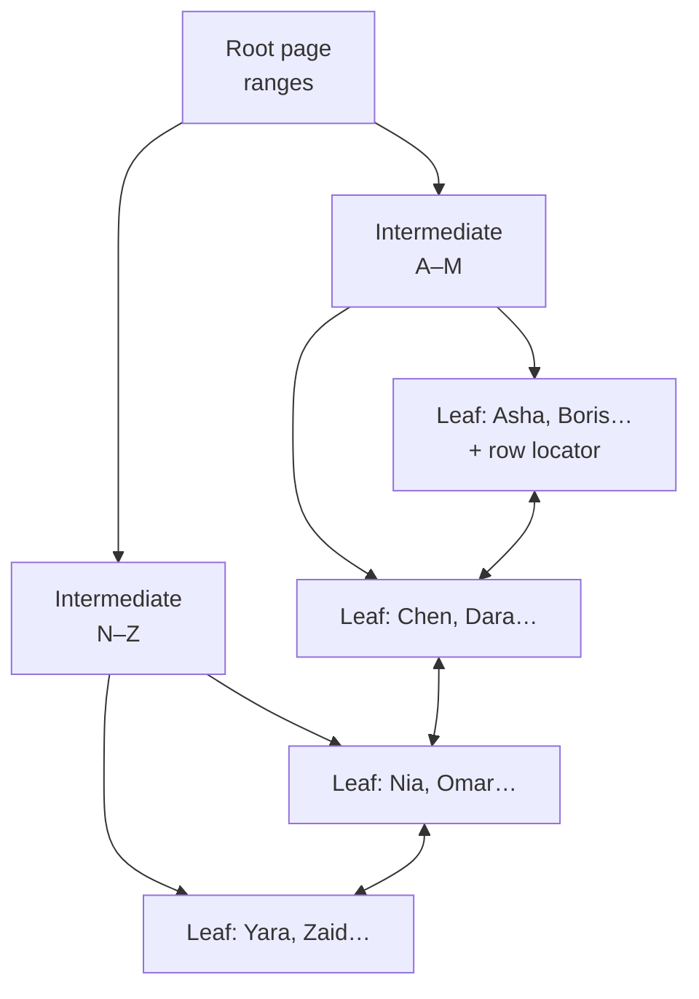

# 08 — Indexing & Query Performance

> **Scope:** the chapter that decides a senior SQL interview. Anyone can write a `JOIN`. Being able
> to say *why* a query is slow, *which* index would fix it, and *what* that index costs on write is
> the differentiator.

---

## What an index actually is

An index is a **B+-tree** (balanced, sorted) whose leaf level holds the indexed columns plus a way
to find the rest of the row. Sorted order is what makes a *seek* possible: the engine descends the
tree comparing keys, touching ~3–4 pages instead of reading every page in the table.



The doubly-linked leaf level is why an index also serves `ORDER BY`, `BETWEEN` and `GROUP BY` — once
you seek to the start of a range you can walk it in order without sorting.

> 💡 **The book analogy, said properly:** "Without an index you read every page to find a topic.
> With one you look up the sorted term and jump to the page. And exactly like a book index, it costs
> pages to store and has to be *reprinted* every time the content changes — which is why an index
> makes reads faster and writes slower."

| | Cost | Benefit |
| --- | --- | --- |
| `SELECT` | — | seek instead of scan; can avoid a sort |
| `INSERT` | one extra B-tree insert **per index** | — |
| `UPDATE` | rewrite **only** the indexes containing a changed column | — |
| `DELETE` | one delete per index | — |
| Storage | a full copy of the key columns (+ included columns) | — |
| Backup / maintenance | larger backups, longer rebuilds | — |

> 🎯 **The one-liner:** "An index speeds up reads and slows down writes, and every index is a
> second copy of some of your data that the engine must keep transactionally consistent. So the
> right number of indexes is 'as few as make the workload fast', found by looking at the actual
> query mix — not one per column."

---

## Clustered vs non-clustered

The single most-asked indexing question.

| | **Clustered** | **Non-clustered** |
| --- | --- | --- |
| What it is | **the table itself**, physically ordered by the key | a **separate** structure: key columns + a row locator |
| Count per table | **exactly one** (or none → a "heap") | up to 999 in SQL Server |
| Leaf level holds | **the entire row** | key + `INCLUDE`d columns + locator |
| Extra lookup needed | never — the data is right there | yes, unless the index **covers** the query |
| Best at | range scans, `BETWEEN`, `ORDER BY`, returning many columns | selective point lookups |
| Created by default on | the `PRIMARY KEY` (in SQL Server) | `UNIQUE` constraints |

```sql
CREATE CLUSTERED INDEX  CIX_orders_id   ON orders(order_id);
CREATE NONCLUSTERED INDEX IX_orders_cust ON orders(customer_id);
```

**The row locator matters.** On a clustered table, every non-clustered index stores the **clustered
key** as its locator — so a wide clustered key (a 16-byte GUID, or a composite of three strings) is
silently duplicated into *every* non-clustered index. On a heap it stores an 8-byte physical
`RID`.

> 🎯 **The complete answer:** "A clustered index *is* the table, stored in key order, so there is
> exactly one and it determines physical layout. A non-clustered index is a separate sorted copy of
> some columns plus a pointer back. The consequence people miss is that the clustered key is the
> pointer used by every non-clustered index, so a narrow, static, ever-increasing clustered key —
> typically an `INT`/`BIGINT IDENTITY` — keeps every other index small. That's the real argument
> against a random GUID clustered key: it's not just page splits, it's 16 bytes added to every row
> of every other index."

### Key lookups and the tipping point


Each **Key Lookup** is a separate seek into the clustered index — cheap for 3 rows, catastrophic for
30 000. Above a *tipping point* of roughly 25–30 % of the table, the optimiser abandons the
non-clustered index and scans the clustered index instead, because a scan is sequential I/O while
lookups are random. That is why "my index exists but SQL Server ignores it" is usually correct
behaviour, not a bug.

The fix is a **covering** index.

---

## Covering indexes and `INCLUDE`

An index **covers** a query when every column the query touches is in the index, so no lookup is
needed.

```sql
-- Query: SELECT total, placed_at FROM orders WHERE customer_id = @c ORDER BY placed_at;
CREATE NONCLUSTERED INDEX IX_orders_cust_covering
    ON orders(customer_id, placed_at)   -- key: used for seeking AND ordering
    INCLUDE (total);                    -- payload: available, but not part of the sort key
```

| | Key columns | `INCLUDE`d columns |
| --- | --- | --- |
| Stored at | every level of the tree | **leaf level only** |
| Usable for seeking / range / ordering | ✅ | ❌ |
| Counts toward the 900/1700-byte key limit | ✅ | ❌ |
| Can be `VARCHAR(MAX)` etc. | ❌ | ✅ |

> 🎯 **The rule:** "Columns you *filter*, *join* or *sort* on go in the key, in that order of
> selectivity and use. Columns you merely *return* go in `INCLUDE`, because they add leaf-level
> bytes without widening the tree or the key."

---

## Composite index column order — the leftmost-prefix rule

The order of key columns is not cosmetic. An index on `(a, b, c)` can seek on:

| Predicate | Can seek? | Why |
| --- | --- | --- |
| `WHERE a = 1` | ✅ | leftmost prefix |
| `WHERE a = 1 AND b = 2` | ✅ | prefix `(a, b)` |
| `WHERE a = 1 AND b = 2 AND c = 3` | ✅ | full key |
| `WHERE a = 1 AND c = 3` | ✅ partial — seek on `a`, then **filter** on `c` | `b` is skipped, so `c` cannot be sought |
| `WHERE b = 2` | ❌ **scan** | no leftmost prefix — like looking up a surname in a phone book ordered by first name |
| `WHERE b = 2 AND c = 3` | ❌ **scan** | same |
| `ORDER BY a, b` | ✅ no sort needed | matches key order |
| `ORDER BY b, a` | ❌ sort required | wrong order |

> 💡 **The heuristic:** equality columns first (most selective first among them), then the range or
> `ORDER BY` column, then `INCLUDE` the rest. An index on `(status, created_at)` serves
> `WHERE status = 'Open' ORDER BY created_at` with no sort; `(created_at, status)` cannot.
>
> **Corollary worth stating:** an index on `(a, b)` makes a separate index on `(a)` redundant — you
> can drop it. An index on `(b)` is *not* redundant.

---

## Index types beyond the basics

| Type | What it is | Use for |
| --- | --- | --- |
| **Unique** | enforces uniqueness *and* indexes | alternate keys; also tells the optimiser at most one row matches |
| **Filtered** (SQL Server) / **partial** (PostgreSQL) | `CREATE INDEX … WHERE is_deleted = 0` | sparse or soft-deleted data; much smaller index, and the workaround for SQL Server's one-`NULL`-per-`UNIQUE` limit |
| **Columnstore** | column-oriented, heavily compressed | analytical scans over millions of rows — 10× compression, batch-mode execution |
| **Full-text** | inverted word index | `CONTAINS`/`FREETEXT` — the correct answer to `LIKE '%term%'` |
| **Computed-column index** | index over a persisted computed column | making a non-SARGable expression SARGable (see below) |
| **Spatial / XML / JSON** | specialised | geography queries, XML paths |
| **Hash / memory-optimised** | in-memory OLTP | point lookups only, no range |

```sql
-- Filtered index: index only the rows the hot query actually reads
CREATE NONCLUSTERED INDEX IX_orders_open
    ON orders(placed_at) INCLUDE (customer_id, total)
    WHERE status = 'Open';
```

---

## SARGability — the single biggest win

**SARG** = Search ARGument. A predicate is *SARGable* if the optimiser can use it to **seek** an
index. The rule is simple: **the indexed column must appear alone on one side of the operator**,
unwrapped.

| ❌ Not SARGable — forces a scan | ✅ SARGable rewrite |
| --- | --- |
| `WHERE YEAR(hired_on) = 2026` | `WHERE hired_on >= '2026-01-01' AND hired_on < '2027-01-01'` |
| `WHERE CAST(created_at AS DATE) = '2026-09-02'` | `WHERE created_at >= '2026-09-02' AND created_at < '2026-09-03'` |
| `WHERE UPPER(email) = 'A@B.COM'` | `WHERE email = 'a@b.com'` with a case-insensitive collation |
| `WHERE salary * 12 > 600000` | `WHERE salary > 600000 / 12` |
| `WHERE LEFT(code, 3) = 'ABC'` | `WHERE code LIKE 'ABC%'` |
| `WHERE name LIKE '%son'` | full-text index, or store a reversed column |
| `WHERE ISNULL(discount, 0) > 0` | `WHERE discount > 0` (nulls already fail the comparison) |
| `WHERE account_no = 12345` (column is `VARCHAR`) | `WHERE account_no = '12345'` |
| `WHERE @from IS NULL OR created_at >= @from` | separate queries, or `OPTION (RECOMPILE)` |

```sql
-- ❌ Function on the column: index scan, every row evaluated
SELECT * FROM orders WHERE YEAR(placed_at) = 2026;

-- ✅ Range on the bare column: index seek
SELECT * FROM orders WHERE placed_at >= '2026-01-01' AND placed_at < '2027-01-01';

-- ✅ When you cannot change the predicate, index the expression instead
ALTER TABLE orders ADD placed_year AS YEAR(placed_at) PERSISTED;
CREATE NONCLUSTERED INDEX IX_orders_year ON orders(placed_year);
```

> ⚠️ **`LIKE 'ABC%'` seeks; `LIKE '%ABC'` and `LIKE '%ABC%'` scan.** A leading wildcard means the
> engine has no starting point in the sorted tree. This is the single most common unfixable-looking
> slow query, and the answer is full-text search — not a better index.

> ⚠️ **Implicit conversion is invisible SARGability loss.** Comparing an `NVARCHAR` column to a
> `VARCHAR` literal (or vice versa) can force the *column* to be converted on every row. The
> execution plan shows a `CONVERT_IMPLICIT` warning. Match your types.

> 🎯 **The senior framing:** "Before I add an index I check whether the existing one is being
> defeated. Wrapping the column in `YEAR()`, `CAST()`, `ISNULL()` or a concatenation makes the
> predicate non-SARGable, and no index can help. Rewriting to a half-open range on the bare column
> usually turns a scan into a seek without touching the schema at all — which is a cheaper fix than
> another index."

---

## Reading an execution plan

The plan is the answer to "why is it slow". Read it **right to left, top to bottom** (data flows
that way), and look at four things.

| What to look at | Healthy | Red flag |
| --- | --- | --- |
| **Operator** | Index Seek, Clustered Index Seek, Merge/Hash Join on big sets | **Table Scan**, **Clustered Index Scan** on a large table, **Key Lookup** with a high row count |
| **Estimated vs actual rows** | within ~10× | a 1-row estimate against 500 000 actual → stale statistics or a table variable; the whole plan shape is wrong |
| **Thick arrows** | thin | a thick arrow *into* a filter means rows were read then thrown away — push the predicate down or index it |
| **Warnings (⚠ on an operator)** | none | `CONVERT_IMPLICIT`, **spill to tempdb** (sort/hash ran out of memory), missing-index hint, excessive grant |

```sql
-- SQL Server
SET STATISTICS IO, TIME ON;         -- logical reads + CPU/elapsed: the numbers to compare
GO
SELECT … ;                          -- Ctrl-M in SSMS for the actual plan
GO
SET SHOWPLAN_XML ON;                -- estimated plan without executing

-- PostgreSQL
EXPLAIN (ANALYZE, BUFFERS) SELECT …;

-- MySQL
EXPLAIN ANALYZE SELECT …;
```

> 💡 **Compare *logical reads*, not duration.** Elapsed time varies with cache state, other load and
> parallelism. Logical reads (pages touched) is the stable measure of whether your change actually
> reduced work. Going from 250 000 reads to 12 is a real fix; going from 900 ms to 700 ms may be
> noise.

> ⚠️ **Never trust the "Missing Index" hint blindly.** It is generated per-query, ignores every
> other query and every write cost, and routinely suggests a wide index that duplicates one you
> already have. Treat it as a hypothesis: check the existing indexes first, and prefer *extending*
> one over adding another.

---

## Statistics, cardinality and parameter sniffing

The optimiser is a **cost-based** engine. It estimates how many rows each operator will produce
using **statistics** (histograms of column values), and picks a plan from those estimates. Bad
estimates produce bad plans — the seek/scan and loop/hash choices are only correct for the row count
the optimiser believed.

```sql
UPDATE STATISTICS dbo.orders WITH FULLSCAN;                -- refresh
SELECT * FROM sys.dm_db_stats_properties(OBJECT_ID('dbo.orders'), 1);  -- how stale?
```

### Parameter sniffing

On first execution of a parameterised query, SQL Server "sniffs" the parameter values, builds a plan
optimised for **those** values, and **caches** it for all later executions.

```sql
CREATE PROCEDURE dbo.GetOrdersByCountry @country CHAR(2) AS
SELECT * FROM orders WHERE country = @country;

EXEC dbo.GetOrdersByCountry 'LU';   -- 12 rows      → plan: index seek + key lookups. Perfect.
EXEC dbo.GetOrdersByCountry 'US';   -- 8,000,000 rows → SAME cached plan: 8M key lookups. Disaster.
```

| Mitigation | Effect | Cost |
| --- | --- | --- |
| `OPTION (RECOMPILE)` | fresh plan every execution, always right for the values | CPU per execution; no plan reuse |
| `OPTIMIZE FOR (@p = 'US')` | pin the plan to a chosen typical value | wrong for atypical values |
| `OPTIMIZE FOR UNKNOWN` | use average density instead of the sniffed value | mediocre for everyone, stable for all |
| Local variable copy | disables sniffing (same as `UNKNOWN`) | obscure; prefer the explicit hint |
| Split the procedure | separate paths for skewed vs normal values | more code |
| **Query Store forced plan** | pin a known-good plan without changing code | needs monitoring; SQL Server 2016+ |

> 🎯 **The answer that shows real experience:** "Parameter sniffing is a *feature* — reusing a plan
> avoids recompiling — that becomes a bug when the data is skewed, because one cached plan has to
> serve wildly different row counts. The symptom is the classic 'it's fast for most customers and
> times out for the biggest one', and the tell is that a `DBCC FREEPROCCACHE` or a recompile makes
> it fast again for a while. I'd confirm it in Query Store — same query, two plans with very
> different durations — then fix it with `OPTION (RECOMPILE)` if execution frequency is low, or by
> splitting the procedure if it's a hot path."

---

## When *not* to index

- **Very small tables** — a scan of a single page beats tree traversal, and the optimiser will
  ignore the index anyway.
- **Low-selectivity columns** alone — a `bit`/`status` column with two values. Useful only as the
  *leading* column of a composite index, or as a **filtered** index.
- **Write-heavy staging / logging tables** — index them after the load, not before.
- **Columns that are never filtered, joined or sorted on** — put them in `INCLUDE` if needed, or
  nowhere.
- **Duplicates.** `(a)` when `(a, b)` exists; `(a, b)` when `(a, b, c)` exists. Every duplicate is
  pure write cost. Find them with `sys.dm_db_index_usage_stats` — an index with many `user_updates`
  and zero `user_seeks`/`user_scans` is costing you and buying nothing.

---

## The rest of the tuning checklist

| Problem | Look for | Fix |
| --- | --- | --- |
| Query suddenly slow, no code change | stale statistics, plan regression | `UPDATE STATISTICS`; Query Store plan comparison |
| Slow only for some inputs | parameter sniffing | `RECOMPILE` / split / force plan |
| Index exists but unused | non-SARGable predicate, implicit conversion, wrong key order | rewrite the predicate; reorder the key |
| Fast alone, slow under load | blocking, not cost | [09 — Concurrency](09-transactions-and-concurrency.md) |
| Many round trips | N+1 from the ORM | `Include`, projection, batching — [11](11-sql-from-dotnet.md#the-n1-problem) |
| Index fragmentation | `sys.dm_db_index_physical_stats` | `REORGANIZE` < 30 %, `REBUILD` above; and check `FILLFACTOR` |
| `SELECT *` in a hot path | covering index defeated | project only the columns needed |
| Huge sort / hash spill warning | insufficient memory grant | reduce row width, add a supporting index to avoid the sort |

> ⚠️ **`WITH (NOLOCK)` is not a performance fix.** It is `READ UNCOMMITTED` per table: it can
> return uncommitted rows, miss rows, or return the same row twice. See
> [09](09-transactions-and-concurrency.md#the-nolock-conversation). If a query is slow because it is
> *blocked*, the fix is the blocking, or snapshot isolation — never dirty reads.

---

## Rapid-fire Q&A

**Q: Clustered vs non-clustered, in one line?**
Clustered *is* the table in key order (one per table); non-clustered is a separate sorted copy of
some columns plus a pointer back (many per table).

**Q: How many clustered indexes can a table have, and what if it has none?**
One. With none it is a **heap** — unordered pages, and non-clustered indexes point at physical
`RID`s.

**Q: What is a covering index?**
One containing every column a query needs, so no lookup into the base table is required.

**Q: Key columns vs `INCLUDE`?**
Key columns are in the whole tree and can be sought/sorted on; `INCLUDE`d columns sit at the leaf
only and just avoid a lookup.

**Q: Does index column order matter?**
Yes — only a **leftmost prefix** of the key can be sought. `(a, b)` cannot seek `WHERE b = 2`.

**Q: What makes a predicate non-SARGable?**
Wrapping the indexed column in a function or expression, or forcing an implicit type conversion on
it.

**Q: Why would the optimiser ignore my index?**
The predicate is not SARGable; or the index does not cover the query and the estimated row count is
past the tipping point where a scan is cheaper; or statistics are wrong.

**Q: What is the tipping point?**
Roughly 25–30 % of the table — beyond it, sequential scanning beats random key lookups.

**Q: What is a bookmark / key lookup?**
The extra seek into the clustered index (or heap) to fetch columns absent from the non-clustered
index. Eliminate it with `INCLUDE`.

**Q: How do you find unused indexes?**
`sys.dm_db_index_usage_stats` — high `user_updates`, zero seeks/scans. Note the counters reset on
service restart, so measure over a full business cycle.

**Q: Index fragmentation — does it still matter?**
Much less than it used to on SSDs, where random reads are cheap. Page **density** (wasted space, so
more pages to read and more memory consumed) matters more than logical order. Rebuild for density,
not for a fragmentation percentage.

**Q: First thing you do with a slow query?**
Get the **actual** execution plan and `SET STATISTICS IO ON`. Everything else is guessing.

---

**Prev:** [07 — Normalization & Data Modelling](07-normalization-and-modelling.md) ·
**Next:** [09 — Transactions & Concurrency](09-transactions-and-concurrency.md) ·
**Up:** [SQL interview hub](readme.md)
