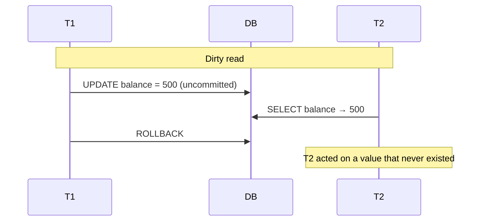
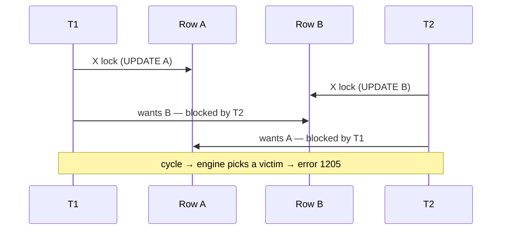

# 09 — Transactions & Concurrency

> **Scope:** ACID, the isolation levels and *what each one lets through*, and the three real
> production conversations — deadlocks, `NOLOCK`, and optimistic concurrency. This is where a
> database interview becomes a systems interview.

---

## ACID

A transaction is a unit of work that either happens completely or not at all.

```sql
BEGIN TRANSACTION;
    UPDATE accounts SET balance = balance - 100 WHERE account_id = 'A';
    UPDATE accounts SET balance = balance + 100 WHERE account_id = 'B';
COMMIT;                 -- or ROLLBACK
```

| Property | Guarantee | Mechanism | What breaks without it |
| --- | --- | --- | --- |
| **A**tomicity | all statements commit or none do | write-ahead log + undo | the debit lands, the credit doesn't — money vanishes |
| **C**onsistency | the database moves from one valid state to another; all constraints hold at commit | constraints, triggers, cascades | a negative balance, an orphaned order line |
| **I**solation | concurrent transactions do not see each other's partial work | locking or row versioning | two withdrawals both read the old balance and both succeed |
| **D**urability | once committed, it survives a crash | write-ahead log flushed to stable storage before commit acknowledges | the commit is acknowledged, the power fails, the money is gone |

> 💡 **How atomicity and durability are both achieved by one mechanism.** The **write-ahead log**
> (WAL / transaction log) records the intent *before* the data pages change. On crash recovery the
> engine **redoes** committed transactions found in the log (durability) and **undoes** uncommitted
> ones (atomicity). If someone asks "how does a database guarantee ACID?", "write-ahead logging plus
> either locking or MVCC" is the answer.

> ⚠️ **Consistency in ACID ≠ consistency in CAP.** ACID's C means "no constraint is violated";
> CAP's C means "every replica returns the same value". Conflating them is a common slip — see
> [Architecture 07](../Architecture/07-databases-and-orm.md#acid-vs-base-cap).

### Explicit transaction control

```sql
BEGIN TRANSACTION;
    UPDATE inventory SET qty = qty - 1 WHERE sku = 'X1';
    SAVE TRANSACTION before_audit;              -- MySQL/PostgreSQL: SAVEPOINT before_audit
        INSERT INTO audit_log (…) VALUES (…);
    ROLLBACK TRANSACTION before_audit;          -- undo only the audit insert
COMMIT;                                         -- the inventory change still commits
```

```sql
-- The production shape: fail closed, and never leave a transaction open
SET XACT_ABORT ON;                 -- any error aborts the whole transaction
BEGIN TRY
    BEGIN TRANSACTION;
        UPDATE accounts SET balance = balance - @amt WHERE account_id = @from;
        IF (SELECT balance FROM accounts WHERE account_id = @from) < 0
            THROW 50001, 'Insufficient funds', 1;
        UPDATE accounts SET balance = balance + @amt WHERE account_id = @to;
    COMMIT;
END TRY
BEGIN CATCH
    IF XACT_STATE() <> 0 ROLLBACK;
    THROW;                         -- rethrow: never swallow the error
END CATCH;
```

> ⚠️ **`SET XACT_ABORT ON` matters more than it looks.** Without it, many T-SQL errors abort only
> the *statement*, leaving the transaction open and partially applied — so a `CATCH` that forgets to
> roll back leaks an open transaction holding locks. And note `@@TRANCOUNT`/`XACT_STATE()`: nested
> `BEGIN TRANSACTION` calls only increment a counter — **only the outermost `COMMIT` commits**,
> while *any* `ROLLBACK` unwinds everything.

---

## The three read phenomena

Isolation levels are defined entirely by which of these they permit. Learn the phenomena first.



| Phenomenon | What happens | Concrete damage |
| --- | --- | --- |
| **Dirty read** | you read another transaction's **uncommitted** change | you act on a value that is rolled back seconds later |
| **Non-repeatable read** | you read the same **row** twice in one transaction and get different values | a validation check passes, then the amount changes before you use it |
| **Phantom read** | you run the same **range query** twice and new rows appear | `COUNT(*)` for a capacity check returns 9, you insert, the limit of 10 is now exceeded because someone else also inserted |

A fourth, subtler one that senior interviews like:

| Phenomenon | What happens | Concrete damage |
| --- | --- | --- |
| **Lost update** | two transactions read the same value, both compute a new one, and the second overwrites the first | two `balance - 100` withdrawals run, one disappears — and no isolation level below `REPEATABLE READ` prevents it |

---

## The four isolation levels

| Level | Dirty read | Non-repeatable read | Phantom | How | Concurrency |
| --- | --- | --- | --- | --- | --- |
| `READ UNCOMMITTED` | ✅ **allowed** | ✅ | ✅ | takes no shared locks | highest |
| `READ COMMITTED` *(default: SQL Server, PostgreSQL, Oracle)* | ❌ | ✅ | ✅ | shared lock held for the **statement** only | high |
| `REPEATABLE READ` *(default: MySQL InnoDB)* | ❌ | ❌ | ✅ | shared locks held to **end of transaction** | lower |
| `SERIALIZABLE` | ❌ | ❌ | ❌ | **range** locks — blocks inserts into the read range | lowest |

Plus two version-based levels in SQL Server, which are the modern answer:

| Level | Reads see | Writers block readers? | Cost |
| --- | --- | --- | --- |
| **RCSI** (`READ_COMMITTED_SNAPSHOT ON`) | a consistent snapshot as at **statement start** | **no** | row versions in `tempdb` |
| `SNAPSHOT` | a consistent snapshot as at **transaction start** | **no** | `tempdb` + possible update conflicts (error 3960) |

```sql
SET TRANSACTION ISOLATION LEVEL REPEATABLE READ;
BEGIN TRANSACTION;
    SELECT balance FROM accounts WHERE account_id = 'A';   -- read
    -- … other work; nobody can change row A until we finish
    SELECT balance FROM accounts WHERE account_id = 'A';   -- guaranteed identical
COMMIT;

-- Database-level switch, and the one to recommend:
ALTER DATABASE MyDb SET READ_COMMITTED_SNAPSHOT ON WITH ROLLBACK IMMEDIATE;
```

> 🎯 **The senior answer to "which isolation level would you use?":** "`READ COMMITTED` is the
> default and right for most work, but its *locking* implementation means writers block readers,
> which is where most 'the site is slow' blocking comes from. On SQL Server I'd turn on
> **READ_COMMITTED_SNAPSHOT**, which keeps the same logical guarantees but serves reads from row
> versions, so readers never block and never take dirty data. It costs `tempdb` space and adds a
> 14-byte version pointer per row, and writers still block writers. For the specific operations that
> need it — a capacity check, a "reserve the last seat" flow — I'd use `SERIALIZABLE` or an explicit
> `UPDLOCK, HOLDLOCK` hint on just that statement, rather than raising the level globally."

> ⚠️ **`REPEATABLE READ` still allows phantoms; `SERIALIZABLE` does not.** That is the *only*
> difference between them, and it is the question. `SERIALIZABLE` achieves it with range/key-range
> locks, which is why it deadlocks far more readily.

> 💡 **PostgreSQL and MySQL use MVCC natively**, so `READ COMMITTED` there already gives
> non-blocking reads without any switch — and PostgreSQL's `REPEATABLE READ` blocks phantoms too
> (it is snapshot isolation). "The isolation level names are standard; the *implementations* and
> even the guarantees differ per engine" is a good thing to say out loud.

---

## Locking, blocking and deadlocks

Three words often used interchangeably. Distinguishing them precisely is worth a lot.

| Term | Meaning | Normal? |
| --- | --- | --- |
| **Locking** | the mechanism — a transaction reserves a resource | ✅ constant and healthy |
| **Blocking** | transaction B waits for A's lock to release | ✅ brief is normal; sustained is a problem |
| **Deadlock** | A waits on B *and* B waits on A — neither can proceed | ❌ always a bug; the engine kills one |

### Lock modes and compatibility

| | Shared (S) | Update (U) | Exclusive (X) |
| --- | --- | --- | --- |
| **Shared (S)** | ✅ compatible | ✅ | ❌ |
| **Update (U)** | ✅ | ❌ | ❌ |
| **Exclusive (X)** | ❌ | ❌ | ❌ |

Granularity escalates: row → page → table. **Lock escalation** kicks in around 5 000 locks in one
statement, converting them to a single table lock — which is why one large `UPDATE` can block an
entire table. The fix is batching:

```sql
-- Instead of one 10-million-row UPDATE that escalates to a table lock:
WHILE 1 = 1
BEGIN
    UPDATE TOP (5000) orders SET status = 'Archived'
    WHERE  status = 'Closed' AND placed_at < '2024-01-01';
    IF @@ROWCOUNT = 0 BREAK;
END
```

### The deadlock everyone demonstrates



```sql
-- T1                                   -- T2
BEGIN TRAN;                             BEGIN TRAN;
UPDATE accounts SET … WHERE id = 'A';   UPDATE accounts SET … WHERE id = 'B';
UPDATE accounts SET … WHERE id = 'B';   UPDATE accounts SET … WHERE id = 'A';
-- deadlock
```

**Preventing deadlocks:**

1. **Always touch resources in the same order.** If every transaction updates accounts in ascending
   `account_id` order, this cycle is impossible. This is the primary fix.
2. **Keep transactions short.** No user input, no HTTP call, no `Thread.Sleep` inside a transaction.
   A transaction's lifetime is its blast radius.
3. **Index the predicates you update on.** An unindexed `UPDATE … WHERE` scans and locks rows it
   does not even change, hugely widening the conflict surface. A surprising number of deadlocks are
   really a missing index.
4. **Use the lowest sufficient isolation level**, and RCSI so readers stop participating at all.
5. **Take the final lock first** — `SELECT … WITH (UPDLOCK)` when you read a row you intend to
   update, so you never upgrade S→X (a classic conversion deadlock).
6. **Retry on 1205.** Deadlocks are a *normal, expected* failure in a busy system. The application
   must catch and retry with jitter.

```c#
// The .NET side: deadlock (1205) and update-conflict (3960) are transient — retry them.
// EF Core has this built in:
options.UseSqlServer(cs, sql => sql.EnableRetryOnFailure(
    maxRetryCount: 5,
    maxRetryDelay: TimeSpan.FromSeconds(10),
    errorNumbersToAdd: [1205, 3960]));   // execution strategy retries transient SQL errors
```

> ⚠️ **`EnableRetryOnFailure` refuses to run a user-initiated transaction.** With an execution
> strategy configured, `BeginTransaction()` throws unless you wrap the whole unit of work in
> `strategy.ExecuteAsync(…)` — because the strategy has to be able to retry the *entire*
> transaction, not one statement inside it. Knowing this specific interaction is a good EF Core
> signal.

> 💡 **Deadlock vs timeout:** a deadlock is detected by the engine (SQL Server's monitor runs every
> ~5 s) which kills the cheapest victim, returning **error 1205** almost immediately. A **lock
> timeout** (`LOCK_TIMEOUT`, or the client's `CommandTimeout`) is one-sided waiting that eventually
> gives up. If the error says 1205 you have a cycle; if it says "timeout expired" you have
> blocking. Different diagnoses, different fixes.

To capture them: the **system_health** extended-events session records every deadlock graph by
default — no setup needed. That is the answer to "how would you investigate a deadlock in
production?"

---

## The `NOLOCK` conversation

`WITH (NOLOCK)` is `READ UNCOMMITTED` for one table. It will come up, and the expected answer is
*not* "it makes queries faster".

What it actually permits:

- **Dirty reads** — rows from transactions that later roll back.
- **Missing rows** — a page split during your scan can move rows past the scan position.
- **Duplicated rows** — the same row read twice for the same reason.
- **Outright errors** — *"Could not continue scan with NOLOCK due to data movement"* (error 601).

```sql
SELECT COUNT(*) FROM orders WITH (NOLOCK);   -- can be wrong in BOTH directions
```

> 🎯 **The answer:** "`NOLOCK` doesn't make the query cheaper — it does the same work — it just
> stops taking shared locks, so it doesn't wait. What you buy is not blocking; what you pay is
> correctness: dirty reads, and — the part people don't know — rows skipped or double-counted
> because of page movement mid-scan, plus the occasional error 601. If the real problem is that
> reads are blocked by writes, **RCSI** solves it properly: non-blocking reads *and* a
> transactionally consistent result. I'd only accept `NOLOCK` on a genuinely approximate query over
> data nobody is writing — an archive table or a rough dashboard number."

---

## Optimistic concurrency with `rowversion`

Two users open the same record and both save. Pessimistic locking (holding a lock across the user's
thinking time) does not scale. **Optimistic** concurrency detects the collision at write time.

```sql
ALTER TABLE products ADD row_ver ROWVERSION;   -- 8-byte, auto-incremented on every UPDATE
```

```sql
-- Read
SELECT product_id, name, price, row_ver FROM products WHERE product_id = 42;

-- Write: only succeeds if nobody else changed the row in between
UPDATE products
SET    price = @newPrice
WHERE  product_id = 42
  AND  row_ver = @rowVerReadEarlier;

IF @@ROWCOUNT = 0
    THROW 50002, 'The record was modified by another user.', 1;
```

```c#
// EF Core: mark the token and it is added to the WHERE clause automatically
public class Product
{
    public int Id { get; set; }
    public decimal Price { get; set; }

    [Timestamp]                       // or .IsRowVersion() in OnModelCreating
    public byte[]? RowVersion { get; set; }
}

try
{
    await db.SaveChangesAsync();
}
catch (DbUpdateConcurrencyException ex)
{
    // 0 rows affected ⇒ someone else won. Reload, merge, or tell the user — never blind-retry.
    var entry = ex.Entries.Single();
    var current = await entry.GetDatabaseValuesAsync();
    // … present the conflict
}
```

| | Pessimistic (`UPDLOCK, HOLDLOCK`) | Optimistic (`rowversion`) |
| --- | --- | --- |
| Conflict detected | at **read** time (others wait) | at **write** time (loser is rejected) |
| Scales across a user "think time" | ❌ holds locks | ✅ holds nothing |
| Suits | short server-side critical sections | web/API edit forms, distributed clients |
| Failure mode | blocking, deadlocks | a rejected save the user must resolve |

> 💡 A `LastModified` `datetime2` column is a *worse* token than `rowversion`: two updates in the
> same clock tick are indistinguishable, and clocks are not monotonic. `rowversion` is guaranteed
> unique and increasing within the database.

---

## Rapid-fire Q&A

**Q: What does ACID stand for and which property does isolation level trade away?**
Atomicity, Consistency, Isolation, Durability. Isolation levels weaken **I** — deliberately — to buy
concurrency.

**Q: Default isolation level?**
`READ COMMITTED` in SQL Server, PostgreSQL and Oracle; **`REPEATABLE READ`** in MySQL InnoDB.

**Q: Difference between `REPEATABLE READ` and `SERIALIZABLE`?**
Only phantoms. `SERIALIZABLE` adds range locks so no new row can enter a range you have read.

**Q: What is a phantom read?**
The same range query returns extra rows on a second execution within one transaction because another
transaction inserted into that range.

**Q: What is a lost update, and how do you prevent it?**
Two transactions read then write the same value; the second overwrites the first. Prevent with
`UPDLOCK` on read, an atomic in-place update (`SET balance = balance - 100`), or an optimistic
concurrency token.

**Q: Locking vs blocking vs deadlock?**
Locking is the mechanism, blocking is one transaction waiting, a deadlock is a *cycle* of waits that
cannot resolve itself.

**Q: What does SQL Server do about a deadlock?**
Detects the cycle, picks the transaction with the lowest rollback cost as **victim**, rolls it back
and returns error **1205**. You handle it by retrying.

**Q: How do you make `TRUNCATE` part of a transaction?**
In SQL Server and PostgreSQL it already is — just wrap it in `BEGIN TRAN`. In MySQL and Oracle it
performs an implicit commit and cannot be rolled back.

**Q: Is a single `UPDATE` statement atomic without an explicit transaction?**
Yes. Every statement runs in an implicit (autocommit) transaction. You need an explicit one to make
**several** statements atomic together.

**Q: `TransactionScope` in .NET — any caveat?**
It escalates to a **distributed** transaction (MSDTC) if it touches two connections or resource
managers, which is slow and often unavailable in containers. Prefer one `DbTransaction` on one
connection, and for cross-service work use the **Saga** pattern instead —
[Architecture 10](../Architecture/10-microservices-patterns.md).

**Q: How long should a transaction be open?**
As briefly as possible. Never across a user interaction, an HTTP call, or a message publish. Do the
external work first, then open the transaction.

---

**Prev:** [08 — Indexing & Query Performance](08-indexing-and-query-performance.md) ·
**Next:** [10 — Views, Procedures, Functions & Triggers](10-views-procedures-functions-triggers.md) ·
**Up:** [SQL interview hub](readme.md)
