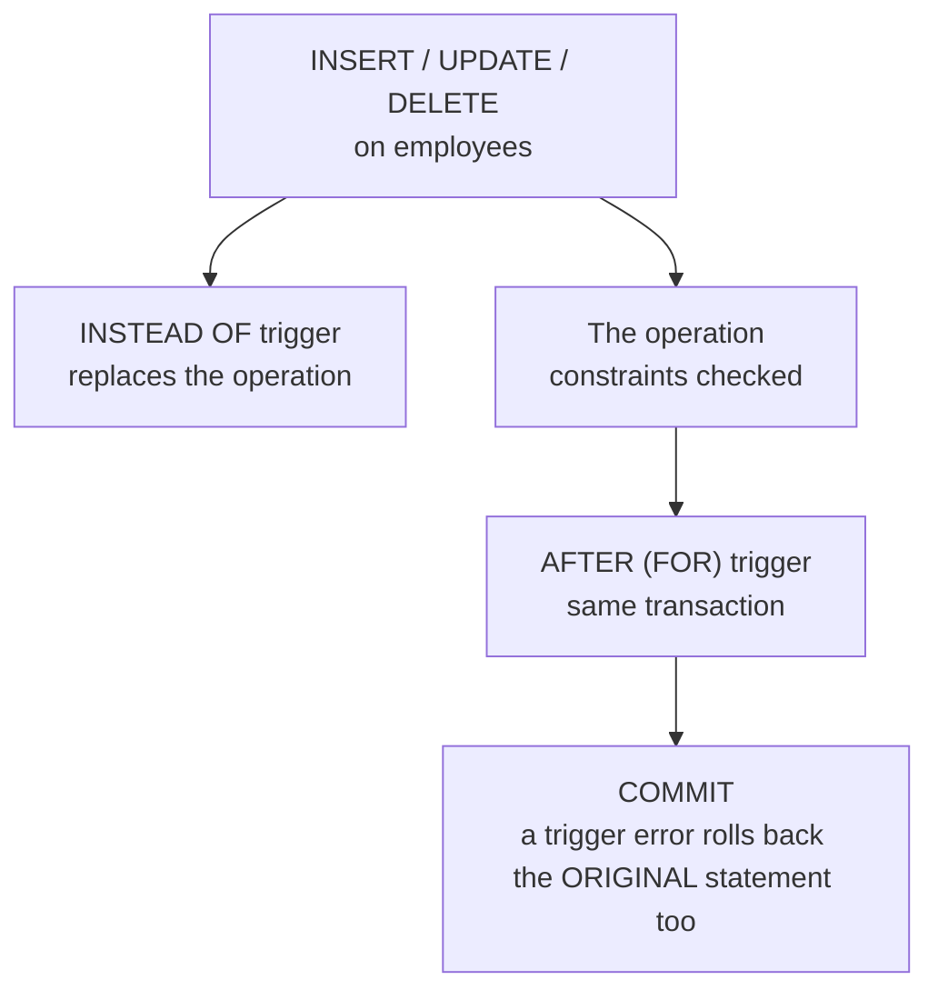

# 10 — Views, Procedures, Functions & Triggers

> **Scope:** the programmable objects. Interviewers use them to test two things: whether you know
> the difference between a procedure and a function, and whether you understand why the *convenient*
> option (scalar UDF, trigger, cursor) is often the slow one.

---

## Views

A view is a **named `SELECT`** — a virtual table. It stores no data; it is expanded into the
referencing query at execution time.

```sql
CREATE VIEW dbo.vw_employee_projects
AS
SELECT e.employee_id, e.full_name, p.name AS project_name
FROM   employees AS e
JOIN   projects  AS p ON p.employee_id = e.employee_id;
GO

SELECT * FROM dbo.vw_employee_projects WHERE full_name LIKE 'A%';
```

### What views are actually for

| Purpose | Explanation |
| --- | --- |
| **Security** | grant `SELECT` on the view, not the base tables — the classic way to expose some columns/rows without exposing the table. Combine with a `WHERE` for row-level filtering. |
| **Abstraction** | the view is a stable contract; the tables underneath can be refactored. |
| **Simplification** | a five-table join expressed once, reused everywhere. |
| **Backward compatibility** | after splitting a table, a view with the old name and shape keeps existing callers working. |

### Lifecycle

| Stage | Statement | Note |
| --- | --- | --- |
| Create | `CREATE VIEW` / `CREATE OR ALTER VIEW` | stored in the schema as a definition only |
| Use | `SELECT`, and `INSERT`/`UPDATE`/`DELETE` **if updatable** | see below |
| Modify | `ALTER VIEW` / `CREATE OR ALTER VIEW` | callers unaffected if the shape is unchanged |
| Drop | `DROP VIEW` | dependent objects then fail at *run* time, not drop time |

> ⚠️ **`SELECT *` in a view is a bug waiting to happen.** The column list is resolved and stored
> when the view is created, so adding a column to the base table does **not** appear in the view —
> and worse, *renaming* one can make the view return the wrong data under the old name until you run
> `sp_refreshview`. Always list columns explicitly. `WITH SCHEMABINDING` prevents the base table
> from changing underneath the view at all.

### Updatable views

A view is updatable only if the engine can map each affected row to exactly one base-table row.
Disqualifiers: `DISTINCT`, `GROUP BY`, aggregates, `UNION`, `TOP` with certain options, window
functions, and (for a multi-table view) touching more than one table in a single DML statement.

`WITH CHECK OPTION` prevents writing a row through the view that the view's own `WHERE` would then
hide:

```sql
CREATE VIEW dbo.vw_active_customers
AS SELECT customer_id, name, is_active FROM customers WHERE is_active = 1
WITH CHECK OPTION;      -- INSERT … is_active = 0 now fails instead of vanishing
```

For anything non-trivial, use an `INSTEAD OF` trigger on the view — the only supported way to make a
complex multi-table view writable.

### Indexed (materialised) views

```sql
CREATE VIEW dbo.vw_sales_by_day
WITH SCHEMABINDING                      -- ← required
AS
SELECT sale_date, COUNT_BIG(*) AS orders, SUM(total) AS revenue   -- ← COUNT_BIG, not COUNT
FROM   dbo.orders
GROUP  BY sale_date;
GO
CREATE UNIQUE CLUSTERED INDEX CIX_vw_sales_by_day ON dbo.vw_sales_by_day(sale_date);
```

Now the aggregate is **stored and maintained by the engine** on every base-table write.
Requirements are strict: `SCHEMABINDING`, two-part names, deterministic expressions, `COUNT_BIG(*)`
if the view has aggregates, no outer joins, no subqueries. In Enterprise edition the optimiser will
even use it for queries that never mention the view.

| | View | Indexed view | Table |
| --- | --- | --- | --- |
| Stores data | ❌ | ✅ | ✅ |
| Read cost | the underlying query, every time | pre-computed | direct |
| Write cost | none | **every base-table write updates it** | direct |
| Always current | ✅ | ✅ (synchronously) | — |

> 🎯 **The trade-off to state:** "A normal view is just query text — it costs nothing to keep and
> nothing is precomputed. An indexed view is a real, engine-maintained materialisation: reads get
> dramatically cheaper and every `INSERT`/`UPDATE` to the base tables gets more expensive and now
> takes locks in the view too. So it's for read-heavy aggregates over relatively static data, and
> it's the wrong answer for a hot write path — where I'd use a cache or an asynchronously updated
> summary table instead." PostgreSQL's `MATERIALIZED VIEW` is *not* the same thing: it is a
> snapshot refreshed on demand with `REFRESH MATERIALIZED VIEW`, so it can be stale.

---

## Stored procedures vs functions

The comparison interviewers want.

| | Stored procedure | Scalar function | Table-valued function |
| --- | --- | --- | --- |
| Returns | zero, one or many result sets, `OUTPUT` params, a return code | **one scalar value** | a **table** |
| Called with | `EXEC` (a statement of its own) | inline in an expression | in `FROM` |
| Usable inside a `SELECT` | ❌ | ✅ | ✅ |
| Can modify data | ✅ | ❌ | ❌ |
| Can contain a transaction | ✅ | ❌ | ❌ |
| Can do error handling (`TRY`/`CATCH`) | ✅ | limited | ❌ |
| Can call dynamic SQL | ✅ | ❌ | ❌ |
| Optimiser sees inside it | per-statement plans | ⚠️ often **not** — see the warning | inline TVF: **yes**; multi-statement TVF: **no** |

```sql
-- Procedure: an action
CREATE OR ALTER PROCEDURE dbo.GetEmployeesByDepartment
    @department_id INT,
    @headcount     INT OUTPUT
AS
BEGIN
    SET NOCOUNT ON;                       -- suppress "N rows affected" chatter
    SELECT employee_id, full_name, salary
    FROM   dbo.employees
    WHERE  department_id = @department_id;

    SELECT @headcount = @@ROWCOUNT;
END;
GO

DECLARE @n INT;
EXEC dbo.GetEmployeesByDepartment @department_id = 1, @headcount = @n OUTPUT;
SELECT @n AS headcount;
```

```sql
-- Inline table-valued function: composable and fast (the optimiser inlines the body)
CREATE OR ALTER FUNCTION dbo.EmployeesInDepartment (@department_id INT)
RETURNS TABLE
AS RETURN (
    SELECT employee_id, full_name, salary
    FROM   dbo.employees
    WHERE  department_id = @department_id
);
GO
SELECT * FROM dbo.EmployeesInDepartment(1) WHERE salary > 100000;   -- predicate pushes INTO the TVF
```

> ⚠️ **Scalar UDFs are the classic hidden performance killer.** Before SQL Server 2019, a scalar
> UDF in a `SELECT` list or `WHERE` clause was executed **once per row**, was invisible in the
> execution plan, and forced the whole query **serial** (no parallelism). A query over a million
> rows made a million function calls that the plan did not show you.
>
> SQL Server 2019+ can **inline** many of them (Scalar UDF Inlining) — but only if they meet a long
> list of conditions, and it is disabled by default at compatibility level < 150. And a UDF in a
> `WHERE` clause is non-SARGable regardless.
>
> 🎯 **The answer:** "I avoid scalar UDFs in queries. If I need reusable row logic I write an
> **inline table-valued function** and use `CROSS APPLY`, because the optimiser can see and inline
> the body, push predicates into it and parallelise. A **multi-statement** TVF has the same problem
> as a scalar UDF — a fixed cardinality guess (1 row before 2014, 100 after) that wrecks the plan."

### Procedures vs ad-hoc SQL

| Procedures give you | The counter-argument |
| --- | --- |
| plan reuse, precompiled | modern engines auto-parameterise and cache ad-hoc SQL too |
| an API surface: grant `EXECUTE` only | ORMs parameterise, which closes the injection gap |
| logic changes without redeploying the app | logic in the database is untested, unversioned and invisible to code review unless you work at it |
| one round trip for multi-statement work | this one is still genuinely true |

> 🎯 **The balanced answer:** "I keep business logic in the application, where it's testable and
> version-controlled, and use procedures for what only the database can do well: set-based batch
> operations, work that would otherwise be N round trips, and a locked-down permission surface
> where the app gets `EXECUTE` and no table rights. What I avoid is the 2005-era pattern of one CRUD
> procedure per table — that's an ORM with extra deployment steps."

---

## Triggers

Code that fires automatically on a data event.



| Axis | Options | SQL Server |
| --- | --- | --- |
| **Timing** | `BEFORE` / `AFTER` (ANSI, MySQL, PostgreSQL, Oracle) | **`AFTER`** (= `FOR`) and **`INSTEAD OF`**. There is **no `BEFORE` trigger** in T-SQL — a favourite trap. |
| **Granularity** | row-level (`FOR EACH ROW`) / statement-level | T-SQL triggers are **statement-level** and fire **once per statement**, giving you the `inserted`/`deleted` pseudo-tables holding *all* affected rows |
| **Scope** | DML / DDL / logon | all three supported |

```sql
-- Audit trail. Note: written set-based, because `inserted` may hold thousands of rows.
CREATE OR ALTER TRIGGER dbo.trg_employees_audit
ON dbo.employees
AFTER UPDATE
AS
BEGIN
    SET NOCOUNT ON;
    IF NOT UPDATE(salary) RETURN;              -- only care about salary changes

    INSERT INTO dbo.employee_audit (employee_id, old_salary, new_salary, changed_at, changed_by)
    SELECT d.employee_id, d.salary, i.salary, SYSUTCDATETIME(), SUSER_SNAME()
    FROM   inserted AS i
    JOIN   deleted  AS d ON d.employee_id = i.employee_id
    WHERE  i.salary <> d.salary;               -- guard against no-op updates
END;
```

| Pseudo-table | Contains |
| --- | --- |
| `inserted` | the **new** rows — populated by `INSERT` and `UPDATE` |
| `deleted` | the **old** rows — populated by `DELETE` and `UPDATE` |

So *both* are populated for an `UPDATE`; that is how you diff old against new.

> ⚠️ **The five trigger traps:**
>
> 1. **Written for one row.** `SELECT @id = employee_id FROM inserted` silently takes an arbitrary
>    row when the statement affected 500. Triggers must be set-based. This is the #1 trigger bug.
> 2. **It runs inside your transaction.** Trigger work extends the transaction, holds its locks, and
>    a trigger error rolls back the statement that fired it. Never put an HTTP call or a slow join
>    in one.
> 3. **`TRUNCATE` and `BULK INSERT` do not fire them.** An audit trigger is not an audit guarantee.
> 4. **Recursion and nesting.** A trigger that updates its own table re-fires (if
>    `RECURSIVE_TRIGGERS` is on) and nested triggers go 32 levels deep before erroring. Use
>    `TRIGGER_NESTLEVEL()` / `IF @@NESTLEVEL > 1 RETURN` to guard.
> 5. **Invisibility.** A trigger is action-at-a-distance: nothing in the calling code hints that an
>    `INSERT` also wrote three other tables. This is the real reason to prefer explicit code.

```sql
DISABLE TRIGGER dbo.trg_employees_audit ON dbo.employees;   -- SQL Server
ENABLE  TRIGGER dbo.trg_employees_audit ON dbo.employees;
DROP    TRIGGER dbo.trg_employees_audit;
-- MySQL / PostgreSQL: ALTER TABLE employees DISABLE TRIGGER trg_name;
```

> 🎯 **When is a trigger the right answer?** "Cross-row integrity a `CHECK` constraint can't
> express, an audit trail that must catch writes from *outside* the application, and making a
> complex view updatable with `INSTEAD OF`. For anything the application already owns — computing a
> total, sending a notification, cascading a status — I'd rather do it explicitly in code, or use a
> persisted computed column, because a trigger is invisible at the call site." Modern alternatives
> worth naming: **temporal tables** (`SYSTEM_VERSIONING = ON`) for history, and **Change Data
> Capture** for feeding downstream systems.

---

## Cursors — and why you usually want a set-based rewrite

A cursor iterates a result set row by row. It is the procedural escape hatch from a declarative
language, and it is almost always the wrong tool.

```sql
DECLARE @id INT, @salary DECIMAL(10,2);

DECLARE emp_cursor CURSOR LOCAL FAST_FORWARD FOR      -- LOCAL FAST_FORWARD: the cheapest kind
    SELECT employee_id, salary FROM employees WHERE department_id = 1;

OPEN emp_cursor;
FETCH NEXT FROM emp_cursor INTO @id, @salary;

WHILE @@FETCH_STATUS = 0
BEGIN
    UPDATE employees SET salary = @salary * 1.10 WHERE employee_id = @id;
    FETCH NEXT FROM emp_cursor INTO @id, @salary;
END

CLOSE emp_cursor;
DEALLOCATE emp_cursor;        -- ← forget this and you leak the cursor for the session
```

The five steps — `DECLARE`, `OPEN`, `FETCH`, `CLOSE`, `DEALLOCATE` — are the textbook answer. The
answer that gets the job is the next line:

```sql
-- One statement. One plan. Orders of magnitude faster.
UPDATE employees SET salary = salary * 1.10 WHERE department_id = 1;
```

> 🎯 **The complete answer:** "A cursor gives you row-at-a-time access: `DECLARE`, `OPEN`, `FETCH`
> in a loop while `@@FETCH_STATUS = 0`, then `CLOSE` and `DEALLOCATE`. But the reason to know
> cursors is mostly to recognise and remove them — this is 'RBAR', row by agonising row. Each
> iteration is a separate round of optimisation, locking and logging, so a 100 000-row cursor is
> 100 000 small transactions' worth of work instead of one set-based statement. The legitimate uses
> are genuinely sequential: iterating over *databases* or *tables* for maintenance, generating a
> script, or a running calculation with a dependency on the previous row that windowing can't
> express. And where I do need one, `LOCAL FAST_FORWARD` (forward-only, read-only) is the cheapest
> form — the default is a scrollable, updatable global cursor that costs far more."

| Cursor option | Meaning |
| --- | --- |
| `LOCAL` | scoped to the batch (the default is `GLOBAL` — a footgun) |
| `FAST_FORWARD` | forward-only + read-only, the cheapest |
| `STATIC` | snapshot copied to `tempdb`; insulated from changes |
| `DYNAMIC` | sees other transactions' committed changes; most expensive |
| `KEYSET` | membership fixed, values live |

A `WHILE` loop over a batch (`UPDATE TOP (5000) …`) is usually the better procedural pattern —
see the batching example in [09](09-transactions-and-concurrency.md#lock-modes-and-compatibility).

---

## Dynamic SQL and injection

Sometimes the shape of the query is genuinely dynamic. That is where the security question lives.

```sql
-- ❌ INJECTABLE. @sort arrives from a caller; a value of "1; DROP TABLE employees --" runs.
DECLARE @sql NVARCHAR(MAX) = N'SELECT * FROM employees ORDER BY ' + @sort;
EXEC(@sql);

-- ✅ Parameterised: values are BOUND, never concatenated
DECLARE @sql NVARCHAR(MAX) = N'SELECT * FROM employees WHERE department_id = @dept';
EXEC sys.sp_executesql @sql, N'@dept INT', @dept = @department_id;
```

Parameters can only carry **values**. An identifier (a table, column or sort direction) cannot be a
parameter — so it must be validated against an **allowlist** and quoted:

```sql
-- ✅ Identifiers: allowlist, then QUOTENAME. Never string-concatenate raw input.
IF @sort NOT IN (N'full_name', N'salary', N'hired_on')
    THROW 50003, 'Invalid sort column', 1;

DECLARE @sql NVARCHAR(MAX) =
    N'SELECT employee_id, full_name FROM dbo.employees ORDER BY ' + QUOTENAME(@sort);
EXEC sys.sp_executesql @sql;
```

```c#
// The .NET side — the same rule, one layer up.
// ❌ string-concatenated command text
var cmd = new SqlCommand($"SELECT * FROM users WHERE email = '{email}'", conn);

// ✅ parameterised
var cmd = new SqlCommand("SELECT * FROM users WHERE email = @email", conn);
cmd.Parameters.Add("@email", SqlDbType.NVarChar, 200).Value = email;

// ✅ EF Core: LINQ always parameterises. Raw SQL is safe ONLY with interpolation it controls:
var users = await db.Users.FromSqlInterpolated(
        $"SELECT * FROM users WHERE email = {email}").ToListAsync();   // → a DbParameter
// ⚠️ FromSqlRaw($"… '{email}'") concatenates. Same bug as above, different spelling.
```

> ⚠️ **A stored procedure is not automatically injection-proof.** A procedure that concatenates its
> parameter into dynamic SQL is exactly as vulnerable as inline SQL. It is **parameterisation** that
> protects you, not the object type.

> 🎯 **Defence in depth, in the order it matters:** parameterise every value; allowlist every
> identifier and `QUOTENAME` it; run the application under a **least-privilege** login (`EXECUTE`
> and the specific tables it needs, never `db_owner`); validate input at the trust boundary; and
> return generic errors to the caller so a failure never leaks schema or a stack trace.

---

## Rapid-fire Q&A

**Q: Stored procedure vs function — the one-line difference?**
A procedure performs an **action** and is invoked with `EXEC`; a function returns a **value or
table** and is used inside an expression. Only a procedure can modify data or manage a transaction.

**Q: Can a function modify data?**
No. That restriction is what allows it to be called inside a `SELECT`.

**Q: Why avoid scalar UDFs?**
Row-by-row execution, invisible in the plan, forces a serial plan, and non-SARGable in `WHERE`. Use
an inline TVF with `CROSS APPLY`.

**Q: Does a view store data?**
No — unless it is an **indexed/materialised** view, which does and is maintained on every base-table
write.

**Q: When is a view not updatable?**
When a row in the view can't be mapped to exactly one base row: aggregates, `GROUP BY`, `DISTINCT`,
`UNION`, window functions. Use an `INSTEAD OF` trigger.

**Q: What are `inserted` and `deleted`?**
Trigger pseudo-tables holding the new and old versions of the affected rows. An `UPDATE` populates
both.

**Q: Does SQL Server have `BEFORE` triggers?**
No. `AFTER` (`FOR`) and `INSTEAD OF` only. MySQL, PostgreSQL and Oracle have `BEFORE`.

**Q: Do triggers fire on `TRUNCATE`?**
No. Nor on `BULK INSERT`/`bcp` without `FIRE_TRIGGERS`. So triggers alone cannot guarantee an audit
trail.

**Q: What are the five cursor steps?**
`DECLARE`, `OPEN`, `FETCH` (loop on `@@FETCH_STATUS`), `CLOSE`, `DEALLOCATE`.

**Q: When is a cursor justified?**
Genuinely sequential, per-object administrative work — iterating databases, generating scripts,
maintenance loops — or a row-dependent calculation that windowing cannot express.

**Q: How do you prevent SQL injection?**
Parameterise values; allowlist and `QUOTENAME` identifiers; least-privilege database login; generic
error responses. Never rely on escaping or a procedure wrapper alone.

---

**Prev:** [09 — Transactions & Concurrency](09-transactions-and-concurrency.md) ·
**Next:** [11 — SQL from .NET](11-sql-from-dotnet.md) ·
**Up:** [SQL interview hub](readme.md)
