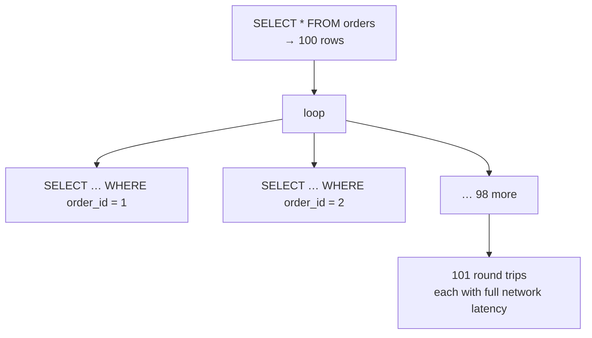

# 11 — SQL from .NET

> **Scope:** the half of a .NET database interview that is not pure SQL. Every question here comes
> down to one theme: **what SQL did your C# actually send, and how many times?**
> Reference material: [`CSharp/ef.md`](../../CSharp/ef.md) and
> [Architecture 07 — Databases & ORM](../Architecture/07-databases-and-orm.md).

---

## ADO.NET — the layer everything sits on

```c#
await using var conn = new SqlConnection(connectionString);
await conn.OpenAsync(ct);

await using var cmd = new SqlCommand(
    "SELECT employee_id, full_name, salary FROM dbo.employees WHERE department_id = @dept", conn);

// Always specify type and length: it prevents implicit conversion in the plan
// (see chapter 08) and stops plan-cache bloat from varying inferred lengths.
cmd.Parameters.Add("@dept", SqlDbType.Int).Value = departmentId;

await using var reader = await cmd.ExecuteReaderAsync(ct);
while (await reader.ReadAsync(ct))
{
    var id     = reader.GetInt32(0);
    var name   = reader.GetString(1);
    var salary = reader.GetDecimal(2);
}
```

| Execute method | Returns | Use for |
| --- | --- | --- |
| `ExecuteReaderAsync` | a forward-only stream of rows | `SELECT` |
| `ExecuteScalarAsync` | the first column of the first row | `COUNT`, `MAX`, an inserted id |
| `ExecuteNonQueryAsync` | rows affected | `INSERT`/`UPDATE`/`DELETE`/DDL |

### Connection pooling — the question behind "should I cache the connection?"

`SqlConnection` objects are cheap; the **TCP + TLS + authentication handshake** is not. ADO.NET
keeps a pool keyed by the **exact connection string** — so `Dispose()` returns the connection to the
pool rather than closing it.

> 🎯 **The answer:** "Open late, close early, and always in a `using`. Holding a connection open
> across a request starves the pool — the default `Max Pool Size` is 100, and exhausting it throws
> *'Timeout expired. The timeout period elapsed prior to obtaining a connection from the pool'*
> after 15 seconds. That error almost always means a leaked connection or a `DbContext` living too
> long, not a database problem. Also: the pool is keyed on the connection string *text*, so building
> strings dynamically silently creates a separate pool per variant."

> ⚠️ **Every `SqlCommand` must be awaited with `Async` and a `CancellationToken`.** A synchronous
> `ExecuteReader` blocks a thread-pool thread for the whole round trip — that is how a service dies
> under load with a healthy database. See
> [C# 08 — Async & TPL](../CSharp-DotNet/08-async-threading-and-tpl.md).

---

## EF Core — what SQL does LINQ produce?

The whole skill is reading the generated SQL. Turn it on in development:

```c#
builder.Services.AddDbContext<AppDbContext>(o => o
    .UseSqlServer(cs)
    .LogTo(Console.WriteLine, LogLevel.Information)      // logs every SQL statement
    .EnableSensitiveDataLogging()                        // ⚠️ dev only — logs parameter VALUES
    .EnableDetailedErrors());
```

> ⚠️ `EnableSensitiveDataLogging` writes **parameter values** into the log. Never enable it outside
> development: it puts personal data into your log store, and the org baseline is explicit that
> personal data must be scrubbed before it reaches observability tooling.

### `IQueryable` vs `IEnumerable` — where the filter runs

```c#
// ✅ Translated to SQL: WHERE salary > 100000 — the database filters
var q1 = await db.Employees.Where(e => e.Salary > 100_000).ToListAsync(ct);

// ❌ AsEnumerable() ends translation: the WHOLE TABLE is fetched, then filtered in memory
var q2 = db.Employees.AsEnumerable().Where(e => e.Salary > 100_000).ToList();
```

> 🎯 "`IQueryable<T>` builds an **expression tree** the provider translates into SQL, so the work
> happens in the database. `IEnumerable<T>` runs delegates in memory. The moment you call
> `AsEnumerable()`, `ToList()`, or a method EF can't translate, everything after it is client-side —
> which on a large table is the difference between a 5 ms indexed seek and pulling ten million
> rows over the wire. EF Core 3.0 made untranslatable expressions **throw** instead of silently
> falling back, which was the right call."

### Projection — the cheapest optimisation there is

```c#
// ❌ SELECT * — every column, full entity materialisation, change-tracking snapshots
var all = await db.Orders.Where(o => o.CustomerId == id).ToListAsync(ct);

// ✅ SELECT order_id, total — only what the caller needs, no tracking, no snapshot
var dto = await db.Orders
    .Where(o => o.CustomerId == id)
    .Select(o => new OrderSummary(o.Id, o.Total, o.PlacedAt))
    .ToListAsync(ct);
```

A `Select` projection to a non-entity type is **automatically no-tracking**, so it also gets you the
`AsNoTracking` benefit for free. It is also what makes a covering index usable — see
[chapter 08](08-indexing-and-query-performance.md#covering-indexes-and-include).

---

## The N+1 problem

The single most-asked ORM question, and the most common real production cause of a slow endpoint.

```c#
// ❌ 1 query for the orders, then 1 MORE per order when Items is touched — 101 round trips for 100 orders
var orders = await db.Orders.ToListAsync(ct);
foreach (var o in orders)
    Console.WriteLine(o.Items.Count);        // lazy load fires here, per order
```



Four fixes, and the trade-off between them is the real question:

```c#
// 1. Eager loading — ONE query with a JOIN
var orders = await db.Orders.Include(o => o.Items).ToListAsync(ct);

// 2. Projection — one query, only the columns needed (usually the best answer)
var summaries = await db.Orders
    .Select(o => new { o.Id, ItemCount = o.Items.Count, Total = o.Items.Sum(i => i.LineTotal) })
    .ToListAsync(ct);

// 3. Split query — one query per collection, no cartesian duplication
var orders = await db.Orders
    .Include(o => o.Items).Include(o => o.Shipments)
    .AsSplitQuery()
    .ToListAsync(ct);

// 4. Filtered include — load only the children you need
var orders = await db.Orders
    .Include(o => o.Items.Where(i => !i.IsCancelled))
    .ToListAsync(ct);
```

> ⚠️ **Lazy loading is off by default in EF Core, and should stay off in a web API.** It needs
> proxies (`UseLazyLoadingProxies` + `virtual` navigations) and it turns an innocent property access
> — including one inside a serializer — into a database round trip. Worse, it throws
> `ObjectDisposedException` if the context is gone. Prefer explicit `Include`/`Select`.

### `Include` and cartesian explosion — why `AsSplitQuery` exists

`Include`ing **two** collections produces one query with two joins, so the row count multiplies:
an order with 10 items and 5 shipments returns **50** rows, and each item's data is repeated 5
times. Ten collections and the payload is unusable.

| | Single query (default) | `AsSplitQuery()` |
| --- | --- | --- |
| Round trips | 1 | 1 **per collection** |
| Duplicated data on the wire | ✅ multiplicative | ❌ |
| Consistency | one snapshot | ⚠️ separate statements — data can change between them unless wrapped in a transaction |
| Best for | one collection, or small ones | several collections, or large ones |

> 🎯 "`AsSplitQuery` trades round trips for payload size, and gives up read consistency across the
> statements. So: single query for one collection, split query when I'm including two or more —
> and if consistency across them matters, inside an explicit transaction or a snapshot isolation
> level."

---

## Tracking vs no-tracking

```c#
// Read-only: skip the change-tracking snapshot entirely
var report = await db.Orders.AsNoTracking().Where(…).ToListAsync(ct);

// Read-only but you need object identity within the graph
var graph = await db.Orders.AsNoTrackingWithIdentityResolution().Include(o => o.Items).ToListAsync(ct);
```

| | Tracked (default) | `AsNoTracking()` | `AsNoTrackingWithIdentityResolution()` |
| --- | --- | --- | --- |
| Change tracking / `SaveChanges` | ✅ | ❌ | ❌ |
| Per-entity snapshot allocated | ✅ | ❌ | ❌ |
| Identity resolution (same row ⇒ same object) | ✅ | ❌ **duplicate instances** | ✅ |
| Typical speed / memory on large reads | baseline | noticeably faster, materially less allocation | between the two |

> ⚠️ **The `AsNoTracking` gotcha:** with no identity resolution, the same database row appearing
> twice in a result graph produces **two separate objects**. Usually harmless for a flat DTO read;
> a real bug if you compare by reference or mutate one copy. Use
> `AsNoTrackingWithIdentityResolution()` when you need the graph but not the tracking.
>
> Set the default once: `optionsBuilder.UseQueryTrackingBehavior(QueryTrackingBehavior.NoTracking)`
> and opt *into* tracking for the write paths — a good answer to "how would you make this API
> faster across the board?"

---

## Bulk operations

```c#
// ❌ 10,000 UPDATE statements: load every entity, mutate, save
foreach (var o in await db.Orders.Where(o => o.Status == "Closed").ToListAsync(ct))
    o.Status = "Archived";
await db.SaveChangesAsync(ct);

// ✅ EF Core 7+ : ONE UPDATE statement, no entities loaded, no tracking
await db.Orders.Where(o => o.Status == "Closed")
               .ExecuteUpdateAsync(s => s.SetProperty(o => o.Status, "Archived"), ct);

await db.Orders.Where(o => o.PlacedAt < cutoff).ExecuteDeleteAsync(ct);
```

> ⚠️ **`ExecuteUpdate`/`ExecuteDelete` bypass the change tracker** — they run immediately, outside
> `SaveChanges`, so they do not participate in your unit of work, do not fire `SaveChanges`
> interceptors, and leave already-tracked entities **stale**. That is the trade-off to state: one
> statement instead of N, at the cost of the tracking guarantees.

For very large inserts, `SaveChanges` batches statements (default up to 42 per round trip) but
`SqlBulkCopy` is an order of magnitude faster still:

```c#
using var bulk = new SqlBulkCopy(conn) { DestinationTableName = "dbo.staging_rows", BatchSize = 5000 };
await bulk.WriteToServerAsync(dataTable, ct);
```

### Table-valued parameters — passing a list to SQL properly

```sql
CREATE TYPE dbo.IdList AS TABLE (id INT NOT NULL PRIMARY KEY);
GO
CREATE OR ALTER PROCEDURE dbo.GetOrdersByIds @ids dbo.IdList READONLY AS
SELECT o.* FROM dbo.orders AS o JOIN @ids AS i ON i.id = o.order_id;
```

```c#
cmd.Parameters.Add(new SqlParameter("@ids", SqlDbType.Structured)
{
    TypeName = "dbo.IdList",
    Value    = idTable        // a DataTable or IEnumerable<SqlDataRecord>
});
```

> 💡 **Why this matters:** `Where(o => ids.Contains(o.Id))` becomes `WHERE id IN (@p0, @p1, … @p999)`.
> Every distinct list length produces a **different query text**, so each gets its own cached plan —
> plan-cache pollution — and SQL Server's hard limit is 2 100 parameters. EF Core 8+ mitigates this
> by translating `Contains` over a parameterised list to `OPENJSON`, which is one stable plan. A TVP
> is the pre-EF-8 answer and still the right one from raw ADO.NET.

---

## Raw SQL from EF Core

```c#
// ✅ Interpolated: EF converts each hole into a DbParameter
var orders = await db.Orders
    .FromSqlInterpolated($"SELECT * FROM dbo.orders WHERE customer_id = {customerId}")
    .Where(o => o.Total > 100)                 // ← still composable: appended as an outer query
    .ToListAsync(ct);

// ✅ Raw with explicit parameters
await db.Database.ExecuteSqlRawAsync(
    "UPDATE dbo.orders SET status = @p0 WHERE order_id = @p1", [status, id]);

// ⚠️ FromSqlRaw with a concatenated string is an injection hole. Same rule as chapter 10.
```

`SqlQuery<T>` (EF Core 8+) returns scalars and non-entity types from raw SQL without registering a
keyless entity.

---

## Dapper — and when to reach for it

```c#
var orders = await conn.QueryAsync<OrderDto>(
    "SELECT order_id AS Id, total AS Total FROM dbo.orders WHERE customer_id = @id",
    new { id = customerId });
```

| | EF Core | Dapper |
| --- | --- | --- |
| Model | full ORM: change tracking, migrations, unit of work | a mapper — you write the SQL |
| Best at | writes, aggregates with a graph, schema evolution | read-heavy queries, reporting, exact plan control |
| Cost | more allocation, generated SQL you must review | you own every query and every schema change |

> 🎯 **The pragmatic answer:** "EF Core for the write model and anything with a graph — the change
> tracker and migrations are worth a lot. Dapper for hot read paths and reports where I want to hand
> the optimiser exactly the query I mean. They share a connection and a transaction, so using both
> in one service is normal, not a compromise."

---

## Resilience and the settings that bite

```c#
builder.Services.AddDbContextPool<AppDbContext>(o => o
    .UseSqlServer(cs, sql =>
    {
        sql.EnableRetryOnFailure(maxRetryCount: 5, maxRetryDelay: TimeSpan.FromSeconds(10),
                                 errorNumbersToAdd: null);   // transient faults + deadlocks
        sql.CommandTimeout(30);                              // seconds, per command
    }));
```

| Setting | Default | Why it matters |
| --- | --- | --- |
| `Max Pool Size` | 100 | exhaustion looks like a database timeout but is a leaked-connection bug |
| `Connect Timeout` | 15 s | connecting, not executing |
| `CommandTimeout` | 30 s | executing; **not** the same knob |
| `MultipleActiveResultSets` | false | `true` lets one connection stream two readers — needed by some lazy-loading patterns, and a smell if you rely on it |
| `Encrypt` | **true** since Microsoft.Data.SqlClient 4.0 | the upgrade that breaks connections to servers without a trusted certificate. Fix the certificate — do **not** reach for `TrustServerCertificate=true` in production |
| `AddDbContextPool` | off | reuses context instances; cuts per-request allocation. Requires that you never keep state on the context |

> ⚠️ **Connection strings are secrets.** They belong in Azure Key Vault (one vault per environment)
> or, better, use a **managed identity** with `Authentication=Active Directory Default` so there is
> no password to store at all. Never in `appsettings.json`, never in source control.

```c#
// Passwordless: no secret in the connection string
var cs = "Server=tcp:myserver.database.windows.net;Database=app;Authentication=Active Directory Default;Encrypt=True";
```

> ⚠️ **Never log a connection string or a parameter value containing personal data**, and scrub
> before anything reaches the observability pipeline.

---

## Rapid-fire Q&A

**Q: What is the N+1 problem and how do you detect it?**
One query for the parents plus one per parent for the children. Detect it by logging the SQL EF
generates, or by watching the query count on an endpoint — a request issuing 100+ statements is
almost always N+1.

**Q: `IQueryable` vs `IEnumerable`?**
`IQueryable` is translated to SQL and executed by the database; `IEnumerable` runs in memory. The
transition point decides where the work happens.

**Q: When would you *not* use `AsNoTracking`?**
When you intend to modify and `SaveChanges` those entities, or when you need identity resolution
across the graph.

**Q: `Include` vs `Select` — which is faster?**
`Select` almost always: it fetches only the needed columns and skips tracking. `Include`
materialises whole entities.

**Q: What does `AsSplitQuery` fix and what does it cost?**
It fixes cartesian duplication from multiple `Include`s; it costs extra round trips and consistency
between the statements.

**Q: How does EF Core protect against SQL injection?**
LINQ always parameterises. Raw SQL is safe only via `FromSqlInterpolated`/parameter arrays;
`FromSqlRaw` with a concatenated string is not.

**Q: Why is `Contains` over a big list a problem?**
It generates `IN (@p0 … @pN)` — a new query text per list length, so plan-cache churn, and a
2 100-parameter ceiling. Use a TVP, `OPENJSON`, or a temp table.

**Q: How do you handle a deadlock from .NET?**
Catch it as transient and retry — `EnableRetryOnFailure` does this, but a user-initiated
transaction must be wrapped in `strategy.ExecuteAsync` for the whole unit of work to be retryable.
See [09](09-transactions-and-concurrency.md#the-deadlock-everyone-demonstrates).

**Q: Where does the connection string live?**
Key Vault per environment, or no secret at all via managed identity. Not in `appsettings.json`.

**Q: `DbContext` lifetime?**
**Scoped** — one per request. It is not thread-safe, and a singleton `DbContext` accumulates tracked
entities until it leaks. See [C# 09 — DI lifetimes](../CSharp-DotNet/09-aspnet-core-pipeline-and-di.md).

**Q: Should business logic live in stored procedures or C#?**
C#, for testability and version control — with procedures for set-based batch work and round-trip
reduction. [Chapter 10](10-views-procedures-functions-triggers.md#procedures-vs-ad-hoc-sql).

---

**Prev:** [10 — Views, Procedures, Functions & Triggers](10-views-procedures-functions-triggers.md) ·
**Next:** [12 — Query Drills](12-query-drills.md) ·
**Up:** [SQL interview hub](readme.md)
