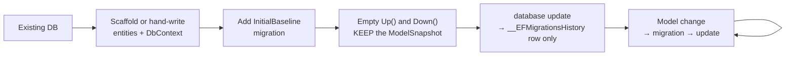
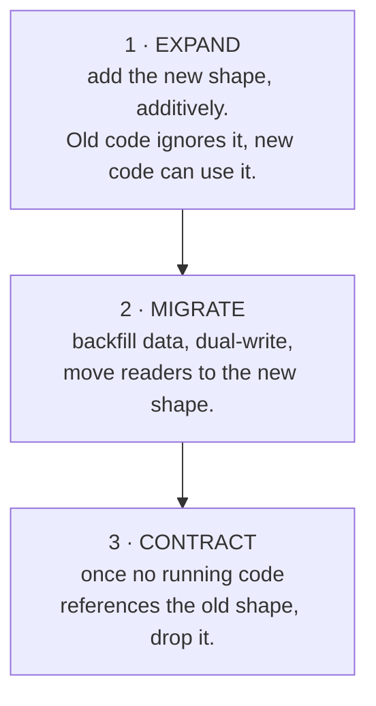
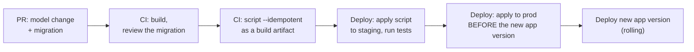

# 13 — Schema Change & Migrations

> **Scope:** how the schema changes over time without taking the application down. Interviewers ask
> this because it is where database knowledge meets delivery: *"how do you deploy a column rename
> with zero downtime?"* has no answer that does not require understanding both.

---

## Database-first vs code-first

The question is not which tool you use — it is **which artefact is the source of truth**.

| | Database-first | Code-first |
| --- | --- | --- |
| Source of truth | the **database schema** | the **C# model** |
| Direction | DB → generated entities (`dotnet ef dbcontext scaffold`) | model → generated migration → DB |
| Change starts | a DBA or a SQL script | a C# class edit |
| Suits | an existing/legacy database, a DBA-owned schema, a database shared by several apps | greenfield, app-owned schema, one team |
| Review artefact | the SQL script | the generated migration (**review it — it is code**) |
| Risk | regenerated entities overwrite hand edits | a generated migration doing something destructive nobody read |

Both use the same three pieces — **entities**, a **`DbContext`**, and a **connection string**. The
difference is only who writes the entities.

> 🎯 **The answer:** "Code-first when the application owns the schema, because the migration is
> versioned, reviewable and deployable with the code. Database-first when the database is shared or
> DBA-owned, because then the schema is a contract I don't unilaterally control. The mistake is
> mixing them without deciding: scaffolding entities *and* adding migrations means two sources of
> truth and a guaranteed drift."

---

## Migrating an existing database into code-first

The realistic scenario: a live database exists, and you want migrations from here on **without**
EF trying to create tables that already exist.

### 1 — Model the existing schema

```sql
-- The existing table
Employee(Id int identity PK, Name nvarchar(100), Salary decimal(18,2), CreatedDate datetime2)
```

```c#
public class Employee
{
    public int      Id          { get; set; }
    public string   Name        { get; set; } = null!;
    public decimal  Salary      { get; set; }
    public DateTime CreatedDate { get; set; }
}
```

Scaffolding is faster and less error-prone than hand-writing it:

```bash
dotnet ef dbcontext scaffold "Name=ConnectionStrings:DefaultConnection" \
    Microsoft.EntityFrameworkCore.SqlServer \
    --output-dir Models --context AppDbContext --no-onconfiguring
```

> ⚠️ **The model must match the database exactly** — types, nullability, precision, string lengths,
> index and constraint names. Any mismatch shows up as spurious operations in the next migration.
> Verify with `dotnet ef migrations add Check --dry-run` style inspection: generate it, read it, and
> if it is not empty, your model is wrong (not the database).

### 2 — `DbContext` and registration

```c#
public class AppDbContext(DbContextOptions<AppDbContext> options) : DbContext(options)
{
    public DbSet<Employee> Employees => Set<Employee>();

    protected override void OnModelCreating(ModelBuilder b)
    {
        b.Entity<Employee>(e =>
        {
            e.ToTable("Employee");                          // match the existing name exactly
            e.Property(p => p.Salary).HasPrecision(18, 2);  // or the migration will "fix" it
            e.Property(p => p.Name).HasMaxLength(100).IsRequired();
        });
    }
}
```

```c#
builder.Services.AddDbContext<AppDbContext>(o =>
    o.UseSqlServer(builder.Configuration.GetConnectionString("DefaultConnection")));
```

### 3 — The baseline migration

This is the step everyone gets wrong.

```bash
dotnet ef migrations add InitialBaseline
```

That generates a migration whose `Up()` **creates every table** — which would fail against the
existing database. You need it recorded as applied *without* running it. Empty the body:

```c#
public partial class InitialBaseline : Migration
{
    // Intentionally empty: the schema already exists in every environment.
    // This migration exists only to establish the baseline snapshot in __EFMigrationsHistory.
    protected override void Up(MigrationBuilder migrationBuilder) { }
    protected override void Down(MigrationBuilder migrationBuilder) { }
}
```

Keep the generated `*ModelSnapshot.cs` **exactly as it is** — that snapshot is what EF diffs future
model changes against. Deleting or editing it is what causes "EF wants to create tables that
already exist" on the *next* migration.

```bash
dotnet ef database update      # writes one row to __EFMigrationsHistory, changes no tables
```

> ⚠️ **`Add-Migration … -IgnoreChanges` is EF6, not EF Core.** The switch does not exist in EF Core
> and the command fails. Emptying `Up()`/`Down()` by hand (keeping the snapshot) is the EF Core
> equivalent. If a guide tells you to use `-IgnoreChanges` with `dotnet ef`, it is written for the
> wrong ORM generation.

### 4 — From here on it is code-first

```c#
public string? Department { get; set; }      // add the property
```

```bash
dotnet ef migrations add AddEmployeeDepartment
dotnet ef database update
```



### `__EFMigrationsHistory`

One row per applied migration: `MigrationId` and `ProductVersion`. That table **is** the state.
Consequences worth knowing:

- Restore a database backup without the table and EF thinks nothing is applied.
- Two branches adding migrations concurrently produce two snapshots and a merge conflict — resolve
  it by removing one migration (`dotnet ef migrations remove`) and regenerating it on top.
- `dotnet ef migrations list` shows applied vs pending.

---

## Reviewing a generated migration

Treat it as code, because it is.

| Look for | Why |
| --- | --- |
| `DropColumn` / `DropTable` | **irreversible data loss**. Is it intended? Is the data captured first? |
| An `AlterColumn` that narrows a type or adds `NOT NULL` | can fail on existing data, or rewrite the whole table under a lock |
| A rename EF has modelled as drop-then-create | loses all data in the column. Use `migrationBuilder.RenameColumn` instead |
| A new index on a large table | build it `ONLINE = ON` (Enterprise) or out-of-band, not in the deploy |
| An empty `Down()` | fine for forward-only, but then say so explicitly rather than leaving it ambiguous |
| A data migration in `Up()` | `migrationBuilder.Sql(...)`. Must be **idempotent** and batched |

```c#
// ✅ A rename that preserves data
protected override void Up(MigrationBuilder b) =>
    b.RenameColumn(name: "FullName", table: "Employee", newName: "DisplayName");
```

> ⚠️ **Never `dotnet ef database update` against production from a developer machine.** Generate a
> script, review it, and apply it through the pipeline:
>
> ```bash
> dotnet ef migrations script --idempotent --output migrate.sql
> ```
>
> `--idempotent` wraps every migration in an `IF NOT EXISTS` check against
> `__EFMigrationsHistory`, so re-running is safe — which is what makes it usable in a retryable
> deploy step. EF Core 8+ can also produce a **migration bundle** (`dotnet ef migrations bundle`),
> a self-contained executable with no SDK on the target.

---

## Zero-downtime schema change: expand / contract

During a rolling deploy, **old and new application code run simultaneously** against **one**
database. So every schema change must be compatible with both versions at once. The pattern has
three deploys.



### Worked example — renaming `FullName` to `DisplayName`

| Deploy | Database | Application |
| --- | --- | --- |
| **1 — expand** | `ADD DisplayName NULL`; trigger or dual-write keeps both in sync | writes **both** columns, reads `FullName` |
| **2 — migrate** | backfill in batches: `UPDATE TOP (5000) … SET DisplayName = FullName WHERE DisplayName IS NULL` | reads `DisplayName`, still writes both |
| **3 — contract** | `ALTER COLUMN DisplayName NOT NULL`; `DROP COLUMN FullName` | reads and writes `DisplayName` only |

A single `sp_rename` in one deploy breaks every instance of the old code the moment it runs.

### The additive-change rules

| Change | Safe in one deploy? | Do this instead |
| --- | --- | --- |
| Add a **nullable** column | ✅ metadata-only | — |
| Add a `NOT NULL` column **with a default** | ⚠️ may rewrite every row under a lock | add nullable → backfill in batches → `ALTER … NOT NULL` |
| Add a table, view, index | ✅ (index: `ONLINE = ON` if available) | — |
| **Rename** a column or table | ❌ | expand/contract |
| **Drop** a column | ❌ old code still selects it | stop referencing it, deploy, *then* drop |
| **Narrow** a type (`NVARCHAR(200)` → `(50)`) | ❌ can fail and rewrites the table | add new column → migrate → contract |
| Add a `CHECK`/`FK` constraint | ⚠️ validates all existing rows under a lock | add `WITH NOCHECK`, clean the data, then validate |
| Change a column's **meaning** | ❌ worst case — no schema signal at all | new column, expand/contract |

> 🎯 **The answer to "how do you deploy a breaking schema change with zero downtime?":**
> "You don't — you turn it into a sequence of non-breaking ones. Expand: add the new shape
> additively so both the old and new code work. Migrate: backfill in batches and dual-write, then
> switch readers. Contract: drop the old shape only once nothing running references it. That's three
> deploys instead of one, and the discipline is that the *database* change is always deployed
> **before** the code that needs it, and the *removal* always after the code that stopped needing
> it."

> ⚠️ **Backfill in batches, always.** A single `UPDATE` over 50 million rows takes an exclusive
> table lock, blows up the transaction log and escalates locks — see the batching loop in
> [09](09-transactions-and-concurrency.md#lock-modes-and-compatibility).

---

## Migrations in CI/CD



| Decision | Recommended |
| --- | --- |
| Who applies migrations? | the **pipeline**, with a dedicated login that has DDL rights — not the application's runtime identity |
| `Database.Migrate()` on startup? | ❌ for anything multi-instance: N replicas race, and a failure takes the app down. Acceptable for a single-instance internal tool |
| Runtime app permissions | `SELECT`/`INSERT`/`UPDATE`/`DELETE`/`EXECUTE` only. **No** `ALTER`, no `db_owner` |
| Rollback strategy | **forward-only.** Write a new corrective migration; do not run `Down()` in production, because `Down()` is usually untested and cannot restore dropped data |
| Drift detection | run `dotnet ef migrations has-pending-model-changes` in CI (EF Core 8+) so a model edit without a migration fails the build |
| Secrets | connection strings from Key Vault, or a **managed identity** so there is no credential at all |

> ⚠️ **`Database.EnsureCreated()` is not a migration tool.** It creates the schema from the model if
> the database is absent and does nothing otherwise — no versioning, no history table, and it
> cannot coexist with migrations. It is for tests and prototypes only.

> 💡 **The alternative worth naming:** a state-based tool (SSDT/`.sqlproj`, DACPAC, Redgate) compares
> a declarative schema project to the target and generates the diff, rather than replaying an ordered
> list of migrations. State-based suits DBA-owned schemas and gives a single readable definition;
> migration-based gives you explicit, reviewable, ordered steps and data migrations. Neither is
> wrong — knowing both exist and why a team would pick one is the senior answer.

---

## Rapid-fire Q&A

**Q: Database-first or code-first?**
Whichever matches who owns the schema. Code-first when the app owns it; database-first when it is
shared or DBA-owned. Never both at once.

**Q: How do you baseline an existing database for EF Core migrations?**
Model it exactly, add an initial migration, empty its `Up()`/`Down()` while **keeping** the model
snapshot, then `database update` to write the history row.

**Q: What does `-IgnoreChanges` do in EF Core?**
Nothing — it is an EF6 switch. Empty the migration body instead.

**Q: What is `__EFMigrationsHistory`?**
The table recording which migrations have been applied. It is the migration state.

**Q: How do you apply migrations to production?**
`dotnet ef migrations script --idempotent` (or a migration bundle) as a reviewed artefact, applied
by the pipeline with a DDL-privileged login — not from a laptop, not at app startup.

**Q: How do you rename a column with zero downtime?**
Expand/contract over three deploys: add the new column and dual-write, backfill and switch readers,
then drop the old one.

**Q: Why is adding a `NOT NULL` column with a default risky?**
It can rewrite every row while holding a lock. Add nullable, backfill in batches, then alter to
`NOT NULL`.

**Q: How do you roll back a bad migration?**
Forward-only: write a corrective migration. `Down()` is usually untested and cannot bring back
dropped data. Have a restore plan for the destructive cases.

**Q: Two developers added migrations on separate branches. Now what?**
Merge conflicts in the model snapshot. `dotnet ef migrations remove` on one branch, rebase, and
regenerate it on top of the other.

**Q: What permissions should the application's runtime login have?**
DML and `EXECUTE` only. DDL belongs to the deployment identity.

---

**Prev:** [12 — Query Drills](12-query-drills.md) ·
**Up:** [SQL interview hub](readme.md)
