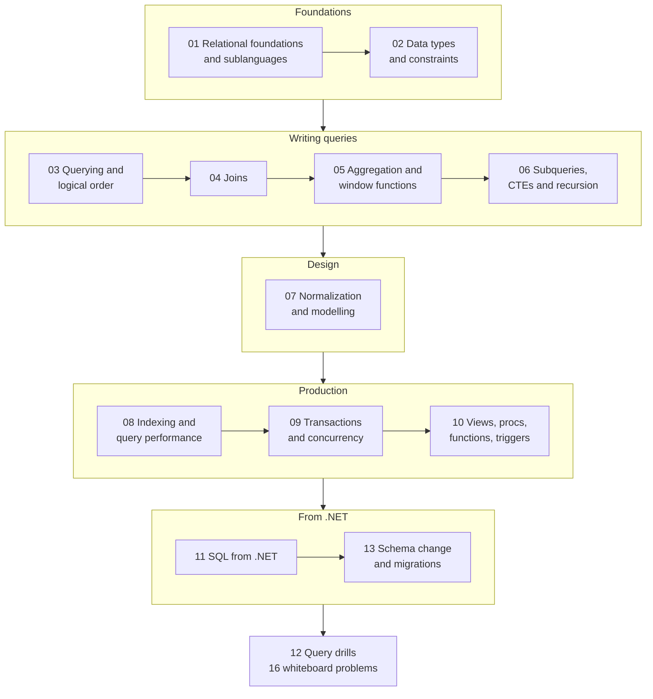

# SQL — Interview Prep Hub

> **What this is.** A hands-on SQL interview track, rebuilt from personal notes (`SQL.docx` and the
> older `SQL/sql.md`) and brought up to date: every claim verified, the dialect always named, and
> every concept given a runnable query and — where it helps — a diagram.
>
> **Dialect:** **T-SQL / SQL Server** is the default, because this blog's stack is .NET. Where MySQL,
> PostgreSQL or ANSI differ in a way that matters, it is called out inline, and
> [03 — Dialect cheat-sheet](03-querying-and-logical-order.md#dialect-cheat-sheet) collects them.
>
> **How to use it.** Work top to bottom for a full pass, or jump to a weak area. Each chapter ends
> with a **Rapid-fire Q&A** to drill the night before, and
> [12 — Query Drills](12-query-drills.md) is the whiteboard practice.

---

## The track



| # | Chapter | Covers |
| --- | --- | --- |
| 01 | [Relational Foundations & SQL Sublanguages](01-relational-foundations.md) | declarative vs set-oriented, relational vocabulary, DDL/DML/DQL/DCL/TCL, `DELETE` vs `TRUNCATE` vs `DROP` |
| 02 | [Data Types & Constraints](02-data-types-and-constraints.md) | type families + .NET mappings, `CHAR`/`VARCHAR`/`NVARCHAR`, `DECIMAL` vs `FLOAT`, the six constraints, keys, `NULL` and three-valued logic |
| 03 | [Querying & Logical Processing Order](03-querying-and-logical-order.md) | the logical order and the three errors it explains, every operator family, `LIKE`, `CASE`, `CAST`, paging, dialects |
| 04 | [Joins](04-joins.md) | every join type with real output, the row-count rule, fan-out, anti-joins, `ON` vs `WHERE`, join algorithms |
| 05 | [Aggregation & Window Functions](05-aggregation-and-window-functions.md) | `GROUP BY`/`HAVING`, `ROW_NUMBER` vs `RANK` vs `DENSE_RANK` vs `NTILE`, `PARTITION BY`, frames, `LAG`/`LEAD` |
| 06 | [Subqueries, CTEs & Recursion](06-subqueries-ctes-and-recursion.md) | the four subquery shapes, `IN` vs `EXISTS` vs `JOIN`, CTEs, recursive CTEs, `APPLY`, temp tables vs table variables |
| 07 | [Normalization & Data Modelling](07-normalization-and-modelling.md) | the three anomalies, 1NF→5NF worked on one table, functional dependencies, denormalization, OLTP vs star schema |
| 08 | [Indexing & Query Performance](08-indexing-and-query-performance.md) | B-trees, clustered vs non-clustered, covering indexes, key order, **SARGability**, execution plans, parameter sniffing |
| 09 | [Transactions & Concurrency](09-transactions-and-concurrency.md) | ACID, the read phenomena, isolation levels, RCSI, locking vs blocking vs deadlock, `NOLOCK`, optimistic concurrency |
| 10 | [Views, Procedures, Functions & Triggers](10-views-procedures-functions-triggers.md) | views and indexed views, procedure vs function, scalar-UDF cost, triggers, cursors, dynamic SQL & injection |
| 11 | [SQL from .NET](11-sql-from-dotnet.md) | ADO.NET and pooling, EF Core translation, **N+1**, tracking, split queries, bulk ops, TVPs, Dapper |
| 12 | [Query Drills](12-query-drills.md) | 16 whiteboard problems with multiple solutions and the trade-offs |
| 13 | [Schema Change & Migrations](13-schema-change-and-migrations.md) | DB-first vs code-first, baselining EF Core, expand/contract for zero downtime, migrations in CI/CD |

---

## Set up the practice database

Nothing in this track is theoretical — every query is meant to be run. Create this once and the
examples in chapters 01–13 work against it.

```sql
CREATE DATABASE SqlPractice;
GO
USE SqlPractice;
GO

CREATE TABLE departments (
    department_id INT           NOT NULL PRIMARY KEY,
    name          NVARCHAR(40)  NOT NULL UNIQUE
);

CREATE TABLE employees (
    employee_id   INT            NOT NULL PRIMARY KEY,
    full_name     NVARCHAR(40)   NOT NULL,
    email         NVARCHAR(100)  NOT NULL,
    salary        DECIMAL(10,2)  NOT NULL CHECK (salary > 0),
    hired_on      DATE           NOT NULL,
    manager_id    INT            NULL REFERENCES employees(employee_id),
    department_id INT            NOT NULL REFERENCES departments(department_id)
);

CREATE TABLE customers (customer_id INT PRIMARY KEY, name NVARCHAR(40), city NVARCHAR(40));
CREATE TABLE orders    (order_id INT PRIMARY KEY, customer_id INT NULL, total DECIMAL(9,2),
                        placed_at DATETIME2(3) NOT NULL DEFAULT SYSUTCDATETIME());
CREATE TABLE logins    (login_id INT PRIMARY KEY, employee_id INT NOT NULL, login_date DATE NOT NULL);
CREATE TABLE sales     (sale_id INT PRIMARY KEY, sale_date DATE NOT NULL,
                        region NVARCHAR(20) NOT NULL, amount DECIMAL(10,2) NOT NULL);

INSERT INTO departments VALUES (1, N'Engineering'), (2, N'Finance'), (3, N'Legal');  -- Legal is empty

INSERT INTO employees (employee_id, full_name, email, salary, hired_on, manager_id, department_id) VALUES
 (1, N'Ada',   N'ada@example.com',   180000, '2019-04-01', NULL, 1),   -- no manager: the root
 (2, N'Asha',  N'asha@example.com',  120000, '2021-06-15', 1,    1),
 (3, N'Boris', N'boris@example.com', 120000, '2022-01-10', 1,    1),   -- tied with Asha
 (4, N'Chen',  N'chen@example.com',   95000, '2023-09-01', 3,    1),
 (5, N'Dara',  N'dara@example.com',  110000, '2020-02-20', 1,    2),
 (6, N'Eve',   N'eve@example.com',    90000, '2024-03-05', 5,    2),
 (7, N'Femi',  N'femi@example.com',   90000, '2024-03-05', 5,    2),   -- tied with Eve
 (8, N'Gita',  N'asha@example.com',   99000, '2025-07-11', 5,    2);   -- duplicate email, on purpose

INSERT INTO customers VALUES (1, N'Asha', N'Pune'), (2, N'Boris', N'Berlin'), (3, N'Chen', N'Shanghai');
INSERT INTO orders (order_id, customer_id, total) VALUES
 (10, 1, 120.00), (11, 1, 80.00), (12, 2, 250.00), (13, NULL, 99.00);  -- 13 is an orphan

INSERT INTO logins VALUES
 (1,2,'2026-03-01'), (2,2,'2026-03-02'), (3,2,'2026-03-03'),           -- a 3-day streak
 (4,2,'2026-03-07'), (5,2,'2026-03-08'),                                -- then a gap, then 2 more
 (6,5,'2026-03-01'), (7,5,'2026-03-05');

INSERT INTO sales VALUES
 (1,'2026-03-01',N'EMEA',1000), (2,'2026-03-01',N'APAC', 500),
 (3,'2026-03-02',N'EMEA', 800), (4,'2026-03-04',N'AMER',1200),          -- note: no sales on the 3rd
 (5,'2026-03-05',N'APAC', 300);
```

The data is deliberately shaped to expose the traps: **tied salaries** (`RANK` vs `DENSE_RANK`), a
**`NULL` manager** (`LEFT JOIN` vs `INNER`), an **empty department** (`COUNT(*)` on an outer join), a
**duplicate email** (dedup drills), an **orphan order** (`NOT IN` and `NULL`), a **login gap** (gaps
and islands) and a **missing sales date** (filling a series).

> 💡 It is synthetic test data — no real personal data. Keep it that way if you extend it.

---

## The 12 answers to have word-perfect

If you have one evening, learn these. Each links to the full treatment.

1. **Logical processing order** — `FROM` → `WHERE` → `GROUP BY` → `HAVING` → `SELECT` → `DISTINCT` →
   `ORDER BY` → `OFFSET/FETCH`; aliases are created in `SELECT`.
   → [03](03-querying-and-logical-order.md#the-logical-processing-order)
2. **`WHERE` vs `HAVING`** — rows before grouping vs groups after; only `HAVING` sees aggregates,
   only `WHERE` can use an index to skip rows. → [05](05-aggregation-and-window-functions.md#where-vs-having)
3. **`DELETE` vs `TRUNCATE` vs `DROP`** — DML vs DDL, triggers, identity reset, and the inbound-FK
   block on `TRUNCATE`. → [01](01-relational-foundations.md#delete-vs-truncate-vs-drop)
4. **`ROW_NUMBER` vs `RANK` vs `DENSE_RANK`** — unique / shares-and-skips / shares-and-continues.
   → [05](05-aggregation-and-window-functions.md#ranking-functions--the-question-you-will-be-asked)
5. **`ON` vs `WHERE` in an outer join** — a `WHERE` predicate on the optional side turns a `LEFT
   JOIN` into an inner join. → [04](04-joins.md#the-on-vs-where-trap)
6. **Clustered vs non-clustered** — the clustered index *is* the table; the clustered key is the
   locator inside every non-clustered index. → [08](08-indexing-and-query-performance.md#clustered-vs-non-clustered)
7. **SARGability** — the indexed column must be bare on one side; `YEAR(d) = 2026` scans, a half-open
   range seeks. → [08](08-indexing-and-query-performance.md#sargability--the-single-biggest-win)
8. **ACID, and the isolation level that allows what** — dirty / non-repeatable / phantom, and RCSI as
   the modern default. → [09](09-transactions-and-concurrency.md#the-four-isolation-levels)
9. **Deadlock vs blocking** — a cycle the engine kills (error 1205) vs one-sided waiting; prevent by
   consistent resource ordering and short transactions. → [09](09-transactions-and-concurrency.md#locking-blocking-and-deadlocks)
10. **`NOT IN` with `NULL`s returns nothing** — use `NOT EXISTS`.
    → [02](02-data-types-and-constraints.md#null-and-three-valued-logic)
11. **Normalization = every fact in exactly one place** — the three anomalies, 3NF by default,
    denormalize with evidence and a named owner. → [07](07-normalization-and-modelling.md)
12. **The N+1 problem** — one query plus one per parent; fix with projection, `Include`, or
    `AsSplitQuery`. → [11](11-sql-from-dotnet.md#the-n1-problem)

---

## Self-test — 20 questions, no notes

Write the answer before you look. Anything you hesitate on is your revision list.

1. Why can `ORDER BY` use a `SELECT` alias when `WHERE` cannot?
2. `TRUNCATE` on a table referenced by an empty child table — what happens?
3. Two employees earn 120 000. What do `ROW_NUMBER`, `RANK` and `DENSE_RANK` give the next person?
4. A `LEFT JOIN` with `WHERE right.col > 100`. What have you accidentally written?
5. `COUNT(*)` on a `LEFT JOIN` gives 1 for a parent with no children. Why, and what is the fix?
6. `WHERE id NOT IN (SELECT manager_id FROM employees)` returns nothing. Why?
7. `AVG(bonus)` over `{100, NULL, NULL}` — what is the result?
8. Which normal form does a comma-separated `tags` column violate?
9. Table has an index on `(a, b, c)`. Can `WHERE b = 2 AND c = 3` seek it?
10. Why does `WHERE CAST(created_at AS DATE) = '2026-09-02'` not use an index, and what do you write
    instead?
11. What is the tipping point, and why does it make the optimiser ignore your index?
12. Name the only difference between `REPEATABLE READ` and `SERIALIZABLE`.
13. Three things `WITH (NOLOCK)` can do to your result set beyond a dirty read.
14. Is a CTE materialised in SQL Server? What is the consequence?
15. Why is `SUM(amount) OVER (ORDER BY d)` a bug for a running total?
16. Does SQL Server have `BEFORE` triggers? Do triggers fire on `TRUNCATE`?
17. Why is a scalar UDF in a `WHERE` clause a performance problem?
18. `AsNoTracking()` — what do you lose besides change tracking?
19. `Contains` over a 3 000-item list from EF Core — what breaks?
20. How do you rename a column with zero downtime?

*(Answers: 1 → [03](03-querying-and-logical-order.md), 2–3 → [01](01-relational-foundations.md) /
[05](05-aggregation-and-window-functions.md), 4–5 → [04](04-joins.md), 6–7 →
[02](02-data-types-and-constraints.md), 8 → [07](07-normalization-and-modelling.md), 9–11 →
[08](08-indexing-and-query-performance.md), 12–13 → [09](09-transactions-and-concurrency.md), 14 →
[06](06-subqueries-ctes-and-recursion.md), 15 → [05](05-aggregation-and-window-functions.md), 16–17 →
[10](10-views-procedures-functions-triggers.md), 18–19 → [11](11-sql-from-dotnet.md), 20 →
[13](13-schema-change-and-migrations.md).)*

---

## A four-evening plan

| Evening | Read | Then do |
| --- | --- | --- |
| 1 | 01 · 02 · 03 | run every query in 03 against the practice database |
| 2 | 04 · 05 · 06 | drills 1–8 in [12](12-query-drills.md), closed-book |
| 3 | 08 · 09 | take one drill, add an index, compare `SET STATISTICS IO` before and after |
| 4 | 07 · 10 · 11 · 13 | drills 9–16, then the 20-question self-test |

> 🎯 **The two habits that change interview outcomes.** First: **state the grain** before you write
> ("one row per employee per month") — most wrong answers are correct queries at the wrong grain.
> Second: **volunteer the edge case** — ties, `NULL`s, empty groups, and what happens at 50 million
> rows. Interviewers are listening for whether you thought about them, not whether they had to ask.

---

## Related reading already on this blog

**Interview tracks** ·
[Interview Prep index](../readme.md) ·
[C# & .NET track](../CSharp-DotNet/readme.md) ·
[Architecture & Senior track](../Architecture/readme.md) ·
[Architecture 07 — Databases & ORM](../Architecture/07-databases-and-orm.md) — RDBMS vs NoSQL, CAP,
CDC and the ORM view from the architecture side

**Reference** ·
[EF Core](../../CSharp/ef.md) ·
[Security & cryptography](../../CSharp/security-and-cryptography.md) ·
[API design](../../API/API.md) ·
[Azure](../../Azure/azure.md)
