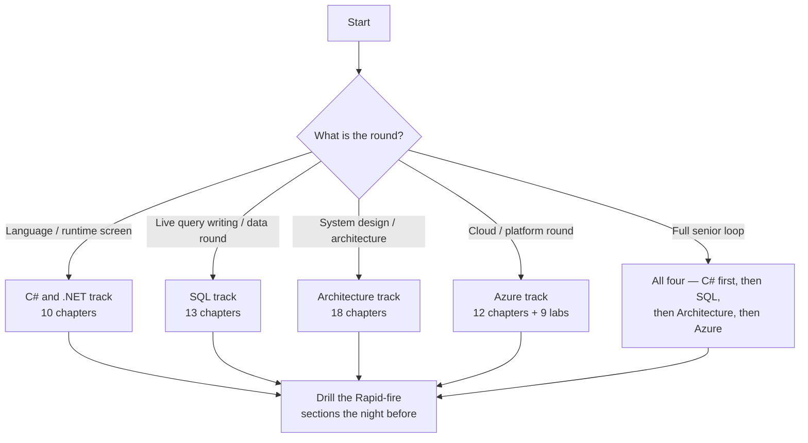

# Interview Prep

> **Four tracks, one entry point.** Everything interview-related lives under this folder. Pick the
> track that matches the conversation you are preparing for — or run all four, since a senior .NET
> interview usually samples from each.

---

## Which track?

| | [C# & .NET](CSharp-DotNet/readme.md) | [SQL](SQL/readme.md) | [Architecture & Senior](Architecture/readme.md) | [Azure](Azure/readme.md) |
| --- | --- | --- | --- | --- |
| Chapters | 10 | 13 | 18 | 12 |
| Question it prepares for | "Explain how `await` works." | "Find the second-highest salary per department." | "Design an order-processing system." | "How would you host and secure this on Azure?" |
| Depth vs breadth | **depth** in the language and runtime | **depth** in querying and the engine | **breadth** across distributed systems | **depth** in one cloud, service by service |
| Typical round | technical screen, language deep-dive | data round, live query writing | system design, architecture, promotion panel | platform round, cloud screen, "walk me through your deployment" |
| Ends each chapter with | Rapid-fire Q&A | Rapid-fire Q&A + runnable queries | interview Q&A + .NET specifics | Rapid-fire Q&A + `az` commands |
| Has a hands-on lab | — | ✅ [practice database](SQL/readme.md#set-up-the-practice-database) + [16 drills](SQL/12-query-drills.md) | — | ✅ [nine labs](Azure/12-hands-on-labs.md) on one running example |

---

## Track 1 — [C# & .NET 10](CSharp-DotNet/readme.md)

Depth in the language, the CLR and ASP.NET Core. Every claim verified against **.NET 10 / C# 14**,
with runnable code and a `Rapid-fire Q&A` at the end of each chapter.

| # | Chapter |
| --- | --- |
| 01 | [Platform, CLR & compilation](CSharp-DotNet/01-dotnet-platform-and-clr.md) |
| 02 | [Memory, types & boxing](CSharp-DotNet/02-memory-and-type-system.md) |
| 03 | [OOP & class design](CSharp-DotNet/03-oop-and-class-design.md) |
| 04 | [Abstract vs interface](CSharp-DotNet/04-abstract-vs-interface.md) |
| 05 | [Language essentials](CSharp-DotNet/05-language-essentials.md) |
| 06 | [Collections & generics](CSharp-DotNet/06-collections-and-generics.md) |
| 07 | [Delegates, events & LINQ](CSharp-DotNet/07-delegates-events-and-linq.md) |
| 08 | [Async, threading & TPL](CSharp-DotNet/08-async-threading-and-tpl.md) |
| 09 | [ASP.NET Core pipeline & DI](CSharp-DotNet/09-aspnet-core-pipeline-and-di.md) |
| 10 | [SOLID & design patterns](CSharp-DotNet/10-solid-and-patterns.md) |

The hub also carries **[the 12 answers to have word-perfect](CSharp-DotNet/readme.md#the-12-answers-to-have-word-perfect)**
and a **[20-question self-test](CSharp-DotNet/readme.md#self-test--20-questions-no-notes)**.

## Track 2 — [SQL](SQL/readme.md)

T-SQL / SQL Server by default, with MySQL and PostgreSQL differences called out. Every query is
runnable against a [practice database](SQL/readme.md#set-up-the-practice-database) whose data is
shaped to expose the classic traps.

| Group | Chapters |
| --- | --- |
| Foundations | [01 Relational foundations](SQL/01-relational-foundations.md) · [02 Data types & constraints](SQL/02-data-types-and-constraints.md) |
| Writing queries | [03 Querying & logical order](SQL/03-querying-and-logical-order.md) · [04 Joins](SQL/04-joins.md) · [05 Aggregation & window functions](SQL/05-aggregation-and-window-functions.md) · [06 Subqueries, CTEs & recursion](SQL/06-subqueries-ctes-and-recursion.md) |
| Design | [07 Normalization & modelling](SQL/07-normalization-and-modelling.md) |
| Production | [08 Indexing & query performance](SQL/08-indexing-and-query-performance.md) · [09 Transactions & concurrency](SQL/09-transactions-and-concurrency.md) · [10 Views, procedures, functions & triggers](SQL/10-views-procedures-functions-triggers.md) |
| From .NET | [11 SQL from .NET](SQL/11-sql-from-dotnet.md) · [13 Schema change & migrations](SQL/13-schema-change-and-migrations.md) |
| Practice | [12 Query drills — 16 whiteboard problems](SQL/12-query-drills.md) |

Also on the hub: **[the 12 answers to have word-perfect](SQL/readme.md#the-12-answers-to-have-word-perfect)**,
a **[20-question self-test](SQL/readme.md#self-test--20-questions-no-notes)** and a
**[four-evening plan](SQL/readme.md#a-four-evening-plan)**.

## Track 3 — [Architecture & Senior](Architecture/readme.md)

Breadth across design, data, distributed systems, cloud and delivery — the material a senior or
architect panel actually probes.

| Group | Chapters |
| --- | --- |
| Foundations | [01 Language fundamentals](Architecture/01-language-fundamentals.md) · [02 Collections](Architecture/02-collections-and-data-structures.md) · [03 SOLID](Architecture/03-solid-and-design-principles.md) · [04 GOF patterns](Architecture/04-design-patterns-gof.md) |
| Runtime & quality | [05 Concurrency](Architecture/05-concurrency-and-multithreading.md) · [06 Memory & GC](Architecture/06-memory-gc-and-profiling.md) · [13 Testing](Architecture/13-testing-and-quality.md) |
| Data & APIs | [07 Databases & ORM](Architecture/07-databases-and-orm.md) · [08 REST & API design](Architecture/08-rest-and-api-design.md) · [11 API security](Architecture/11-api-security.md) |
| Distributed & architecture | [09 Messaging](Architecture/09-messaging-and-eventing.md) · [10 Microservices](Architecture/10-microservices-patterns.md) · [17 Architecture & NFRs](Architecture/17-architecture-and-nfrs.md) · [18 NFR deep dive](Architecture/18-nfr-deep-dive.md) |
| Platform & delivery | [12 Cloud](Architecture/12-cloud-architecture.md) · [14 DevOps & CI/CD](Architecture/14-devops-and-cicd.md) · [15 Observability](Architecture/15-observability-and-monitoring.md) · [16 Web & frontend](Architecture/16-web-and-frontend.md) |

## Track 4 — [Azure](Azure/readme.md)

One cloud, service by service, for a **C# / .NET 10** developer: what each service is for, the
trade-off that decides it, the SDK code and the `az` commands. Nine
[hands-on labs](Azure/12-hands-on-labs.md) build one running example end to end.

| Group | Chapters |
| --- | --- |
| Foundations | [01 Fundamentals & governance](Azure/01-fundamentals-and-governance.md) · [02 Entra ID & managed identity](Azure/02-identity-and-managed-identity.md) |
| Compute | [03 App Service](Azure/03-app-service.md) · [04 Azure Functions](Azure/04-azure-functions.md) · [05 Containers, ACR & AKS](Azure/05-containers-and-aks.md) |
| Data | [06 Blob Storage](Azure/06-blob-storage.md) · [07 Cosmos DB](Azure/07-cosmos-db.md) |
| Integration | [08 Messaging & events](Azure/08-messaging-and-events.md) · [10 API Management](Azure/10-api-management.md) |
| Production | [09 Key Vault & App Configuration](Azure/09-secrets-and-configuration.md) · [11 Observability & KQL](Azure/11-observability-and-kql.md) |
| Practice | [12 Hands-on labs — nine builds](Azure/12-hands-on-labs.md) |

Also on the hub: **[the 12 answers to have word-perfect](Azure/readme.md#the-12-answers-to-have-word-perfect)**,
a **[20-question self-test](Azure/readme.md#self-test--20-questions-no-notes)**, a
**[service cheat-sheet](Azure/readme.md#service-cheat-sheet)** and
**[where the AZ-204 certification went](Azure/readme.md#about-the-certification)** (retired
31 July 2026 — AI-200 replaces it).

---

## Who owns which topic

Several subjects legitimately appear in more than one track — at different depths and for different
questions. This table is the **canonical home** for each, so there is one place to update and one
place to revise from:

| Topic | Canonical home | The other tracks cover |
| --- | --- | --- |
| Value vs reference types, boxing | [C# 02](CSharp-DotNet/02-memory-and-type-system.md) | [Arch 01](Architecture/01-language-fundamentals.md) — one-paragraph recap |
| GC internals, generations, profiling | [Arch 06](Architecture/06-memory-gc-and-profiling.md) | [C# 01](CSharp-DotNet/01-dotnet-platform-and-clr.md) — interview essentials only |
| Collections & Big-O | [C# 06](CSharp-DotNet/06-collections-and-generics.md) | [Arch 02](Architecture/02-collections-and-data-structures.md) — concurrent collections |
| `async`/`await`, `Task`, TPL | [C# 08](CSharp-DotNet/08-async-threading-and-tpl.md) | [Arch 05](Architecture/05-concurrency-and-multithreading.md) — PLINQ, `ThreadLocal` |
| SOLID | [C# 10](CSharp-DotNet/10-solid-and-patterns.md) — bad→good C# pairs | [Arch 03](Architecture/03-solid-and-design-principles.md) — plus DRY/KISS, coupling |
| GOF patterns | [Arch 04](Architecture/04-design-patterns-gof.md) — all 23 | [C# 10](CSharp-DotNet/10-solid-and-patterns.md) — the 4 creational ones in depth · [GOF index](../GOF/GOF.md) |
| DI & lifetimes | [C# 09](CSharp-DotNet/09-aspnet-core-pipeline-and-di.md) | — |
| **SQL language, joins, window functions** | [SQL 03](SQL/03-querying-and-logical-order.md)–[06](SQL/06-subqueries-ctes-and-recursion.md) | [Arch 07](Architecture/07-databases-and-orm.md) — one-table summary |
| **Indexing & query tuning** | [SQL 08](SQL/08-indexing-and-query-performance.md) | [Arch 07](Architecture/07-databases-and-orm.md) — clustered vs non-clustered only |
| **Normalization & 1NF–5NF** | [SQL 07](SQL/07-normalization-and-modelling.md) | [Arch 07](Architecture/07-databases-and-orm.md) — normalize vs denormalize trade-off |
| **ACID, isolation levels, deadlocks** | [SQL 09](SQL/09-transactions-and-concurrency.md) | [Arch 07](Architecture/07-databases-and-orm.md) — ACID vs BASE and CAP |
| **RDBMS vs NoSQL, CAP, CDC** | [Arch 07](Architecture/07-databases-and-orm.md) | [SQL 01](SQL/01-relational-foundations.md) — DBMS vs RDBMS definitions |
| **EF Core, N+1, migrations** | [SQL 11](SQL/11-sql-from-dotnet.md) · [SQL 13](SQL/13-schema-change-and-migrations.md) | [Arch 07](Architecture/07-databases-and-orm.md) — ORM overview · [`CSharp/ef.md`](../CSharp/ef.md) — reference |
| **SQL injection & parameterisation** | [SQL 10](SQL/10-views-procedures-functions-triggers.md#dynamic-sql-and-injection) | [Arch 11](Architecture/11-api-security.md) — API-layer security |
| REST, versioning, OpenAPI | [Arch 08](Architecture/08-rest-and-api-design.md) | [`API/API.md`](../API/API.md) — reference |
| Auth, JWT, OAuth | [Arch 11](Architecture/11-api-security.md) | [`CSharp/security-and-cryptography.md`](../CSharp/security-and-cryptography.md) |
| NFRs, RTO/RPO, system design | [Arch 18](Architecture/18-nfr-deep-dive.md) | [Arch 17](Architecture/17-architecture-and-nfrs.md) — views & layering |
| **Azure services, SDKs and `az`** | [Azure 01](Azure/01-fundamentals-and-governance.md)–[12](Azure/12-hands-on-labs.md) | [Arch 12](Architecture/12-cloud-architecture.md) — Azure ⇄ AWS mapping and IaC |
| **Cloud identity, managed identity, OAuth flows** | [Azure 02](Azure/02-identity-and-managed-identity.md) | [Arch 11](Architecture/11-api-security.md) — protocol-level API security |
| **Queues, topics, event streams on Azure** | [Azure 08](Azure/08-messaging-and-events.md) | [Arch 09](Architecture/09-messaging-and-eventing.md) — broker-agnostic patterns |
| **Telemetry, App Insights, KQL** | [Azure 11](Azure/11-observability-and-kql.md) | [Arch 15](Architecture/15-observability-and-monitoring.md) — logs/metrics/traces in general |

---

## Reference material outside this folder

These are **deep-dives and cheat-sheets**, not interview chapters — reach for them when a chapter
sends you there:

**Language & framework** ·
[Modern C# 12–14](../CSharp/modern-csharp.md) ·
[Pattern matching tips](../CSharp/tips.md) ·
[Classes & objects](../CSharp/OOP.md) ·
[SOLID with analogies](../CSharp/csharp-solid.md) ·
[Delegates](../CSharp/csharp-delegate.md) ·
[EF Core](../CSharp/ef.md) ·
[Security & cryptography](../CSharp/security-and-cryptography.md) ·
[ASP.NET Core filters](../CSharp/Filters/filter.md) ·
[.NET CLI](../CSharp/Dotnet/dotnet-cli.md)

**Platform** ·
[GOF pattern index](../GOF/GOF.md) ·
[API design](../API/API.md) ·
[Azure automation & Logic Apps](../Azure/azure.md) ·
[Azure fundamentals](../Azure/azure-basic.md) ·
[Azure DevOps & CI/CD](../Azure/Azure-DevOps.md) ·
[Azure certification (AZ-204 → AI-200)](../Azure/Certification/AZ-204.md) ·
[AWS](../AWS/aws.md) ·
[Kubernetes](../Containerization/K8/k8.md) ·
[Docker](../Containerization/Docker/docker.md)
