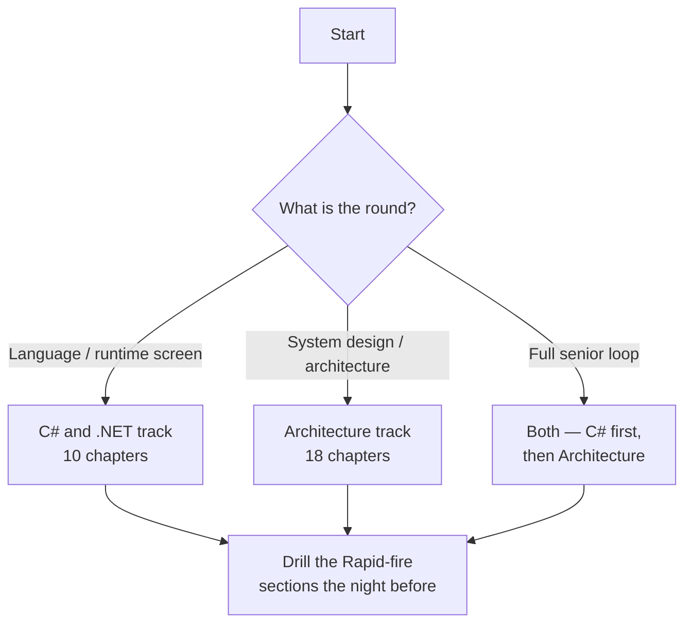

# Interview Prep

> **Two tracks, one entry point.** Everything interview-related lives under this folder. Pick the
> track that matches the conversation you are preparing for — or run both, since a senior .NET
> interview usually samples from each.

---

## Which track?

| | [C# & .NET](CSharp-DotNet/readme.md) | [Architecture & Senior](Architecture/readme.md) |
| --- | --- | --- |
| Chapters | 10 | 18 |
| Question it prepares for | "Explain how `await` works." | "Design an order-processing system." |
| Depth vs breadth | **depth** in the language and runtime | **breadth** across distributed systems |
| Typical round | technical screen, language deep-dive | system design, architecture, promotion panel |
| Ends each chapter with | Rapid-fire Q&A | interview Q&A + .NET specifics |

---

## Track 1 — [C# & .NET 10](CSharp-DotNet/readme.md)

Depth in the language, the CLR and ASP.NET Core. Every claim verified against **.NET 10 / C# 14**,
with runnable code and a `Rapid-fire Q&A` at the end of each chapter.

| # | Chapter |
| --- | --- |
| 01 | [Platform, CLR & compilation](CSharp-DotNet/01-dotnet-platform-and-clr.md) |
| 02 | [Memory, types & boxing](CSharp-DotNet/02-memory-and-type-system.md) |
| 03 | [OOP & class design](CSharp-DotNet/03-oop-and-class-design.md) |
| 04 | [Abstract vs interface](CSharp-DotNet/04-abstract-vs-interface.md) |
| 05 | [Language essentials](CSharp-DotNet/05-language-essentials.md) |
| 06 | [Collections & generics](CSharp-DotNet/06-collections-and-generics.md) |
| 07 | [Delegates, events & LINQ](CSharp-DotNet/07-delegates-events-and-linq.md) |
| 08 | [Async, threading & TPL](CSharp-DotNet/08-async-threading-and-tpl.md) |
| 09 | [ASP.NET Core pipeline & DI](CSharp-DotNet/09-aspnet-core-pipeline-and-di.md) |
| 10 | [SOLID & design patterns](CSharp-DotNet/10-solid-and-patterns.md) |

The hub also carries **[the 12 answers to have word-perfect](CSharp-DotNet/readme.md#the-12-answers-to-have-word-perfect)**
and a **[20-question self-test](CSharp-DotNet/readme.md#self-test--20-questions-no-notes)**.

## Track 2 — [Architecture & Senior](Architecture/readme.md)

Breadth across design, data, distributed systems, cloud and delivery — the material a senior or
architect panel actually probes.

| Group | Chapters |
| --- | --- |
| Foundations | [01 Language fundamentals](Architecture/01-language-fundamentals.md) · [02 Collections](Architecture/02-collections-and-data-structures.md) · [03 SOLID](Architecture/03-solid-and-design-principles.md) · [04 GOF patterns](Architecture/04-design-patterns-gof.md) |
| Runtime & quality | [05 Concurrency](Architecture/05-concurrency-and-multithreading.md) · [06 Memory & GC](Architecture/06-memory-gc-and-profiling.md) · [13 Testing](Architecture/13-testing-and-quality.md) |
| Data & APIs | [07 Databases & ORM](Architecture/07-databases-and-orm.md) · [08 REST & API design](Architecture/08-rest-and-api-design.md) · [11 API security](Architecture/11-api-security.md) |
| Distributed & architecture | [09 Messaging](Architecture/09-messaging-and-eventing.md) · [10 Microservices](Architecture/10-microservices-patterns.md) · [17 Architecture & NFRs](Architecture/17-architecture-and-nfrs.md) · [18 NFR deep dive](Architecture/18-nfr-deep-dive.md) |
| Platform & delivery | [12 Cloud](Architecture/12-cloud-architecture.md) · [14 DevOps & CI/CD](Architecture/14-devops-and-cicd.md) · [15 Observability](Architecture/15-observability-and-monitoring.md) · [16 Web & frontend](Architecture/16-web-and-frontend.md) |

---

## Who owns which topic

Several subjects legitimately appear in both tracks — at different depths and for different
questions. This table is the **canonical home** for each, so there is one place to update and one
place to revise from:

| Topic | Canonical home | The other track covers |
| --- | --- | --- |
| Value vs reference types, boxing | [C# 02](CSharp-DotNet/02-memory-and-type-system.md) | [Arch 01](Architecture/01-language-fundamentals.md) — one-paragraph recap |
| GC internals, generations, profiling | [Arch 06](Architecture/06-memory-gc-and-profiling.md) | [C# 01](CSharp-DotNet/01-dotnet-platform-and-clr.md) — interview essentials only |
| Collections & Big-O | [C# 06](CSharp-DotNet/06-collections-and-generics.md) | [Arch 02](Architecture/02-collections-and-data-structures.md) — concurrent collections |
| `async`/`await`, `Task`, TPL | [C# 08](CSharp-DotNet/08-async-threading-and-tpl.md) | [Arch 05](Architecture/05-concurrency-and-multithreading.md) — PLINQ, `ThreadLocal` |
| SOLID | [C# 10](CSharp-DotNet/10-solid-and-patterns.md) — bad→good C# pairs | [Arch 03](Architecture/03-solid-and-design-principles.md) — plus DRY/KISS, coupling |
| GOF patterns | [Arch 04](Architecture/04-design-patterns-gof.md) — all 23 | [C# 10](CSharp-DotNet/10-solid-and-patterns.md) — the 4 creational ones in depth |
| DI & lifetimes | [C# 09](CSharp-DotNet/09-aspnet-core-pipeline-and-di.md) | — |
| EF Core & data access | [Arch 07](Architecture/07-databases-and-orm.md) | [`CSharp/ef.md`](../CSharp/ef.md) — reference |
| REST, versioning, OpenAPI | [Arch 08](Architecture/08-rest-and-api-design.md) | [`API/API.md`](../API/API.md) — reference |
| Auth, JWT, OAuth | [Arch 11](Architecture/11-api-security.md) | [`CSharp/security-and-cryptography.md`](../CSharp/security-and-cryptography.md) |
| NFRs, RTO/RPO, system design | [Arch 18](Architecture/18-nfr-deep-dive.md) | [Arch 17](Architecture/17-architecture-and-nfrs.md) — views & layering |

---

## Reference material outside this folder

These are **deep-dives and cheat-sheets**, not interview chapters — reach for them when a chapter
sends you there:

**Language & framework** ·
[Modern C# 12–14](../CSharp/modern-csharp.md) ·
[Pattern matching tips](../CSharp/tips.md) ·
[Classes & objects](../CSharp/OOP.md) ·
[SOLID with analogies](../CSharp/csharp-solid.md) ·
[Delegates](../CSharp/csharp-delegate.md) ·
[EF Core](../CSharp/ef.md) ·
[Security & cryptography](../CSharp/security-and-cryptography.md) ·
[ASP.NET Core filters](../CSharp/Filters/filter.md) ·
[.NET CLI](../CSharp/Dotnet/dotnet-cli.md)

**Platform** ·
[GOF pattern index](../GOF/GOF.md) ·
[SQL](../SQL/sql.md) ·
[API design](../API/API.md) ·
[Azure](../Azure/azure.md) ·
[AWS](../AWS/aws.md) ·
[Kubernetes](../Containerization/K8/k8.md) ·
[Docker](../Containerization/Docker/docker.md)
